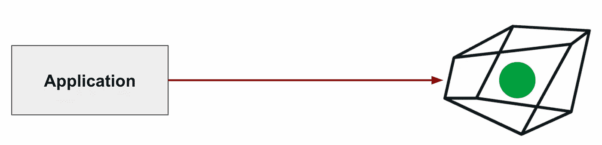
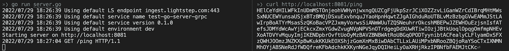
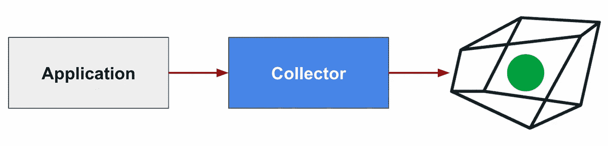
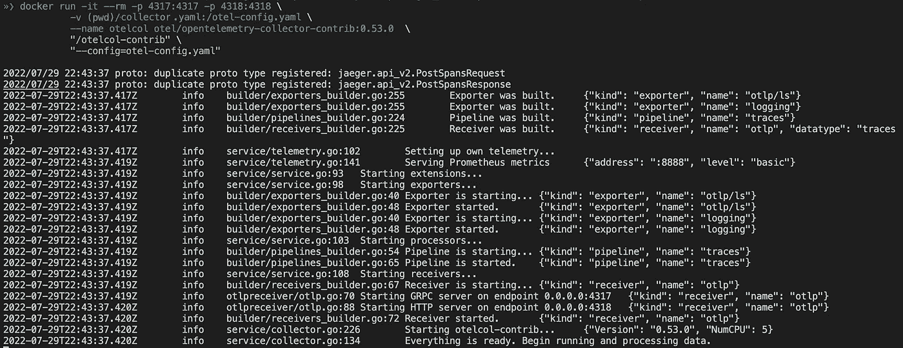
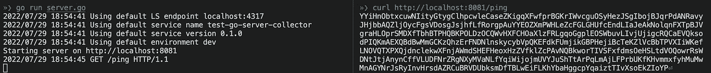
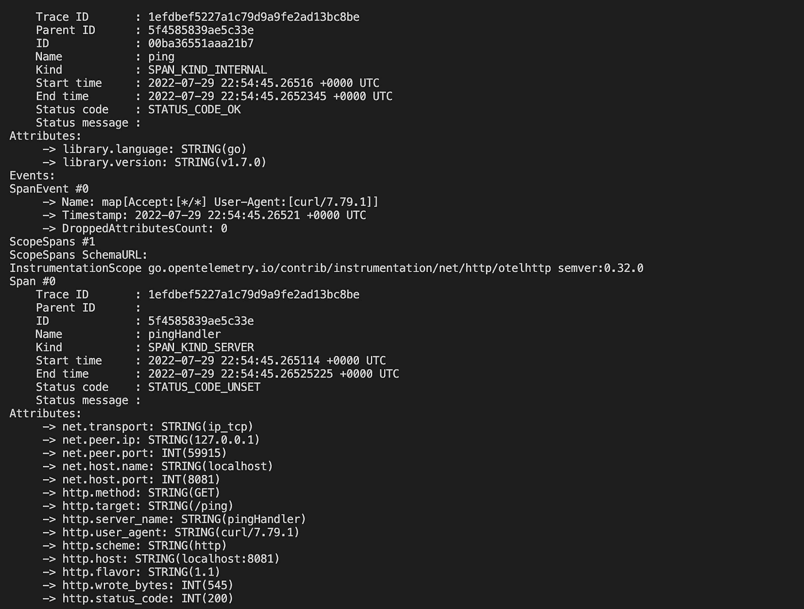
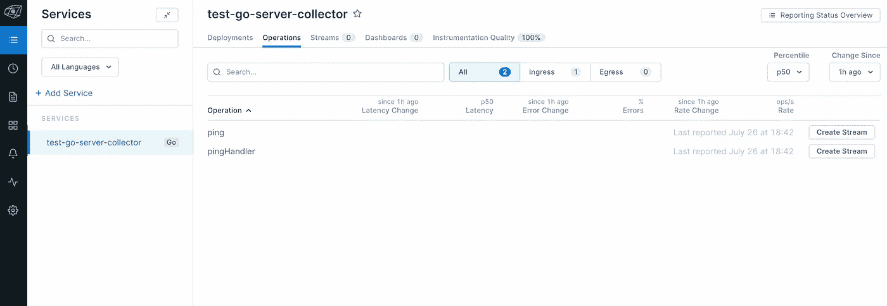
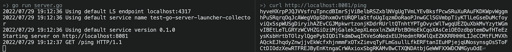

# OpenTelemetry for Go:向 OTLP 可观测性后端发送数据的三种方式

> 原文：<https://blog.devgenius.io/opentelemetry-to-lightstep-3-ways-in-golang-7dfcf2892003?source=collection_archive---------12----------------------->


帝王蝶给紫色小花授粉。阿德里·维勒拉的照片

在过去的几周里，我花了大量时间寻找不同的方式向 Lightstep 发送 [OpenTelemetry (OTel)](https://lightstep.com/blog/opentelemetry.io) 数据。

如果这个超级明显的标题还没有给你提示，有三种不同的方法可以做到:

1.  直接来自应用程序
2.  [打开遥测采集器](https://opentelemetry.io/docs/collector)
3.  启动器(通过收集器或直接从应用程序)

在这篇文章中，我将详细探究这三种方法，用代码片段解释如何将数据放入 [Lightstep Observability](https://lightstep.com/blog/app.lightstep.com) 中。我们开始吧！

> **注意:** *如果你正在寻找完整的代码清单，不要惊慌！你可以在 Lightstep* [*OTel 范例库中看到它们*](https://github.com/lightstep/opentelemetry-examples/tree/main/go) *。*

在我们继续之前，这里有一些你需要的东西:

*   对 [Golang](https://go.dev/doc/tutorial/getting-started) 的基本了解
*   基本了解[开放式遥测采集器](https://lightstep.com/blog/observability-mythbusters-how-hard-is-it-to-get-started-with-opentelemetry#otel-collector-101)

如果您想运行完整的代码示例，您还需要:

*   一个[光步可观测性账户](https://app.lightstep.com/signup/developer?signup_source=docs)
*   一个 [Lightstep 访问令牌](https://docs.lightstep.com/docs/create-and-manage-access-tokens)告诉 Lightstep 将你的跟踪发送到哪个项目
*   一个本地 Golang 开发环境
*   (我们将需要它来本地运行 OTel 收集器)

Lightstep 可观测性支持本机[开放式遥测协议(OTLP)](https://github.com/open-telemetry/opentelemetry-specification/blob/main/specification/protocol/otlp.md) 。它可以通过 [HTTP](https://opentelemetry.io/docs/concepts/glossary/#http) 或 [gRPC](https://opentelemetry.io/docs/concepts/glossary/#grpc) 接收 OTLP 格式的数据。您需要指定您希望在代码中使用的方法，我们将在接下来的代码片段中看到这一点。

如果你对使用 gRPC 和 HTTP 进行 OpenTelemetry 感到好奇，请查看这些文档。

> **注:** *其他支持 OTLP 的可观测性工具还有* [*蜂巢*](https://www.honeycomb.io/blog/all-in-on-opentelemetry)*[*格拉法纳*](https://grafana.com/blog/2021/04/13/how-to-send-traces-to-grafana-clouds-tempo-service-with-opentelemetry-collector)*[*耶格*](https://medium.com/jaegertracing/introducing-native-support-for-opentelemetry-in-jaeger-eb661be8183c) *。***

# **直接来自应用程序**

**如果您开始使用 OpenTelemetry 为您的应用程序提供工具，这可能是大多数初学者最常走的路线。顾名思义，我们直接从应用程序代码向给定的可观察性后端发送数据。**

****

**应用程序将 OpenTelemetry 数据直接发送到 Lightstep。图由 [Adri Villela](https://adri-v.medium.com) 绘制。**

**为此，我们必须做到以下几点:**

*   **安装所需的 OpenTelemetry 包，并导入它们**
*   **配置导出器**
*   **配置 TracerProvider**
*   **初始化导出器和 TracerProvider 以向 Lightstep 发送数据**

**如果你不知道这一切意味着什么，不要惊慌。我们很快就会开始挖掘。**

> ****注:** *这里* *可以看到通过 OTLP 越过 gRPC* [*直接发送 OTel 数据到 Lightstep 的完整例子。HTTP 版可以在这里找到*](https://github.com/lightstep/opentelemetry-examples/blob/main/go/opentelemetry/otlp/server/server.go)[](https://github.com/lightstep/opentelemetry-examples/blob/main/go/opentelemetry/otlp/server/server-http.go)**。****

## **它是如何工作的**

****1-安装所需的 OTel 库****

**这些是 ***将数据发送到可观察性后端(如 Lightstep)*** 所需的库。**

**在我们的应用程序代码中，我们需要导入相同的库:**

**如果您希望使用 HTTP 而不是 gRPC，请用`otlptracehttp`替换`otlptracegrpc`。**

****2-配置导出器****

**导出器是我们向 OpenTelemetry 发送数据的方式。正如我前面提到的，Lightstep 接受 OTLP 格式的数据，所以我们需要定义一个 OTLP 导出器。**

> ****注意:** *有些厂商不接受 OTLP 格式的数据，这意味着您需要使用一个* [*特定于厂商的导出器*](https://opentelemetry.io/registry/?language=go&component=exporter) *来向他们发送数据。***

**我们这样配置我们的导出器:**

**一些值得注意的事项:**

*   **将`endpoint`设置为`ingest.lightstep.com:443`，指向 Lightstep 的公共微卫星池。如果您使用的是内部卫星池，请查看这些文档。**
*   **您必须用自己的[光步访问令牌](https://docs.lightstep.com/docs/create-and-manage-access-tokens)为`<LS_ACCESS_TOKEN>`提供一个值。**
*   **我们正在通过 gRPC 向 Lightstep 发送数据。如果您希望使用 HTTP 而不是 gRPC，您的客户端连接将类似于下面的代码片段。请注意我们是如何添加额外的配置选项`WithURLPath`的。这个配置选项允许我们[覆盖发送跟踪的默认 URL 路径](https://pkg.go.dev/go.opentelemetry.io/otel/exporters/otlp/otlptrace/otlptracehttp#WithURLPath)。[默认值为](https://github.com/open-telemetry/opentelemetry-specification/blob/main/specification/protocol/exporter.md#endpoint-urls-for-otlphttp)`/v1/traces`；但是，对于 HTTP 连接，Lightstep 期望这个值是`traces/otlp/v0.9`。**

****3-配置 TracerProvider****

**一个`TracerProvider`作为 OpenTelemetry API 的入口点。它提供对`Tracer` s 的访问。A `Tracer`负责创建一个 [Span](https://opentelemetry.io/docs/concepts/observability-primer/#spans) 来跟踪给定的操作。**

**我们这样配置我们的 TracerProvider:**

**一些值得注意的事项:**

*   **我们定义了一个[资源](https://github.com/open-telemetry/opentelemetry-specification/blob/main/specification/resource/sdk.md)来为 OpenTelemetry 提供一系列标识我们服务的信息。这包括像`serviceName`和`serviceVersion`这样的东西，都是 Lightstep 需要设置的。顾名思义，`serviceName`是您正在检测的微服务的名称。**
*   **`sdktrace.WithBatcher`告诉 OpenTelemetry 使用 [BatchSpanProcessor](https://github.com/open-telemetry/opentelemetry-specification/blob/main/specification/trace/sdk.md#batching-processor) 。就是说批量导出数据。出于这个例子的目的，我们并没有做什么特别的事情。**

****4-初始化导出器和 TracerProvider 向 Lightstep** 发送数据**

**我们终于准备好向 Lightstep 发送数据了！我们通过从我们的`main`函数调用上面的`newExporter`和`newTraceProvider`函数来做到这一点:**

## **试试看！**

**让我们来看看运行中的代码示例。在这个例子中，我们将运行一个带有`/ping`端点的[服务器](https://github.com/lightstep/opentelemetry-examples/blob/main/go/opentelemetry/otlp/server/server.go)。服务器将 OTel 数据通过 gRPC 经由 OTLP 直接发送给 Lightstep。我们将使用`curl`到达终点。**

****1-克隆回购****

```
**git clone git@github.com:lightstep/opentelemetry-examples.git**
```

****2-打开终端窗口并运行服务器程序****

```
**cd opentelemetry-examples/go/opentelemetry/otlp/server export LS_ACCESS_TOKEN = <your_access_token> 
go run server.go**
```

**确保用您自己的 [Lightstep 访问令牌](https://docs.lightstep.com/docs/create-and-manage-access-tokens)替换`<your_access_token>`**

****3-打开一个新的终端窗口并点击端点****

```
**curl http://localhost:8081/ping**
```

**服务器输出和`curl`命令的并列示例输出:**

****

**server.go 和 curl 输出的屏幕截图。图片由 [Adri Villela](https://adri-v.medium.com) 提供。**

****4-在 Lightstep** 中查看**

****

**Lightstep 中我们服务的示例输出。图片由 [Adri Villela](https://adri-v.medium.com) 提供。**

> ****注意:** *想运行 HTTP 版？将步骤 2 中的* `*go run server.go*` *替换为* `*go run server-http.go*` *。***

# **打开遥测收集器**

**向可观测性后端发送数据的下一种方法是通过 [OpenTelemetry Collector](https://opentelemetry.io/docs/collector) 。对于非开发设置，这是将 OpenTelemetry 数据发送到可观测性后端的推荐方法。**

****

**应用程序通过 OTel 收集器向 Lightstep 发送 OpenTelemetry 数据。由[阿德里·维莱拉](https://adri-v.medium.com)绘制。**

**要通过收集器将测量数据发送到可观察性后端，我们必须执行以下操作:**

*   **让 OpenTelemetry Collector 实例在某个地方运行(在本地运行它是最简单的)**
*   **安装所需的 OpenTelemetry 包，并导入它们**
*   **配置导出器**
*   **配置 TracerProvider**
*   **初始化导出程序和跟踪程序提供程序**

**看起来和直接进场差不多，不是吗？*差不多* …**

**我们很快会谈到不同之处。**

## **它是如何工作的**

****1-安装所需的 OTel 库****

**这些是 ***将数据发送到可观察性后端(如 Lightstep)*** 所需的库。**

**在我们的应用程序代码中，我们需要导入相同的库:**

**如果您希望使用 HTTP 而不是 gRPC，请用`otlptracehttp`替换`otlptracegrpc`。**

****2-配置导出器****

**正如我们在直接示例中看到的，我们通过 OTLP 导出我们的数据(查看返回类型如何是`otlptrace.Exporter`)。不同之处在于，我们不是将数据直接导出到 Lightstep，而是将数据导出到 OTel 收集器，OTel 收集器也会以 OTLP 格式从我们的应用程序中获取 OTel 数据。**

**在我们的直接例子中，在我们可以创建一个新的导出器之前，我们首先需要创建一个新的跟踪客户端(`otlptracegrpc.NewClient`)，这样我们就可以告诉 OpenTelemetry *如何*向 Lightstep 发送数据。当我们使用收集器时，我们不需要这样做，因为收集器会使用[收集器配置 YAML](https://github.com/lightstep/opentelemetry-examples/blob/main/collector/vanilla/collector.yml) 中的信息在后台为我们创建一个跟踪客户端。**

**我们这样配置我们的导出器:**

**一些值得注意的事项:**

*   **`endpoint`是你收藏者的网址。**
*   **在下面的例子中，收集器`endpoint`被设置为`localhost:4317`，这意味着 OpenTelemetry 收集器[在本地运行，使用 Docker](https://github.com/lightstep/opentelemetry-examples/blob/main/collector/vanilla/readme.md) ，监听 gRPC 端口`4317`。**
*   **您不需要提供 [Lightstep 访问令牌](https://docs.lightstep.com/docs/create-and-manage-access-tokens)作为此配置的一部分，因为该值已在 [OTel 收集器的](https://lightstep.com/blog/observability-mythbusters-how-hard-is-it-to-get-started-with-opentelemetry#running-the-webstore-app-locally)配置 [YAML 文件](https://github.com/lightstep/opentelemetry-examples/blob/main/collector/vanilla/collector.yml)中设置。**
*   **请注意`WithInsecure`选项已设置。如果您正在使用收集器，并且仅当收集器中未配置证书时，这是必需的。(那是改天的博文。😜)**

****3-配置 TracerProvider****

**我们的`TracerProvider`与我们在直接示例中配置的相同:**

****4-初始化导出器和 TracerProvider 向 Lightstep 发送数据****

**我们终于准备好向 Lightstep 发送数据了！我们通过从我们的`main`函数调用上面的`newExporter`和`newTraceProvider`函数来做到这一点:**

**请注意，这与我们在直接示例中看到的相同。只有`newExporter`函数中的底层代码不同。**

## **试试看！**

**让我们来看看运行中的代码示例。在这个例子中，我们将运行一个具有`/ping`端点的[服务器](https://github.com/lightstep/opentelemetry-examples/blob/main/go/opentelemetry/collector/server/server.go)。服务器将通过收集器，在 gRPC 上向 Lightstep 发送 OTel 数据。我们将使用`curl`到达终点。**

****1-克隆回购****

```
**git clone git@github.com:lightstep/opentelemetry-examples.git**
```

****2-运行收集器****

**打开一个新的终端窗口。首先，您需要编辑 [collector.yaml](https://github.com/lightstep/opentelemetry-examples/blob/main/collector/vanilla/collector.yml) 文件。请务必用您自己的 [Lightstep 访问令牌](https://docs.lightstep.com/docs/create-and-manage-access-tokens)替换`${LIGHTSTEP_ACCESS_TOKEN}`。**

**现在您可以启动收集器了:**

```
**cd opentelemetry-examples/collector/vanilla
docker run -it --rm -p 4317:4317 -p 4318:4318 \
    -v $(pwd)/collector.yaml:/otel-config.yaml \
    --name otelcol otel/opentelemetry-collector-contrib:0.53.0  \
    "/otelcol-contrib" \
    "--config=otel-config.yaml"**
```

> ****注意** *:如果是第一次提取收集器图像，这可能需要一点时间。***

**样本输出:**

****

**OTel 收集器启动序列。图片由 [Adri Villela](https://adri-v.medium.com) 提供。**

**打开一个新的终端窗口并运行服务器程序**

```
**cd opentelemetry-examples/go/opentelemetry/collector/server
go run server.go**
```

****4-打开第三个终端窗口并点击端点****

```
**curl http://localhost:8081/ping**
```

**服务器输出和`curl`命令的并列示例输出:**

****

**server.go 和 curl 输出的屏幕截图。图片由 Adri Villela 提供。**

**您的收集器输出应该如下所示:**

****

**样本收集器输出。图片由 Adri Villela 提供。**

****5-在 Lightstep** 中查看**

****

**Lightstep 中我们服务的示例输出。图片由 [Adri Villela](https://adri-v.medium.com) 提供。**

# **发射者**

**我们今天要探索的最后一种方法是启动器。如果你已经通读了 [OpenTelemetry docs](https://lightstep.com/blog/opentelemetry.io/docs) 并且没有看到任何地方提到发射器，那是因为它们本身不是 OTel 的一部分。**

**您可以将启动器视为 OTel SDKs 的包装器。发射器最初是由这里的一些天才工程师在 [Lightstep](https://lightstep.com/blog/lightstep.com) 创建的，以提供一种封装 OpenTelemetry 设置和配置的方法。简而言之，发布者是因为厌倦了复制 SDK 设置代码而诞生的。再一次，开发商懒惰为赢！(郑重声明，我坚信开发人员的懒惰造就了伟大的软件。我们只是讨厌重复！)启动器还增加了一层验证，让用户更好地理解所有必需的参数。关于发射器的更多信息，请查看[这篇文章](https://lightstep.com/blog/opentelemetry-launchers-what-they-solve-and-why-we-need-them)，作者[泰德·杨](https://twitter.com/tedsuo)。**

**我们目前有用于 [Go](https://github.com/lightstep/otel-launcher-go) 、 [Python](https://github.com/lightstep/otel-launcher-python) 、 [Java](https://github.com/lightstep/otel-launcher-java) 和 [Node 的启动器。JS](https://github.com/lightstep/otel-launcher-node) 。**

**好了……现在我们明白了为什么存在启动器，让我们看看如何使用它们向 Lightstep 发送 OTel 数据。**

**为此，我们必须做到以下几点:**

*   **安装所需的 OpenTelemetry 和启动器包，并导入它们**
*   **配置启动器**
*   **初始化启动器**

**看起来和其他两个例子有点不同，不是吗？如您所见，启动器负责配置和初始化导出器和 TracerProvider。**

**让我们开始吃吧。**

> ***你可以在 gRPC* [*这里*](https://github.com/lightstep/opentelemetry-examples/blob/main/go/launcher/server/server.go) *看到使用 Go 启动器通过收集器向 Lightstep 发送 OTel 数据的完整示例。直接(通过发射器)版本可以在* [*这里*](https://github.com/lightstep/opentelemetry-examples/blob/main/go/launcher/server/server-otlp.go) *找到。***

## **它是如何工作的**

****1-安装所需的 OTel 库****

**在我们的应用程序代码中，我们需要导入相同的库:**

**哼…需要安装和导入的包更少了！**

****2-配置启动器****

**这里，我们正在配置启动器，类似于我们配置导出器和 TracerProvider 时所做的。除了它都被封装在这个可爱的`launcher.ConfigureOpentelemetry`！超级酷。😎**

**一些值得注意的事项:**

*   **将`endpoint`设置为`ingest.lightstep.com:443`，指向 Lightstep 的公共微卫星池。如果您使用的是内部卫星池，请查看这些文档。**
*   **您必须用自己的 [Lightstep 访问令牌](https://docs.lightstep.com/docs/create-and-manage-access-tokens)为`<LS_ACCESS_TOKEN>`提供一个值。**
*   **启动器仅使用 gRPC。老实说，不是交易破坏者。**

**啊…这很好，但是如果你想用一个收集器呢？我不是说过这是非开发人员设置的首选方法吗？是的，我确实做了！不用担心，因为您可以使用启动器将 OTel 数据发送到收集器，而不是直接发送到 Lightstep。为此，您只需:**

****3-初始化启动器****

**我们所需要做的就是调用我们的`newLauncher`函数，我们就完成了！**

**总的来说，与其他两种 sans-Launcher 方法相比，Launcher 方法需要较少的代码。**

## **试试看！**

**让我们来看看运行中的代码示例。在这个例子中，我们将运行一个具有`/ping`端点的[服务器](https://github.com/lightstep/opentelemetry-examples/blob/main/go/launcher/server/server.go)。服务器将使用 Go 启动器通过收集器，在 gRPC 上向 Lightstep 发送 OTel 数据。我们将使用`curl`到达终点。**

****1-克隆回购****

```
**git clone [git@github.com](mailto:git@github.com):lightstep/opentelemetry-examples.git**
```

****2-运行收集器****

**打开一个新的终端窗口。首先，你需要编辑 [collector.yaml](https://github.com/lightstep/opentelemetry-examples/blob/main/collector/vanilla/collector.yaml) 文件。确保用自己的 [Lightstep 访问令牌](https://docs.lightstep.com/docs/create-and-manage-access-tokens)替换`${LIGHTSTEP_ACCESS_TOKEN}`。**

**现在您可以启动收集器了:**

```
**cd opentelemetry-examples/collector/vanilla
docker run -it --rm -p 4317:4317 -p 4318:4318 \
    -v $(pwd)/collector.yaml:/otel-config.yaml \
    --name otelcol otel/opentelemetry-collector-contrib:0.53.0  \
    "/otelcol-contrib" \
    "--config=otel-config.yaml"**
```

> ****注意** *:如果你是第一次绘制收集器图像，这可能需要一点时间。***

**样本输出:**

****

**OTel 收集器启动序列。图片由 Adri Villela 提供。**

****3-打开一个新的终端窗口并运行服务器程序****

```
**cd opentelemetry-examples/go/launcher/server
go run server.go**
```

## **4-打开第三个终端窗口并点击端点**

```
**curl http://localhost:8081/ping**
```

**服务器输出和`curl`命令的并列示例输出:**

****

**server.go 和 curl 输出的屏幕截图。图片由 [Adri Villela](https://adri-v.medium.com) 提供。**

**您的收集器输出应该如下所示:**

****

**样本收集器输出。图片由 [Adri Villela](https://adri-v.medium.com) 提供。**

> ****注意:** *想用启动器运行直接版？只需跳过第 2 步。在步骤 3 中设置* `*LS_ACCESS_TOKEN*` *环境变量:* `*export LS_ACCESS_TOKEN=<your_access_token>*` *，其中* `*<your_access_token>*` *是自己的*[*light Step Access Token*](https://docs.lightstep.com/docs/create-and-manage-access-tokens)*，并将* `*go run server.go*` *替换为* `*go run server-otlp.go*` *。***

**当我尝试这三种方法时，我遇到了一些问题，所以我想在这里分享一下。**

**gRPC 是我存在的祸根。尤其是看到那个可爱的`context deadline exceeded`消息的时候。它使我热血沸腾。幸运的是，我在 Lighstep 的 OTel 朋友告诉了我两个漂亮的小旗，它们使 gRPC 调试变得稍微容易一些:**

**设置这些美丽的东西，如果您不能连接到您的 gRPC 端点，您将相对快速地知道。成功的连接看起来是这样的:**

```
**2022/07/26 16:28:36 Using default LS endpoint ingest.lightstep.com:443 2022/07/26 16:28:36 INFO: [core] [Channel #1] Channel created 2022/07/26 16:28:36 INFO: [core] [Channel #1] original dial target is: "ingest.lightstep.com:443" 2022/07/26 16:28:36 INFO: [core] [Channel #1] parsed dial target is: {Scheme:ingest.lightstep.com Authority: Endpoint:443 URL:{Scheme:ingest.lightstep.com Opaque:443 User: Host: Path: RawPath: ForceQuery:false RawQuery: Fragment: RawFragment:}} 2022/07/26 16:28:36 INFO: [core] [Channel #1] fallback to scheme "passthrough" 2022/07/26 16:28:36 INFO: [core] [Channel #1] parsed dial target is: {Scheme:passthrough Authority: Endpoint:ingest.lightstep.com:443 URL:{Scheme:passthrough Opaque: User: Host: Path:/ingest.lightstep.com:443 RawPath: ForceQuery:false RawQuery: Fragment: RawFragment:}} 2022/07/26 16:28:36 INFO: [core] [Channel #1] Channel authority set to "ingest.lightstep.com:443" 2022/07/26 16:28:36 INFO: [core] [Channel #1] Resolver state updated: { "Addresses": [ { "Addr": "ingest.lightstep.com:443", "ServerName": "", "Attributes": null, "BalancerAttributes": null, "Type": 0, "Metadata": null } ], "ServiceConfig": null, "Attributes": null } (resolver returned new addresses) 2022/07/26 16:28:36 INFO: [core] [Channel #1] Channel switches to new LB policy "pick_first" 2022/07/26 16:28:36 INFO: [core] [Channel #1 SubChannel #2] Subchannel created 2022/07/26 16:28:36 Using default service name test-go-client-grpc 2022/07/26 16:28:36 Using default service version 0.1.0 2022/07/26 16:28:36 Using default environment dev 2022/07/26 16:28:36 INFO: [core] [Channel #1 SubChannel #2] Subchannel Connectivity change to CONNECTING 2022/07/26 16:28:36 INFO: [core] [Channel #1 SubChannel #2] Subchannel picks a new address "ingest.lightstep.com:443" to connect 2022/07/26 16:28:36 INFO: [core] pickfirstBalancer: UpdateSubConnState: 0x14000380100, {CONNECTING <nil>} 2022/07/26 16:28:36 INFO: [core] [Channel #1] Channel Connectivity change to CONNECTING Get "http://localhost:8081/ping": dial tcp [::1]:8081: connect: connection refused 2022/07/26 16:28:37 INFO: [core] [Channel #1 SubChannel #2] Subchannel Connectivity change to READY 2022/07/26 16:28:37 INFO: [core] pickfirstBalancer: UpdateSubConnState: 0x14000380100, {READY <nil>} 2022/07/26 16:28:37 INFO: [core] [Channel #1] Channel Connectivity change to READY**
```

**如果您正在使用启动器，并且您的 Spans 不知道显示在 Lightstep 中，您可以在运行代码之前设置`OTEL_LOG_LEVEL`标志:**

**您的调试输出如下所示:**

```
**2022/07/26 15:39:10 debug logging enabled 2022/07/26 15:39:10 configuration 2022/07/26 15:39:10 { "SpanExporterEndpoint": "localhost:4317", "SpanExporterEndpointInsecure": true, "ServiceName": "test-go-client-launcher", "ServiceVersion": "0.1.0", "Headers": null, "MetricExporterEndpoint": "localhost:4317", "MetricExporterEndpointInsecure": true, "MetricExporterTemporalityPreference": "cumulative", "MetricsEnabled": true, "LogLevel": "debug", "Propagators": [ "tracecontext", "baggage" ], ... }**
```

**当我在 2021 年第一次开始 OTel 之旅时(在我的光步之前的日子里)，我通过 [OTel 收集器](https://storiesfromtheherd.com/unpacking-observability-the-observability-stack-93d4733e2a72)将 OTel 数据发送到我的可观测性后端。对我来说，这是显而易见的，因为收藏家可以:**

*   **从多个来源接收数据(包括应用程序和基础架构指标)**
*   **添加/移除元数据**
*   **分离数据**
*   **抽样资料**
*   **同时向多个后端发送数据(如果您正在评估不同的供应商或者从一个供应商过渡到另一个供应商，这非常好)**

**我个人是收集器的忠实粉丝，我认为在 Pre-Prod/Prod 环境中运行 OTel 收集器以将 OpenTelemetry 数据发送到可观测性后端是一种很好的做法。**

**但是……我不得不承认，我更多的是从运营的角度考虑这个问题，而不是从开发者的角度。**

**事实是，当你开始使用 OTel 时，很可能是从零开始。也就是说，你已经必须弄清楚这整个仪器的事情了。压力已经够大了。再加上试图在这一切之上建立一个收集器，你已经有了太多的移动部件，并且很可能*非常*不堪重负的开发人员…即使你用最简单的配置运行它(即，通过 Docker 在本地运行)。还有，当你只是做本地开发的时候，你*真的*需要运行一个收集器吗？很可能是得不偿失。**

**但是…我也从个人经验中了解到，通过直接方法连接到可观察性后端是一件极其痛苦的事情。文献非常稀少。例子不完整。不用说，这是一次非常艰难的旅程。我很难同时使用 HTTP 和 gRPC。**

**所以这就引出了一个问题——有什么好的、简单的方法来检测你的代码并将其发送到可观测性后端？这就是发射器发挥作用的地方！因为他们给你两个世界最好的东西。您可以直接连接到您的 Observability 后端，或者您可以通过 OTel 收集器连接。此外，启动程序不限制您使用 Lightstep 作为您的可观察性后端，因为:**

1.  **如果您从启动器连接到收集器，收集器会自动为您提供发送到多个可观察性后端的能力**
2.  **如果你选择直接连接到一个[非光步可观测性后端](https://github.com/lightstep/otel-launcher-go#configure)，它接受来自启动器的 OTLP 格式的 OTel 数据**

**不得不承认，在我使用 Go Launcher 之前，我对它是相当怀疑的。毕竟，它不是香草 OTel，这让我想到…“啊哦…供应商锁定！这不正是 OTel 想要避免的吗？”**

**但是两件事改变了我的想法。首先，事实上你并不局限于一个特定的供应商(见上文)。其次，我们在 Honeycomb 的朋友一直致力于将发射器带到社区中，正如这里所做的工作[一样](https://github.com/honeycombio/otel-launcher-go/pull/1#issuecomment-1191243498)，所以发射器可能是(vanilla) OTel 的未来！**

**我的结论是:与同类产品相比，Launcher 由于其灵活性和整体简单性而胜出。**

**我们已经了解了如何通过三种不同的方式向 Lightstep 发送 OTel 数据:**

*   **直接来自我们的应用程序**
*   **通过 OTel 收集器**
*   **使用启动器，可以将数据直接发送到 Lightstep 或通过收集器发送**

**在非开发设置中，使用收集器是将数据发送到可观察性后端的首选方式；然而，如果您刚刚开始使用 OTel，将 OTel 数据直接发送到您的可观测性后端是最有意义的，因为您必须处理更少的移动部件。**

**也就是说，使用 vanilla OTel 来做上面的任何一项可能会有点儿力不从心，这就是启动器的用武之地，因为它们抽象了一堆连接性的东西，因此更容易将数据发送到您的可观测性后端，无论是直接发送还是通过收集器发送。**

**咻！这是一个需要思考和理解的问题！给自己一个鼓励，因为我们已经做了很多！现在，请欣赏这张山羊的照片。**

****

**山羊在加拿大安大略省蓝山吃草。Adri Villela 的照片。**

**和平、爱和准则。🦄 🌈 💫**

**有关于 Golang OTel 仪器的问题吗？联系我们！通过[电子邮件](mailto:devrel@lightstep.com)或[推特](https://twitter.com/adrianamvillela)联系我们。希望收到你们的来信！**

**更多关于可观察性的文章，请查看我的拆包可观察性系列:**

**

阿德里·维莱拉** 

## **拆包可观察性**

**[View list](https://adri-v.medium.com/list/unpacking-observability-be1835c6dd23?source=post_page-----7dfcf2892003--------------------------------)****18 stories**************

***最初发表于*[*https://lightstep.com*](https://lightstep.com/blog/observability-mythbusters-send-opentelemetry-data-to-lightstep-3-ways-golang)*。***