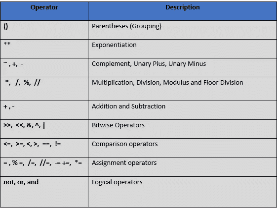

# 运算符优先级:Python 完整教程—第 17 部分

> 原文：<https://blog.devgenius.io/operators-priorities-python-complete-course-part-17-1070b43d4127?source=collection_archive---------9----------------------->

## 通过实际的代码示例学习 Python 中操作符的优先级。


[Gyathursan](https://pixabay.com/users/gyathursan-15101559/) 在 [Pixabay](https://pixabay.com/photos/search/stick%20note/) 拍摄的照片

在我们开始之前，让我告诉你

*   这篇文章是 Python 完全初学者到专家课程
    的一部分，你可以在这里找到它[。](https://medium.com/@samersallam92/python-complete-beginner-to-expert-course-f7626916df30)
*   所有资源都可以在下面的“资源”部分找到。
*   这篇文章在 YouTube 上也有视频[点击这里](https://youtu.be/pdvbiGaq4i4)。

[https://youtu.be/pdvbiGaq4i4](https://youtu.be/pdvbiGaq4i4)

## 介绍

在您学习了 Python 中的所有操作符类型之后，假设您有一个包含多个操作符的表达式。在这种情况下，**应该先执行哪个运算符？**

为了回答这个问题，本文将涵盖**运营商的优先级**。

在回答上述问题并深入了解运营商的优先事项之前，请记住以下几点:

*   最高优先级是有时被调用的**括号**(**分组**)。
*   当两个操作符的优先级相同时，先执行左边上的操作符。换句话说，它有更高的优先级。

现在，参考表 1，它列出了 Python 中从最高到最低优先级的所有操作符。



表 1: Python 操作者的优先级(图片由作者提供)

正如您之前看到的，该表以括号或分组开始。它位于该表的顶部，因为它具有最高的优先级。逻辑运算符的优先级最低。

为了更好地理解这个想法，让我们举一个实际的例子。

输出:

```
50.0
```

您得到 50，因为括号内的操作符已经被首先执行了。之后是除法，然后是加法。

让我们看看另一个例子，其中有几个括号(相同的优先级)。

输出:

```
90.0
```

在本例中，首先执行`a + b`(左侧)，然后执行`c /d` (右侧)。最后在两个结果之间应用了`*`。

## 现在，让我们总结一下我们在这篇文章中学到的内容:


照片由[安 H](https://www.pexels.com/@ann-h-45017/) 在[像素](https://www.pexels.com/)上拍摄

*   最高优先级是开始执行**括号**内的内容。
*   当两个运算符具有相同的优先级时，首先执行左边的运算符。

***附言*** *:万分感谢您花时间阅读我的故事。在你们离开之前，让我快速提两点:*

*   *首先，要想直接在你的收件箱里看到我的帖子，请在这里订阅*[](https://medium.com/@samersallam92/subscribe)**，你可以在这里关注我*[](https://medium.com/@samersallam92)**。***
*   ***第二，作家在媒介上制造了数以千计的***。为了无限制地访问媒体故事并开始赚钱，* [***现在就注册成为媒体会员***](https://medium.com/@samersallam92/membership)**其中* *每月只需花费 5 美元。报名* [***有了这个链接***](https://medium.com/@samersallam92/membership) *，可以直接支持我，不需要你额外付费。*****

**

[萨梅尔·萨拉姆](https://medium.com/@samersallam92?source=post_page-----1070b43d4127--------------------------------)** 

## **Python 初学者到专家的完整课程**

**[View list](https://medium.com/@samersallam92/list/python-complete-beginner-to-expert-course-32d3a941c05e?source=post_page-----1070b43d4127--------------------------------)****21 stories**************

**要回到上一篇文章，您可以使用以下链接:**

**第 16 部分:赋值操作符**

**要阅读下一篇文章，您可以使用以下链接:**

**[第 18 部分:数学模块快速概述](https://medium.com/mlearning-ai/a-quick-overview-of-math-module-python-complete-course-part-18-7ee3439111c8?source=your_stories_page-------------------------------------)**

## **资源:**

*   **GitHub [**这里的**](https://github.com/samersallam/python-complete-beginner-to-expert-course/tree/main/Operators%20Priorities) **。****