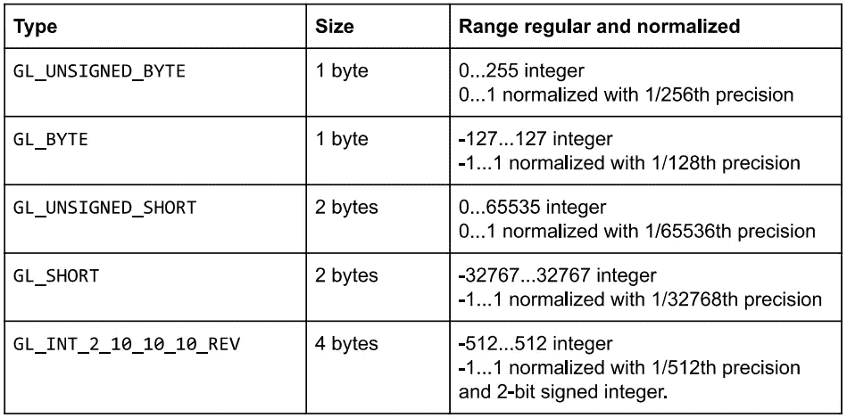
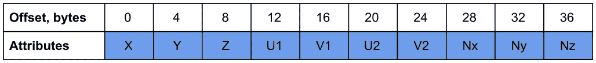
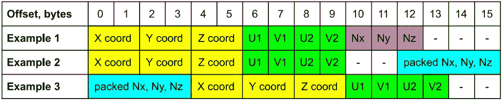
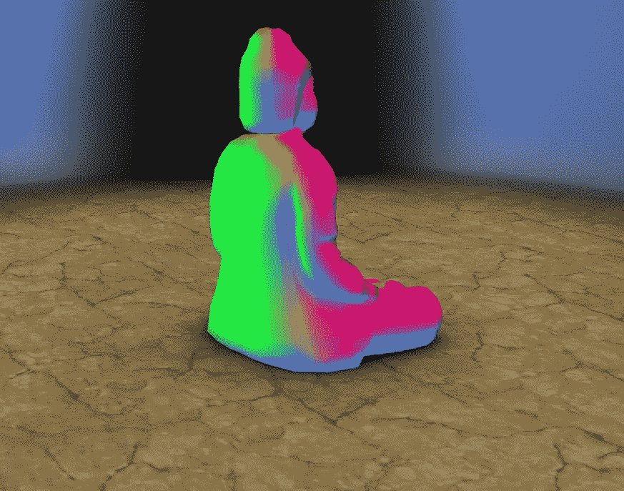
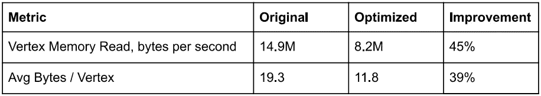

# OpenGL ES 顶点数据的优化

> 原文：<https://blog.devgenius.io/optimization-of-opengl-es-vertex-data-b76927a63922?source=collection_archive---------13----------------------->

由[尼基塔·万托林](https://unsplash.com/@vantorin?utm_source=medium&utm_medium=referral)在 [Unsplash](https://unsplash.com?utm_source=medium&utm_medium=referral) 上拍摄

我们的 Android 应用是动态壁纸，所以轻量级对它们来说非常重要。为了实现最佳性能、最小内存和功耗，我们不断通过减少资源大小和使用硬件支持的各种压缩来改进我们的应用。

[3D 佛像动态壁纸](https://play.google.com/store/apps/details?id=org.androidworks.livewallpaperbuddha)的最新更新引入了更紧凑的存储 3D 对象，以节省内存和提高性能。我们以同样的方式更新了它的 [WebGL 演示](https://keaukraine.github.io/webgl-buddha/index.html)，在本文中，我们将描述这一优化的过程。

# OpenGL ES / WebGL 中的紧凑数据类型

以前在我们的应用中，我们只使用浮动来存储所有的逐顶点信息——位置、法线、颜色等。这些是标准的 32 位 IEEE-754 浮点值，足够通用来保存从顶点坐标到颜色的任何类型的信息。

然而，并非所有类型的数据都需要 32 位浮点精度。和 OpenGL ES 2.0/WebGL 有其他不太精确但更紧凑的数据类型来代替 32 位浮点。

首先，OpenGL 支持 16 位和 8 位有符号和无符号整数。那么整数值怎么代替浮点数呢？有两种选择——在着色器中按原样使用整数值，并将它们转换为浮点型，或者将其规格化。规范化意味着驱动程序/GPU 执行从整数到浮点值的转换，顶点着色器接收准备使用的浮点值。规范化将整数值转换为范围[0，1]或[-1，1]，具体取决于它们是无符号整数还是有符号整数。规范化值的精度由源整数值的范围指定-源整数中的位数越多，精度就越高。

因此，例如，无符号字节值 128 将被规范化为 0.5，有符号 short -16383 将被规范化为-0.5。你可以在这个 OpenGL wiki 页面上阅读更多关于规格化整数转换的内容。

要使用规范化整数，必须将`glVertexAttribPointer`的规范化参数设置为`true`，着色器将接收规范化浮点。

存储在无符号字节中的典型值是颜色，因为颜色分量不需要超过 1/256 的精度，3 或 4 个无符号字节分别存储 RGB 或 RGBA 颜色是最理想的。两个 shorts 可用于存储典型 3D 模型的 UV 坐标，假设它们在[0，1]范围内，并且在网格上不使用重复纹理。它们为这些需求提供了足够的精度——例如，无符号短整型将提供子纹理像素精度，即使对于维度为 4096 的纹理，因为它的精度是 1/65536。

较新的 OpenGL ES 3.0(以及基于它的 WebGL 2)引入了新的紧凑数据类型:

*   顶点数据的半浮点数—这些是 16 位 IEEE-754 浮点数。它们使用类似于`GL_SHORT`的 2 个字节，但是它们的范围和精度不像标准化值那样有限。
*   4 字节打包格式`INT_2_10_10_10_REV`，包含 4 个可以规格化为浮点数的整数值。其中三个整数具有 10 位精度，一个只有 2 位精度。该格式在 [OpenGL ES 3.0 规范](https://www.khronos.org/registry/OpenGL/specs/es/3.0/es_spec_3.0.pdf)的第 2.9.2 节中有描述。

在某些硬件上，规范化整数类型的使用可能不是免费的，可能需要几个额外的 GPU 周期来将值转换为浮点，然后再将它们输入到着色器中。然而，内存节省比额外的转换开销提供了更多的好处，因为它是逐顶点执行的。

# 步幅、偏移量和间距

在我们的管道中，我们使用两步方法——首先生成顶点数据，然后进行压缩。首先，源 OBJ 和 FBX 文件被 GPU 阵列转换为随时可用的文件——顶点索引和交错顶点属性数据(步长)。下一步是将浮点值转换成更紧凑的数据类型。这是用运行在 Node.js 上的 JavaScript 编写的命令行实用程序完成的。你可以从 GitHub 获得它[。](https://github.com/keaukraine/stride-compressor)

为了实现读取顶点数据的最佳缓存一致性，建议创建一定大小的步幅。然而，这取决于 GPU 的类型，因此对于最佳的总步幅大小，存在相当不同的建议:

*   根据官方[苹果 iOS OpenGL ES 文档](https://developer.apple.com/library/archive/documentation/3DDrawing/Conceptual/OpenGLES_ProgrammingGuide/TechniquesforWorkingwithVertexData/TechniquesforWorkingwithVertexData.html)，步幅大小必须是 4 字节的倍数，才能达到最佳性能，减少驱动开销。显然这是由苹果芯片的架构造成的，它们基于 Imagination Technologies PowerVR GPU。
*   官方 [PowerVR 性能建议](https://cdn.imgtec.com/sdk-documentation/PowerVR.Performance+Recommendations.pdf)文档含糊地指出，一些硬件可能会受益于 16 字节边界对齐的步长。
*   ARM 在其[应用优化指南](https://developer.arm.com/docs/dui0555/a/optimization-checklist/ensure-your-application-is-not-cpu-bound/align-data)中建议将数据对齐为 8 字节，以在 Mali GPUs 上获得最佳性能。
*   对于高通 Adreno GPUs 的顶点数据对齐，没有官方建议。

我们的工具按 4 字节排列数据以节省更多内存(在我们的应用程序中，我们不使用具有过多顶点的模型，因此访问顶点数据不是瓶颈)。

接下来，当您在交叉顶点数据中使用混合数据类型时，每个属性数据必须在跨距内正确对齐。这在 [OpenGL ES 3.0 规范](https://www.khronos.org/registry/OpenGL/specs/es/3.0/es_spec_3.0.pdf)的第 2.10.2 节中有所说明——属性偏移量必须是相应数据类型大小的倍数。如果你不满足这个要求，Android 和 WebGL 上的 OpenGL ES 的行为会有所不同。OpenGL ES 不会产生任何错误，结果取决于硬件(可能还有驱动程序)——adre no GPU 似乎可以处理这样的畸形数据而不会产生任何错误，而 Mali GPUs 却无法绘制任何东西。另一方面，WebGL 实现检测未对齐的交错属性，您会在控制台中发现错误或警告。

Chrome 给出以下错误:

> GL_INVALID_OPERATION:偏移量必须是传入数据类型的倍数。

Firefox 会生成以下警告:

> WebGL 警告:vertexAttribI？指针:“stride”和“byteOffset”必须满足“type”的对齐要求。

我们的工具可以添加空白填充字节来正确对齐任何数据类型。

如前所述，OpenGL ES 3.0 和 WebGL 2 支持特殊的打包`INT_2_10_10_10_REV`结构，其中包含三个 10 位和一个 2 位有符号整数。这种数据类型提供了比 byte 稍好的精度，但只比 3 个单独的字节多占用 1 个字节。我们的工具可以将 3 个浮点数转换成这种打包的数据类型。请注意，即使你只使用这个结构中的 3 个组件，你也应该在使用它时为`glVertexAttribPointer`指定大小 4(在着色器中，你仍然可以使用`vec3`制服，w 组件将被忽略)。

这里有三个不同的压缩和对齐步幅的例子。由 32 位浮点组成的每个步长的原始大小为 40 字节(10 个浮点)-3 个浮点用于顶点坐标，4 个用于两组 UV 坐标(漫反射和光照贴图)，3 个用于法线。以下是以三种不同方式压缩到每顶点 16 字节(比原始数据小 60%)的相同数据的示例，而没有视觉上可感知的质量损失。

原始步幅:

压缩步幅的不同变体:

数据类型的颜色代码:

在第一种情况下，法线不需要对齐，因为它们使用标准化的`GL_UNSIGNED_BYTE`类型。第二种情况是将所有正常值打包到一个`INT_2_10_10_10_REV`结构中，以获得更高的精度。请注意，这要求它与 4 个边界的倍数对齐。对于这种对齐，添加了 2 个未使用的填充字节，将法线偏移 12。第一种情况的有用数据大小是 13 个字节，其中 3 个填充字节用于对齐总步幅大小，第二种情况使用 14 个字节，其中 2 个未使用的字节用于内部对齐。它们都适合 16 个字节(最接近 4 的倍数)，以便 GPU 更有效地获取整个步长。

您可能希望交换某些属性以紧密适应数据，并消除使用内部空填充的必要性。一般来说，将最大的数据类型放在前面会使较小的数据类型更容易对齐。例如，在第三种情况下，打包法线存储在偏移量 0 处，因为这不会导致半浮点和其后的字节错位，所以不需要添加内部填充字节。

# 尺寸、性能和质量差异

我们已经压缩了佛像模型的顶点数据，对位置使用半浮点，对漫射和光照贴图 UV 坐标使用无符号字节，对法线使用有符号字节。这导致未压缩(gzip 之前)的数据大小从 47 kB 减少到 18 kB。

即使我们对 UV 坐标使用了最不精确的精度，这也足够了，因为在这个模型中我们没有使用大于 256x256 的纹理。而规格化的有符号字节对于法线来说就足够了。法线的测试可视化显示各种数据类型之间没有视觉差异，只有感知差异可以发现某些像素之间的微小差异。Medium 不支持动画 WebP，所以你可以使用这个 [Google Drive 链接](https://drive.google.com/file/d/1wTSQiQSS2HRPCSQkMShxuRgfcTrC11Ka/view?usp=sharing)来预览它。

为了准确测量优化如何影响内存使用，我们使用[骁龙分析器](https://developer.qualcomm.com/software/snapdragon-profiler)来捕获两个实时顶点数据指标的平均值。在谷歌 Pixel 3 上，我们得到了以下结果:

这是一个重大的变化，减少了应用程序的总内存消耗，也减少了总内存带宽。减少的 GPU 负载允许在动态壁纸上绘制更平滑的系统 UI，并提高电池使用率。

# 结果

你可以从 [Google Play](https://play.google.com/store/apps/details?id=org.androidworks.livewallpaperbuddha) 获得更新的 Android 动态壁纸，在这里观看更新的直播 [WebGL 演示，在这里](https://keaukraine.github.io/webgl-buddha/index.html)查看其[来源。](https://github.com/keaukraine/webgl-buddha)