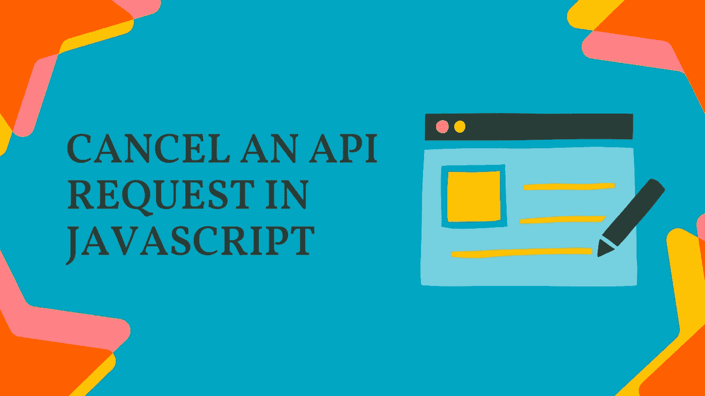

# 在 JavaScript 中取消 API 请求。JavaScript 中的 AbortController

> 原文：<https://blog.devgenius.io/optimize-your-api-by-canceling-it-abortcontroller-in-javascript-d9a5428988b8?source=collection_archive---------14----------------------->



在这篇博客中，我们将学习 JavaScript 中的 AbortController，看看如何优化我们的 API 调用。我们将看到**什么是 AbortController？**和**如何优化 API 请求**。所以，我们马上开始吧。

假设您的网站导航栏列出了不同类别的产品，用户单击某个产品，从而调用 API 来获取该产品的详细信息，但与此同时，用户改变了主意，想要查看另一个产品并单击它。现在，网站正在对服务器进行另一个 API 调用。这里，我们想取消用户发出的第一个 API 调用，因为现在我们不再需要第一个产品细节。

## 如何取消 API 请求？

在 JavaScript 中，我们可以使用 AbortController 取消一个 API 请求

## **什么是堕胎控制器？**

AbortController 是一个构造函数，它在初始化时给你一个控制器对象，使用控制器对象，你可以在需要时取消/中止一个或多个 API 调用。

```
let controller = new AbortController();
```

## 将控制器信号插入提取请求

就像我们将头和内容类型传递给 API 请求一样。我们还需要向我们发出的 API 请求添加一个控制器信号。

```
let controller;
const getData = async function() {
  controller = new AbortController();
  const response = await fetch("https://jsonplaceholder.typicode.com/posts", 
  {
     signal: controller.signal
  });
  const result = await response.json();
}
```

## 中止 API 请求

现在，基于我们选择的场景，我们可以使用 **controller.abort()** 取消 API 调用

假设我们想在用户点击 cancel 按钮时取消我们的请求。现在，我们可以监听用户发出的点击事件，并基于它取消我们发出的请求。

```
<div>
  <button class="cancel">Cancel</button>
</div>
```

```
const cancelBtn = document.querySelector(".cancel"); 
cancelBtn.addEventListener("click", () => { 
  controller.abort(); 
});
```

**感谢您阅读至此。我希望现在您已经理解了如何取消 API 请求。**

## 如果你想要更多这样的内容，请在[媒体](https://rajeshi.medium.com)上关注我，并订阅我的 [YouTube](https://www.youtube.com/channel/UCgfW-cxlW7NlpbOscKJYkfA) 频道

# 你也可以在推特上找到我