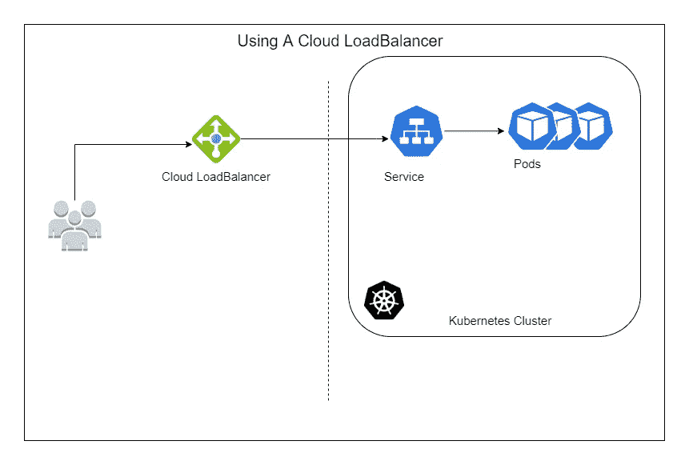
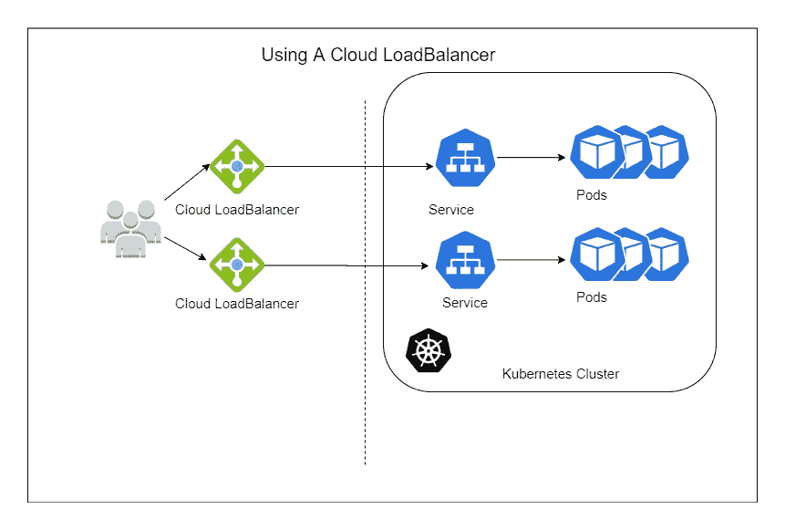
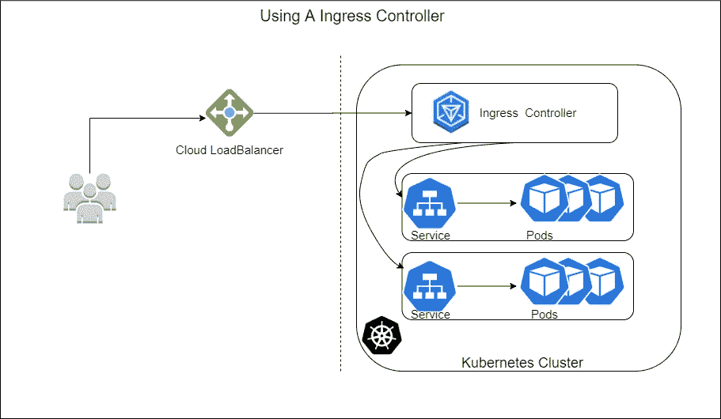
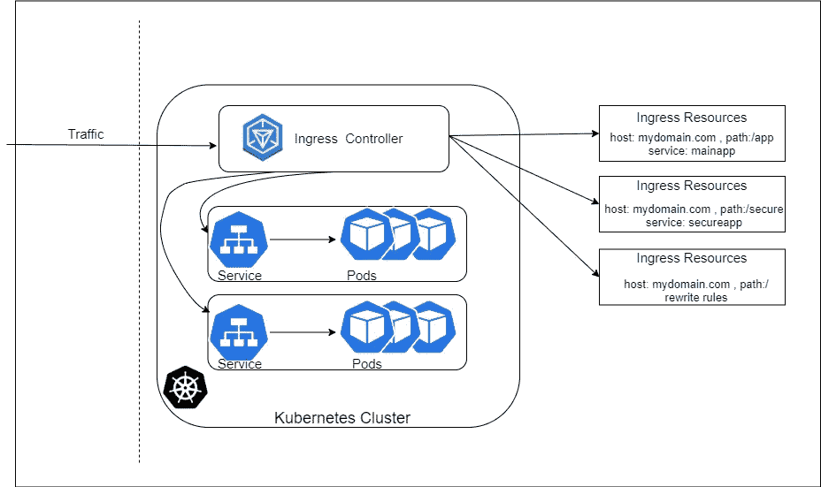

# 使用 Ingress 优化您的 Kubernetes 服务

> 原文：<https://blog.devgenius.io/optimize-your-kubernetes-service-using-ingress-ab20ae2ec2aa?source=collection_archive---------22----------------------->

## 入口和入口控制器

[斯科特·格雷厄姆](https://unsplash.com/@sctgrhm?utm_source=medium&utm_medium=referral)在 [Unsplash](https://unsplash.com?utm_source=medium&utm_medium=referral) 上拍照

我们一直使用云负载平衡器向外界公开我们的服务。让我们看看如何使用入口控制器来优化我们的 Kubernetes 服务。

## 进入

与使用传统的云负载平衡器相比，入口是一种更加可定制的方式来公开我们的流量。对于每个服务，我们配置一个入口对象来定义如何路由流量。入口对象配置对群集外服务的访问。Ingress 是一种针对 web 流量(主要是 HTTP 和 HTTPS)的设计，它允许 it 定制路由，并提供选项来保护 SSL 流量，并根据主机名和 URL 路径路由到不同的后端服务。一旦我们定义了入口资源，我们就设置了一个入口控制器。

## 入口控制器

入口控制器本身是基于其资源(入口定义)路由流量的实际应用。但是面向公众的前端通常只有一个云负载平衡器。尽管如此，通过使用入口控制器来管理通过它的所有流量，我们将所有的路由和服务逻辑整合到一个资源中。
最受欢迎的入口控制器是 Nginx 入口控制器，因为它为 Nginx 网络服务器提供电源，帮助引导我们的流量。但是也可以使用其他入口控制器，如 Istio 入口、HAProxy 入口等。
让我们看一张图，以便更好地理解这一点。

在虚线的右侧，我们有我们的 Kubernetes 集群。我们已经有了运行我们的应用程序的 pod 和定义对它的访问的服务对象。然后我们询问我们的云服务提供商(AWS、GCP、Azure 等。)来提供一个负载平衡器，以便向外界公开该服务。但是在这种模式下，如果我们想要添加额外的服务并向外界公开，我们会提供更多的负载平衡器。我们将在如何配置这些负载平衡器方面受到一些限制，随着我们添加更多的服务，我们将开始为更多的负载平衡器转发角色付费。

或者，通过使用入口控制器模型，我们将需要一个云负载平衡器。所有流量将首先路由到入口控制器。入口控制器然后相应地将该流量路由到我们集群中的服务。

让我们仔细看看入口控制器是如何工作的！

当流量到达入口控制器时，它会检查其路由逻辑的入口资源。在这里，它可以根据主机名或 URL 中的路径决定将流量路由到不同的后端服务。我们甚至可以用重写规则来注释入口资源。

**Nginx 入口控制器**
Nginx 入口控制器是一般入口控制器的普遍选择。Nginx 入口控制器可作为一个稳定的头盔拍摄，可以在几分钟内安装。它支持作为常规部署或守护进程集运行。如果选择常规部署，Nginx 入口控制器还支持水平 pod 自动扩展。Kubernetes 项目本身也支持它，所以如果它符合您的需求，这是一个很好的选择。

仅仅通过使用一些入口控制器(或者可能是一个),您就可以节省在配置多个负载平衡器上花费的大量资金。