# 优化地图缩减作业

> 原文：<https://blog.devgenius.io/optimizing-map-reduce-job-fe7e3dc12001?source=collection_archive---------11----------------------->

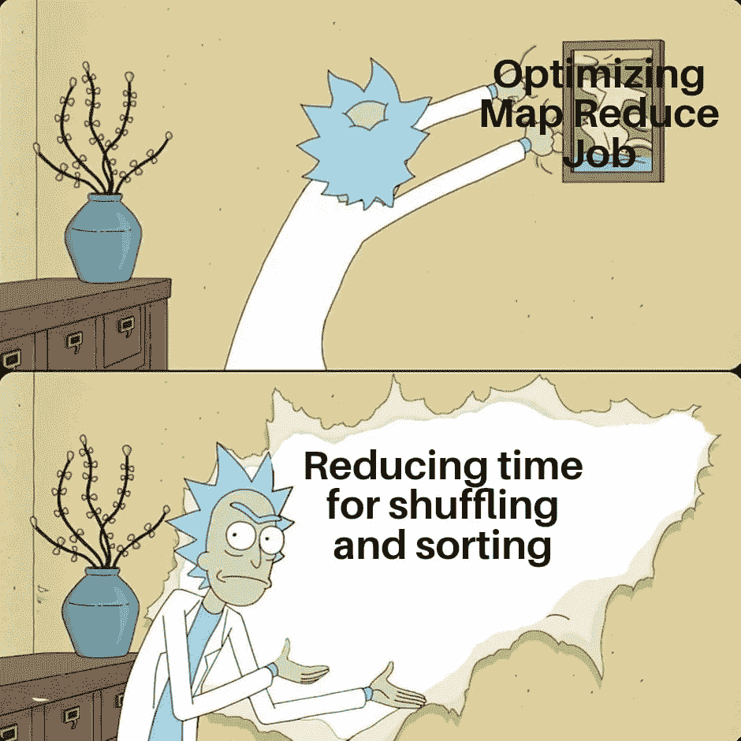

让我们做这个家伙💪🏻

在最后一篇[文章](/map-reduce-example-89bd529e4277)中，我们潜入水中🏊🏻‍♀️进入**地图缩小**并借助一个例子理解了它。我们使用了一个非常简单的例子来查找文件中的单词频率。我们还在 Map Reduce 中看到了混洗和排序过程，这是我们将映射器输出移动到 Reduce 时需要花费时间的一步。在最后一个例子中，我们只使用了 1 个减速器。如果呢！我们使用的**减速机**不止 1 台。映射器的输出将如何在缩减器之间分配，以及它将如何优化映射缩减作业。很多 questions❓人对吗😣没问题。今天我们将借助一个详细的例子来回答所有这些问题。让我们开始…

# 查找每个学生的总分数

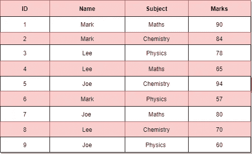

让我们找出每个主题的总数😙

因此，上述数据将成为我们的**输入记录**，我们必须首先将其转换为(键，值)对。**记录阅读器**可以为我们做到这一点。

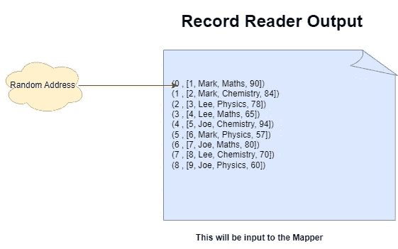

这些密钥是随机的，但在这里，我们连续使用它们只是为了举例。值将是 id、名称、主题、标记的整行。现在，因为我们只需要找到每个学生的总分数，所以不需要映射器逻辑的关键字、id 和主题。所以映射器的输出应该是..

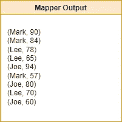

现在数据将被**混洗和排序(升序)**并且我们将作为

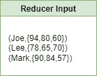

在汇总列表后，我们将得到减速器输出

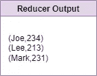

这是和上次一样的例子。让我们先了解一些事情，并尝试添加那些辛辣的东西🍜知识融入其中。

让我们飞得更高🚀🚀

## **推出多少 mappers 和 reducers？**

假设我们上面的数据是 1 GB。

因此，数据块数量= 1 GB / 128 MB(默认数据块大小)= 8 个数据块

**映射器数量** =块数

启动了 8 个 Mappers。

这并不意味着所有的映射器都将并行运行。假设我们有 3 个节点，那么所有块将不会并行运行，但最终将运行 8 个映射器。因此映射器的并行性将取决于可用的资源。

到达**减速器数量。**默认情况下，我们只有 1 个减速器，但是我们可以将减速器的数量改成甚至 0 个，也可以使其超过 1 个。

## **零(0️⃣)** 🤯**？？哪些任务可以通过将减压器设置为零来解决🤔**

很少有作业不需要聚合(例如:-过滤)和 ***混洗&排序(数据从映射器到 reducess 的移动称为混洗)，只有当我们有一个或多个 reduce 时才会发生。*** 因此，如果有一个场景，您只需要过滤数据，例如:-在上面的示例中，假设我们只需要大于 60 的标记作为输出，那么我们将不需要 reducer，因为我们只进行过滤，没有聚合部分，因此没有数据移动。**在这些场景中，映射器输出是最终输出。**在输出中，我们将有 8 个输出文件，因为有 8 个映射器。

## 我们什么时候应该考虑增加减速器的数量？

假设 5 个制图者的工作在 2 分钟内完成，1 个减速器需要 10 分钟，那么总共需要 12 分钟。我们对代码逻辑做了一些修改，将负载从 reducer 转移到 mappers(因为他们做的工作很少)，现在 mappers 需要 3 分钟，reducer 需要 5 分钟，所以总共需要 8 分钟，但除此之外，我们无法优化。所以，我们应该选择增加减压器的数量。

## **还原器超过 1 个时，洗牌后的数据将如何划分？**

这是怎么回事？😵😵

现在，假设我们有两个归约器，那么逻辑应该涉及到发送(键，值)对给两个归约器。为什么这里需要逻辑？？正如你所知道的，reducer 在聚合部分和聚合部分必须在相同的键上完成。我们不能在不同的 reducers 中有相同的键，那么在最终输出中，我们将有两个相同的键，并且输出将是不一致的。那解决办法是什么？🤔🤔

# 划分

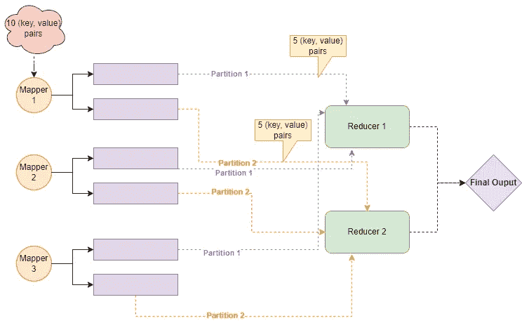

因此，为了保持这种一致性，当我们有不止一个缩减器时，分区的概念就发挥作用了。这是为了告诉哪一个键值对去哪一个 reducer。相同的键将总是进入相同的 reducer，以在聚合期间保持一致性，从而获得最终输出。**归约器可能无法获得相同数量的(键，值)对，因为一些键可能更少，一些键可能更多，这就是为什么在归约器中存在(键，值)对的不均匀分割。**默认情况下，有一个哈希函数(系统定义的)来判断哪个(键，值)对属于哪个分区/缩减器。例如:- mod 是一个散列函数。**哈希函数要一致。**

在我们的例子中，假设我们的散列函数的字符数小于等于 3(这是我们用户定义的一致函数),那么所有键为 **Lee，Joe** 的对将进入同一个 reducer，而**标记**到另一个。

**哈希函数不在哪里的例子？**

随着价值的波动，将美元($)转换成卢比是不一致的。对于散列函数，值必须稳定。

整个过程持续到现在..

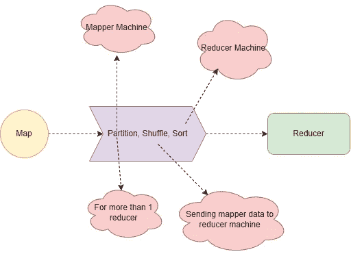

云定义了流程的定义位置

## 能不能做更好的优化？

让我们保持动力，尽最大努力🙂🙂

在洗牌和排序部分之后，我们正在做汇总部分。我们可以在它减少减速器的负载和我们的绘图仪工作更多之前完成它。这被称为**本地聚合。**我们将使用**组合器**用于本地聚合部分。

让我们用同样的例子来试试。因此，我们将有 4 个映射器，因为我们的数据是 1 GB。我们需要找到每个学生的总数，但这次我们将考虑本地聚合🏏。

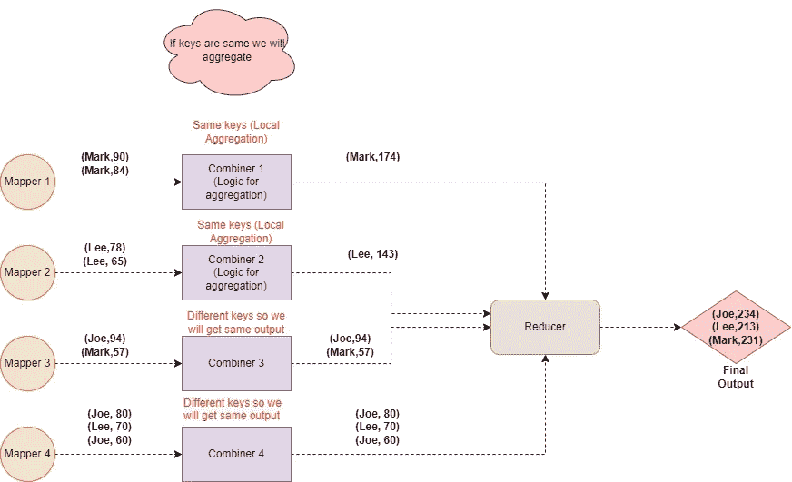

在前面的例子中，我们向 reducer 发送了 9 个(键，值)对，但是现在我们只发送了 7 个(键，值)对。因此，我们正在减少洗牌时间，这是我们应该做的👍当我们优化一个地图缩小工作。

组合器做的工作和 reducer 完全一样，但是 reducer 处理全部数据，而组合器处理数据的子集。合并器位于映射器机器上。

**本地聚集的优势**

1.  减少数据传输
2.  提高并行度

# 小心使用组合器，☢

💥💣🧨🤯🧪

我们应该谨慎理解组合器。让我们用同样的例子来理解。

当我们谈到 **MIN** ， **MAX** ， **SUM** 使用合并器有无结果都是一样的。

# **但是如果我们用平均呢？**

假设我们需要找到每个学生的平均值

## 无组合器

答案是

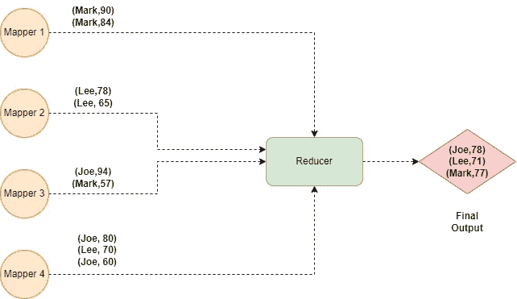

## 带组合器

答案是

*当我们使用合并器时，我们得到了不应该发生的错误答案。记住我们的首要任务是先得到正确的答案* ✅.

这就是为什么我们应该谨慎使用组合器，⚠.

我们信任你，但不是每次都信任😆😆

我们可以通过改变组合器逻辑来得到正确的答案。而不是得到**平均值**作为局部聚集逻辑。我们应该像这样在局部聚集期间做 **SUM** :

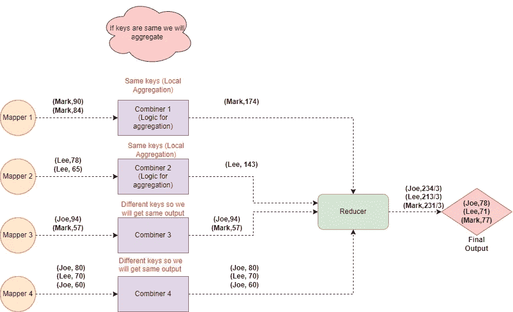

所以，当使用**合并器**时，试着相应地调整本地聚合逻辑，这样你就不会得到错误的答案。

# 未来🧘‍♀️的动力👼

在 **Map Reduce** 中有更多内容，我们将在以后的文章中逐步了解它是如何被 Hadoop 中的不同框架使用的。但是现在我们已经为我们的高🗼结构。

我们甚至可以写代码👩‍💻for**Map Reduce Job**用 Java 编写，可以在我们的机器上运行代码。但是现在我只想保持简单，给你们看代码👩‍💻当我们遇到**火花**(未来话题伙计们不要担心放松就好🍨)因为我不想吓到👻你现在有很长很长的代码。当我们学习 **Spark** 的时候，你将会用几行代码做和我们在 java 中做的一样的事情。在那里，我将向你展示两种代码之间的区别，以及为什么 **Spark** 如此出色。

我认为我们已经做了足够的地图缩小，现在是时候了⏰向前进。保持冷静，感觉放松🧊，并填写意见💬如有任何疑问，请参阅。

让我们结束这个博客吧🤗暂时的！

现在是时候进入下一个话题了，☠☠

**干杯🤗读者们，如果你们已经走了这么远..**

**谢谢！为了阅读。**

如果你喜欢这个博客，请鼓掌回应👏

**跟随..☺️** [**我**](https://medium.com/@prikshitsingla78) **更多这样有见地的 articles✍️**

请在评论中分享你的想法，并请分享对需要改进的部分的反馈，以便我下次改进。

祝大家有美好的一天！