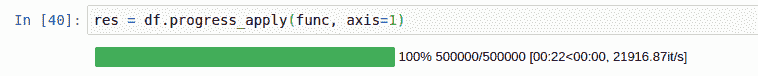

# 优化 Pandas 数据框架📁使用并行处理的操作🚅

> 原文：<https://blog.devgenius.io/optimizing-pandas-data-frame-operations-using-pandarallel-8824a599123?source=collection_archive---------3----------------------->

嘿，伙计们👋，让我们快速讨论一下 pandas 中的并行处理模块，它有助于将数据帧分成更小的部分并单独执行。

目录:

*   ***什么是 Pandarallel(并行处理)？***
*   ***如何实现 Pandarallel？***
*   ***结论***

## ***什么是 Pandarallel？***

在开始了解 pandarallel 之前，我们应该先了解一下“并行处理”。

*   **并行处理**是一种操作模式，在这种模式下，任务被分成更小的部分，每个任务在连接到同一台计算机的不同处理器上同时执行


更多详情请访问:[https://hotcore.info/babki/parallel-processing-model.htm](https://hotcore.info/babki/parallel-processing-model.htm)

现在让我们来谈谈 pandarallel，它是一个 python 模块，提供了一种简单的方法，只需更改一行代码就可以在所有 CPU 上并行处理 pandas 操作(它还显示进度条)。

只是为了展示使用和不使用 pandarallel 的情况:

*   没有并行化



[https://raw . githubusercontent . com/nale PAE/pandarallel/master/docs/progress _ apply . gif](https://raw.githubusercontent.com/nalepae/pandarallel/master/docs/progress_apply.gif)

*   并行化


[https://raw . githubusercontent . com/nale PAE/pandarallel/master/docs/progress _ parallel _ apply . gif](https://raw.githubusercontent.com/nalepae/pandarallel/master/docs/progress_parallel_apply.gif)

要阅读更多关于 python 模块的内容，请访问 Github 页面。

## ***如何实现 Pandarallel？***

让我们来看一个数据集，看看 pandarallel 是如何工作的，

```
## Importing pandas module
import pandas as pd

## Reading and displaying the dataset
df = pd.read_csv("Sales_Data.csv")
display(df.head())
```


数据框看起来像这样

现在下一个任务是导入 pandarallel 模块并初始化它。

```
## Importing the module
from pandarallel import pandarallel 

## Initilze the pandarallel
pandarallel.initialize(progress_bar = True)
```


工作节点的数量

为了进行测试，我们创建了一个简单的函数，将“单位成本”和“单位价格”相乘(您可以给 python 函数起一个更好的名字😅).

```
## Function defination 

def add_column(df):
    return (df['Unit Cost'] * df['Unit Price'])
```

现在让我们看看有无 pandarallel 的情况。

*   没有 pandarallel

— — — — — — — — — — — — — — — — —

```
df['Cal_cost'] = df.apply(add_column, axis=1)
```

为了以进度条的形式看到这一点，我们可以使用另一个名为“[**【tqdm】**](https://tqdm.github.io/)**”的模块。**

```
from tqdm import tqdm
tqdm.pandas()

df['Cal_cost_tqdm'] = df.progress_apply(add_column, axis=1)
```


无 pandarallel:输出

— — — — — — — — — — — — — — — — —

*   与 pandarallel

— — — — — — — — — — — — — — — — —

```
df['Cal_cost_parallel'] = df.parallel_apply(add_column, axis=1)
```


带 pandarallel:输出

10，000 行在 4 个节点之间划分(每个节点 2500 行)。

— — — — — — — — — — — — — — — — —

## 结论

在这篇文章中，我们了解了两个惊人的 python 模块 pandarallel 和 tqdm。

**注意** : *通常只有当你有一个非常大的数据集来显示这个模块的真正能力时，才使用 Pandarallel，否则普通方法和这个方法之间的时间差是可以忽略的。*

[**更多关于我:**](https://linktr.ee/ravikumar10593)

我是一名数据科学爱好者🌺，学习和探索数学、商业和技术如何帮助我们在数据科学领域做出更好的决策。

**想看更多**:[*https://medium.com/@ravikumar10593/*](https://medium.com/@ravikumar10593/)

**找到我的所有句柄**:[*https://linktr.ee/ravikumar10593*](https://linktr.ee/ravikumar10593)

> 如果这篇文章对你有所帮助，别忘了关注、喜欢并分享给你的朋友👍快乐学习！！