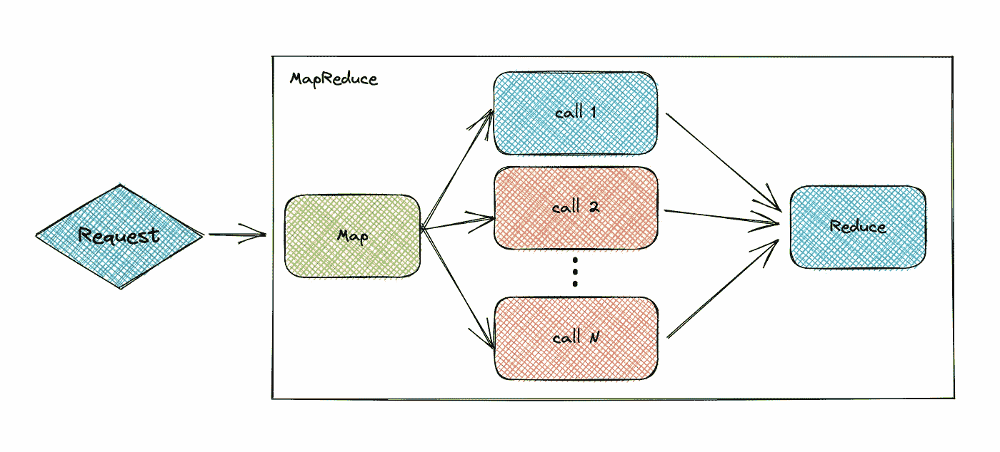
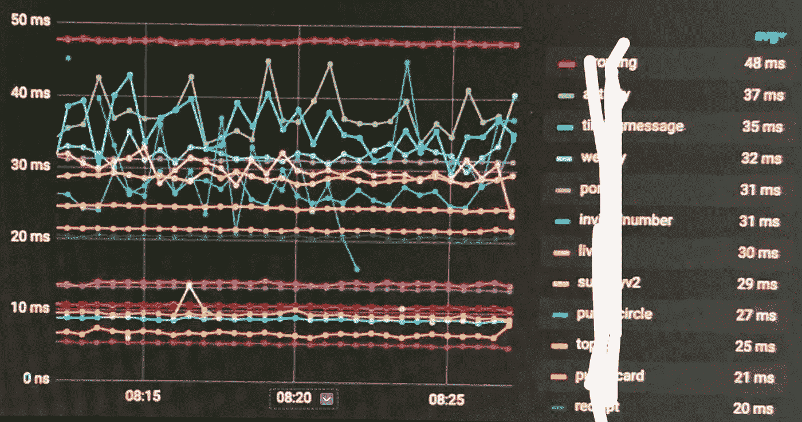
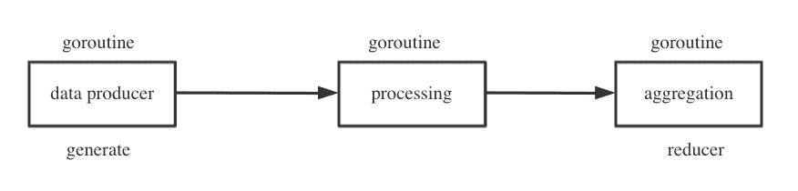
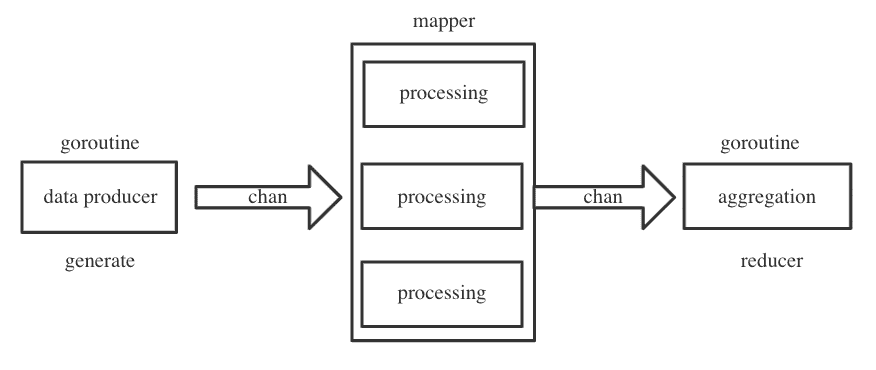
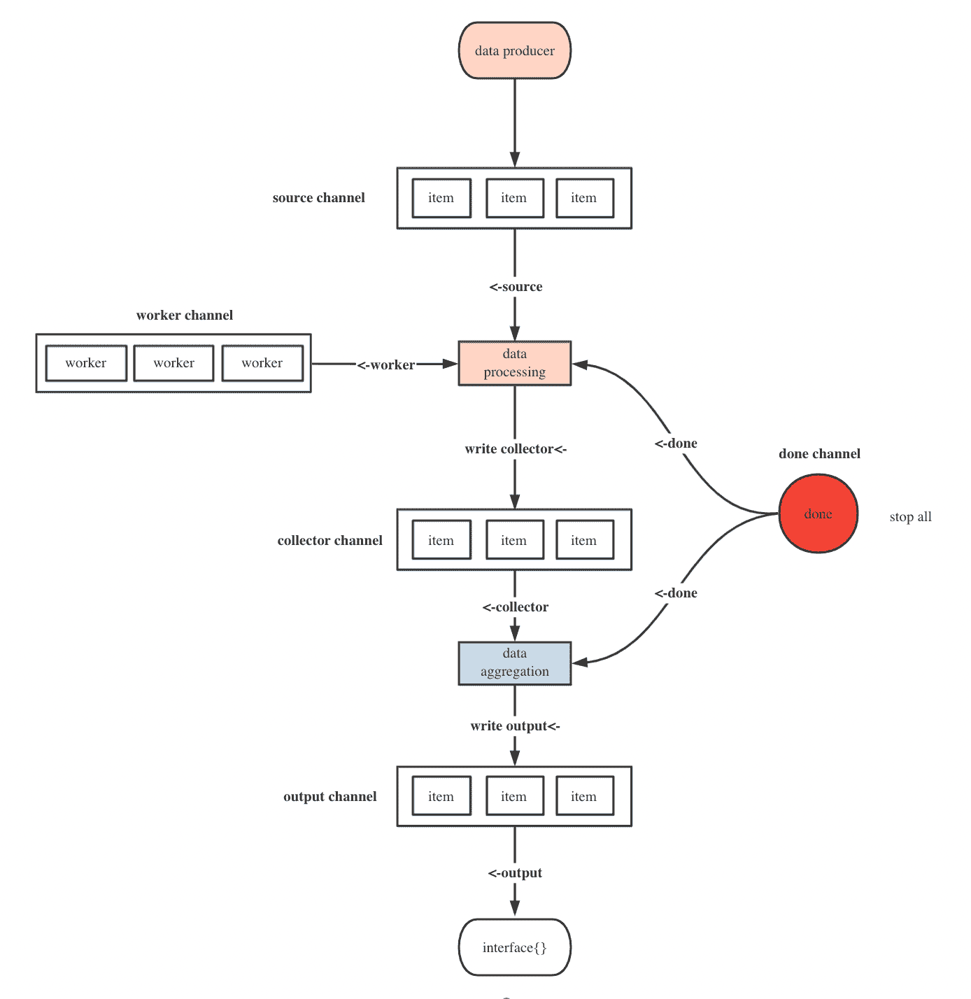

# 使用 MapReduce 优化服务响应时间

> 原文：<https://blog.devgenius.io/optimizing-the-service-response-time-by-using-mapreduce-d0379755072d?source=collection_archive---------7----------------------->



我们的服务达到大约 30 毫秒的平均延迟的主要先决条件之一是我们使用 MapReduce，它允许我们的服务调用许多服务，这通常取决于最慢请求的响应时间。



对于您现有的服务，无需优化数据库操作、优化缓存或重写业务逻辑，只需通过 MapReduce 并行化正交(不相关)请求，您就可以显著减少服务响应时间。

在本文中，我们将向您详细介绍 MapReduce 实现的细节。

# 为什么需要 MapReduce

在实际的业务场景中，我们经常需要从不同的 rpc 服务中获取相应的属性来组装复杂的对象。

例如，查询产品详细信息。

1.  产品服务—查询产品属性
2.  库存服务—查询库存属性
3.  价格服务-查询价格属性
4.  营销服务—查询营销属性

如果是串行调用，响应时间会随着 rpc 调用的次数线性增加，所以我们一般会将串行改为并行，以优化响应时间。

使用`WaitGroup`的简单场景也能满足需求，但是如果我们需要检查 rpc 调用返回的数据，数据处理转换，数据聚合呢？go-zero 实现了一个基于 MapReduce 架构的进程内数据批处理`MapReduce`并发工具类。

# 设计理念

让我们试着站在作者的角度，为并发工具整理出可能的业务场景:

1.  查询产品详情:支持并发调用多个服务来组合产品属性，支持可以立即结束的调用错误。
2.  产品详情页自动推荐用户卡券:支持并发验证卡券，失败自动拒绝，全部退回。

以上实际上是对输入数据进行处理，最后输出清洗后的数据。数据处理有一个非常经典的异步模式:生产者-消费者模式。所以我们可以抽象出数据批处理的生命周期，大致可以分为三个阶段。



1.  数据生产生成
2.  数据处理映射器
3.  数据聚合缩减器

数据产生是必不可少的阶段，数据处理和数据聚合是可选阶段，数据产生和处理支持并发调用，数据聚合基本上是纯内存操作，所以单个并发进程就可以完成。

由于数据处理的不同阶段是由不同的 go routine 执行的，因此自然要考虑使用通道来实现 go routine 之间的通信。



如何随时终止该进程？

很简单，只需监听全局结束通道或 goroutine 中给定的上下文。

# 归零码实现

`core/mr/mapreduce.go`

# 必备知识—基本渠道使用

由于 MapReduce 源代码使用了很多通道进行通信，所以让我们来提一些基本的通道用法:

*   写完后记得关闭频道

```
ch := make(**chan** **interface**{})
// You need to actively close the channel when you finish writing
**defer** **func**() {
    close(ch)
}()
**go** **func**() {
    // v,ok mode Read the channel
    **for** {
        v, ok := <-ch
        **if** !ok {
            **return**
        }
        t.Log(v)
    } // for range mode reads the channel, the channel closes the loop and exits automatically
    **for** i := **range** ch {
        t.Log(i)
    } // Clear the channel, the channel close loop exits automatically
    **for** **range** ch {
    }
}()
**for** i := 0; i < 10; i++ {
    ch <- i
    time.Sleep(time.Second)
}
```

*   封闭通道仍然支持读取
*   限制通道读写权限

```
// Read-only channel
**func** **readChan**(rch <-**chan** **interface**{}) {
    **for** i := **range** rch {
        log.Println(i)
    }
}// Write only the channel
**func** **writeChan**(wch **chan**<- **interface**{}) {
    wch <- 1
}
```

# 接口定义

让我们从三个核心函数定义开始。

1.  数据生产
2.  数据处理
3.  数据聚合

```
// data production func
// source - data is produced and written to source
GenerateFunc **func**(source **chan**<- **interface**{})// data processing func
// item - the produced data
// writer - call writer.Write() to pass the processed data backwards to the reducer
// cancel - terminates the process func
MapperFunc **func**(item **interface**{}, writer Writer, cancel **func**(error))// data aggregation func
// pipe - the processed data
// writer - call writer.Write() to return the aggregated data to the user
// cancel - terminates the process func
ReducerFunc **func**(pipe <-**chan** **interface**{}, writer Writer, cancel **func**(error))
```

# 面向用户的方法定义

[**用法可以查看官方文档，这里就不赘述了**](https://go-zero.dev/cn/mapreduce.html)

面向用户的方法更多，方法分为两大类。

**不归**

*   当出现错误时，执行过程立即终止
*   执行过程不关注错误

**带有返回值**

*   手动写入源，手动读取聚合数据通道
*   手动写入源，自动读取聚合数据通道
*   外部传递到源，自动读取聚合数据通道

```
// Concurrent execution of func, any error will terminate the process immediately
**func** **Finish**(fns ... . **func**() **error**) **error**// Execute func concurrently, even if an error occurs, the process will not be terminated
**func** **FinishVoid**(fns ... .**func**())// requires the user to manually write the production data to the source, process the data and return a channel for reading
// opts - optional parameter, currently contains: number of concurrent processes in the data processing phase
**func** **Map**(generate GenerateFunc, mapper MapFunc, opts . .Option)// no return value, no focus on errors
**func** **MapVoid**(generate Generate GenerateFunc, mapper VoidMapFunc, opts . . Option)// No return value, focus on errors
**func** **MapReduceVoid**(generate Generate GenerateFunc, mapper MapperFunc, reducer VoidReducerFunc, opts . . Option)// requires the user to manually write the production data to source and return the aggregated data
// generate produce
// mapper processing
// reducer aggregation
// opts - optional parameter, currently contains: number of processors in the data processing phase
**func** **MapReduce**(generate Generate GenerateFunc, mapper MapperFunc, reducer ReducerFunc, opts . .Option) (**interface**{}, error)// Support passing in a data source channel and returning the aggregated data
// source - the data source channel
// mapper - reads the source content and processes it
// reducer - the data is processed and sent to the reducer for aggregation
**func** **MapReduceWithSource**(source <-**chan** **interface**{}, mapper MapperFunc, reducer ReducerFunc,
    opts . .Option) (**interface**{}, error)
```

核心方法是 MapReduceWithSource 和 Map，所有其他方法都在内部调用它们。一旦弄清楚 MapReduceWithSource 方法，调用 Map 就不是什么大事了。

# MapReduceWithSource 源代码实现

都在这个图表里了



```
// Support passing in a data source channel and returning the aggregated data
// source - the data source channel
// mapper - reads the source content and processes it
// reducer - send the data to the reducer for aggregation after processing
**func** **MapReduceWithSource**(source <-**chan** **interface**{}, mapper MapperFunc, reducer ReducerFunc,
    opts . .Option) (**interface**{}, error) {
    // Optional parameter settings
    options := buildOptions(opts...)
    // Aggregate data channel, need to manually call write method to write to output
    output := make(**chan** **interface**{})
    // output will only be read once at the end
    **defer** **func**() {
        // If there are multiple writes, it will block and cause a concurrent leak
        // Here we use for range to check if the data can be read, and if it can be read, it means it was written multiple times
        // Why do we use panic here? It's better to show the user that the usage is wrong than to fix it automatically
        **for** **range** output {
            panic("more than one element written in reducer")
        }
    }()
    // create a cached chan with a capacity of workers
    // means that up to workers are allowed to process data at the same time
    collector := make(**chan** **interface**{}, options.workers)
    // Data aggregation task completion flag
    done := syncx.NewDoneChan()
    // Writer that supports blocking writes to chan
    writer := newGuardedWriter(output, done.Done())
    // Single instance closure
    **var** closeOnce sync.
    **var** retErr errorx.AtomicError
    // The data aggregation task is finished and the finish flag is sent
    finish := **func**() {
        // Can only be closed once
        closeOnce.Do(**func**() {
            // send the completion signal for the aggregation task, the close function will write a zero value to chan
            done.Close()
            // Close the data aggregation chan
            close(output)
        })
    }
    // Cancel the operation
    cancel := once(**func**(err error) {
        // set error
        **if** err ! = **nil** {
            retErr.Set(err)
        } **else** {
            retErr.Set(ErrCancelWithNil)
        }
        // Clear the source channel
        drain(source)
        // call the finish method
        finish()
    }) **go** **func**() {
        **defer** **func**() {
            // Clear the aggregation task channel
            drain(collector)
            // Capture the panic
            **if** r := recover(); r ! = **nil** {
                // Call the cancel method to end immediately
                cancel(fmt.Errorf("%v", r))
            } **else** {
                // end normally
                finish()
            }
        }()
        // Perform data processing
        // Note that writer.write writes the processed data to output
        reducer(collector, writer, cancel)
    }()
    // Perform data processing asynchronously
    // source - data production
    // collector - data collection
    // done - the end flag
    // workers - concurrent count
    **go** executeMappers(**func**(item **interface**{}, w Writer) {
        mapper(item, w, cancel)
    }, source, collector, done.Done(), options.workers)
    // The reducer writes the processed data to the output.
    // Read the output when you need the data back
    // If the output has been written more than twice
    // then the defer func at the beginning will still be able to read the data
    // This detects that the user has called the write method more than once
    value, ok := <-output
    **if** err := retErr.Load(); err ! = **nil** {
        **return** **nil**, err
    } **else** **if** ok {
        **return** value, **nil**
    } **else** {
        **return** **nil**, ErrReduceNoOutput
    }
}// Data processing
**func** **executeMappers**(mapper MapFunc, input <-**chan** **interface**{}, collector **chan**<- **interface**{},
    done <-**chan** lang.PlaceholderType, workers **int**) {
    // goroutine coordinates the synchronization semaphore
    **var** wg sync.WaitGroup
    **defer** **func**() {
        // Wait for data processing tasks to complete
        // prevent the data-processing concurrent from simply quitting before the data has been processed
        wg.Wait()
        // Close the data processing channel
        close(collector)
    }()
    // channel with buffer, buffer size is workers
    // control the number of concurrent processes for data processing
    pool := make(**chan** lang.PlaceholderType, workers)
    // data processing writer
    writer := newGuardedWriter(collector, done)
    **for** {
        **select** {
        // listen to external end signal, end directly
        **case** <-done:
            **return**
        // Control the number of data processing concurrently
        // buffer capacity -1
        // will be blocked when there is no capacity, waiting for capacity to be released
        **case** pool <- lang.Placeholder:
            // blocking waiting to produce data channel
            item, ok := <-input
            // If ok is false, input is closed or cleared
            // Data processing is complete, execute exit
            **if** !ok {
                // buffer capacity + 1
                <-pool
                // end this loop
                **return**
            }
            // wg synchronize semaphore +1
            wg.Add(1)
            // better to safely run caller defined method
            // perform data processing asynchronously to prevent panic errors
            threading.GoSafe(**func**() {
                **defer** **func**() {
                    // wg synchronize semaphore-1
                    wg.Done()
                    // buffer capacity +1
                    <-pool
                }() mapper(item, writer)
            })
        }
    }
}
```

# 摘要

我花了大概两个晚上的时间钻研`MapReduce`源代码，整体看腻了。一方面我对 go 语言不是很精通，尤其是 channel 的用法，需要经常停下来查看相关文档才能理解作者的写法，另一方面通过 channel 交流实现多个 goroutines 之间的协作真的是相当烧脑(佩服作者的思维能力)。

其次，第一次看源代码的时候肯定会比较迷茫，其实没关系找到程序的入口(公共基础组件一般都是面向方法)先沿着主线一路往下看每一句代码理解加注释，然后再看分支线代码。

如果真的有不明白的地方，检查提交记录的代码很有可能解决一个 bug 的修改，比如下面的代码我已经看了很多遍但是不明白。

```
// Aggregate data channel, you need to manually call the write method to write to the output
output := make(**chan** **interface**{})
// output will only be read once at the end
**defer** **func**() {
    // If there are multiple writes, it will block and cause a concurrent leak
    // Here we use for range to check if the data can be read, and if it can be read, it means it was written multiple times
    // Why do we use panic here? It's better to show the user that the usage is wrong than to fix it automatically
    **for** **range** output {
        panic("more than one element written in reducer")
    }
}()
```

最后画出流程图基本上让源代码可以理解，对我来说，这种方法是相当愚蠢但有效的。

# 项目地址

[**https://github.com/zeromicro/go-zero**](https://github.com/zeromicro/go-zero)

欢迎用`go-zero`和**星**支持我们！