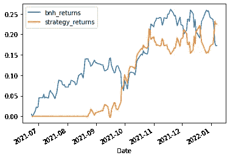
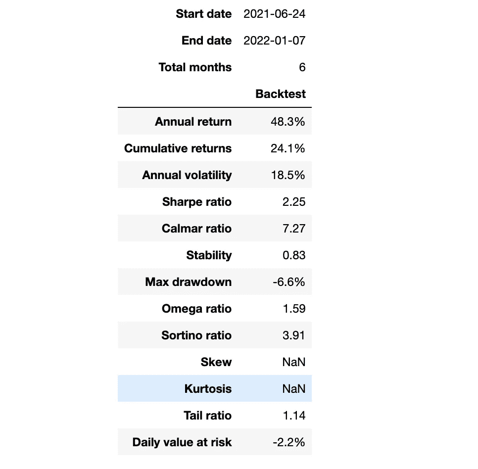
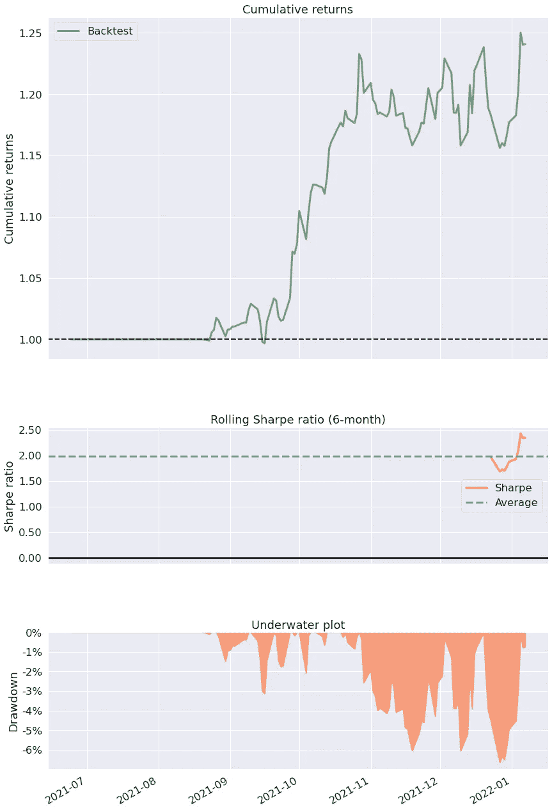

# python 中的算法交易优化策略

> 原文：<https://blog.devgenius.io/optimizing-trading-strategies-using-python-ff419f1f3ffb?source=collection_archive---------0----------------------->


[行政长官](https://unsplash.com/@executium?utm_source=medium&utm_medium=referral)在[广场](https://unsplash.com?utm_source=medium&utm_medium=referral)拍照

在本文中，我将描述如何用 python 回溯测试交易策略的代码片段。这是我的[上一篇关于用 python](/algorithmic-trading-backtesting-a-strategy-in-python-3a136be16ece) 回溯测试策略的文章的后续文章，我高度评价你阅读这篇文章以理解这篇文章。本文背后的动机是展示如何将一个策略应用于不同时间段(开始和结束日期)的各种股票符号，以及封装了绘图和优化技术的代码。

本文特别涵盖了两个主题。

1.  以面向对象的方式组织代码
2.  优化策略参数以实现回报最大化

为了简单起见，我将把代码片段基于基于技术指标的策略(布林线)

## 以下是步骤…

1.  下载所有必要的库
2.  创建财务数据类
3.  策略类(基于布林线的策略)
4.  创建类对象并进行回溯测试
5.  用 pyfolio 创建一个撕页

## 第一步。下载所有必要的库

在此步骤中，将导入所有必需的库

## 第二步。金融数据类

在这个代码片段中，创建了一个财务数据类。类对象接受一个符号、结束日期和需要下载每日数据的天数。

这将是一个基类，可由任何其他策略类继承，以封装所有基本功能，如下载数据、绘制数据、准备数据和创建样张。

## 第三步。策略类(基于布林线的策略)

在此步骤中，将创建一个包含以下功能的策略类

*   准备指标—请参考这篇关于如何用 python 创建示例策略的文章
*   回溯测试策略，包括创建信号、头寸和策略回报
*   Optimizer —此函数迭代一个或多个具有一系列值的参数，并选择具有最高回报的参数。这可以进一步修改，以便结合高 Sharpe 比率对返回值进行排序。
*   画出优化策略的回报。

## 第四步。创建类对象并进行回溯测试

在这一步中，创建了特定策略类的对象。strategy 类中的 optimizer 函数重用 strategy 函数来遍历布林线策略中所需的移动平均线的各种窗口值，并绘制具有最高回报的策略参数。

```
[*********************100%***********************]  1 of 1 completed
   Window  bnh returns  strategy returns
0      41     0.041484          0.216779
1      40     0.041484          0.205460
2      39     0.041484          0.205460
3      27     0.041484          0.183269
4      28     0.041484          0.183269
Window: 41
```



## 5.用 pyfolio 创建一个撕页

```
Bollinger.create_simple_tear_sheet()
```



## 结论

以上代码片段可以在:[https://github . com/karthikramx/algorithm-Trading-optimize-back-test](https://github.com/karthikramx/Algorithmic-Trading-optimize-back-test)找到