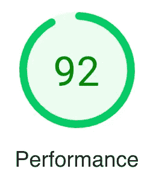
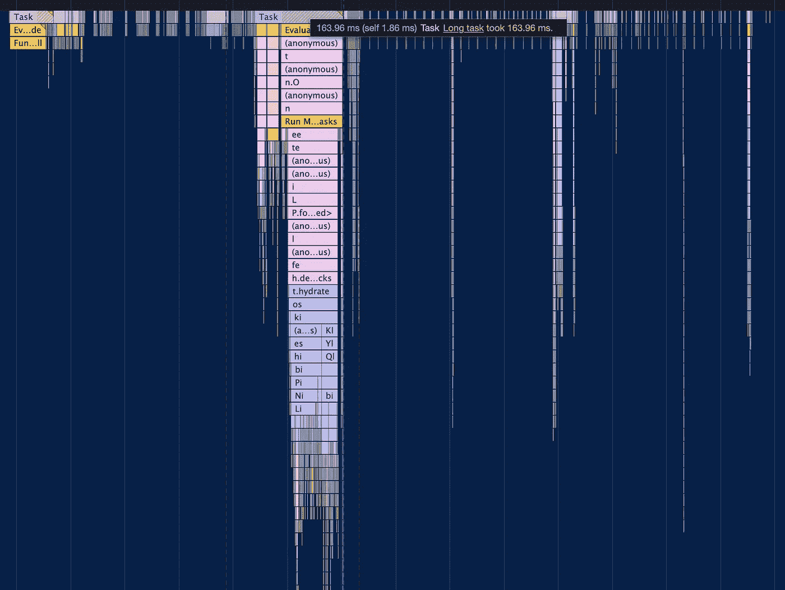
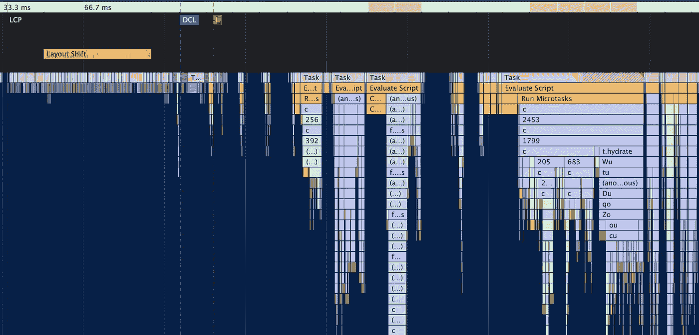
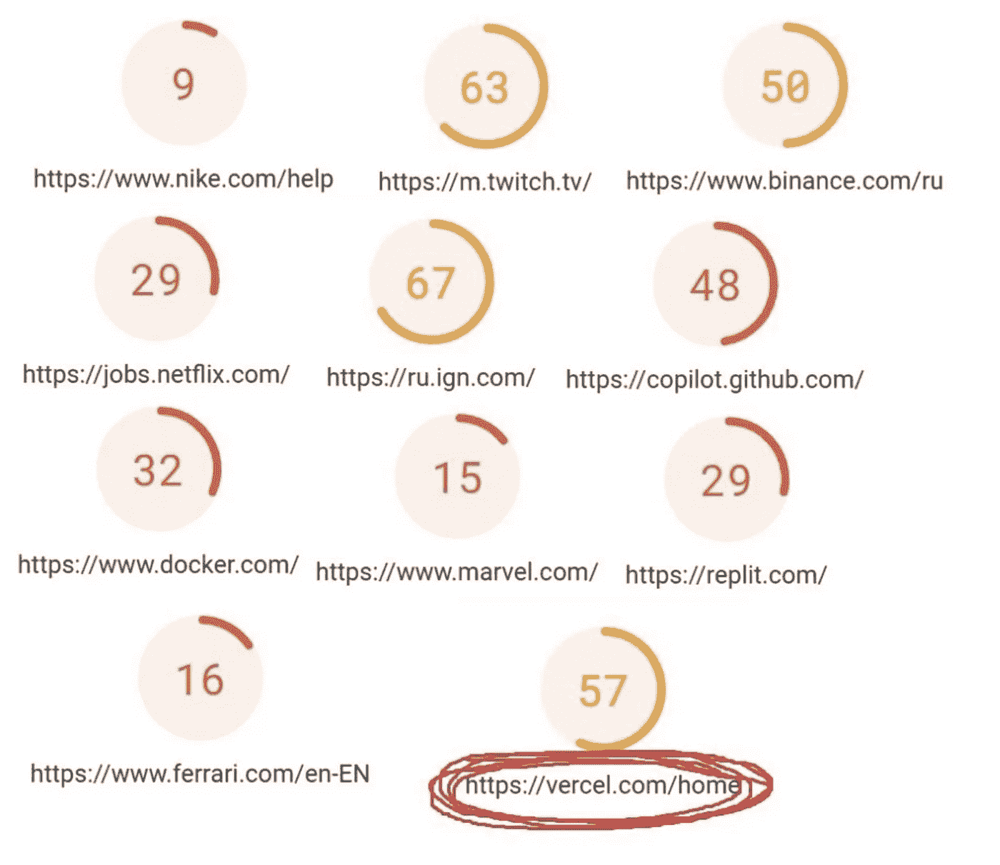
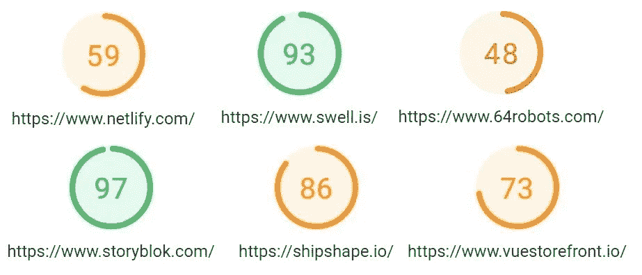
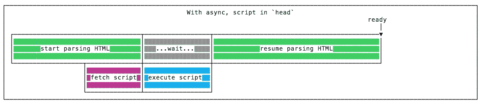
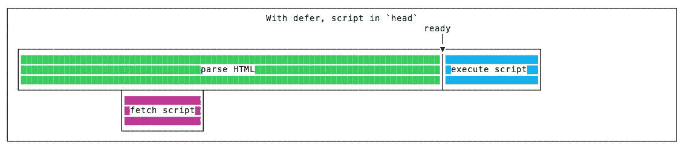

# 使用 NextJS 优化 Web 生命周期

> 原文：<https://blog.devgenius.io/optimizing-web-vitals-with-nextjs-f503aaded741?source=collection_archive---------3----------------------->

根据 [pagespeed.web.dev](https://pagespeed.web.dev/) 的说法，使用 NextJs 可以很容易地获得高达 95 的性能。一般来说，没有人急于得分超过 90，因为没有人知道 90 和 100 之间是否有区别，我想包括谷歌自己。但是如果你需要尽可能接近 100，那么你应该考虑另一个框架——我的建议是 NuxtJS (Vue.js)。

结果:



图 1 —使用 NextJS 时根据页面速度的性能


图 2 —根据页面速度和 NuxtJS 的性能

在我做了下面的改进后，所有的都是为了改进 js 事件循环，你不能用 NextJS 做得足够有效，只要在初始渲染时有丢帧，你就不能进一步改进。



图 Chrome DevTools 中的 NextJS 任务性能记录



图 Chrome DevTools 中的 NuxtJS 任务性能记录

这就是为什么我认为这不是一个错误:



图 5 —根据 NextJS 网站的页面速度的性能



图 6 —根据 NuxtJS 网站的页面速度的性能

重要的是要注意上面各组之间名字的显著性差异，以及谁更需要 seo，但我认为 replit 和 vercel 自己知道他们在做什么。

期望得到纠正后，我们将继续学习如何提高 seo 性能的技巧。

# 如何测试

1.  移动外形更为重要，应该成为关注的焦点。桌面将会不断改进。上面所有的截图都是在移动设备上制作的。
2.  [Pagespeed](https://pagespeed.web.dev/) 对你网站的表现有最终决定权。在下面的所有改进之后，你应该验证它们在 pagespeed 上有多大帮助。本节中的所有工具只对本地开发有帮助。
3.  [灯塔](https://www.npmjs.com/package/lighthouse)是用于本地测试的很棒的 npm 包。比 DevTools 里的 lighthouse 稳定多了。
4.  DevTools 中的 Lighthouse 应该只在隐姓埋名模式下使用，这样会删除一些统计数据。如果仍然有可以匿名访问的扩展，你应该关闭它们，因为它们会在渲染、加载外部数据等过程中扰乱帧。
5.  即使你用缓存清除重新加载页面，chrome 仍然会缓存一些数据，这会扭曲结果。因为它我决定用火狐。
6.  如果在浏览器中使用 lighthouse 进行测试，那么每次重新构建项目时，都应该创建新的浏览器选项卡。

专业提示:如果组件看起来太重或未经优化，最好删除它并检查它，因为问题可能在其他地方。

# 字体

这是最关键的部分。

小建议——提供网络字体的资源保留禁止对其网络字体进行任何修改的权利。我不记得 google-fonts 这样做了，因为我看到的所有 web 字体都有开源许可(你可以通过查看 web-fonts 页面上的许可标签来验证)。

1.  仔细检查设计师是否仍然需要字体，是否应该使用字体，因为过一段时间后，他们很容易忘记。也许它们只是旧了，或者更换它们很简单，因为移除它们就简化了 CLS 修复。
2.  使用字体子集减少所有剩余 web 字体中使用的字形数量。 [Fontsquirrel](https://www.fontsquirrel.com/tools/webfont-generator) 为不同语言、字体粗细甚至单个字形的子集化字体提供了强大的功能。
3.  仔细检查从谷歌字体下载的任何字体。所有提供的 css 文件链接到不同的系列和权重子集，但在大多数情况下，这些链接将是相同的，这意味着字体是一体化的。这不是魔术，因为这些字体的尺寸要大得多。这就是为什么最好自己创建子集。
    对于自定义网页字体，您可以使用 DevTools 快速检查字形编号:*代码元素*->-*元素* - >在样式中选择*计算出的* - >在*渲染字体*窗口底部将会得到字形编号。
4.  Webfonts 应使用值 preload `<link rel="preload"/>`与 rel 属性链接。这将大大降低 CLS，但对技术性贸易壁垒几乎没有影响。
5.  通过 base64 字体移除所有字体链接，因为这将极大地增加 css 文件的大小，从而删除所有重要的字体。

# 导入和第三方脚本

1.  在从版本 11 开始的 NextJS 中，外部脚本应该只通过 [next/script](https://nextjs.org/docs/basic-features/script) 链接(`plugin:@next/next/recommended` eslint 扩展可以帮助避免遗漏)。Doc 详细解释了一切，但总结起来:
    1。Id 总是不同的
    2。策略:
    **`beforeInteractive`—会话管理器、bot 检查等。
    **`afterInteractive`—标签管理器和分析
    **`lazyOnload`—聊天插件和其他小部件(不在*_ 文档*中使用它们，因为它们不会出现，而是在*_ 应用*中使用)
    注意:
    **在撰写原始文章时，测试是在 NextJS 版本 11.1.2 上进行的，由于某些原因，第一次加载 JS 时会更大最后，我对每个脚本进行了测试，以决定是使用 next/script 还是 standard < script/ >(没有找到哪个更好的模式)。
    **由于某种原因，无论使用什么策略，也无论是否指定了 defer 或 async，都无法加载多个脚本(例如来自 googletagmanager 的 gtag 脚本)。小心点。**********
2.  ******任何脚本都应该使用属性 defer 而不是 async。******

************

******图 7 —包括带有异步属性的脚本******

************

******图 8 —包括具有延迟属性的脚本******

******3.积极使用 [next/dynamic](https://nextjs.org/docs/advanced-features/dynamic-import) 用于页面打开时不出现的组件(如下拉菜单、汉堡菜单、弹出菜单)。与`{ ssr: false }`选项一起使用。******

# ******形象******

******我应该推荐 [next/image](https://nextjs.org/docs/api-reference/next/image) ，但我不会。在编写<的时候，图像>没有使用 className 属性，这使得样式非常困难。使用包装元素的解决方法非常糟糕，因为除了/image 创建的 6 个其他节点之外，它还创建了另一个 DOM 节点(4 div + 1 img + 1 noscript)。通常它不会有太大的影响，但是 lighthouse 敦促我们每页创建少于 250 个节点。******

1.  ******所有 img 标签必须指定相应的宽度和高度。******
2.  ******第一屏渲染之外的所有图像都应该加载属性`loading="lazy"`。******
3.  ******如果页面使用了大量的图标，那么它们应该通过 sprite 来使用——小图像被组合成大图像，然后通过背景图像和背景位置来使用。互联网上有很多这样的例子，但随之而来的是一个常见的问题——如何调整精灵图片的大小。可悲的是，没有 js 也没办法。下面是一个示例片段:******

******4.每个图像都应该用 SVGOMG 或它的模拟来处理。结果偶尔会被打破，所以不要在没有测试的情况下使用。如果你使用大量的 svg 图片，那么第一次加载 js 可以节省 100kb 的空间。******

******5.使用[下一张图片](https://www.npmjs.com/package/next-images)有两个原因。首先，你可以使用 webp 和其他现代格式，但是本地支持是有缺陷的。其次，它会在适当的时候自动将图像转换为 base64 格式。bas64 中的图像大大提高了加载速度，因为对它们没有额外的请求。但是，不要自己转换所有图像，因为每个图像都有其大小阈值，当 base64 字符串实际上比图像本身更大时，整个页面的加载速度会下降。这个包省了很多麻烦。******

```
****const withImages = require(‘next-images’)
module.exports = withImages({
 // … then standard next.config.js
})****
```

# ******库和包******

******检查每个包裹的尺寸很重要。也许它有 30kb 大，但只有一小部分被使用，可以在 5 秒内重写，就像我用 swiper.js 一样。******

1.  ******使用 [bundlephobia](https://bundlephobia.com/) 检查包裹尺寸。也许我在这里有点极端，但是每个 kb 都很重要，将包大小和第一次加载 js 减少 10kb 可以使性能提高 5 个百分点。******
2.  ******仔细检查包装是否使用正确。在 [NextJS github](https://github.com/vercel/next.js/tree/canary/examples) 上有如何使用像 [mobx](https://github.com/vercel/next.js/tree/canary/examples/with-mobx-react-lite) 或者 [redux](https://github.com/vercel/next.js/tree/canary/examples/with-redux) 这样的热门包的例子。******

# ******应用程序接口******

*******这不会直接影响性能，但为什么不在这里改进呢。*******

******所有请求都应该使用压缩。******

******在像 cloudflare 这样的 PaaS 上，您可以通过一个复选标记来启用压缩。或者使用类似 nginx 的反向代理来启用它。这将减少执行代码的数量，从而加快响应速度，缩短交互时间。******

******要通过代码进行压缩，您可以使用中间件，如用于 koa 的 [koa-compress](https://www.npmjs.com/package/koa-compress) 或用于 Nest.js 的[压缩模块](https://docs.nestjs.com/techniques/compression)。最后一个注意到，对于高流量，压缩应该转移到反向代理:******

> ******对于生产中的**高流量**网站，强烈建议从应用服务器卸载压缩******

****尽管如前所述，压缩不应该通过代码来完成，但我决定找出 100 个请求的平均值。也许我得到这样的测试结果是因为请求的有效负载很小，但无论如何也不应该很大。****

```
**Nginx + middlewares: 353.61msNginx without middlewares: 370.54msMiddlewares without Nginx: 433.11msNone: 10.5s**
```

****所以目前我决定同时使用这两种方法，但也许未来会教我其他方法。****

# ****常规优化技巧****

1.  ****别忘了`requestAnimationFrame`。如果每一帧都要渲染一些东西，那么必须用这个函数来完成，因为它有助于事件循环在帧之间分配工作。****
2.  ****`scroll`和所有`touch`事件的处理程序必须添加`{ passive: true }`选项，因为它优化滚动。****

```
**useEffect(() => {
  window.addEventListener('scroll', () => {}, { passive: true }) return () => {
    window.removeEventListener('scroll', () => {})
  }
}, [])**
```

****3.仔细检查您对 api 的请求是否不应该通过批处理操作来实现。****

****4.所有 mount useEffect(那些没有依赖关系的)都必须返回清理函数，以清除所有超时和间隔，删除所有事件侦听器，并禁止在异步函数中更改状态。如果不清理，这些元素只会导致错误或过度渲染。****

```
**const [response, setResponse] = useState()useEffect(() => { 
  window.addEventListener('scroll', () => {}, { passive: true }) // remember paragraph 2 return () => {
    window.removeEventListener('scroll', () => {})
  }
}, [])**
```

****5.[下一个/链接](https://nextjs.org/docs/api-reference/next/link)必须与`prefetch={false}`一起使用。有了良好的优化，它们无论如何都会加载得很快，但是如果没有预取，它们不会引起额外的请求，这会减慢当前页面的渲染速度。****

****6.[网络工作者](https://developer.mozilla.org/ru/docs/Web/API/Web_Workers_API/Using_web_workers)非常适合硬同步计算。复杂计算的例子是`for (let i = 0; i < 10_000_000; i++) {}`。考虑到没有人实现空循环，导致阻塞的迭代次数将会显著减少，如果每帧都进行这些计算，那么即使 1000 次也太多了。
这样的操作会阻塞 ui 渲染，总阻塞时间增长很快。**然而**，如果所有的代码都是对 100 个元素的小数组进行排序和过滤，那么用户不会感觉到这些冻结，你需要解决的只是总阻塞时间，这可以通过将函数转换为[非阻塞 i/o](https://nodejs.org/en/docs/guides/blocking-vs-non-blocking/) 来实现。****

```
**const isMounted = useRef(true)const [posts, setPosts] = useState([])useEffect(() => {
  const formatPosts = async () => {
    const newPosts = posts
      .filter(el => el.is_visible)
      .map(el => ({ ...el, page: 1 }))
      .sort((a, b) => b.updated_at - a.updated_at)
      .sort((a, b) => b.likes - a.likes)
     // unoptimized solely for the example if (isMounted.current) { // prevents state mutation on unmounted components
      setPosts(newPosts)
    }
  } void formatPosts() return () => {
    isMounted.current = false
   }
}, [])**
```

# ****留下了什么****

*   ****NextJS 允许您创建[自定义 next/document](https://nextjs.org/docs/advanced-features/custom-document) ，这在理论上可以改善脚本的加载方式，但是:
    ♀**我发现脚本根本不能改善性能。例如，[这个](https://github.com/engineerapart/nextscript)
    ♀**在引擎盖下接下来使用纯 react 来创建元素，这是更优化的方式********
*   ******找到了一些[超级优化的 css 加载脚本](https://css-tricks.com/the-best-font-loading-strategies-and-how-to-execute-them/)但是没时间测试。******