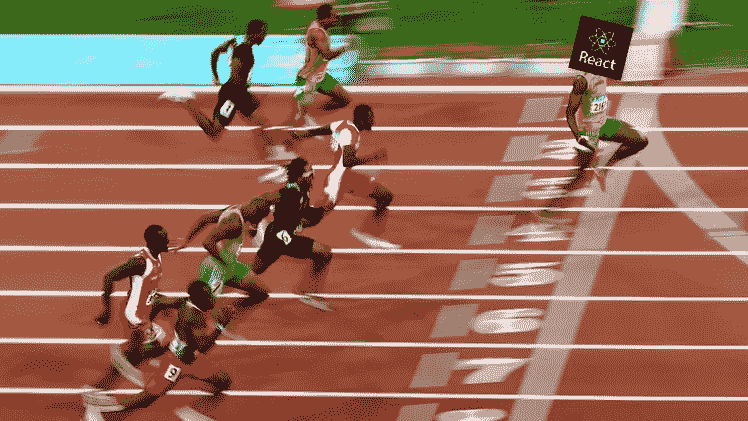
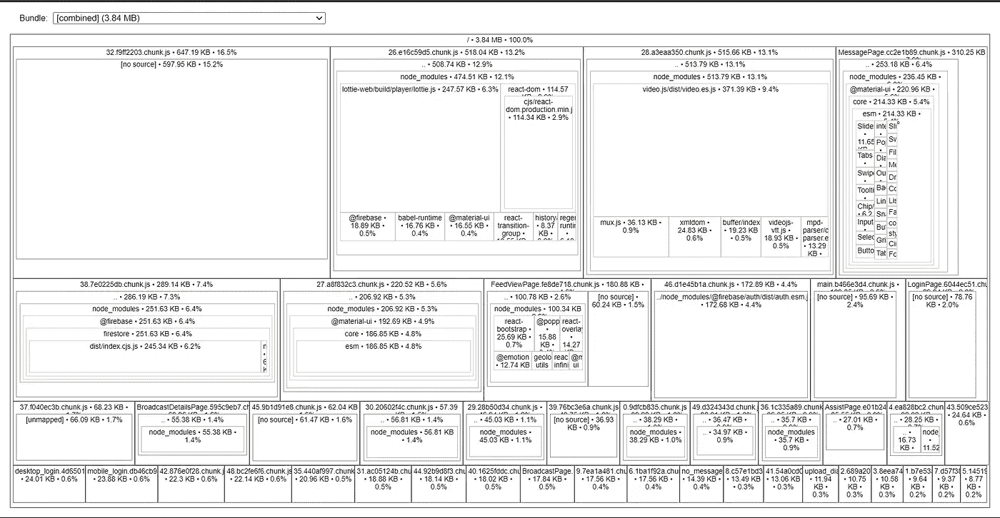

# 优化 React 应用程序(第 1 部分)

> 原文：<https://blog.devgenius.io/optimizing-your-react-application-part-1-fb1a9398cc30?source=collection_archive---------18----------------------->

您创建了一个令人惊叹的网站，添加了精美的动画，并确保您的应用程序免受任何可能的攻击。但是等等，在你称你的网站完整之前，问问你自己这个非常重要的问题，**你优化它了吗？**

> “哇！！React 开箱速度如此之快，我为什么还要费心呢？”
> 
> "我肯定花了 15 分钟思考优化，这算吗？"
> 
> “我的应用程序如我所愿地工作，我的工作完成了。”

当我被告知要让我的应用程序更有性能时，我经常这么说，但现在我已经意识到，一个经过良好优化的应用程序可以决定一个**优秀的 web 应用程序**和一个**优秀的 web 应用程序**。现在，让我们快速了解一下如何提供最佳用户体验。

优化可能意味着各种各样的事情，这取决于您正在构建的内容，但是这里我们关注以下内容

*   页面加载 :-你的页面加载需要多长时间？用户必须花很长时间才能看到弹出的第一个屏幕吗？
*   **资源利用** :-您对客户端浏览器资源的利用情况如何？
*   **缓存**

在这一部分，我们将关注更快的页面加载。

# 更快…更快的页面加载

很简单，如果你让你的用户等很长时间，他们可能不会再回来。你甚至想使用一个让你等 10 秒钟才显示第一页的网站吗？

> 目标是为 90%的用户在 1.5 秒内加载你的第一页。

重要的是要注意，你的大多数用户可能没有使用非常快速的互联网，他们的体验将与你的大不相同，因为你将在一台拥有惊人互联网的伟大机器上开发它。加快页面加载的步骤非常简单明了

*   javascript 文件越大，下载的时间就越长。所以我们需要把它变小。
*   **妥善处理图像**。将图像调整到合适的大小。我们不想下载 1080 X 1080 的图像来加载到 50 X 50 的框架中。
*   如果您需要进行网络调用以获取一些数据来显示您的第一个页面，**将其与闪屏/欢迎屏幕**交换，并在后台加载所需的数据，然后转换到主屏幕。用户更喜欢一个好的欢迎屏幕，而不是看到一个 5 秒钟后就填满的空白页面。

# 分割 Javascript 文件

如果您已经使用了"**create**-**react**-**app "**来设置您的应用程序，或者如果您是喜欢冒险的类型，并且已经决定使用 **Webpack** 、 **Rollup** 或任何其他变体从头开始配置您的捆绑包，那么您可能已经生成了一个简洁的小型 javascript 文件。是时候更进一步，让这个缩小的文件变得更小了！😜

## 介绍代码分割和延迟加载

> “代码拆分永远改变了我的生活，我的网站每天有 5 个用户，在我花了 3 个小时拆分我的 javascript 后，我的活跃用户增加到了 1000”——张诗钟，一个卖糖网站的老板。

**代码拆分** :-让我们将缩小后的 javascript 文件拆分成多个更小的文件，这样就不会一次全部下载到客户端。

**惰性加载** :-我们将只下载显示用户所在页面所必需的东西。如果用户在登录页面上，我们不需要下载用户资料页面。

**受够了什么，让我们进入如何！！**

## 步骤 1:分析您的 javascript 包

我们需要**看看**当你构建你的应用时捆绑框架(Webpack，Rollup)到底创建了什么，我用过的最好的捆绑可视化工具是:-

*   **网络包**:-[https://www.npmjs.com/package/webpack-bundle-analyzer](https://www.npmjs.com/package/webpack-bundle-analyzer)
*   **上卷**:-[https://www.npmjs.com/package/rollup-plugin-visualizer](https://www.npmjs.com/package/rollup-plugin-visualizer)

按照说明设置 bundle analyzer，运行命令后，您应该能够在浏览器中看到类似下面的内容。

现在，您已经可视化了您的包，您将不得不瞄准最大的盒子并钻取它们，将它们分成更小的块。

上图是一个拆分良好的应用程序的例子，整个应用程序的大小是 **3.84MB** ，它被拆分成几个更小的块，其中最大的块是 **647kb** 。

## 第二步:弄清楚要分割什么

虽然一开始很难确定要拆分什么，但是你可以从**拆分应用程序的不同页面**开始。

对于这个例子，我们假设你有三个页面，**一个登录页面**，**一个个人资料页面，**和**主页**。现在，当用户登陆您的网站时，您应该显示登录页面，并在认证后，将用户重定向到个人资料页面。因此，如果用户只在登陆你的网站时看到登录页面，我们**不需要**来下载个人资料和主页的资产(javascript、图片等)。这就是基于页面或路线的拆分。

另一种分割方法是考虑页面加载时屏幕上可见的所有内容**和从该页面中分离出剩余的内容**。例如，如果我有几个当用户执行一个动作时打开的对话框，我可以把它们从代码中分离出来，因为它们只在用户执行动作时需要。

## 第三步:把它分开

我们将使用 **React.lazy** 和 **React。暂停**执行基于路线的代码拆分。

这是一个简单的组件，使用 [react-router-dom](https://reactrouter.com/web/guides/quick-start) 设置了 3 条路由，它将基于当前路由加载 Home、Login 和 Profile。如果您没有根据路由对代码进行分割，那么这就是您的代码最初的样子。

我们已经成功地实现了基于路由的代码拆分。👏

*   长相怪异的**进口("。/profile")** 陈述:-整个魔术在这里发生。当捆绑工具(如 Webpack)遇到导入语句或动态导入时，它会自动将代码拆分成不同的捆绑包。所以基本上现在我已经创建了 3 个额外的**块**(Home、Login 和 Profile)，最小化了将阻塞页面加载的主 javascript 文件的大小。动态导入语句返回一个用下载的文件解析的承诺。点击此处了解更多信息。
*   **lazy()**:-lazy 方法或 [React.lazy()](https://reactjs.org/docs/code-splitting.html) 允许我们延迟加载任何组件，这意味着如果用户在登录页面上，我们将**而不是**下载 Home 包或 Profile 包。
*   **做出反应。悬疑** :-反应。暂停或暂停组件负责加载已经下载的懒惰组件。在上面的场景中，用户登录后，他将被重定向到主屏幕，然后 React 将检测到需要下载主块，并开始下载。那么，在请求的数据块完全下载完之前会发生什么呢？悬念组件需要一个名为 **fallback，**的道具，在这里你可以传递另一个组件或字符串，这个 fallback 组件会显示在屏幕上，直到所请求的块被完全下载。
*   **webpackChunkName** ":-该注释通知 Webpack 用指定的字符串命名包，否则，Webpack 将随机命名，这将使我们在使用 bundle visualizer 时更难分析。

使用回退道具，您可以使用圆形微调器、框架页面等在页面之间切换，以确保流畅的体验。

查看它的运行情况:-

请注意，只有当您第一次单击 Profile 选项卡或 Login 选项卡时，才会显示文本**“LOADING”**。这是因为下载完块后，下次需要这些组件时，它们将被重用。

我们也可以对非路由/页面做同样的事情。

这里我们用 lazy 包装对话框，因为它只有在按钮被点击时才会显示。因为按钮组件在页面加载过程中是可见的，所以我们导入它通常不像对话框那样。

# 处理图像

> “人们过去常常抱怨突然出现的图像让我的网站变得紧张不安。我修好了它，现在每个人都很开心”——Twinkle，天文学博客 Little Wonder 的联合创始人

图像不是渲染阻塞资源，不像 javascript，即使所有的图像都没有下载，页面也会加载，一旦完成，它们就会显示在页面上。然而，看到页面上的空白随着时间的推移慢慢填满并不是一种很好的体验。

## 使用正确的图像格式

你需要做的第一件事是通过使用合适的格式来减小图像的尺寸。jpeg ，。 **png** …)。并非所有的格式都是一样的，有些格式比另一些格式占用更大的空间，而另一些格式质量更好。你需要找出哪一个最适合你的网站。

点击阅读更多关于各种网络图像格式的信息[。](https://themeisle.com/blog/best-image-format/)

## 压缩图像

接下来，我们将尝试在不损失丝毫质量的情况下缩小图像的尺寸。尝试对您的图像进行无损压缩。有几种工具可以帮助压缩图像。我个人比较喜欢的一个在线工具是 [Compressor.io](https://compressor.io/) 。只需上传图像，压缩，并下载和使用压缩版本。

## 调整图像大小

根据您希望在网站上显示图像的框架来调整图像的大小。当你想展示它的 100 X 100 版本时，不要使用高分辨率的大图。

## 渐进式加载图像

这是我最喜欢的展示图像的方式。渐进式加载指的是先下载图像的模糊版本，一旦准备好，就用高分辨率版本替换它。

https://www.npmjs.com/package/react-progressive-image 的[是一个很好的图书馆，可以很好地处理这个问题。](https://www.npmjs.com/package/react-progressive-image)

参见下面的渐进图像:

## 最后的结果

完成所有更改后，是时候看看您的应用程序是否有所改进了。我使用以下工具来确定我的网站性能:-

*   【https://developers.google.com/speed/pagespeed/insights/ 
*   [https://www.webpagetest.org/](https://www.webpagetest.org/)
*   [https://gtmetrix.com/](https://gtmetrix.com/)

使用上述资源，通过模拟不同的网络速度来衡量您的网站性能。

这就是本系列的第一部分。在下一部分中，我们将进一步了解**如何分析 React 应用程序**并通过**优化组件的渲染**来提高性能。