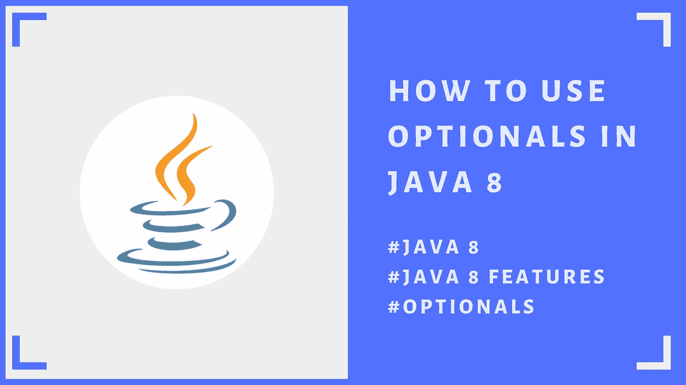

# Java 8 中的可选类

> 原文：<https://blog.devgenius.io/optional-class-in-java-8-3eebe6a66f83?source=collection_archive---------10----------------------->

让我们学习如何处理期权



嘿戴夫伙计们！希望你一切都好..继续我的 Java 文章系列，我想写 Java 8 的特性。那不是别人，正是 Java 8 中引入的**可选**类！😎

# 什么时候，为什么？

通常当我们用 Java 编码时，我们必须处理异常😕。最常见的异常之一是**NullPointerException(NPE)**。因此，从 java 8 开始，我们可以使用选项以更好的方式处理 NPE！😍否则我们不得不*在代码中执行如此多的空检查*。可选对象可用于表示没有值的 NULL。这是选修课的主要用途。我将在文章中详细解释。

# optional . of()vs optional . of nullable()

两种方法**都接受一个元素，并返回带有指定元素的可选的**。

> 如果给定的 ***元素为空*** *，那么 optional . of nullable()****方法返回空的可选*** 。👉可选。空
> 
> 但在 Optional.of()方法中，当给定元素为空时，仍会抛出 NPE。

如果元素不为空，则两种方法执行相同的操作。

假设我们有一个 **Person** 类…如果人名不为空，我们需要将其转换成大写。用我们传统的方式，我们会怎么做？

我们必须做空检查…对吗？让我们写一个简单的代码…

```
class Person {
    private final String name;
    private final Integer age;
    private final String job;
    public Person(String name, Integer age, String job) {
        this.name = name;
        this.age = age;
        this.job = job;
    }
    public String getName() {
        return name;
    }
    public Integer getAge() {
        return age;
    }
    public String getJob() {
        return job;
    }
}
```

如果没有期权，我们会做这样的事情来避免 npe。

```
Person person = new Person("sailtha", 28, "SE");
String upperCaseName = "";
if (person != null) {
    String name = person.getName();
    if (name != null) {
        upperCaseName = name.toUpperCase();
    }
}
System.out.println(upperCaseName);
```

如果你仔细看这里，我们还必须维护 ELSE 子句，这将再次产生一个冗长的代码！

# 可选方法

我们将把 Person 对象包装在 optional => ofNullable()中，这对 NPE 是安全的…

这个例子有一个空名称的对象…

```
Person person = new Person(null, 28, "SE");
Optional<Person> personOptional = Optional.*ofNullable*(person);
personOptional.ifPresent(p -> {
    Optional<String> name = Optional.*ofNullable*(p.getName());
    **String upperCaseName = name.map(String::toUpperCase).orElse("Empty Name");**
    System.out.println(upperCaseName);
});
```

我们有 **isPresent()** 方法来检查元素的可用性…不需要空检查！😎

**orElse()** 方法**将返回指定的默认名称**，当*特定值不存在*时。

有了选项，我们可以像在流中一样访问 filter()和 map()方法..

```
List<Person> personList = Arrays.*asList*(
        new Person("Andrew", 28, null),
        new Person("John", 34, "QA"),
        new Person("Peter", 43, "SE"),
        new Person("Tim", 39, "TL")
);
List<Person> agedPersonsList = personList.stream()
        .filter(p -> p.getAge() < 30)
        .collect(Collectors.*toList*());
Optional<Person> personData = Optional.*ofNullable*(agedPersonsList.get(0));
personData.ifPresent(p -> {
    Optional<String> job = Optional.*ofNullable*(p.getJob());
    Optional<String> name = Optional.*ofNullable*(p.getName());
    String upperCaseJob = job.map(String::toUpperCase).orElse("Empty Job");
    String nameFilter = name.filter(n -> n.equals("Andrew")).map(String::toUpperCase).orElse("Empty name");
    System.out.println(upperCaseJob);
    System.out.println(nameFilter);
});
```

结果会是这样的..

**原因:**

1.  筛选条件仅返回 1 个具有空作业的对象。由于值不存在，将从 orElse 返回默认名称。
2.  所选员工的名字是 Tim。然后它将被映射为大写字符串并返回。


结果

这都是关于**选项**…尽可能多地使用选项来避免 npe，使你的代码更加整洁。👍 💪 😎 👊