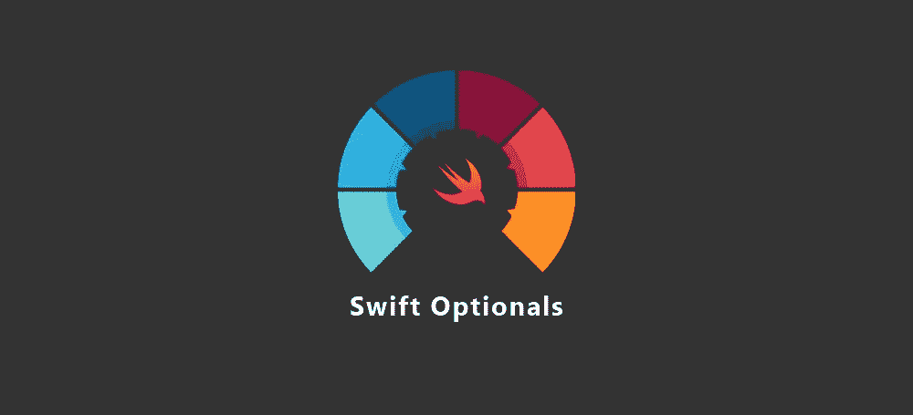
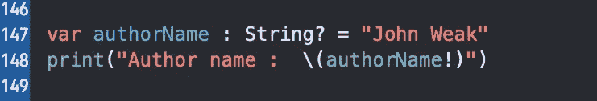
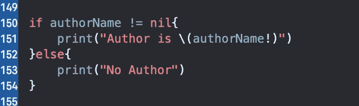
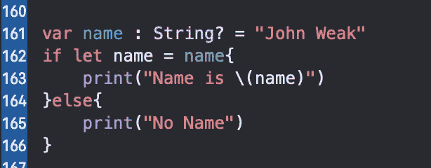
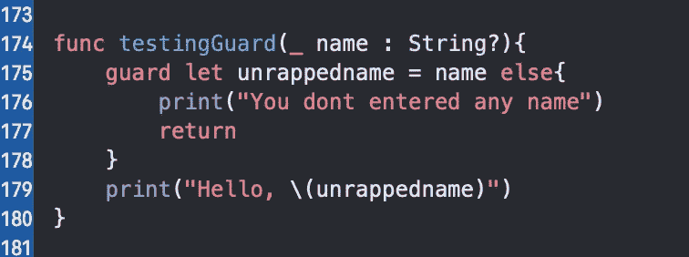
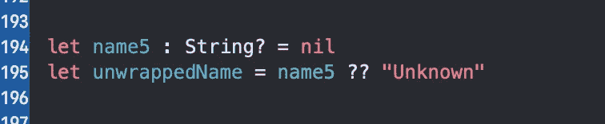

# Swift 中的选项

> 原文：<https://blog.devgenius.io/optionals-in-swift-211e92d4197b?source=collection_archive---------0----------------------->

所有关于 Swift 编程中的选项:初学者到高级，并解释了解开变量的许多方法。

> Swift 中的一个可选类型是可以保存值或不保存值(？) .

# 警戒值

代表无价值的东西称为标记价值

# 可选择的

把可选的看作一个盒子:它要么包含一个值，要么不包含。当它不包含值时，我们说它包含零。盒子本身总是存在的；它总是在那里等着你去打开看看里面。

# 声明可选的

期权就像一个盒子，要想看到里面，我们需要打开它。

选项的存在固然很好，但您可能想知道如何查看盒子内部并操纵它包含的值。

有一些方法可以打开包装查看盒子内部:

1.  通过强制展开
2.  通过可选绑定
3.  通过守卫声明
4.  通过零合并

这些是你打开选装件并查看盒子内部的几种方法。让我们一个接一个地学习所有这样做的方法。

# 强制展开

要强制展开，我们使用“！”唱歌。

还有字符串可选类型的 *authorName* ，在打印作者姓名时我们在 *authorName* 变量后使用感叹号强制展开。

这里我们检查 authorName 是否有任何值，如果它没有任何值意味着它的值为零，那么条件将为假，否则块将运行并打印出没有作者。如果有一些价值，那么它将打印作者姓名是“曾经是什么”。例如，考虑某个名字而不是 nil，那么在控制台中，您将看到“作者是某个名字”。

# 可选绑定

Swift 包括一个称为**可选绑定**的特性，它让您可以安全地访问可选绑定中的值。

这里所发生的是，名字具有作为“约翰弱”的值。所以在检查名字常量是否存储名字变量的值时。如果 name 变量有值，则 name 将存储 john weak，第一个块将运行，但假设没有 John weak，则不会打印 name。

# 守卫声明

有时你想检查一个条件，只有当条件为真时才继续执行一个函数，比如当你使用 optionals 时。想象一个从网络上获取一些数据的函数。如果网络中断，提取可能会失败。封装这种行为的通常方法是使用可选的，如果获取成功，它将有一个值，否则为零。

在这种情况下，Swift 有一个有用且强大的功能可以提供帮助:guard 语句**。**

在这里，我们声明了 unrappedname = name，如果 name 有值，那么条件将为真，当保护条件为真时，它将退出，因此在退出保护块后，它将打印 hello unrappedname。

# **零合并**

这就是零合并的工作原理。？？被称为零合并运算符。

# 要点

*   nil 表示没有值。
*   非可选变量和常量必须总是有一个非零值。
*   **可选**变量和常量就像盒子一样，可以包含一个值*或*为空(零)。
*   若要使用可选中的值，必须首先从可选中解开它。
*   解开可选值最安全的方法是使用**可选绑定**或**零合并**。仅在适当的时候使用**强制展开**，因为它可能会产生运行时错误。