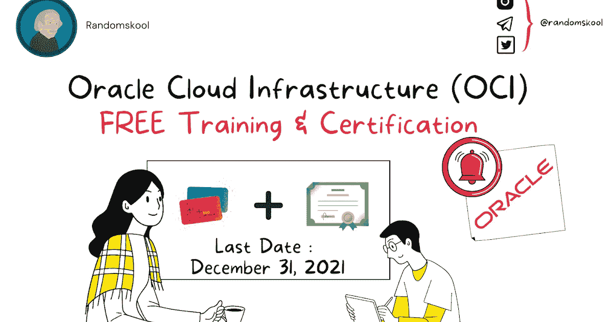

# 甲骨文云基础设施(OCI)免费认证|注册和参加考试的最后一天:2021 年 12 月 31 日

> 原文：<https://blog.devgenius.io/oracle-cloud-infrastructure-oci-certified-for-free-last-day-to-register-and-take-the-exam-73ecc24836f4?source=collection_archive---------2----------------------->

激活您的免费学习订阅。

1.**针对 Oracle 云基础设施-**

下面提到学习订阅:

**考试名称:**甲骨文云基础设施基础 2021 助理

**学习订阅:**[https://learn . Oracle . com/ols/Learning-path/become-an-OCI-foundation-associate/35644/98057](https://learn.oracle.com/ols/learning-path/become-an-oci-foundation-associate/35644/98057)

**考试名称:**甲骨文云基础设施 2021 架构师助理

**学习订阅:**[https://learn . Oracle . com/ols/Learning-path/become-an-OCI-architect-associate/35644/98012](https://learn.oracle.com/ols/learning-path/become-an-oci-architect-associate/35644/98012)

**考试名称:**甲骨文云基础设施 2021 云运营助理

**学习订阅:**[https://learn . Oracle . com/ols/Learning-path/become-an-OCI-cloud-operations-associate/35644/98023](https://learn.oracle.com/ols/learning-path/become-an-oci-cloud-operations-associate/35644/98023)

**考试名称:**甲骨文云基础设施 2021 架构师专业

**学习订阅:**[https://learn . Oracle . com/ols/Learning-path/become-OCI-architect-professional/35644/97984](https://learn.oracle.com/ols/learning-path/become-oci-architect-professional/35644/97984)

**考试名称:**甲骨文云基础设施开发者 2021 助理

**学习订阅:**[https://learn . Oracle . com/ols/Learning-path/become-OCI-developer-associate/35644/99037](https://learn.oracle.com/ols/learning-path/become-oci-developer-associate/35644/99037)

**考试名称:**甲骨文云平台身份与安全管理 2021 专员

**学习订阅:**[https://learn . Oracle . com/ols/Learning-path/become-a-cloud-security-administrator/35644/98653](https://learn.oracle.com/ols/learning-path/become-a-cloud-security-administrator/35644/98653)

**考试名称:**甲骨文云平台系统管理 2021 专员

**学习订阅:**[https://learn . Oracle . com/ols/Learning-path/become-an-Oracle-management-cloud-administrator/35644/91205](https://learn.oracle.com/ols/learning-path/become-an-oracle-management-cloud-administrator/35644/91205)

2.**用于应用开发-**

下面提到学习订阅:

**学习订阅:**[https://learn . Oracle . com/ols/Learning-path/become-an-application-integration-specialist/35644/98851](https://learn.oracle.com/ols/learning-path/become-an-application-integration-specialist/35644/98851)

**考试名称:** [云平台应用开发 2021 专科](https://www.randomskool.com/2021/09/oracle-cloud-infrastructure-oci.html)

**学习订阅:**[https://learn . Oracle . com/ols/Learning-path/become-a-cloud-app-developer/35644/91389](https://learn.oracle.com/ols/learning-path/become-a-cloud-app-developer/35644/91389)

**考试名称:** [甲骨文云平台数字助理 2021 专科](https://www.randomskool.com/2021/09/oracle-cloud-infrastructure-oci.html)

**学习订阅:**[https://learn . Oracle . com/ols/Learning-path/become-a-digital-assistant-developer/35644/91396](https://learn.oracle.com/ols/learning-path/become-a-digital-assistant-developer/35644/91396)

**考试名称:** [甲骨文云平台内容管理 2021 专科](https://www.randomskool.com/2021/09/oracle-cloud-infrastructure-oci.html)

**学习订阅:**[https://learn . Oracle . com/ols/Learning-path/become-a-sites-developer/35644/57593](https://learn.oracle.com/ols/learning-path/become-a-sites-developer/35644/57593)

3.**用于数据管理-**

下面提到学习订阅:

**考试名称:** [Oracle 自主数据库云 2021 专家](https://www.randomskool.com/2021/09/oracle-cloud-infrastructure-oci.html)

**学习订阅:**[https://learn . Oracle . com/ols/Learning-path/become-an-autonomous-database-specialist/35644/97809](https://learn.oracle.com/ols/learning-path/become-an-autonomous-database-specialist/35644/97809)

**考试名称:** [甲骨文云数据库服务 2021 专科](https://www.randomskool.com/2021/09/oracle-cloud-infrastructure-oci.html)

**学习订阅:**[https://learn . Oracle . com/ols/Learning-path/become-an-Oracle-cloud-database-services-specialist/35644/91401](https://learn.oracle.com/ols/learning-path/become-an-oracle-cloud-database-services-specialist/35644/91401)

**考试名称:** [甲骨文云数据库迁移与集成 2021 专家](https://www.randomskool.com/2021/09/oracle-cloud-infrastructure-oci.html)

**学习订阅:**[https://learn . Oracle . com/ols/Learning-path/become-an-Oracle-cloud-database-migration-and-integration-specialist/35644/92250](https://learn.oracle.com/ols/learning-path/become-an-oracle-cloud-database-migration-and-integration-specialist/35644/92250)

**考试名称:** [甲骨文云平台企业分析 2021 专家](https://www.randomskool.com/2021/09/oracle-cloud-infrastructure-oci.html)

**学习订阅:**[https://learn . Oracle . com/ols/Learning-path/become-a-business-analytics-expert/35644/91371](https://learn.oracle.com/ols/learning-path/become-a-business-analytics-expert/35644/91371)

作为促销活动的一部分，考生必须通过点击云学习订阅中相应学习路径中的考试板块来注册考试，以便免费参加考试。 [**每次考试只限三次。**](https://www.randomskool.com/2021/09/oracle-cloud-infrastructure-oci.html)

**报名考试的第一天**:2021 年 9 月 8 日，格林威治时间上午 12:00

**报名和参加考试的最后一天**:2021 年 12 月 31 日 11:59PM GMT

[*https://education.oracle.com/oracle-oci-certification*](https://education.oracle.com/oracle-oci-certification)

[*https://learn . Oracle . com/ols/home/Oracle-cloud-infra structure-learning-subscription/35644*](https://learn.oracle.com/ols/home/oracle-cloud-infrastructure-learning-subscription/35644)

【https://www.randomskool.com】最初发表于**。**