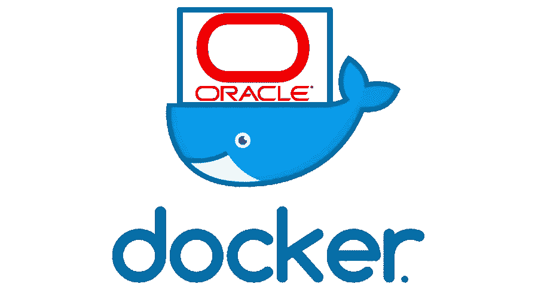
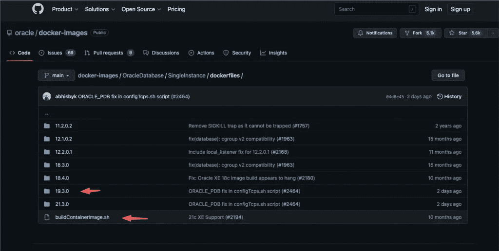
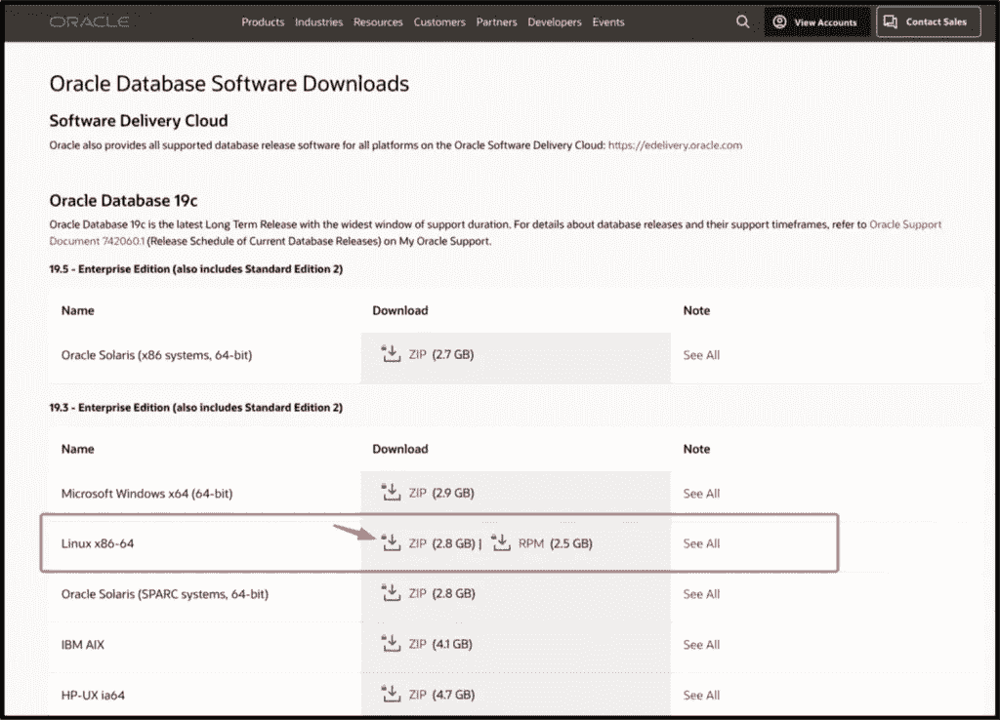
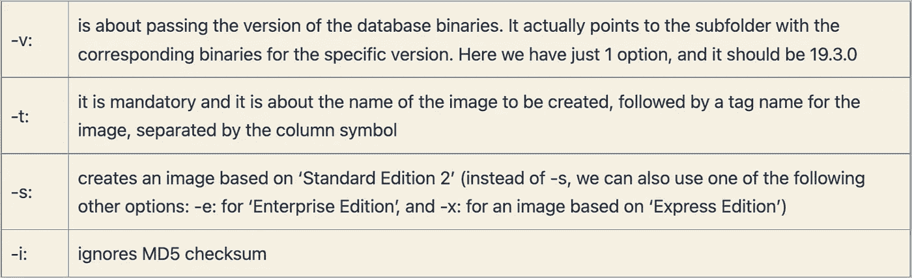
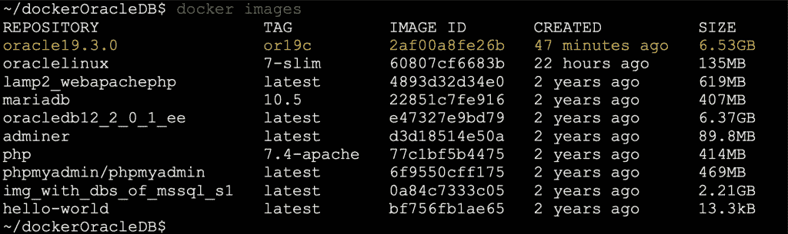
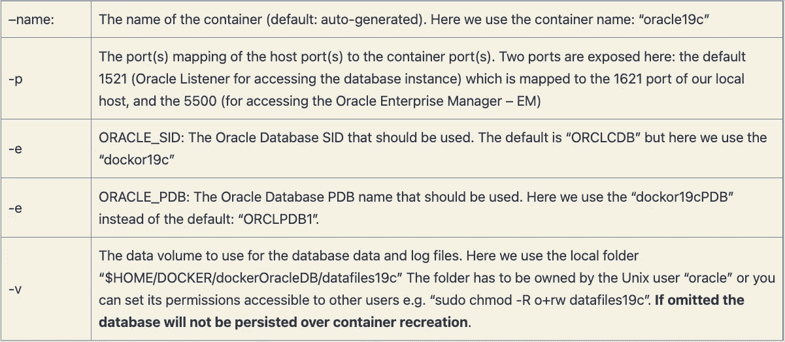
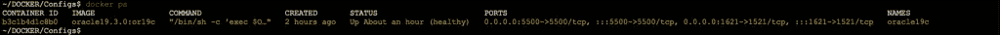
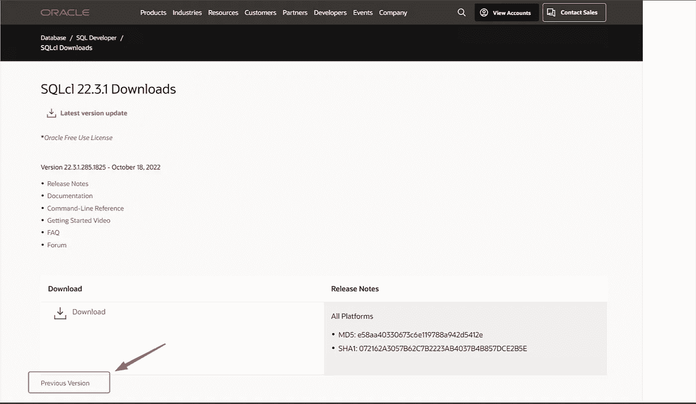
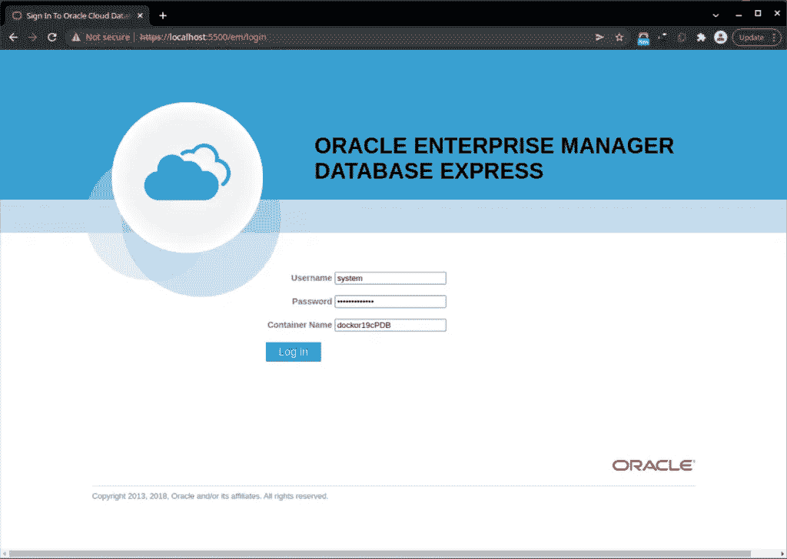
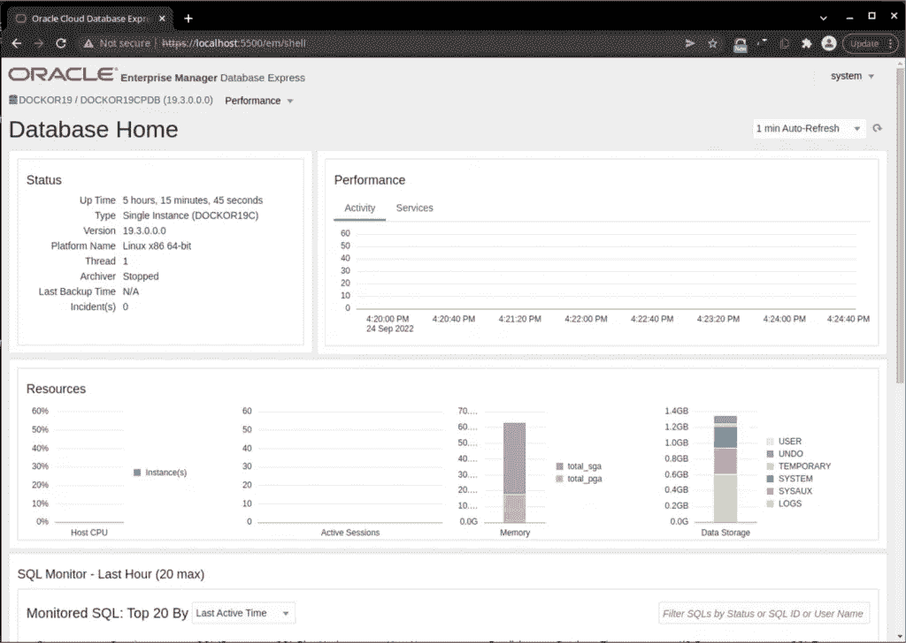

# Docker 中的 Oracle 数据库

> 原文：<https://blog.devgenius.io/oracle-database-in-docker-65da9c96ed56?source=collection_archive---------0----------------------->

5 分钟指南。轻松全面！



# 介绍

我不会开始解释为什么 Oracle 是 RDBMS 行业的领导者，这是在浪费你的时间。在这里，我只想展示一下，根据最新的 Oracle 官方回购协议，您可以多快地为您的 Oracle 开发需求建立一个 Docker 工作环境。

# 先决条件

*   你必须熟悉 [Docker](https://www.docker.com/) 、Docker 镜像和容器，并且 Docker 应该安装在你的系统中(最好是 Linux 系统或 macOS)
*   你必须已经创建了一个甲骨文账户(你可以在这里创建一个甲骨文账户

# 装置

该过程包括两个阶段:

1.  使用适合您的 Oracle DB 版本构建 Docker 映像
2.  创建一个工作的 Oracle 容器。

## 第 1 阶段——建立 Docker 形象

这个阶段需要 3 个步骤:

**步骤 1——获取构建映像所需的脚本**

通常，您从 [DockerHub](https://hub.docker.com/) 中**提取**docker 映像，然而，Oracle 通过其 [GitHub 存储库](https://github.com/oracle/docker-images)为我们提供了必要的构建脚本来自动化/简化映像创建过程。您可以克隆整个回购，但我不认为这对我们的案例有用。

Docker 映像的 Oracle 数据库支持文件可以在[这里](https://github.com/oracle/docker-images/tree/main/OracleDatabase/SingleInstance)找到。你可以看到，你可以找到如何创建你的 Docker 形象的所有重要信息和例子。

到我写这篇文章的那天(2022 年 9 月 23 日)为止，Oracle 的可用版本有:

*   Oracle 数据库 21c (21.3.0)企业版、标准版 2 和快速版(XE)
*   Oracle 数据库 19c (19.3.0)企业版和标准版 2
*   Oracle 数据库 18c (18.4.0)快速版(XE)
*   Oracle 数据库 18c (18.3.0)企业版和标准版 2
*   Oracle Database 12c 第 2 版(12.2.0.2)企业版和标准版 2
*   Oracle Database 12c 第 1 版(12.1.0.2)企业版和标准版 2
*   Oracle 数据库 11g 第 2 版(11.2.0.2)快速版(XE)

重要脚本和 dockerfiles 位于 [dockerfiles](https://github.com/oracle/docker-images/tree/main/OracleDatabase/SingleInstance/dockerfiles) 文件夹中。在那里，您还可以看到每个受支持的版本都有单独的子文件夹。



我们将为 OracleDB 版本 19 . 3 . 0(2022 年 9 月 23 日，这是支持期限窗口最宽的最新长期版本)的单个实例和一个 PDB 创建映像。

所以，我建议你在你的系统里创建一个你喜欢做的文件夹。随意命名，例如**/docker acledb，**并且只复制 **buildContainerImage.sh** 和相应的文件夹，在我们的例子中是 **19.3.0** 子文件夹。

注意:除了 repo 19.3.0 子文件夹之外，您还可以获取适合您需求的任何其他版本的子文件夹。

如果您无法下载整个 19.3.0 子文件夹及其所有内容，您可以使用可用的工具之一，例如[download-directory-github-io](https://download-directory.github.io/)**(粘贴该 GitHub 子文件夹的链接)。它将子文件夹压缩成一个. zip 文件，您可以将它放在系统中所需的位置(对于我们的例子，在/dockerOracleDB 文件夹中)。**

**授予对/dockerOracleDB 文件夹内容的读写和执行权限。**

**继续下一步。**

****第 2 步——获取您喜欢的 Oracle 版本的安装二进制文件****

**进入 [**甲骨文技术网**](http://www.oracle.com/technetwork/database/enterprise-edition/downloads/index.html) 页面。**

****

**如果您已经登录到您的 Oracle 帐户，下载 19.3.0 二进制文件会更好，因为这是您需要它的地方。**

**下载。Linux x86–64 二进制文件的. zip 文件，并将。将文件压缩到/19.3.0 子文件夹中。(如您所见，它大约有 2.8GB，因此，可能需要几分钟才能下载完)。**

****步骤 3 —运行脚本构建映像****

```
./buildContainerImage.sh -v 19.3.0 -t oracle19.3.0:or19c -s  -i
```

**下面是我们使用的参数的简短描述:**

****

**应该完成大约 24 个步骤，因此该过程可能需要几分钟才能完成。如果构建成功，您必须看到类似于以下内容的结束行:**

```
---**>** 2af00a8fe26b
Successfully built 2af00a8fe26b
Successfully tagged oracle19.3.0:or19cOracle Database container image **for** 'se2' version 19.3.0 is ready to be extended:
--**>** oracle19.3.0:or19cBuild completed **in** 458 seconds.
```

**👉你可以在这里看到完整的(相当长的)输出日志文件。**

**使用 docker image 命令查看该图像现在是否在本地 docker 图像列表中:**

****

**到目前为止，一切顺利！现在让我们从上面的图片开始创建一个新的 docker 容器。**

## **阶段 2 —创建一个工作的 Oracle 容器**

**这里的官方文档[非常详细地介绍了 Oracle Docker 的创建以及用户可以用于定制的所有可能的参数。然而，下面我只使用几个最常用的参数。](https://docs.oracle.com/en/database/oracle/oracle-database/21/deeck/index.html)**

```
docker run --name oracle19c -p 1621:1521 -p 5500:5500 -e ORACLE_SID=dockor19c -e ORACLE_PDB=dockor19cPDB -v $HOME/DOCKER/dockerOracleDB/datafiles19c:/opt/oracle/oradata oracle19.3.0:or19c
```

**下表给出了此处使用的参数:**

****

**容器创建过程可能需要一些时间，但是，您会得到通知。当您看到消息“数据库可以使用了！”您的 docker 容器应该被创建，并保持运行。**

**👉你可以在这里找到容器创建输出/日志。**

**通过 docker ps 命令检查它:**

```
$ docker ps
CONTAINER ID   IMAGE                COMMAND                  CREATED      STATUS                            PORTS                                                                                  NAMES
b3c1b4d1c8b0   oracle19.3.0:or19c   "/bin/sh -c 'exec $O…"   5 days ago   Up 8 seconds (health: starting)   0.0.0.0:5500->5500/tcp, :::5500->5500/tcp, 0.0.0.0:1621->1521/tcp, :::1621->1521/tcp  oracle19c
```

****

**您可以使用标准的 docker 命令停止容器并再次启动它，即:**

```
docker stop oracle19c
docker start oracle19c
```

****使用 Oracle** 提供的 *setPassword.sh* shell 脚本修改密码**

**这里值得一提的是，我们没有使用环境变量'-e ORACLE_PWD= <mysyspassword>'来定义 SYS 和 SYSTEM(以及 PDBADMIN)帐户的密码。因此，Oracle 创建了一个随机生成的。然而，只要你想，你就可以改变它(不需要在本地登录，例如' sql[lus / as sysdba ')，只需使用容器根文件夹中提供的 shell 脚本' **setPassword.sh** '。下面是命令输出的示例(直接从主机运行，而不是从容器内运行):</mysyspassword>**

# **访问容器外壳，使用 sql*plus 并执行一些基本操作**

**通过执行以下命令来访问容器外壳:**

```
~/dockerOracleDB$ docker exec -it oracle19c bash -c "source /home/oracle/.bashrc; bash"
```

****获取一些关于正在使用的 Linux 发行版的信息****

**这是一个 Oracle Linux Server 7.9 版本:**

**看看 Oracle 环境变量和 PATH:**

****以 sysdba 身份通过 sql*Plus(在容器内)连接:****

**查看连接名称(这是 CDB-根容器):**

**更改系统和系统密码:**

**切换到可插拔数据库:**

# **使用 Oracle SQLcl 连接**

**使用 [SQLcl](https://www.oracle.com/database/sqldeveloper/technologies/sqlcl/) (Oracle 免费命令行工具)从本地主机连接到 sql*plus**

**👉注意:确保使用与 JRE 活动版本一致的 SQL 版本。2022 年 9 月 24 日，SQL 的最新版本是版本 22.2.1，它需要 JRE 版本 11 或更高版本。但是，您可以通过单击下载窗口底部左侧的以前版本来下载以前的版本:**

****

**“最老”的可用版本是版本 20.2，它需要 Java 8 (JRE 1.8)和更高版本。**

****连接到根实例:****

```
~$ sqlcl sys/myPassw@localhost:1621/dockor19c as sysdba
```

**或者去 PDB:**

```
~$ sqlcl sys/myPassw@localhost:1621/dockor19cPDB as sysdba
```

**（👉注意:上面我们使用了/bin 文件夹中重命名的 sql 可执行文件，从 sql 到 sqlcl)**

# **Oracle 企业管理器(EM) —登录并开始工作**

**[Oracle Enterprise Manager](https://www.oracle.com/enterprise-manager/) 是 Oracle 的数据库监控和管理工具。Oracle 发布了带有我们下载的 docker 二进制文件的 [Express 版本](https://docs.oracle.com/database/121/ADMQS/GUID-BA75AD46-D22E-4914-A31E-C395CD6A2BBA.htm#ADMQS031)。**

**因为我们已经映射了端口 5500(这是 EM 控制台的默认端口)，所以我们可以登录到它。在浏览器中打开一个新窗口或标签，并给出地址:**

```
https://localhost:5500/em/login
```

********

**暂时就这样吧！我希望你喜欢它👏！
感谢阅读，敬请关注！**

**PS:你可能也会对我的以下帖子感兴趣:**

**[](/salts-and-uuids-for-your-oracle-database-990af1e361a1) [## Oracle 数据库的 Salts 和 UUIDs

### 一篇简明的帖子，介绍了在使用 Oracle 时 UUIDs 和密码加盐散列的实际实现步骤…

blog.devgenius.io](/salts-and-uuids-for-your-oracle-database-990af1e361a1) [](https://medium.com/@zzpzaf.se/move-your-oracle-docker-container-with-all-its-data-dcecfe6b7c46) [## 移动 Oracle Docker 容器及其所有数据

### 避免一些常见的陷阱，比如忘记或锁定密码，以及连接到一个空闲实例。

medium.com](https://medium.com/@zzpzaf.se/move-your-oracle-docker-container-with-all-its-data-dcecfe6b7c46)**