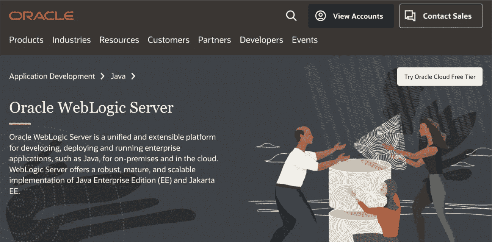
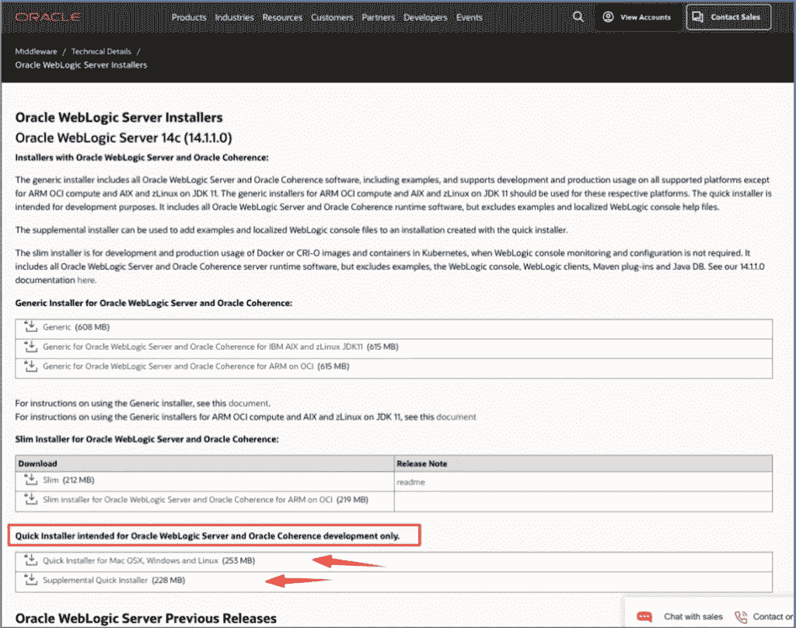
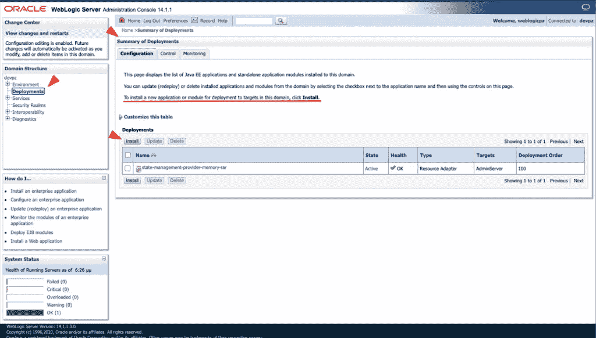

# Oracle WebLogic Java 应用服务器(开发人员版本)

> 原文：<https://blog.devgenius.io/oracle-weblogic-java-application-server-developers-version-dde0970cef26?source=collection_archive---------3----------------------->

## macOS 安装



# 介绍

[Oracle WebLogic Server](https://www.oracle.com/java/weblogic/) (最初由 [BEA Systems](https://en.wikipedia.org/wiki/BEA_Systems) 开发)是一个众所周知的可伸缩的企业 Java (Java EE)平台**应用服务器**，用于基于 Java 的 web 应用。由于它是一个商业/许可产品，它似乎在其他 java 应用服务器中没有那么大的使用份额(根据[J](https://www.jrebel.com/products/jrebel)Rebel 的 [2021](https://www.jrebel.com/resources/java-developer-productivity-report-2021) 和 [2022](https://www.jrebel.com/success/java-developer-productivity-report-2022) [](https://www.jrebel.com/success/java-developer-productivity-report-2022)Java 开发人员生产力报告，它从第三位跌至第五位)。


来源: [2021](https://www.jrebel.com/resources/java-developer-productivity-report-2021) 和 [2022](https://www.jrebel.com/success/java-developer-productivity-report-2022) 由 [JRebel](https://www.jrebel.com/products/jrebel) 发布的 Java 开发人员生产力报告

然而，我们必须强调，上述调查的参与者数量有限，毫无疑问，它是专业/商业环境中受人尊敬的重型产品。此外，事实上它是由甲骨文公司提供的，这使得它可能是最受业界欢迎的选择。

WebLogic Server 主要提供三个版本:**基础版**、**标准版**和**企业版**。然而，在这篇文章中，我们不会详细讨论上述版本之间的差异，也不会详细介绍 WebLogic 的特性。我们将展示如何在 macOS 上安装**WebLogic Server for Developers 版本 14 (14.1.1.0)** 。所以，我们开始吧。

# 获取安装程序

我们将安装 **WebLogic Server for Developers 版本 14 (14.1.1.0)** ，它需要[JDK 1 . 8 . 0 _**251**T5 或更高版本，或者](https://www.oracle.com/java/technologies/javase/javase8u211-later-archive-downloads.html) [JDK 11.0.6](https://www.oracle.com/java/technologies/javase/jdk11-archive-downloads.html) 或更高版本。(因此，要么更新您的 JDK，要么选择旧版本的 Weblogic server)。

> **注意**:开发安装程序只能通过 Oracle [**技术资源页面**](https://www.oracle.com/technical-resources/) 获得，因此，为了从 Oracle 获得它们，您已经使用您的 Oracle 帐户凭证登录。

因此，登录后，请转到 Oracle [**技术资源页面**](https://www.oracle.com/technical-resources/) 并选择 [Oracle WebLogic Server](https://www.oracle.com/middleware/technologies/fusionmiddleware-downloads.html) 链接:


在下一个[页面](https://www.oracle.com/middleware/technologies/fusionmiddleware-downloads.html)，转到最底部并点击[查看所有 Oracle WebLogic Server 下载](https://www.oracle.com/middleware/technologies/weblogic-server-installers-downloads.html)


在那个[页面上](https://www.oracle.com/middleware/technologies/weblogic-server-installers-downloads.html)停留在关于最新版本的第一部分(在我们的例子中是‘14c(14 . 1 . 1 . 0)’),然后在文本“ *Quick Installer”下面的表格中找到并下载两个压缩文件，这两个文件仅用于 Oracle WebLogic Server 和 Oracle Coherence* ***开发*** *。*’



下载的文件被压缩(。zip)文件，其中包含 2。jar 文件:


**fmw _ 14 . 1 . 1 . 0 . 0 _ WLS _ lite _ quick _ generic . jar**
这是**基础开发**安装程序，包含所需的 WebLogic Server 组件:

*   基本开发文件，如核心应用服务器和 Coherence
*   WebLogic Server 管理控制台
*   WebLogic 客户端 JAR 文件
*   TopLink
*   Jackson(开源 Java JSON 处理器)
*   Jersey(开源 RESTful Web 服务框架)
*   Maven(开源存储库管理器)
*   OPatchAuto
*   OUI 安装和卸载文件

**fmw _ 14 . 1 . 1 . 0 . 0 _ WLS _ supplemental _ quick . jar**
这是**补充开发**安装程序。此 JAR 文件将下列可选的 WebLogic Server 组件添加到现有的基本开发安装中:

*   服务器示例
*   Derby 评估数据库
*   WebLogic Server 管理控制台语言帮助文件
*   一致性示例
*   Web 服务客户端

# 装置

您可以随时遵循[官方指示](https://docs.oracle.com/en/middleware/standalone/weblogic-server/14.1.1.0/wlsig/installing-weblogic-server-developers.html#GUID-207CA334-FEDD-4D35-9DCA-357E5FDFEB2E)。这里我们将只遵循与 macOS 相关的说明。

我们必须首先安装 **WebLogic Server for Developers 基础安装**。之后，我们可以运行 WebLogic Server for Developers **补充安装**。

## 设置环境变量

在运行安装程序之前，我们必须为 macOS 设置两个必要的环境变量，JAVA_HOME 和 USER_MEM_ARGS。在 MAC 中使用终端窗口，并相应地导出它们:

```
export JAVA_HOME= /Library/Java/JavaVirtualMachines/1.8.0.jdk/Contents/Home<br> export USER_MEM_ARGS="-Xmx1024m"
```

(或者，您可以将它们添加到您的 ***。bash_profile*** 文件)。

检查/确认更改:

```
➜  ~ java -version
java version "1.8.0_321"
Java(TM) SE Runtime Environment (build 1.8.0_321-b07)Java HotSpot(TM) 64-Bit Server VM (build 25.321-b07, mixed mode)
➜  ~
```

然后我们必须分配用户 _MEM_ARGS 参数。

```
➜  ~ export USER_MEM_ARGS="-Xmx1024m"
➜  ~
➜  ~ echo $USER_MEM_ARGS
-Xmx1024m
➜  ~
```

## 运行基本安装程序(fmw _ 14 . 1 . 1 . 0 . 0 _ WLS _ lite _ quick _ generic . jar)

为 WebLogic Oracle 主目录创建一个文件夹，例如:
~/Oracle/ **weblogic**

并授予其读写权限，例如:

```
➜  ~ chmod -R ugo+rw ~/Oracle/weblogic
```

然后运行安装程序(这可能需要一些时间… 🥱)


之后，我们准备为 Oracle WebLogic Server 执行一些非常基本的设置。

# 使用配置向导创建开发域

在 WebLogic 域上开发和运行应用程序之前，必须先创建 WebLogic 域。配置向导(如图 1–2 所示)简化了创建和更新域的过程。如需了解更多信息，请访问:[https://docs . Oracle . com/en/middleware/standalone/WebLogic-server/14 . 1 . 1 . 0/wld CW/introduction . html # GUID-00 D7 f0c 4-409 c-4B2D-BA14-fc 908 ebe 7 e 02](https://docs.oracle.com/en/middleware/standalone/weblogic-server/14.1.1.0/wldcw/introduction.html#GUID-00D7F0C4-409C-4B2D-BA14-FC908EBE7E02)
或者对于独立的情况，请使用快速启动配置向导，网址:[https://docs . Oracle . com/en/middleware/standalone/WebLogic-server/14.1。](https://docs.oracle.com/en/middleware/standalone/weblogic-server/14.1.1.0/wldcw/introduction.html#GUID-1E99A12B-AD64-4F42-B515-CA237C8E1122)

在我们的例子中，切换到文件夹:~/Oracle/WebLogic/Oracle _ common/common/bin

```
➜  ~ cd ~/Oracle/weblogic/oracle_common/common/bi
```

并运行配置脚本:

```
➜  ~ ./config.sh
```

您将会得到提示(用户名、密码等。)获取域位置。因此，在运行配置向导脚本之前，您可以主动创建一个(实际上是创建一个文件夹)，例如:

```
~/Oracle/weblogic/domains/devpz
```

为了方便起见，下面引用了配置向导的一些截图。


请注意，WebLogic 管理员帐户的密码。密码必须至少为八个字符，并且必须包含至少一个数字字符或至少一个以下字符:
`! **" # $ % & ' ( ) * + , - . / : ; < = > ? @ [ \ ] ^ _ ` { | } ~**`


这样，我们就完成了 WebLogic Server 的最基本的配置(域设置)。之后，我们准备第一次运行它。

# 启动 WebLogic 域并访问管理控制台

转到域目录中的/bin:

```
~/Oracle/weblogic/domains/devpz/bin
```

输入以下命令启动 WebLogic server:

```
➜ ~ ./startWebLogic.sh
```


然后用你的浏览器进入控制台:
http://localhost:7001/console


登录后，您可以访问 Weblogic Server 控制台:


您可以访问**阅读文档**链接，了解使用 WebLogic Server 的所有必要细节。下面我们将执行一个简单的 Java 应用程序。战争档案。

# 在 WebLogic Server 上部署应用程序

我们可以部署我们的 Java 应用程序(实际上。jar 或更常见的 web 应用**。war** 文件)通过**部署**链接:



干得好！如果一切正常，您可以通过主机端口 **7001** (http)访问您的应用程序

最后，每当您想要停止 WebLogic Server 时，请键入:

```
➜ ~ ./stopWebLogic.sh
```

就是这样！
享受，感谢阅读！