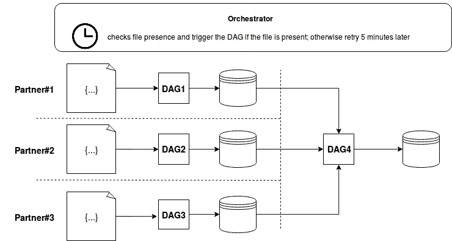
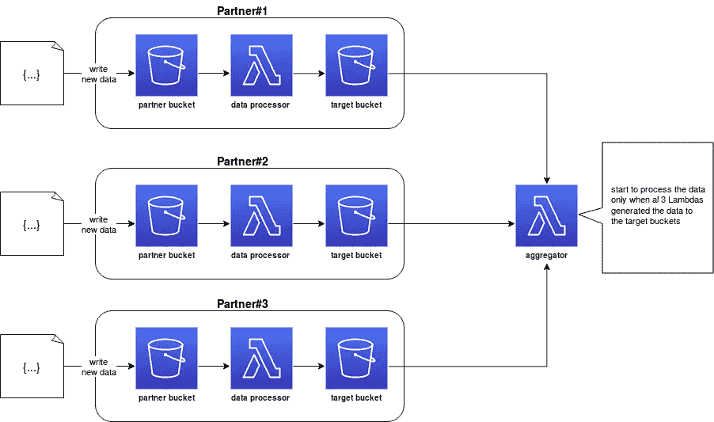
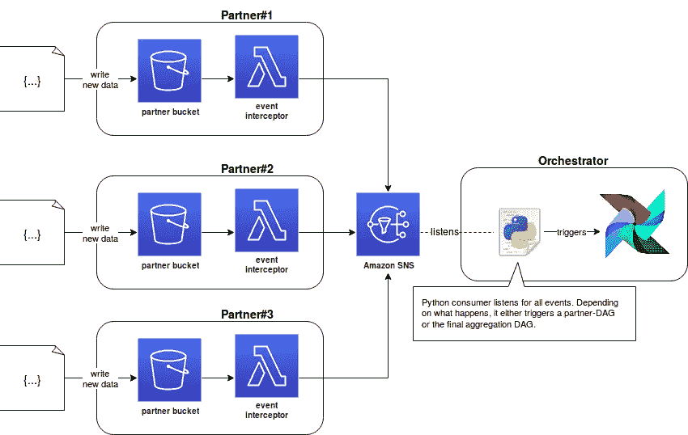

# 编排或编排

> 原文：<https://blog.devgenius.io/orchestration-or-choreography-edb316cba7ff?source=collection_archive---------4----------------------->

博客由三部分组成。

1.  提醒基础知识。
2.  更侧重于混合方法的解释
3.  展示了一个示例实现。

# 编排与编排

**编排定义，**在数据/业务实体处理管道中，编排器是负责管理节点和流程的组件。只有一个主机知道在给定的时刻应该执行哪个管道。这个编排器是唯一能够触发该执行的组件。

**编排**依赖于独立的微服务架构，其中每个服务都知道在一天的给定时刻做什么。这些服务不直接通信。相反，它们通过基于事件的架构间接对话。在这种情况下，每个服务都知道如何处理每个订阅的事件。

这两种方法各有利弊。*orchestrator 提供了管道的统一视图*，但与编排相比，它的灵活性较差。另一方面，*编排使用松散耦合，有时无共享管道*比高度耦合的管道更难管理。尤其是当上下文随着每个新添加的服务和事件变得越来越复杂时。

流程编排方法可以与 DAG 工作流一起呈现。例如，允许拥有由整合来自我们不同合作伙伴的数据的步骤和一个最终 DAG 组成的管道，以对它们进行一些最终计算

编排示例

为了说明编排模式，我们可以使用任何事件驱动的架构来集成上游/下游(合作伙伴)的数据，并触发最终的聚合作业。

编排示例

也许示例没有清楚地显示出来，但是这两种方法略有不同。在基于编排的体系结构中，编排器以一定的时间间隔验证它是否可以启动合作伙伴的处理。通过编排，每个合作伙伴都有自己专用的数据管道，启动管道的逻辑由数据处理器 Lambda 函数在内部管理。

# 提议的混合解决方案

编排具有基于服务已知事件的优势。因此，当一些输入数据不存在时，在它上面不会有任何处理动作。另一方面，得出这样一个流程的总体进度可见性可能是复杂的，特别是如果您想知道什么部分被执行了以及何时被执行。让我们看看我们是否能同时拥有两个世界。

混合解决方案方法仍然使用编排来执行处理逻辑，但是增加了中央状态管理器，称为 master。主模块负责将事件保存在事件存储中，然后与编排器进行通信，以提供一种集中的方式来可视化所发生的事情以及进度。

# 履行

这个理论看起来很简单，但是以一种具体的方式混合这两个词要稍微复杂一些。让我们看看前面提到的本地事件驱动的数据处理示例的可行性。

混合溶液流

在该模式中，Lambda 函数仅充当生成事件的拦截器。它不包含任何处理逻辑，而是捕捉事件细节并将其发送给某个流代理。在编排者方面，有一个简单的流消费者，根据读取事件，可能触发 DAG。触发的 DAG 没有计划，因此只能通过外部触发器启动。消费者传递特定于给定执行的所有配置(在 Apache Airflow 的情况下，通过 *-c CONF* 参数)。

编排和编排是完全相反的概念。前者使用单个控制器来管理作业的执行，而后者给了作业执行更多的自由。然而，两者可以混合使用，以获得两者的最佳效果。