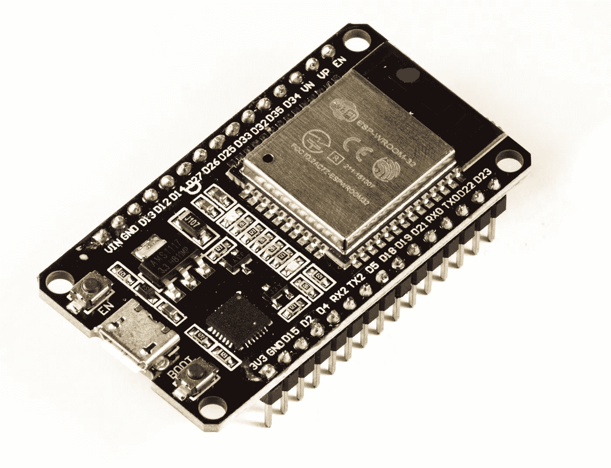

# ESP32 项目的 OTA 更新

> 原文：<https://blog.devgenius.io/ota-updates-for-your-esp32-project-e15af9cb24af?source=collection_archive---------5----------------------->

在当今互联设备的世界中，无线(OTA)更新固件的能力是许多电子项目的一项基本功能。流行的微控制器 ESP32 提供 Wi-Fi 和蓝牙连接，但实现 OTA 功能的过程可能很棘手。在本文中，我将介绍一个名为 [esp_ghota](https://github.com/Fishwaldo/esp_ghota) 的新 ota 库，它由 Justin Hammond 开发，可以轻松地将 OTA 更新添加到您的 ESP32 项目中。我将解释 esp_ghosta 是如何工作的，以及它如何帮助您在不需要物理访问的情况下保持项目最新。



ESP-WROOM-32 开发板，图像维基共享

esp_ghota 采用了一种独特的 ota 更新方法，使用 GitHub 版本作为固件更新的来源。为了支持这一点，Hammond 包含了一个流 JSON 解析器来处理来自 GitHub API 的大量响应。使用 esp_ghota 很简单——用户只需要在 GitHub 上推一个新的提交给他们的 repo，GitHub 动作会处理剩下的事情:它会构建并发布固件，esp_ghota 会定期检查更新并完成剩下的工作。

库功能:

*   使用 esp_https_ota 库更新固件映像
*   也可以更新 spiffs/littlefs/fatfs 分区
*   使用 SemVer 比较版本，仅在有新版本可用时才进行更新
*   与 esp-idf 引导程序的应用程序回滚和反回滚功能配合良好
*   直接从 github 发布页面下载固件和分区镜像
*   支持具有不同固件映像的多个设备
*   包括一个示例 Github 动作，当一个新标签被推送时，它构建并释放图像
*   更新可以手动触发，也可以通过间隔计时器触发
*   使用流 JSON 解析器来减少内存使用(Github API 响应可能会很大)
*   支持私有存储库(需要 Github API 令牌*)
*   支持 Github Enterprise
*   支持 Github 个人访问令牌以克服 Github API 速率限制
*   通过 esp_event_loop 发送更新进度

除了库本身，Hammond 还提供了一个示例 GitHub 操作和一个示例 ESP32 项目来帮助用户入门。这使得 esp_ghota 成为任何希望在他们的 ESP32 项目中实现 ota 更新的人非常有用的工具。

## 用法示例

这些是来自 esp_ghota [官方文档](https://esp-github-ota.readthedocs.io/en/latest/README.html)的用法示例。初始化网络访问后，启动计时器定期检查新版本:

```
ghota_config_t ghconfig = {
        .filenamematch = "GithubOTA-esp32.bin", // Glob Pattern to match against the Firmware file
        .storagenamematch = "storage-esp32.bin", // Glob Pattern to match against the storage firmware file
        .storagepartitionname = "storage", // Update the storage partition
        .updateInterval = 60, // Check for updates every 60 minuites
    };
    ghota_client_handle_t *ghota_client = ghota_init(&ghconfig);
    if (ghota_client == NULL) {
        ESP_LOGE(TAG, "ghota_client_init failed");
        return;
    }
    esp_event_handler_register(GHOTA_EVENTS, ESP_EVENT_ANY_ID, &ghota_event_callback, ghota_client); // Register a handler to get updates on progress 
    ESP_ERROR_CHECK(ghota_start_update_timer(ghota_client)); // Start the timer to check for updates
```

或者手动检查更新:

```
ghota_config_t ghconfig = {
        .filenamematch = "GithubOTA-esp32.bin",
        .storagenamematch = "storage-esp32.bin",
        .storagepartitionname = "storage",
        .updateInterval = 60,
    };
    ghota_client_handle_t *ghota_client = ghota_init(&ghconfig);
    if (ghota_client == NULL) {
        ESP_LOGE(TAG, "ghota_client_init failed");
        return;
    }
    esp_event_handler_register(GHOTA_EVENTS, ESP_EVENT_ANY_ID, &ghota_event_callback, ghota_client);
    ESP_ERROR_CHECK(ghota_check(ghota_client));

    semver_t *cur = ghota_get_current_version(ghota_client);
    if (cur) {
        ESP_LOGI(TAG, "Current version: %d.%d.%d", cur->major, cur->minor, cur->patch);
        semver_free(cur);
    }

    semver_t *new = ghota_get_latest_version(ghota_client);
    if (new) {
        ESP_LOGI(TAG, "New version: %d.%d.%d", new->major, new->minor, new->patch);
        semver_free(new);
    }
    ESP_ERROR_CHECK(ghota_update(ghota_client));
    ESP_ERROR_CHECK(ghota_free(ghota_client));
```

这就是全部了！您的 ESP32 项目现在将自动检查固件更新，并在您指定的 GitHub 存储库中有新版本可用时通过无线方式自我更新

## 结论

总之，esp_ghosta 对于任何希望向他们的 ESP32 项目添加 OTA 更新的人来说都是一个有价值的工具。通过利用 GitHub 版本的强大功能，esp_ghosta 提供了一种简单有效的方法来保持固件最新，而无需物理访问设备。凭借其流 JSON 解析器和对多个文件系统的支持，esp_ghosta 为 ESP32 上的 OTA 更新提供了一个健壮的解决方案。由于 Justin Hammond 提供了示例 GitHub 操作和示例 ESP32 项目，即使对于 ESP32 平台的新手来说，开始使用 esp_ghosta 也很容易。