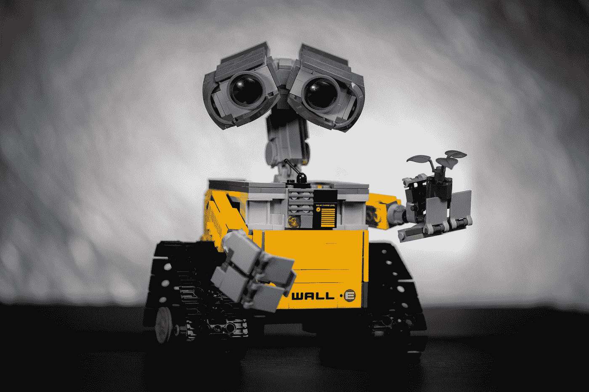

# 到目前为止，我的团队实现有效远程协作的历程…

> 原文：<https://blog.devgenius.io/our-journey-of-working-remotely-so-far-55bd46002aa0?source=collection_archive---------34----------------------->

## 对于软件技术团队来说，在家工作时保持高效和积极是一个巨大的挑战

戈兰·艾沃斯在 [Unsplash](https://unsplash.com?utm_source=medium&utm_medium=referral) 上的照片

过去，我曾几次在家工作，每次一两天。我当时的经验是有时富有成效，而其他时候没那么多。我大部分时间都是独自工作，完成我的任务或我被分配的项目。当我在家工作时，团队的其他成员在办公室里，按常规方式做他们的事情。然而，我从未想过有一天整个团队会在家开始工作。

这个疫情帮助我们探索了以前在办公室工作的所有团队去远程和在家工作的不太可能的场景。令我惊讶的是，在家工作让我大开眼界。让远程协作更上一层楼。

在这次疫情之前的几个月，我们的团队采用了 XP(极限编程)实践。XP 中一个常见的实践是结对编程，有时是 Mob 编程。我们很高兴在团队中拥有这套工具，这非常令人兴奋。很多时候，2 个工程师一起合作完成同一项任务，有时我们和 3 个以上的工程师一起工作。一切都很好，直到我们所有人都开始远程工作。

照片由[奥斯丁·迪斯特尔](https://unsplash.com/@austindistel?utm_source=medium&utm_medium=referral)在 [Unsplash](https://unsplash.com?utm_source=medium&utm_medium=referral) 上拍摄

我们不确定如何远程工作结对/mob 编程，因为在过去，每当我们必须远程工作时，我们每个人都单独工作。我们决定按照以下操作程序继续进行结对/mob 编程

1.  一个人将共享他们的屏幕并开始编码，在编码过程中，他们将编写代码和单元测试。在结对编程中，这样的人被称为司机。
2.  其他人将指导驾驶员完成任务，并帮助他们实现更大的价值和更好的设计。这些人在结对编程中被称为导航员。
3.  15 分钟的计时器将被设置，在经过时，司机将推动代码，并成为一个导航员，而其中一个导航员将成为司机
4.  如果只有一对成员在一起工作，其中一个成员缺席了一段时间，那么另一个成员将继续工作，并为他们的工作创建一个拉式请求，然后缺席的成员在到达时对其进行检查。
5.  在迭代开始时，在计划之后，我们将决定配对并分配工作。每一次迭代都会有不同的组合，这样我们就可以和整个团队保持联系

这听起来是个好计划。我们开始研究它。经过几次迭代，我们发现我们的生产率提高了，甚至比在办公室工作还要好。但是很快我们意识到我们已经筋疲力尽了，我们不能进行适当的休息，我们不能与团队的其他成员合作，除了在每天的同步会议上。我们只专注于工作，没有别的。感觉就像机器在工作，不知何故，人的因素消失了。

[梁杰森](https://unsplash.com/@ninjason?utm_source=medium&utm_medium=referral)在 [Unsplash](https://unsplash.com?utm_source=medium&utm_medium=referral) 上的照片

意识到这一点后不久，我们召开了一次团队会议，在会上我们思考可以采取什么措施来弥补这些不足。我们决定我们应该创建一个 Slack 频道，在那里我们应该发布每一对/每一群人工作的 Zoom 房间的链接，以及他们在某一天工作的主题。我们还决定在定期休息的问题上明确沟通。这个改变稍微改善了工作方式，我们不那么累了，但仍然有一种与其他组/小怪脱节的感觉。

当时我们团队的规模是 6 人。我们决定，不是有三对 2 人，我们可能有 3 人的小怪。我们多次尝试这种方法，效果不错，但不知何故，我们仍然感到疲惫不堪。在大多数情况下，我们发现两个成员积极合作，第三个成员无所事事。这种行为有几个原因，比如第三个成员觉得他们没什么可贡献的，因为其他两个成员都忙于讨论。另一个原因可能是我们无法切换驾驶员和导航员。有两个小怪的积极方面是，如果三个成员中的一个缺席，剩下的两个会像结对编程一样继续工作。

为了解决这些问题，我们进一步尝试了混合的方法。就像一对一群人，或者所有成员在一个缩放室，然后讨论和决定任务，并在分组讨论室将团队分开。但我们发现，与最初相比，生产率有所下降。然后我们意识到，我们开始变得无聊或缺乏动力。主要原因是我们一直在工作，没有留出一天或一周的时间来放松、娱乐和从事非工作活动。

路易斯·维拉斯米尔在 [Unsplash](https://unsplash.com?utm_source=medium&utm_medium=referral) 上的照片

因此，我们现在决定再次两人一组工作，而不是群氓，以保持生产力，并在导航器和驱动器之间进行有效和高效的切换，这样我们所有人都有机会编码。我们还决定至少每周举行一次与工作无关的会议、讨论和有趣的活动。我们还决定在需要的时候休息一下。到目前为止，这是一个更好的体验，但是只有时间才能证明我们在家工作时是否达到了生产力和动力的最佳平衡。