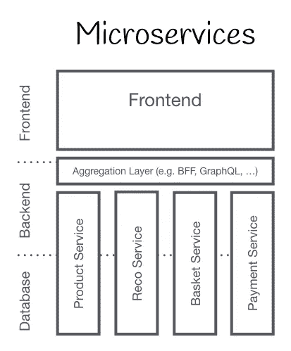
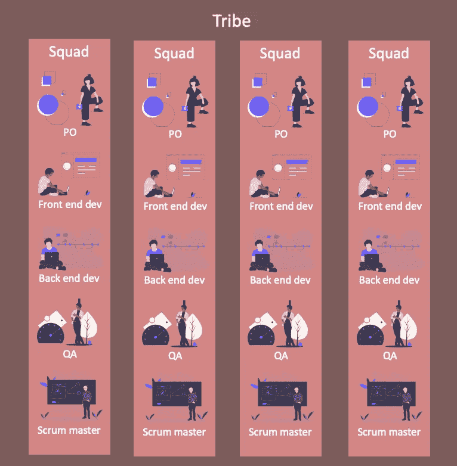
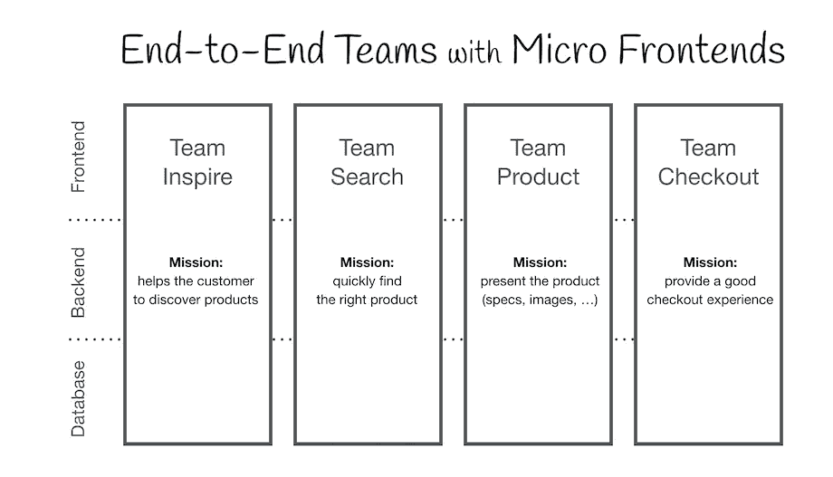
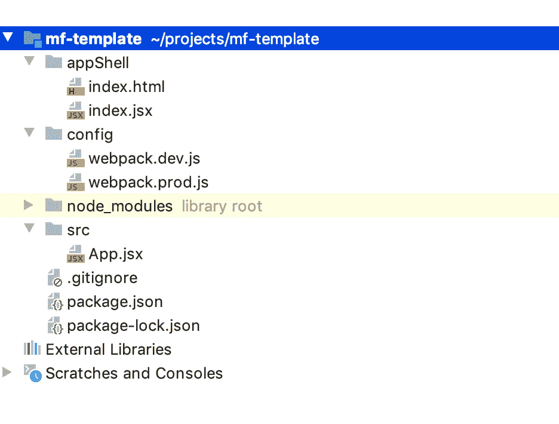
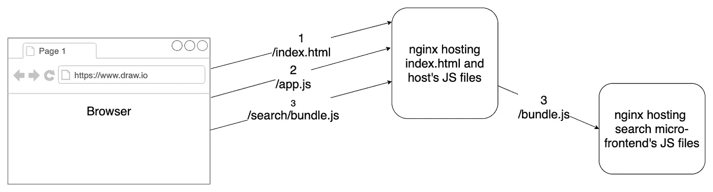

# 我们的微前端之旅

> 原文：<https://blog.devgenius.io/our-journey-to-micro-frontend-5fbe5f9f69a2?source=collection_archive---------24----------------------->

## 我的团队解释了实施微前端的原因、方式、我们面临的问题和解决方案


[jcomp 制作的红色照片](https://www.freepik.com/free-photos-vectors/red)

微前端架构是开发前端的一种方式，大致相当于后端的微服务。
你把你的前端分成可以独立开发、测试和部署的小块。

微前端有一些好处，如:

*   你**可以**为应用程序的特定部分使用不同的技术(小心这一点)。
*   微前端通过将一个大的代码库分割成更小的部分来帮助管理它。
*   更小的部分导致更可伸缩的开发。更多的人可以在同一个应用上工作。

模块化代码有它自己的好处，当然也有一些缺点。

不要担心，在这篇博客结束时，你会对什么是微前端有一个很好的理解。

> 现在，让我们谈谈我们的旅程。

**所有图片仅供理解，并非事实陈述。*

## 背景

我们有一个使用 React 和 Spring Boot 构建的应用程序。它在后端遵循微服务架构。然而，frontend 是一个完整的 react 应用程序。它的架构是这样的。



[micro-frontends.org](https://micro-frontends.org/)

有一天

> *产品负责人走进
> “我有这些我们必须构建的新功能…，
> 还有一件事，微前端”——产品负责人
> *麦克风掉落

这是一个笑话，坦率地说，我不记得他说了什么，因为谁会听产品负责人的。
又是一个笑话。…请不要解雇我。

他有将分散的项目整合成单一产品的远见。我们的项目被选中转化为这个产品。

这个想法是，其他项目将集成到我们的项目中，原始团队将保持他们的应用程序的一部分。这与我们正在经历的向部落模式的转变是携手并进的。

这就是我们部落的样子。



所有这些团队，现在称为小队，是部落的一部分，部落有一种产品。产品的每个部分都将由一个小组负责。每个部分必须覆盖该领域的端到端。

由于这篇文章是关于微前端的，所以我不会详细介绍部落模型。
需要知道的重要一点是，在部落模型中，一个团队被分成几个小组。每个组都是应用程序的一部分的所有者。
这些团队应该能够独立设计、开发、测试和部署他们的应用程序部分。

允许团队整合到我们的项目中，同时拥有上述所有的自由，这是我们面临的挑战。

我们去绘图板，看看是否和如何能做到这一点。
在后端，我们使用了完美的微服务架构。可以为要集成的项目创建新的服务。

问题在前端。一些突出的例子:

*   我们的应用程序本身就很大，添加更多将由其他团队编写的代码似乎是一场灾难。
*   我们希望每个班都能够独立部署。
*   我们希望小队之间的依赖性最小。队伍之间需要的配合越少越好。

我们知道我们需要独立的代码库，因为多个团队在一个 git 存储库中处理同一个项目会导致


意大利面条——由弗里皮克设计的

在这一点上，我们知道我们必须去微前端。我们不确定的是我们想要构建时集成还是运行时集成。

*词汇表:
主机——每个人都融入其中的那个。
微前端——被集成的那个。*

本质上，在构建时集成中，您将代码导出为库，宿主应用程序会将其作为依赖项添加并呈现。
在运行时集成中，你直接在 index.html 文件中添加微前端的捆绑 JS 文件，所以主机只在浏览器中获取你的代码，而不是在那之前。

我们没有选择构建时集成，因为这会造成团队之间的依赖。每当一个小队想要部署到 prod 时，他们必须在主机中更新他们的版本并运行一些测试。我们希望避免这种依赖。我们希望小队能够独立部署。

现在来看运行时集成，这也是我们最终要做的。

有了运行时集成，我们可以拥有一切。然而，这种设置的成本很高。

我们研究了不同的方法，最终决定采用定制的方法，因为我们希望在对主机进行最小改动的情况下集成微前端。
还有，我们挑 react 开发微前端。

我们的定制方法是将整个微前端作为 react 组件导出，并在主机应用程序中呈现。

请注意，导出的微前端将在运行时在浏览器中可用。它不是主机的构建时依赖项。

现在我们的应用就是这样划分的。



[micro-frontends.org](https://micro-frontends.org/)

## 我们是怎么做到的？

我假设你知道 react &如何在正常情况下捆绑一个前端应用程序。
我们正在使用 webpack 捆绑我们的应用。

在一个普通的应用程序中，你可以将入口点设置为`index.js`。此`index.js`有以下代码。

```
ReactDOM.render(**<**App**/>**, document.getElementById("root"));
```

`ReactDOM.render`负责在网页上渲染应用程序。

我们没有导出这个`index.js`，而是通过在 webpack 中将`App.jsx`设置为`entrypoint`来导出`<App/>`组件，并将其捆绑为一个库。

这创建了一个 JS 文件，当添加到一个`index.html`时，在`window`对象中设置`App`组件。

下面是 webpack 配置的相关部分，它将微前端捆绑到一个库中。

```
webpackConfig **=** {
    entry: './src/App.jsx',
    output: {
        library: 'app',
        libraryTarget: 'umd'
    }
}
```

## 问题

我们面临的一些突出挑战:

*   本地开发设置
*   功能测试和与主机应用程序的集成测试
*   CSS 类名冲突
*   主机和微前端之间的通信
*   生产部署
*   捆绑大小

这是我们对他们每个人做的。

## 本地开发设置

我们的自定义方法有一个问题，即没有主机就无法渲染微前端。这是因为我们将代码捆绑成一个库。我们需要一些可以使用这个库并显示在用户界面上的东西。

这个问题的一个显而易见的解决方案是在本地运行主机，并将微前端连接到它。这将允许我们在主机中查看我们的应用程序。

这种方法有问题。首先，我们现在依赖于另一个团队(一个维护主机的团队)，其次，运行两个服务器很麻烦，我们也失去了热重装。

在 react 的本地设置中，每个人都使用热重装。这允许您更改代码并立即看到更改。这看起来微不足道，但是对生产力有着重要的影响。

为了解决这个问题，我们创建了单独的 webpack 配置。一个用于生产，我们用`App.jsx`作为入口点，另一个用于本地，入口点是`index.jsx`。

> 等等，这是什么`*index.jsx*`？

我们的`index.jsx`就像普通 react app 的`index.jsx`。两者都有`ReactDOM.render`来呈现页面上的内容。

index.jsx 相关部分:


我们将这个`index.jsx`保存在一个单独的文件夹中，远离`src`。我们将其命名为`appShell`。这个`appShell`用于本地开发，并作为一个容器来呈现`<App/>`组件。我们不打算在生产捆绑包的`appShell`文件夹中捆绑任何东西。

这允许我们在没有实际主机的情况下在微前端上工作，并热重装我们的更改。

我们的项目文件结构:



## 功能测试和与主机的集成测试

正如本地设置一样，一个显而易见的方法是测试主机内部的微前端。就像本地设置一样，缺点是我们增加了对另一个小队的依赖。如果他们的代码被破解，我们的测试就会失败。

为了避免依赖性并保持微前端的独立性，我们创建了一个新的用于功能测试的准系统主机，代码足够运行微前端。我们使用这个测试实例编写了所有功能测试。

我们还编写了与真实主机的集成测试。这个集成测试是一个最小的测试，只检查微前端是否加载。

我们在微前端和主机的功能测试套件中添加了这个集成测试。两者现在都在部署前检查集成。这允许我们在微前端和主机的管道之间实现零依赖性。

## CSS 类名冲突

微前端的另一个问题是，每个微前端都创建自己的 CSS 类，如果它们有相同的名称，这些类可能会相互冲突。为了避免这个问题，我们给每个 CSS 类名加了前缀。

为了自动做到这一点，我们在 webpack 中定制了`css-loader`。

```
cssLoader = {
    loader: 'css-loader',
    options: {
        modules: {
            getLocalIdent: (context, localIdentName, localName) => {
                return `awesome_${localName}`;
            }
        }
    }
}
```

将上面的内容添加到 webpack 中会给每个 CSS 类加上前缀`awesome_`。将应用程序名称作为前缀将确保您永远不会有冲突的 CSS 类。

我们通过`css-loader`这样做，因为我们希望这是一个背景，我们甚至可以忘记它的存在。

## 主机和微前端之间的通信

在我们的用例中，主机和微前端之间没有太多的通信。我们现在所做的是，当一些东西需要从主机传到微前端时，我们将其作为`props`传递下去。
对于需要从微前端到主机的事情，我们通过事件来完成。

我们已经创建了一个事件总线，任何微前端都可以在其中发布事件。它作为一个共同的沟通渠道。

另一个我们正在考虑但没有实施的方法是共享 redux。有了共享的 redux，你可以轻松地进行双向交流。这种方法有一个风险，即任何人都可以修改商店中的任何内容。这就是为什么我们没有采取这种方法。

我不会详细讨论事件，因为它本身就是一个博客。

## 生产部署

这是一个重要的挑战。如何独立部署两个 app？如果小队在部署前必须互相检查，那么这个模型将是不可扩展的。

一件重要的事情，我们有集成测试，以确保微前端工作良好，所有的团队运行它们。这些测试是端到端的测试。这些是防止小队破坏别人的 else 代码所必需的。



上图是我们的架构的样子。
我们在 Nginx 服务器上部署了主机代码，这个 Nginx 是每个请求的入口点。

Nginx 是一款可以托管静态文件的软件，比如 HTML、CSS & JS，它还可以路由流量。

搜索微前端的代码部署在不同的 Nginx 上。

这些服务器由不同的团队管理。所以他们的部署是独立的。

让我们看看页面加载时会发生什么。

当你打开我们网站的第一件事就是从主机服务器下载`index.html`。
接下来，这个`index.html`有这几行。

```
<script type="text/javascript" src="app.js"></script>
<script type="text/javascript" src="search/bundle.js"></script>
```

然后浏览器会发送一个下载这些文件的请求。第一个文件`app.js`是直截了当的，它是主机的代码，可以在主机的服务器上获得。

第二个文件`search/bundle.js`存在于微前端的服务器上，而不在主机上。

浏览器只知道主机的服务器，所以它发送这个请求到主机，在那里我们有一个路由规则来转发(传递)所有以`/search`开始的请求来搜索微前端的服务器。而现在这个请求是由微前端的服务器来服务的。

重要的是，这是一个转发(传递)而不是重定向。

在主机上有一个路由规则将`/search`的控制权交给搜索小队，这样每个小队都可以控制自己的部分。

## 捆绑大小

当采用微前端的方法，应用程序在运行时结合时，这个问题就出现了。

每个应用程序都必须捆绑它们所有的依赖项(react 和其他)。
每个微前端都捆绑了它们所有的依赖项，因此存在大量重复的依赖项。

这是一个我们尚未解决的问题。我们在浏览器上缓存我们的 JS 文件，所以这个问题只在用户第一次加载页面时出现，所以我们还没有优先考虑它。

## 如果你喜欢这篇文章，请点击👏按钮并分享，帮助其他人找到它！欢迎在下方留言评论。

你可以在这里 & [这里](https://micro-frontends.org/)阅读更多关于微前端[的内容。](https://martinfowler.com/articles/micro-frontends.html)