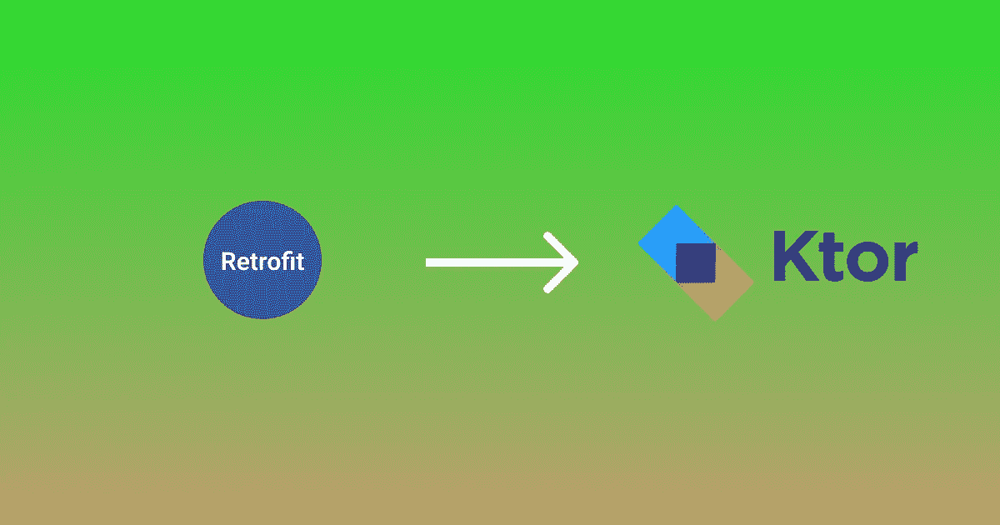

# 带改造的出去，带 KTor 客户端的进来

> 原文：<https://blog.devgenius.io/out-with-retrofit-and-in-with-ktor-client-e8b52f205139?source=collection_archive---------0----------------------->



在这篇文章中，让我们看看如何将所有网络呼叫从 Retrofit 迁移到 Kotlin KTor 客户端，以及它相对于前者提供的所有优势。

## 什么是 KTor 客户端，它与 Android 的改造有何不同？

Ktor 客户机是一个 HTTP 客户机，可用于发出请求和处理响应。它的工作原理与翻新非常相似，但让它脱颖而出的是，它没有连接到任何 android 特定的东西，完全由 Kotlin 驱动。这意味着，在未来，如果你计划将你的 android 应用程序扩展为多平台应用程序，那么你就不需要绞尽脑汁去打网络电话了，Ktor 会处理它。

## 不错，它允许多平台功能，它还能做什么？

*   它完全是用科特林语写的..所以从配置客户端到处理响应的一切都很简洁
*   它是即插即用的，意味着每个特性(身份验证、序列化等)都在它们自己的库中提供。因此，您不必导入一个包含您不需要的内容的大型库。
*   有一些很棒的异常处理程序。

## 我们开始吧

> 注意——这篇文章主要关注使用 KTor 客户端发出请求和处理响应，对于在 Android 中处理网络调用的健壮方法，请参考我的另一篇文章[这里](https://medium.com/@hyzamzz/modern-network-calls-in-android-with-retrofit-coroutines-and-sealed-classes-8c9453a6b331)。
> 
> 您还需要在 [Yelp Developers](https://www.yelp.com/developers) 中创建一个开发者帐户，以获取将用于发送请求的 API 密钥

1.  **添加眷属**

在 build.gradle(应用程序模块级别)文件中，添加以下更改

```
plugins **{
    ....** id 'org.jetbrains.kotlin.plugin.serialization' version '1.5.31'
**}**....
.........dependencies **{

    ....**

    implementation "io.ktor:ktor-client-core:1.6.7"
    implementation "io.ktor:ktor-client-android:1.6.7"
    implementation "io.ktor:ktor-client-serialization:1.6.7"
**}**
```

*   客户端核心是我们的 Ktor 客户端的核心库。
*   *client-android* 是 android 特有的引擎库。如果您的项目在多平台中提供对 iOS 的支持，那么您也可以添加特定于 iOS 的引擎。
*   *客户端序列化*带来了将我们的响应序列化为类对象的能力，反之亦然

**2。配置客户端**

```
object KtorClient {
    private const val AUTHORIZATION_HEADER = "Authorization"
    private var API_KEY: String = "Your API Key here"    private val client = HttpClient(Android) **{** *defaultRequest* **{** *header*(AUTHORIZATION_HEADER, "BEARER $API_KEY")
        **}** install(JsonFeature) **{** serializer = KotlinxSerializer(
kotlinx.serialization.json.*Json* **{** isLenient = true
                ignoreUnknownKeys = true
                explicitNulls = false
            **}**)
        **}
    }** val getInstance = client
}
```

在这里，我创建了一个名为 KtorClient 的 Kotlin 对象。它有一个 ***客户端*** 属性，这是我们的 http 客户端。

*   *defaultRequest* 确保 header 组件被传递给客户端发出的所有请求
*   *install(JsonFeature)* 允许我们将响应序列化到 Kotlin 对象中

**3。设置响应模型类别**

```
import kotlinx.serialization.SerialName
import kotlinx.serialization.Serializable

@Serializable
data class SearchResponse(
    @SerialName("businesses")
    val businesses: List<BusinessResponse>,

    @SerialName("total")
    val total: Int,
) {
    @Serializable
    data class BusinessResponse(
        @SerialName("id")
        val id: String,

        @SerialName("name")
        val name: String,

        @SerialName("image_url")
        val imageUrl: String,

        @SerialName("is_closed")
        val isClosed: Boolean,

        @SerialName("categories")
        val categories: List<BusinessCategoryResponse>,

        @SerialName("price")
        val price: String?,

        @SerialName("rating")
        val rating: Float,

        @SerialName("phone")
        val phone: String,
    )

    @Serializable
    data class BusinessCategoryResponse(
        @SerialName("title")
        val title: String,
    )
}
```

*   @Serializable 注释帮助您序列化对 Kotlin 对象的 JSON 响应，反之亦然。
*   @SerialName 注释有助于在序列化发生时手动设置密钥名。

**4。创建 API 服务和服务实现**

与翻新不同的是，服务是为我们实现的，这里我们需要手动实现它。让我们看看如何

*   创建一个名为 YelpAppServices.kt 的文件。这将提到我们计划设置的服务

```
interface YelpAppServices {
    suspend fun search(
        term: String = "burger",
        location: String = "california",
        limit: Int = 50,
    ): SearchResponse
}
```

*   创建一个名为 YelpAppServicesImpl.kt 的文件，这将为我们指定的服务提供实现

```
object YelpAppServicesImpl : YelpAppServices {
    private val httpClient by *lazy* **{** KtorClient.getInstance **}** override suspend fun search(term: String, location: String, limit: Int): SearchResponse {
        return httpClient.get **{** *url*("https://api.yelp.com/v3/businesses/search")
            *parameter*("term", term)
            *parameter*("location", location)
            *parameter*("limit", limit)
        **}** }
}
```

*   在实现中，我们提供请求所指向的 URL
*   我们还提供了发出请求的参数

**5。现在让我们从我们的存储库层调用我们的服务**

创建一个 MainRepository.kt 并添加以下代码

```
object MainRepository {

    suspend fun search(term: String? = null): 
         List<BusinessResponse> {
        return try {
            val response = 
                    YelpAppServicesImpl.search(term = term ?: "")
            response.businesses
        } catch (e: ClientRequestException) {
            Timber.d("client exception" )
            *emptyList()*
        } catch (e: IOException) {
            Timber.d("no internet" )
            *emptyList()*
        }
    }
}
```

*   ClientRequestException 是 KTor 提供的一个异常处理程序，用于处理 4XX 响应。类似的还有其他的处理程序，你可以在这里找到它们[。](https://ktor.io/docs/response-validation.html)

> 注意:为了文章的简单，如果有错误发生，我们用一个空列表来响应。确保您的响应包含适当的处理程序来处理这些情况。要了解更多，请阅读[这篇文章](https://medium.com/@hyzamzz/modern-network-calls-in-android-with-retrofit-coroutines-and-sealed-classes-8c9453a6b331)。

**6。通过视图模型**向视图提供数据

```
class MainViewModel: ViewModel() {
    private val _list = 
              MutableLiveData<List<BusinessResponse>>(*emptyList*())
    private val list: LiveData<List<Business>> = _list

    fun search(term: String) {
        *viewModelScope*.*launch*(Dispatchers.IO) **{** _list.postValue(MainRepository.search(term))
        **}** }
}
```

现在，您可以在视图中观察列表并更新数据。

**就是这样！**

您已经成功创建了一个通过 Ktor 客户端与服务器通信的 android 应用程序。在他们的[官方文档](https://ktor.io/docs/getting-started-ktor-client.html)中了解更多关于 Ktor 客户端提供的所有特性。

如果你觉得这篇文章对你有帮助，请分享并留下赞。*一路平安！*