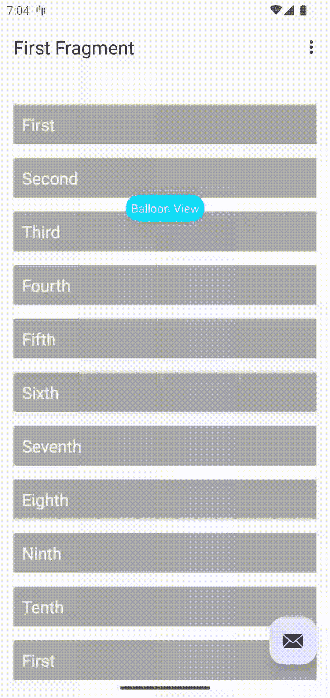

# 重叠项目装饰者

> 原文：<https://blog.devgenius.io/overlapping-itemdecorator-29651f6fa564?source=collection_archive---------0----------------------->

最近，我在解决一个问题，在这个问题中， **RecyclerView** 中的一个项目可以与另一个项目重叠，以实现类似这样的内容:



在这个界面中，蓝色气球是**回收查看**项目的一部分，但是它的相似物已经被添加到上面的**回收查看**中。

让我们开始:

```
class OverlappingItemDecoration : RecyclerView.ItemDecoration() {
    override fun getItemOffsets(outRect: Rect, view: View, parent: RecyclerView, state: RecyclerView.State) {
        if (parent.getChildAdapterPosition(view) != RecyclerView.NO_POSITION) {
            outRect.set(0, 0, 0, - 60)
        }
    }
}
```

[](https://www.buymeacoffee.com/devsoni044) [## 德夫·达尔

### 嘿，如果你喜欢我的博客，请支持我

www.buymeacoffee.com](https://www.buymeacoffee.com/devsoni044) 

结束了。

请别忘了鼓掌:)

请投票支持我在 [Stackover Flow](https://stackoverflow.com/a/71566174/10362244) 上的回答。