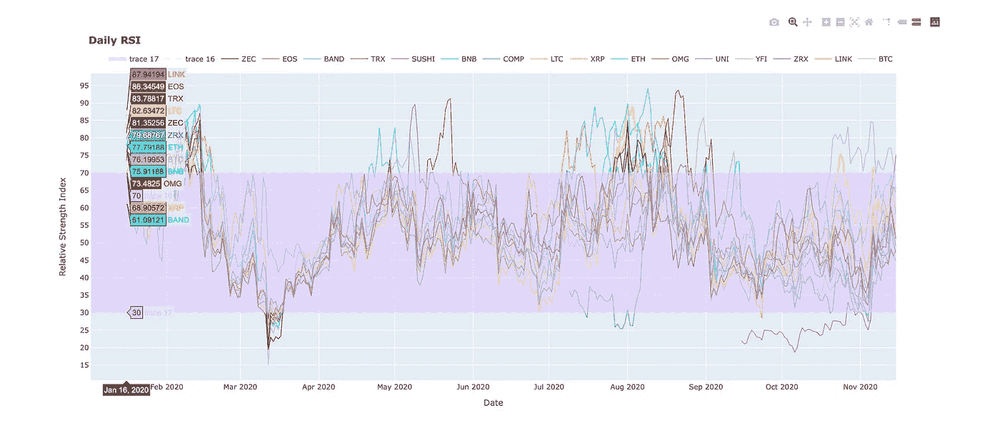
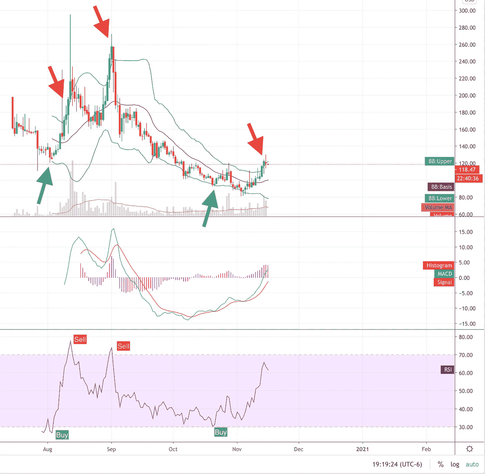
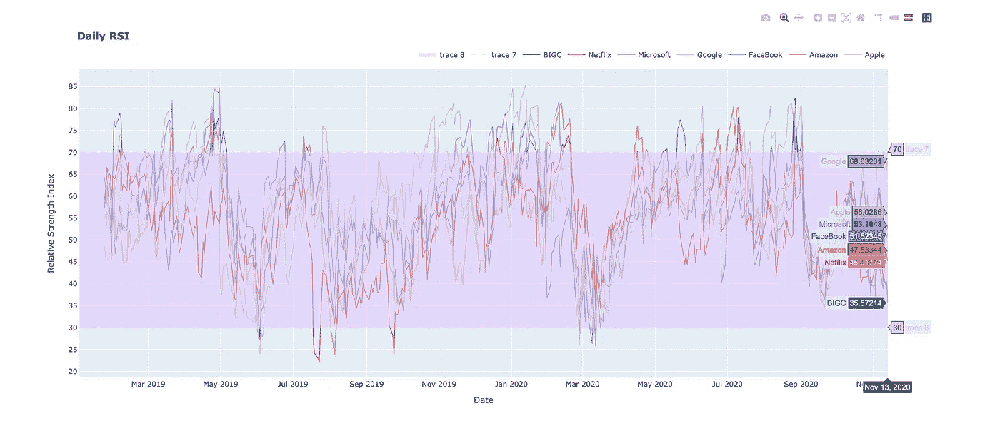

# 在 Python 中将相对强弱指数(RSI)叠加到多个股票/加密上

> 原文：<https://blog.devgenius.io/overlaying-the-relative-strength-index-rsi-on-multiple-stocks-crypto-in-python-64a46f9837a1?source=collection_archive---------2----------------------->



Plotly 中几个加密硬币的每日 RSI

# 我会长话短说

如果你像我一样，只要你在那里，你真的可以不在乎你是如何到达那里的。我本周末开始寻找一种方法来覆盖多种加密货币的 RSI，并以上面的图像(和一个股票)结束。这正是我想要的。

现在，也许有一个网站免费提供这个功能，也许没有。不管怎样，如果你已经找到了这个页面，并且正在寻找一个快捷的方法来查看多个股票/密码的 RSI，这就是你所需要的。代码如下。不过，您必须自己解决如何运行 python 的问题。

*我只创建了每日图表。我真的需要添加一个参数，用于在每个周期(15 分钟，1 小时，2 小时，4 小时，6 小时等)拉进股票/密码。)也许我现在会那么做…也许不会:)我确定它已经是那些库中的参数了。一定是。

# 什么是 RSI？

> [由 J. Welles Wilder](https://school.stockcharts.com/doku.php?id=technical_indicators:relative_strength_index_rsi) 开发，相对强弱指数(RSI)是衡量价格运动速度和变化的动量振荡器。RSI 在 0 到 100 之间震荡。根据怀尔德的说法，RSI 在 70 以上被认为超买，在 30 以下被认为超卖。信号也可以通过寻找背离、失败摆动和中线交叉来产生。RSI 也可以用来识别大趋势。

***等待..什么？RSI 只是一个由某个等式计算出来的值(虽然不完全是等式)，它告诉你什么时候应该买入/卖出。这是一个在每个交易平台上都使用的指标，在 youtube 上几乎每个关于“如何赚一百万美元 OMG！？!"而且在大多数交易策略中，不管目标是什么；长期，短期 HODL 永远#月亮#显而易见***

# 如何看待 RSI？

准备好了吗？当 RSI 线低于底线(30)时，买入，当它高于顶线(70)时，卖出。就是这样。走开。

如果你只在每日时段应用这个策略，你会错过交易，但是，这是一个非常好的指标。这不是交易建议，但如果你只在 RSI 跌至 30 线以下时买入，你可能不会出错。接下来几周还会涨。不客气



当天$COMP 硬币的交易视图图像

# RSI 密码

```
#import the libraries
from fastquant import get_stock_data
from fastquant import get_crypto_data
from pandas_datareader import data as pdr
import yfinance as yf
import plotly.graph_objects as go
import pandas as pd
from datetime import datetime#set a date variable
now = datetime.today().strftime('%Y-%m-%d')
print('current date: ', now)#pull in the data
BTC = get_crypto_data("BTC/USDT", "2020-01-01", now) 
print('1/16 done')
LINK = get_crypto_data("LINK/USDT", "2020-01-01", now) 
print('2/16 done')
ZRX = get_crypto_data("ZRX/USDT", "2020-01-01", now) 
print('3/16 done')
YFI = get_crypto_data("YFI/USDT", "2020-01-01", now) 
print('4/16 done')
UNI = get_crypto_data("UNI/USDT", "2020-01-01", now) 
print('5/16 done')
OMG = get_crypto_data("OMG/USDT", "2020-01-01", now) 
print('6/16 done')
ETH = get_crypto_data("ETH/USDT", "2020-01-01", now)
print('7/16 done')
XRP = get_crypto_data("XRP/USDT", "2020-01-01", now)
print('8/16 done')
LTC = get_crypto_data("LTC/USDT", "2020-01-01", now)
print('9/16 done')
COMP = get_crypto_data("COMP/USDT", "2020-01-01", now)
print('10/16 done')
BNB = get_crypto_data("BNB/USDT", "2020-01-01", now)
print('11/16 done')
SUSHI = get_crypto_data("SUSHI/USDT", "2020-01-01", now)
print('12/16 done')
TRX = get_crypto_data("TRX/USDT", "2020-01-01", now)
print('13/16 done')
BAND = get_crypto_data("BAND/USDT", "2020-01-01", now)
print('14/16 done')
EOS = get_crypto_data("EOS/USDT", "2020-01-01", now)
print('15/16 done')
ZEC = get_crypto_data("ZEC/USDT", "2020-01-01", now)
print('16/16 done')#reset the indexes of each df
BTC = BTC.reset_index()
LINK = LINK.reset_index()
ZRX = ZRX.reset_index()
YFI = YFI.reset_index()
UNI = UNI.reset_index()
OMG = OMG.reset_index()
ETH = ETH.reset_index()
XRP = XRP.reset_index()
LTC = LTC.reset_index()
COMP = COMP.reset_index()
BNB = BNB.reset_index()
SUSHI = SUSHI.reset_index()
TRX = TRX.reset_index()
BAND = BAND.reset_index()
EOS = EOS.reset_index()
ZEC = ZEC.reset_index()print('btc: ', BTC.head())#keep only the date and the close column
#rename the cloumns
BTC = BTC[['dt','close']].rename(columns={"dt": "Date", "close": "btc_close"})
LINK = LINK[['dt','close']].rename(columns={"dt": "Date", "close": "link_close"})
ZRX = ZRX[['dt','close']].rename(columns={"dt": "Date", "close": "zrx_close"})
YFI = YFI[['dt','close']].rename(columns={"dt": "Date", "close": "yfi_close"})
UNI = UNI[['dt','close']].rename(columns={"dt": "Date", "close": "uni_close"})
OMG = OMG[['dt','close']].rename(columns={"dt": "Date", "close": "omg_close"})
ETH = ETH[['dt','close']].rename(columns={"dt": "Date", "close": "eth_close"})
XRP = XRP[['dt','close']].rename(columns={"dt": "Date", "close": "xrp_close"})
LTC = LTC[['dt','close']].rename(columns={"dt": "Date", "close": "ltc_close"})
COMP = COMP[['dt','close']].rename(columns={"dt": "Date", "close": "comp_close"})
BNB = BNB[['dt','close']].rename(columns={"dt": "Date", "close": "bnb_close"})
SUSHI = SUSHI[['dt','close']].rename(columns={"dt": "Date", "close": "sushi_close"})
TRX = TRX[['dt','close']].rename(columns={"dt": "Date", "close": "trx_close"})
BAND = BAND[['dt','close']].rename(columns={"dt": "Date", "close": "band_close"})
EOS = EOS[['dt','close']].rename(columns={"dt": "Date", "close": "eos_close"})
ZEC = ZEC[['dt','close']].rename(columns={"dt": "Date", "close": "zec_close"})print('btc: \n ', BTC.head())#merge all the dataframes
df = pd.merge(BTC, LINK, on='Date', how='left')
df = pd.merge(df, ZRX, on='Date', how='left')
df = pd.merge(df, YFI, on='Date', how='left')
df = pd.merge(df, UNI, on='Date', how='left')
df = pd.merge(df, OMG, on='Date', how='left')
df = pd.merge(df, ETH, on='Date', how='left')
df = pd.merge(df, XRP, on='Date', how='left')
df = pd.merge(df, LTC, on='Date', how='left')
df = pd.merge(df, COMP, on='Date', how='left')
df = pd.merge(df, BNB, on='Date', how='left')
df = pd.merge(df, SUSHI, on='Date', how='left')
df = pd.merge(df, TRX, on='Date', how='left')
df = pd.merge(df, BAND, on='Date', how='left')
df = pd.merge(df, EOS, on='Date', how='left')
df = pd.merge(df, ZEC, on='Date', how='left')print(df.info)#rsi function
def computeRSI (data, time_window):
    diff = data.diff(1).dropna() # diff in one field(one day)#this preservers dimensions off diff values
    up_chg = 0 * diff
    down_chg = 0 * diff

    # up change is equal to the positive difference, otherwise equal to zero
    up_chg[diff > 0] = diff[ diff>0 ]

    # down change is equal to negative deifference, otherwise equal to zero
    down_chg[diff < 0] = diff[ diff < 0 ]

    # check pandas documentation for ewm
    # [https://pandas.pydata.org/pandas-docs/stable/reference/api/pandas.DataFrame.ewm.html](https://pandas.pydata.org/pandas-docs/stable/reference/api/pandas.DataFrame.ewm.html)
    # values are related to exponential decay
    # we set com=time_window-1 so we get decay alpha=1/time_window
    up_chg_avg = up_chg.ewm(com=time_window-1, min_periods=time_window).mean()
    down_chg_avg = down_chg.ewm(com=time_window-1, min_periods=time_window).mean()

    rs = abs(up_chg_avg/down_chg_avg)
    rsi = 100 - 100/(1+rs)
    return rsi#run the function for each column
df['btc_close'] = computeRSI(df['btc_close'], 14)
df['link_close'] = computeRSI(df['link_close'], 14)
df['zrx_close'] = computeRSI(df['zrx_close'], 14)
df['yfi_close'] = computeRSI(df['yfi_close'], 14)
df['uni_close'] = computeRSI(df['uni_close'], 14)
df['omg_close'] = computeRSI(df['omg_close'], 14)
df['eth_close'] = computeRSI(df['eth_close'], 14)
df['xrp_close'] = computeRSI(df['xrp_close'], 14)
df['ltc_close'] = computeRSI(df['ltc_close'], 14)
df['comp_close'] = computeRSI(df['comp_close'], 14)
df['bnb_close'] = computeRSI(df['bnb_close'], 14)
df['sushi_close'] = computeRSI(df['sushi_close'], 14)
df['trx_close'] = computeRSI(df['trx_close'], 14)
df['band_close'] = computeRSI(df['band_close'], 14)
df['eos_close'] = computeRSI(df['eos_close'], 14)
df['zec_close'] = computeRSI(df['zec_close'], 14)#set the high and low lines (as columns)
df['low'] = 30
df['high'] = 70
df.head(20)#plot it!
fig = go.Figure()#create lines/traces
fig.add_trace(go.Scatter(x=df['Date'], y=df['btc_close'],
                    mode='lines',
                    name='BTC',
                    line=dict(color="Silver", width=1),))
fig.add_trace(go.Scatter(x=df['Date'], y=df['link_close'],
                    mode='lines',
                    name='LINK',
                    line=dict(color="orange", width=1),))
fig.add_trace(go.Scatter(x=df['Date'], y=df['zrx_close'],
                    mode='lines',
                    name='ZRX',
                    line=dict(color="royalblue", width=1),))
fig.add_trace(go.Scatter(x=df['Date'], y=df['yfi_close'],
                    mode='lines',
                    name='YFI',
                    line=dict(color="LightGreen", width=1),))
fig.add_trace(go.Scatter(x=df['Date'], y=df['uni_close'],
                    mode='lines',
                    name='UNI',
                    line=dict(color="MediumPurple", width=1),))
fig.add_trace(go.Scatter(x=df['Date'], y=df['omg_close'],
                    mode='lines',
                    name='OMG',
                    line=dict(color="Red", width=1),))fig.add_trace(go.Scatter(x=df['Date'], y=df['eth_close'],
                    mode='lines',
                    name='ETH',
                    line=dict(color="Aqua", width=1),))
fig.add_trace(go.Scatter(x=df['Date'], y=df['xrp_close'],
                    mode='lines',
                    name='XRP',
                    line=dict(color="Gold", width=1),))
fig.add_trace(go.Scatter(x=df['Date'], y=df['ltc_close'],
                    mode='lines',
                    name='LTC',
                    line=dict(color="Yellow", width=1),))
fig.add_trace(go.Scatter(x=df['Date'], y=df['comp_close'],
                    mode='lines',
                    name='COMP',
                    line=dict(color="lightseagreen", width=1),))
fig.add_trace(go.Scatter(x=df['Date'], y=df['bnb_close'],
                    mode='lines',
                    name='BNB',
                    line=dict(color="darkturquoise", width=1),))fig.add_trace(go.Scatter(x=df['Date'], y=df['sushi_close'],
                    mode='lines',
                    name='SUSHI',
                    line=dict(color="slateblue", width=1),))
fig.add_trace(go.Scatter(x=df['Date'], y=df['trx_close'],
                    mode='lines',
                    name='TRX',
                    line=dict(color="firebrick", width=1),))fig.add_trace(go.Scatter(x=df['Date'], y=df['band_close'],
                    mode='lines',
                    name='BAND',
                    line=dict(color="turquoise", width=1),))
fig.add_trace(go.Scatter(x=df['Date'], y=df['eos_close'],
                    mode='lines',
                    name='EOS',
                    line=dict(color="olivedrab", width=1),))
fig.add_trace(go.Scatter(x=df['Date'], y=df['zec_close'],
                    mode='lines',
                    name='ZEC',
                    line=dict(color="maroon", width=1),))fig.add_trace(go.Scatter(x=df['Date'], y=df['high'],
                         fill=None,
                         mode='lines',
                         line=dict(width=0.5, color='rgb(222, 196, 255)', dash='dash')))
fig.add_trace(go.Scatter(x=df['Date'],y=df['low'],
                         fill='tonexty', # fill area between trace0 and trace1
                         mode='lines',
                         line=dict(width=0.5, color='rgb(222, 196, 255)', dash='dash')))#update axis ticks
fig.update_yaxes(nticks=30,showgrid=True)
fig.update_xaxes(nticks=12,showgrid=True)#update layout
fig.update_layout(title="<b>Daily RSI</b>"
                 , height = 700
                 , xaxis_title='Date'
                 , yaxis_title='Relative Strength Index'
                 , template = "plotly" #['ggplot2', 'seaborn', 'simple_white', 'plotly', 'plotly_white', 'plotly_dark']
                 )#update legend
fig.update_layout(legend=dict(
    orientation="h",
    yanchor="bottom",
    y=1.02,
    xanchor="right",
    x=1
))#show the figure
fig.show()
```

# RSI 股票代码

```
from pandas_datareader import data as pdr
import yfinance as yf
import plotly.graph_objects as goyf.pdr_override()# download dataframe
data = pdr.get_data_yahoo(tickers = "AMZN AAPL MSFT GOOGL NFLX FB BIGC"
                          , start="2019-01-01"
                          , end="2020-11-14")print(data.head())#rsi function
def computeRSI (data, time_window):
    diff = data.diff(1).dropna() # diff in one field(one day)#this preservers dimensions off diff values
    up_chg = 0 * diff
    down_chg = 0 * diff

    # up change is equal to the positive difference, otherwise equal to zero
    up_chg[diff > 0] = diff[ diff>0 ]

    # down change is equal to negative deifference, otherwise equal to zero
    down_chg[diff < 0] = diff[ diff < 0 ]

    # check pandas documentation for ewm
    # [https://pandas.pydata.org/pandas-docs/stable/reference/api/pandas.DataFrame.ewm.html](https://pandas.pydata.org/pandas-docs/stable/reference/api/pandas.DataFrame.ewm.html)
    # values are related to exponential decay
    # we set com=time_window-1 so we get decay alpha=1/time_window
    up_chg_avg = up_chg.ewm(com=time_window-1, min_periods=time_window).mean()
    down_chg_avg = down_chg.ewm(com=time_window-1, min_periods=time_window).mean()

    rs = abs(up_chg_avg/down_chg_avg)
    rsi = 100 - 100/(1+rs)
    return rsi#create rsi columns
close = data['Adj Close']
close = close.reset_index()close['RSI_APPLE'] = computeRSI(close['AAPL'],14)
close['RSI_AMZN'] = computeRSI(close['AMZN'],14)
close['RSI_FB'] = computeRSI(close['FB'],14)
close['RSI_GOOGL'] = computeRSI(close['GOOGL'],14)
close['RSI_MSFT'] = computeRSI(close['MSFT'],14)
close['RSI_NFLX'] = computeRSI(close['NFLX'],14)
close['RSI_BIGC'] = computeRSI(close['BIGC'],14)
close['low'] = 30
close['high'] = 70
close.head(20)#plot
fig = go.Figure()#create lines/traces
fig.add_trace(go.Scatter(x=close['Date'], y=close['RSI_APPLE'],
                    mode='lines',
                    name='Apple',
                    line=dict(color="Silver", width=1),))
fig.add_trace(go.Scatter(x=close['Date'], y=close['RSI_AMZN'],
                    mode='lines',
                    name='Amazon',
                    line=dict(color="orange", width=1),))
fig.add_trace(go.Scatter(x=close['Date'], y=close['RSI_FB'],
                    mode='lines',
                    name='FaceBook',
                    line=dict(color="royalblue", width=1),))
fig.add_trace(go.Scatter(x=close['Date'], y=close['RSI_GOOGL'],
                    mode='lines',
                    name='Google',
                    line=dict(color="LightGreen", width=1),))
fig.add_trace(go.Scatter(x=close['Date'], y=close['RSI_MSFT'],
                    mode='lines',
                    name='Microsoft',
                    line=dict(color="MediumPurple", width=1),))
fig.add_trace(go.Scatter(x=close['Date'], y=close['RSI_NFLX'],
                    mode='lines',
                    name='Netflix',
                    line=dict(color="Red", width=1),))
fig.add_trace(go.Scatter(x=close['Date'], y=close['RSI_BIGC'],
                    mode='lines',
                    name='BIGC',
                    line=dict(color="Teal", width=1),))fig.add_trace(go.Scatter(x=close['Date'], y=close['high'],
                         fill=None,
                         mode='lines',
                         line=dict(width=0.5, color='rgb(222, 196, 255)', dash='dash')))
fig.add_trace(go.Scatter(x=close['Date'],y=close['low'],
                         fill='tonexty', # fill area between trace0 and trace1
                         mode='lines',
                         line=dict(width=0.5, color='rgb(222, 196, 255)', dash='dash')))#update axis ticks
fig.update_yaxes(nticks=30,showgrid=True)
fig.update_xaxes(nticks=12,showgrid=True)#update layout
fig.update_layout(title="<b>Daily RSI</b>"
                 , height = 700
                 , xaxis_title='Date'
                 , yaxis_title='Relative Strength Index'
                 , template = "plotly" #['ggplot2', 'seaborn', 'simple_white', 'plotly', 'plotly_white', 'plotly_dark']
                 )#update legend
fig.update_layout(legend=dict(
    orientation="h",
    yanchor="bottom",
    y=1.02,
    xanchor="right",
    x=1
))fig.show()
```



几只股票的日相对强弱指数

# 一些细节

对于 Crypto，如果你感兴趣的话，有两个库使它成为可能。不是说只有两个库可以完成这项工作，我敢肯定有很多。我不想走创建帐户和生成 api 密钥的路线。真烦人。所以我找到了`fastquant`一个[令人敬畏的 python 库](https://github.com/enzoampil/fastquant)，它允许你获取历史数据以及回溯测试不同的指标。向他们大声呼喊！

至于股票，我用的是`yfinance` [库](https://pypi.org/project/yfinance/)，也很棒。这里有一篇[非常得体的文章](https://tcoil.info/compute-rsi-for-stocks-with-python-relative-strength-index/)，向你展示了如何使用它来生成 RSI 的更多细节。我的只是更漂亮；)这里还有一篇关于生成 RSI 的[精彩 stackoverflow 帖子](https://stackoverflow.com/questions/20526414/relative-strength-index-in-python-pandas)。

# 总结

通过总结，我的意思是我毫无根据地让那些有点强迫症的人耐着性子读完我的文章，因为让我们面对它，他们必须读完整篇文章，对吗？