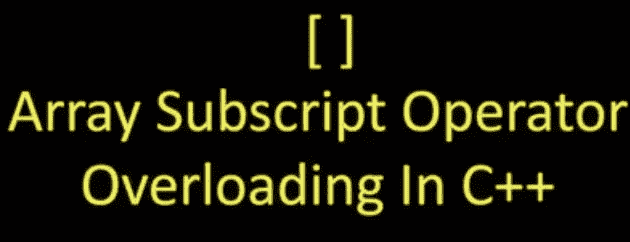

# 在 C++中重载 Subscripting[]运算符

> 原文：<https://blog.devgenius.io/overloading-the-subscripting-operator-in-c-1745e8818e02?source=collection_archive---------10----------------------->

## 在 C++中实现 Get/Set 的地图方括号索引



## 放弃

我喜欢误用“索引”这个词，把它当作一个动词来使用，意思是在数据结构(通常是数组或列表)的索引处查找值。我更喜欢误用这个意思，将它扩展为“索引”一个地图，这只是获取存储在键中的值。本质上，“索引”是在某物上使用方括号操作符(`mymap[key]`)。我不知道我为什么这么说，也不知道这是否是一件常见的事情，但从快速的谷歌搜索来看，我怀疑它不是。

## 序言

最近，我决定用 C++实现一个红黑树作为个人项目。这已经以`std::map`和`std::set`的形式存在，实现起来很痛苦，因为 segfaults 几乎在每一行都发生，但是这对于红黑树(我正在学校学习)和 C++来说都是一个很好的练习(这总是需要改进的)。我让我的树处理 get、set、inserts 和 remove，一切都很好。然而，我错过了 C#和 python 的简单语法，在这两种语言中，人们可以用`map[key] = value`索引地图，而不是使用笨重的方法和点语法。在实践中，我们可以写点，这没什么大不了的，但这已经是一个实验了，所以为什么不试着让使用变得更简单(更酷)呢？

## 运算符重载

C++允许我们覆盖定制类型的几乎所有操作符，例如`+`、`-`、`>`、`=`和订阅操作符`[]`。C/C++中的正常行为是像在`pointer[5] = *(pointer+5)`中一样自动执行指针运算和解引用，但是在语义上，它已经变得与索引(或下标，因此得名)数组、列表和映射同义。为类型重载该操作符的语法是使用签名`<returnType> operator[](<paramType> <param>)`创建一个方法。单数参数对应于方括号内的内容。该方法可以在地图`mymap`上作为
`<returnType> v = mymap[<param>];`调用

## 重载树上的[]

像我们想要的那样实现订阅操作符有点困难，因为它需要服务于两个功能，获取和设置。我们不能直接引用值字段，因为它有特定的 getters 和 setters，我们不想暴露它。因此，我们需要根据操作符的使用方式和位置来改变行为。`int val = mymap[key];`应该调用 getter 方法，而`mymap[key] = val;`应该调用 setter/insertion。真的没有办法让两个重载具有不同的行为(你可以自己尝试一下，看看为什么)，所以我们必须想出一个更棘手的解决方案。我们可以让`operator[]` a 返回一个“代理”对象，它重载操作符并根据对它做了什么调用正确的方法。

```
rbtree<K, V>::getSetProxy operator[](K key) {
    return getSetProxy(this, key);
}
```

现在呼叫`int val = mymap[key];`变成了`int val = getSetProxy;`，而`mymap[key] = val;`变成了`getSetProxy = val;`

## getSetProxy

这个代理对象将根据用户试图做的事情来处理获取和设置。代理的构造接受对树的引用，以便它可以执行操作，还接受键，以便它知道在哪里获取/设置/插入。

设定的情况相当简单。我们将使用赋值操作符`=`来设置，所以我们可以重载它来调用 setter 方法。

```
class getSetProxy {
    rbtree<K, V> *theTree;
    K key;
...
    void operator=(V value) {
        if (!theTree->setValue(key, value)) {
            theTree->insert(key, value);
        }
    }
...
}
```

赋值右侧的值被设置或插入到树中的键上。

Get 有点棘手。C++中有一个操作符叫做隐式强制转换操作符，带有签名`operator T() const;`，其中`T`是要强制转换到的类型，`const`只是意味着这个函数不能修改类。每当 C++需要转换成不同的类型时，就会调用这个函数。

```
myclass myobj = myobj();
int myint = myobj;
//          ^^^^^
//          implicit cast int() is called
```

所以在`T val = getSetProxy;`中会调用`operator T()`。我们可以重载它来获得如下功能:

```
class getSetProxy {
    rbtree<K, V> *theTree;
    K key;
...
    operator V() const {
        return theTree->getValue(key);
    }
...
}
```

## 把所有的放在一起

请原谅我对符号、等式和所有即将发生的数学的滥用。

`V value = mymap[key];` →`V value = getSetProxy{key = key};`→
→`V value = getSetProxy.operatorV();` →`V value = mymap.getValue(key);`

`mymap[key] = value;`(为简单起见假设钥匙不在地图上)
→ `getSetProxy{key = key} = value;`
→ `getSetProxy{key = key}.operator=(value);` → `mymap->setValue(key, value)`

## 收场白

C++非常有趣，因为你可以真正把它变成你自己的语言。我能够用几行代码(尽管有点棘手)就把笨拙的语法变得我更熟悉。整个项目的代码，包括这个订阅部分可以在我的 GitHub 上的[这里](https://github.com/ericbreyer/redBlackTreeInCpp)找到。

# 关于作者

Eric Breyer 是莱斯大学的计算机科学本科生。你可以在他的[网站](http://www.ericbreyer.com/)，以及 [GitHub](https://github.com/ericbreyer) 和 [LinkedIn](https://www.linkedin.com/in/eric-breyer/) 上找到他。