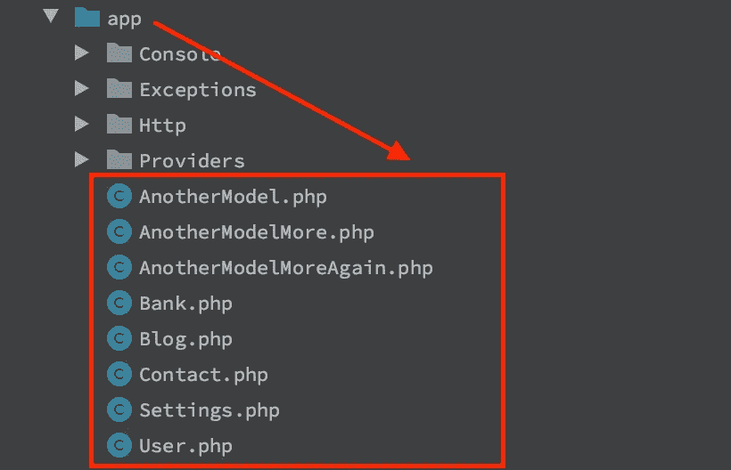
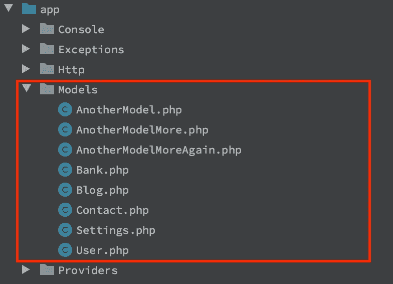
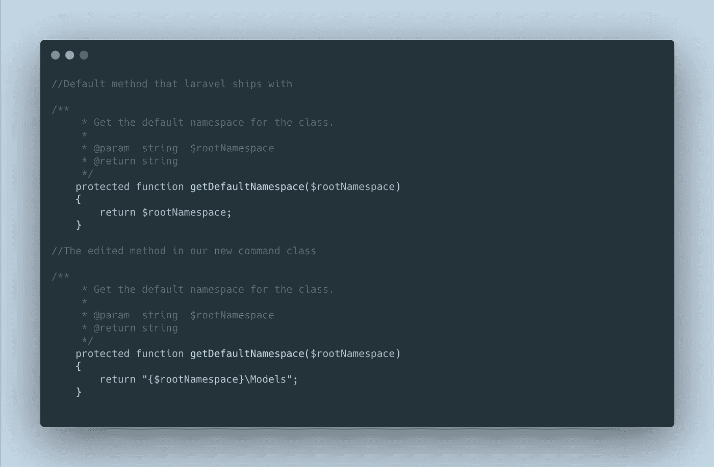

# 使用 Artisan 命令覆盖 Laravel 的默认模型文件夹

> 原文：<https://blog.devgenius.io/overriding-laravels-default-models-folder-using-artisan-command-a362f5d77765?source=collection_archive---------5----------------------->

几周前，Laravel 的创建者 Taylor Otwell 进行了一项调查，询问该框架的用户如何在应用程序文件夹中排列他们的模型文件。

框架默认将所有模型直接存储在 app 文件夹中，但是大多数开发人员(包括我在内)更喜欢有一个特定的 models 文件夹来存放所有模型。



默认的 Laravel 模型排列。



我安排模特的方式。

遵循这种排列模型的方法有点繁琐，因为在使用 artisan 命令创建模型时，必须将文件夹名称指定为名称空间。要以默认方式创建模型，您可以在终端中运行以下命令:

> php 工匠制作:模型库

该命令将创建一个新的银行模型类，并将文件直接放在 app 文件夹中。

要将模型直接创建到任何其他文件夹中，对于我来说，就是 Models 文件夹，这必须在运行命令时指定，见下面:

> php 工匠制作:模型模型\ \银行

虽然在您想要创建一个新模型的任何时候这样做可能看起来没什么大不了的，但是在项目中有不止一个开发人员或者随着时间的推移创建了许多模型，您可能会忘记每次都添加 *Models\\* 前缀，这会将模型创建到默认的应用程序文件夹中，这不是我们想要的。

要解决这个问题，我们可以扩展 Laravel 的默认模型创建 artisan 命令并编辑默认的名称空间/文件夹，这样我们就不必在创建新模型时预先考虑名称空间/文件夹名称。

*注意:文件夹名，也是名称空间名。*

首先，创建一个新的 artisan 命令:

> php artisan make:命令模型 make 命令

这将在 app\Console\Commands 文件夹中创建一个新的命令类/文件，其内容为:

```
<?php

namespace App\Console\Commands;

use Illuminate\Console\Command;

class ModelMakeCommand extends Command
{
    */**
     * The name and signature of the console command.
     *
     ** ***@var*** *string
     */* protected $signature = 'command:name';

    */**
     * The console command description.
     *
     ** ***@var*** *string
     */* protected $description = 'Command description';

    */**
     * Create a new command instance.
     *
     ** ***@return*** *void
     */* public function __construct()
    {
        parent::*__construct*();
    }

    */**
     * Execute the console command.
     *
     ** ***@return*** *int
     */* public function handle()
    {
        return 0;
    }
}
```

其次，我们将我们的 ModelMakeClass 扩展的类从*Illuminate \ Console \ Command*改为*Illuminate \ Foundation \ Console \ model make Command*

第三，我们将清空 ModelMakeClass 的默认方法，并在该类中创建一个名为 *getDefaultNamespace* 的新方法来处理我们希望它执行的任务(该方法覆盖了我们正在扩展的中的*Illuminate \ Foundation \ Console \ model make command 中的方法)。*

ModelMakeClass 变成:

```
<?php

namespace App\Console\Commands;

use Illuminate\Foundation\Console\ModelMakeCommand as Command;

class ModelMakeCommand extends *Command* {

    */**
     * Get the default namespace for the class.
     *
     ** ***@param*** *string $rootNamespace
     ** ***@return*** *string
     */* protected function getDefaultNamespace($rootNamespace)
    {
        //logic to change default behaviour
    }

}
```

添加到我们刚刚创建的新命令类的最后一件事是使我们的文件夹成为放置模型文件的默认文件夹的逻辑，在我的例子中是 Models 文件夹。



getDefaultNamespace 方法的两个不同版本。

我们的新命令类现在变成了:

```
<?php

namespace App\Console\Commands;

use Illuminate\Foundation\Console\ModelMakeCommand as Command;

class ModelMakeCommand extends *Command* {
    */**
     * Get the default namespace for the class.
     *
     ** ***@param*** *string $rootNamespace
     ** ***@return*** *string
     */* protected function getDefaultNamespace($rootNamespace)
    {
        return "{$rootNamespace}\Models";
    }
}
```

最后，运行 artisan 命令创建一个新模型，默认情况下会将模型放在 *app\Models* 文件夹中🙂。

TL；博士:

要更改 Laravel 应用程序中的默认模型文件夹

*   创建名为 ModelMakeCommand 的新 artisan 命令
*   扩展*照明\基础\控制台\模型制作命令*类，而不是*照明\控制台\命令*类。
*   从该类中删除其他方法和属性，然后创建一个名为 *getDefaultNamespace* 的新方法，其内容为:

```
*/**
     * Get the default namespace for the class.
     *
     ** ***@param*** *string $rootNamespace
     ** ***@return*** *string
     */* protected function getDefaultNamespace($rootNamespace)
    {
        return "{$rootNamespace}\Models";
    }
```

*   整个班级变成了:

```
<?php

namespace App\Console\Commands;

use Illuminate\Foundation\Console\ModelMakeCommand as Command;

class ModelMakeCommand extends *Command* {
    */**
     * Get the default namespace for the class.
     *
     ** ***@param*** *string $rootNamespace
     ** ***@return*** *string
     */* protected function getDefaultNamespace($rootNamespace)
    {
        return "{$rootNamespace}\Models";
    }
}
```

*   运行模型创建 artisan 命令，模型将出现在 app\Models 文件夹中。

> 在推特上关注我:【https://twitter.com/drumzminister 