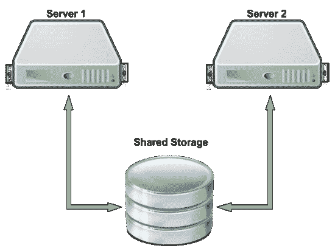
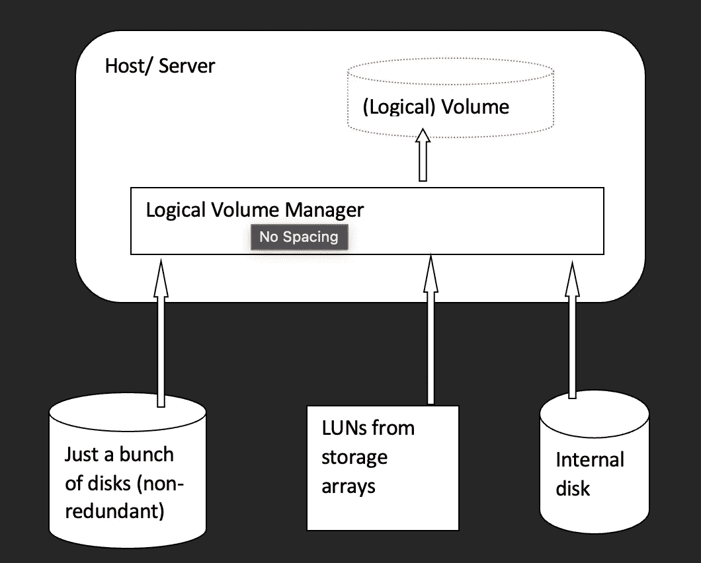
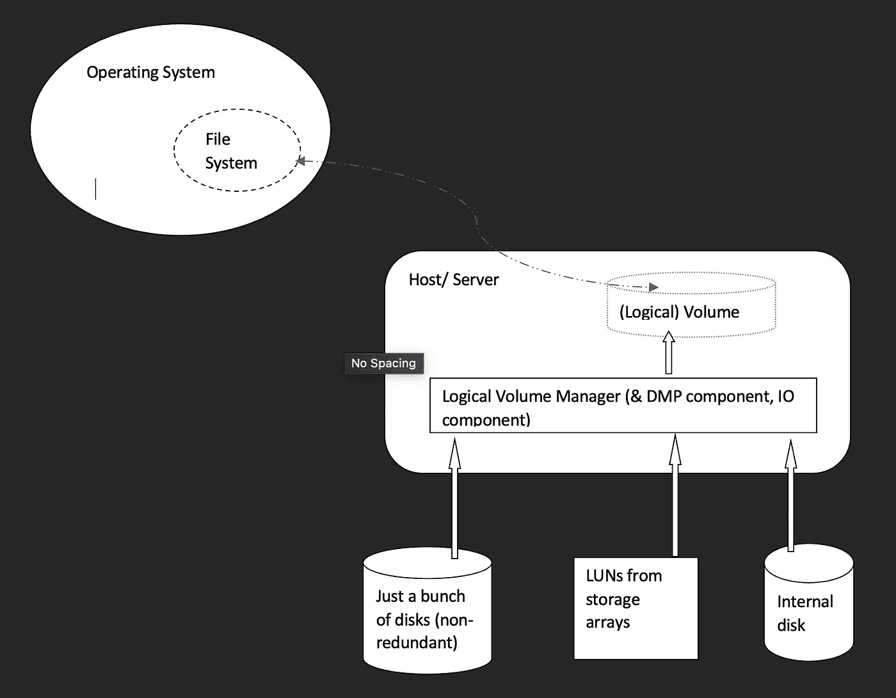
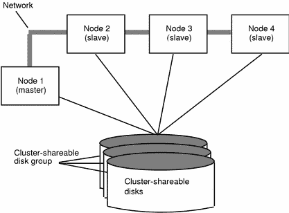
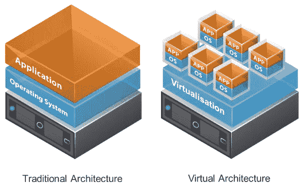
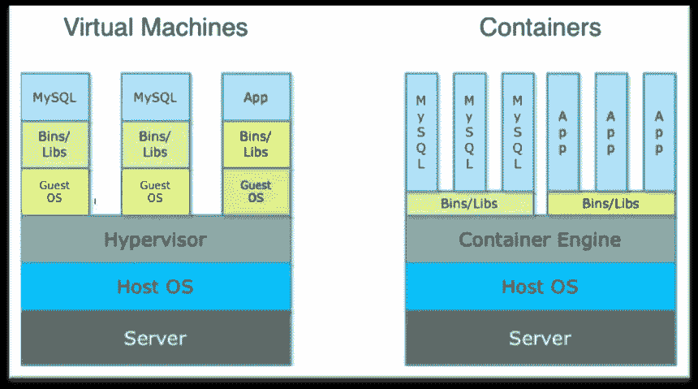

# 过于简化:计算术语

> 原文：<https://blog.devgenius.io/oversimplified-computing-terminologies-f8ab63f5337f?source=collection_archive---------11----------------------->

**文件系统:**它是操作系统的一个模块，其工作是帮助用户存储和读取数据。文件系统在索引的帮助下跟踪非易失性存储器中的空闲空间和数据。当要存储或获取数据时，这些索引很方便。Windows 操作系统的文件系统称为 NTFS(新技术文件系统)。Ubuntu 的文件系统是 ext4(默认)。

**集群文件系统:**普通文件系统是为单台计算机试图访问存储的用例而构建的。文件系统会将用户导向数据或释放内存。但是，如果存储在多台服务器或计算机之间共享呢？

两台计算机之间的共享存储

那么文件系统应该足够智能以允许对存储的多重访问。集群文件系统知道哪个服务器要执行读取，哪个服务器要执行写入。多路访问有助于提高性能。集群文件系统或共享磁盘文件系统也称为 SAN 文件系统。传统的文件系统不能用于共享磁盘，因为它们不提供并发控制。如果做不到这一点(提供并发控制)，就会导致同时修改相同的数据，从而导致数据损坏和丢失。集群文件系统的一个例子是 Veritas 文件系统。

**分区:**是硬盘的一个(逻辑)区。分区使我们能够在同一个硬盘上存储不同的文件系统(也就是操作系统)。(让我们假设下图代表一个 100 千兆字节大小的硬盘)

100 GB 大小的硬盘

**卷:**数据不能存储在原始分区本身。原始分区不足以存储数据。分区被格式化，文件系统被安装在分区的顶部，它成为卷。数据通常存储在卷中(如下所示)。下图显示了硬盘的两个卷。

"同一硬盘的不同卷"

**卷管理器:**在企业级应用程序中，有时来自“不同硬盘”的卷被组合在一起，以创建更大的卷来实现可伸缩性。该任务由卷管理器执行。卷管理器的任务或工作是创建虚拟/逻辑卷。文件系统稍后将使用这些卷来存储数据。简而言之，卷管理器向文件系统提供空间(卷)来存储数据。(卷管理器也用于分配存储容量)。卷管理器可以将硬盘、存储器或 LUN 上的分区组合起来，创建称为卷的虚拟分区。

卷管理器使用“单一服务器”从异构存储中创建卷

文件系统使用卷管理器创建的卷来存储数据

**集群卷管理器:**传统卷管理器非常适合这种使用情况:异构存储连接到“单个节点”或计算机，卷将从中提取。但是，如果多个节点或计算机连接到共享存储(磁盘、LUN、云)并且要绘制卷，该怎么办呢？

连接到共享存储器的多台计算机

在这种情况下，群集的节点在创建卷时必须相互同步。普通的卷管理器不会削减它。因此，使用了像 Veritas volume manager 这样的集群卷管理器(CVM)。CVM 共享存储元数据到每个节点，以便在创建卷时数据不会损坏或丢失。

**文件级存储:**日常生活中使用的分级存储。数据存储在文件夹和随后的子文件夹中(如 windows 和 ubuntu)。每个文件都可以通过“/home/Abhijeet/hello_world.py”路径找到。因此，在文件存储中导航很快。网络连接存储(NAS)的理想选择。所有文件都存储在一个环境或操作系统中。

**块级存储:**要存储的数据被分割成块或块。这些块可以存储在不同的环境(操作系统)中。一部分进入 windows，另一部分进入 Ubuntu 等等。存储区域网络(SAN)的理想选择。每个数据块都独立存在，并且可以进行分区，因此可以在不同的操作系统中访问，这为用户提供了配置数据的完全自由。

**RAID** :代表独立磁盘冗余阵列，是一种用于在硬盘中存储数据的技术。

**RAID 0:** 假设您有两个硬盘(磁盘 1 和磁盘 2)。那么你的数据将被存储在片段中。一些碎片进入磁盘 1，一些碎片进入磁盘 2。或者简单地说，总数据量的一半存储在一个硬盘上，另一半存储在另一个硬盘上。这可能会加快存储的读写操作。它将数据置于风险之中。即使其中一个磁盘丢失，整个数据也会损坏和丢失。

**RAID 1** :数据存储(镜像)在两个磁盘上。即使其中一个磁盘出现故障，备份也随时准备就绪。当 RAID 1 和 RAID 0 结合使用时，就产生了 RAID 10。

> **虚拟化和容器化**

虚拟机和容器在理论上是相似的，因为它们都提供了一个在服务器上开发和托管应用程序的隔离环境。——(吐温·泰勒在 techgenix.com 的博客中写道)

虚拟化就像在大型服务器上繁殖小型(虚拟)计算机。较大的服务器可能有太多的 RAM、存储和计算资源。但是，虚拟机的创建成本很高，而且很难维护(消耗大型服务器的大量 CPU 和内存资源)。虚拟机需要根据它将托管的应用程序(在服务器上)进行配置，并且需要单独的操作系统来运行，这带来了很多麻烦。

虚拟化就像在大型计算机上繁殖小型计算机

集装箱或集装箱化简化了这项工作。容器是共享操作系统的轻量级组件。容器消耗的资源更少，因为它们只虚拟化托管的应用程序，而不是整个操作系统。因为可以在服务器上创建许多容器(不像虚拟机)。容器成为基于微服务的应用的理想选择。

虚拟化与容器化:虚拟机上有 3 个来宾操作系统，容器中只有 1 个操作系统运行 3 个应用程序

最终，容器做虚拟机做的事情，但具有可伸缩性和灵活性。