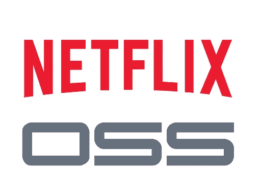
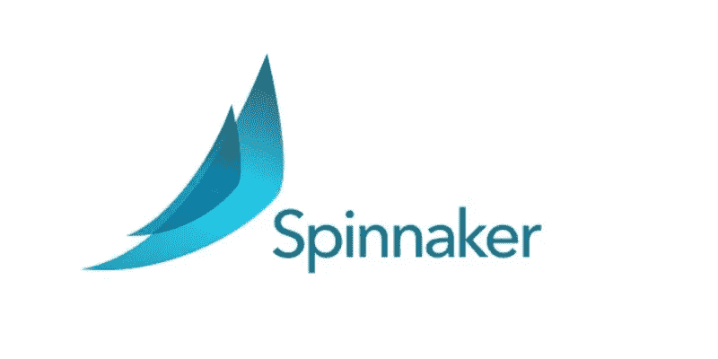
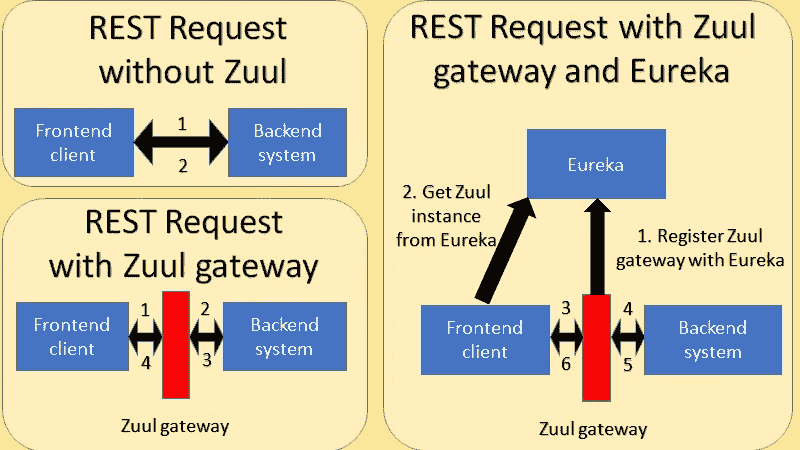

# 开发微服务应用的网飞开源软件中心概述

> 原文：<https://blog.devgenius.io/overview-of-netflix-open-source-software-centre-for-developing-microservices-applications-e248918ada61?source=collection_archive---------2----------------------->

在这篇文章中，我们来谈谈网飞，它以最大的在线流媒体平台而闻名。自 1997 年成立以来，它在过去 23 年中发展迅速，仅在 2019 年就实现了 201.56 亿美元的收入，付费会员数为 1.671 亿，全球员工 8600 人。它还提高了《财富》500 强的排名，2019 年排名第 197 位，比上一年提高了 64 位。

但是在这篇文章中，我们不会谈论网飞如何提高排名，如何成为最受欢迎的在线流媒体平台，以及如何每年发布新的剧集。这篇文章是关于网飞对开源环境的贡献。

当网飞第一次被创建时，它在一个单一的架构中创建它的应用程序。后来，当它呈指数级增长时，它必须满足指数级增长、可扩展性、效率和性能的要求。为此，它将其架构转移到微服务架构框架中。在这样做的过程中，它发布了开源项目并为开源社区做出了贡献。下文讨论了其中一些项目。

该图显示了每年会员总数的指数增长。数据来源(【https://en.wikipedia.org/wiki/Netflix】T2

# 开源软件:

> 开放源代码软件是一种计算机软件，其中源代码在许可证下发布，版权所有者授予用户使用、研究、更改和向任何人出于任何目的分发软件的权利。——[维基百科](https://en.wikipedia.org/wiki/Open-source_software)。

换句话说，开源软件是免费使用的，它的源代码可以根据你的需要进行任何修改或修正。网飞在从单一应用向微服务过渡的过程中，也开发了开源软件来创建微服务应用。任何想为自己的企业创建微服务应用的人都可以使用这些软件。

# 构建和交付工具:

## 网飞星云

Nebula 是网飞的一个开源项目。星云是一个 gradle 项目集合，最初是为在网飞工作的工程师建造的。这个项目背后的想法是消除 gradle 构建文件中样板文件的需要，以减少开发人员的认知负荷，使他们能够专注于编写代码。在构建 Nebula 时，网飞的工程师意识到这些任务是行业的共同需求，所以他们将 Nebula 开源。在 Nebula 之前，网飞的团队使用基于 Ant 和 Ivy 的解决方案，称为 CBF(通用构建框架)。你可以从他们的[官网](http://nebula-plugins.github.io/)了解更多关于星云的信息。

## 三角帆:

Spinnaker 是一个用于多云连续交付平台的开源软件，用于以高速度和信心发布软件变更。Spinnaker 由数百个团队在数百万次部署中进行了测试，事实证明它非常成功，几乎所有主要的云平台都支持它，如 AWS、Google cloud、Oracle cloud、Kubernetes、Microsoft Azure 和 Cloud Foundry。它是成功的开源部署工具之一。查看他们的[官网](https://spinnaker.io/)。

# 公共运行时服务和库

这些项目是支持微服务的运行时容器、库和服务。他们包括像尤里卡，丝带，祖尔和阿歇斯。

## 网飞尤里卡:

网飞尤里卡是微服务最常出现的问题的解决方案，它维护所有需要被应用程序使用的微服务的列表，并在单个存储库中维护它们。网飞尤里卡是一个发现平台，作为一个客户端服务器应用程序。Eureka server 本身就是一个微服务，它的主要作用是注册应用程序需要使用的所有服务。Eureka client 是独立的微服务，将注册到服务器进行发现。这里的[教程](https://dzone.com/articles/netflix-eureka-discovery-microservice)展示了如何使用 spring boot 实现这一点。Eureka 也有助于负载平衡。

## 网飞·祖尔:

网飞 Zuul 是来自前端设备(如移动设备或 web 应用程序)的所有请求的入口点。它作为后端系统的网关，包含对您想要访问的所有微服务的访问。它还有助于管理系统中的路由规则、过滤器和负载平衡。下图直观地展示了 Zuul 和 Eureka 是如何协同工作的。

查看完整教程:[https://www . javainuse . com/spring/spring-cloud-网飞-zuul-tutorial](https://www.javainuse.com/spring/spring-cloud-netflix-zuul-tutorial)

## 网飞丝带:

Ribbon 是一个进程间通信(远程过程调用)库，内置了软件负载平衡器。主要的使用模式包括 REST 调用，支持各种序列化方案。Zuul 需要 Ribbon 来实现负载平衡器。当我们实现 Zuul 时，Ribbon 就作为 Zuul 进程间通信的一部分被集成了

## 网飞·阿歇斯:

网飞 Archaius 是一个开源的配置管理库，用于从许多不同的来源收集配置属性，提供快速、线程安全的访问。Archiaus 最大的优点是它允许属性在运行时动态改变，而无需重启应用程序。在网飞科技博客上阅读更多关于 Archaius 的信息。

 [## 宣布 Archaius

### 云中的动态属性

netflixtechblog.com](https://netflixtechblog.com/announcing-archaius-dynamic-properties-in-the-cloud-bc8c51faf675) 

# 网飞的其他开源软件:

这些只是网飞帮助开发、部署和配置微服务应用的几个开源项目。网飞正在从事 50 多个项目，这些项目得到了企业、第三方供应商和其他开源贡献者的高度认可。网飞将这些项目分类如下:

1.  **大数据:**充分利用(大)数据的工具和服务
2.  **内容编码:**自动化可扩展多媒体摄取和编码
3.  **数据持久化:**在云端存储和服务数据。
4.  **洞察力、可靠性和性能:**提供大规模可操作的洞察力
5.  **安全性:**规模化防御
6.  **用户界面:**帮助您构建富客户端应用程序的库

你可以通过下面的链接查看网飞的所有开源项目。

 [## 网飞开源

### 云平台是网飞大部分服务的基础和技术堆栈。云…

netflix.github.io](https://netflix.github.io/) 

如果你是一个开源贡献者，想了解更多关于他们的源代码，这里有网飞 github 简介的参考。

 [## 网飞公司。

### GitHub 是超过 5000 万开发者共同工作的家园。加入他们，发展您自己的开发团队，管理…

github.com](https://github.com/Netflix) 

# 结论:

写这篇文章的想法是强调网飞在软件开发的不同方面所做的开源贡献，包括前端、后端和中间层开发。焦点主要集中在开发微服务的开源软件上，这样如果有人想实现微服务应用，他们就可以利用这些开源项目/库。

快乐阅读