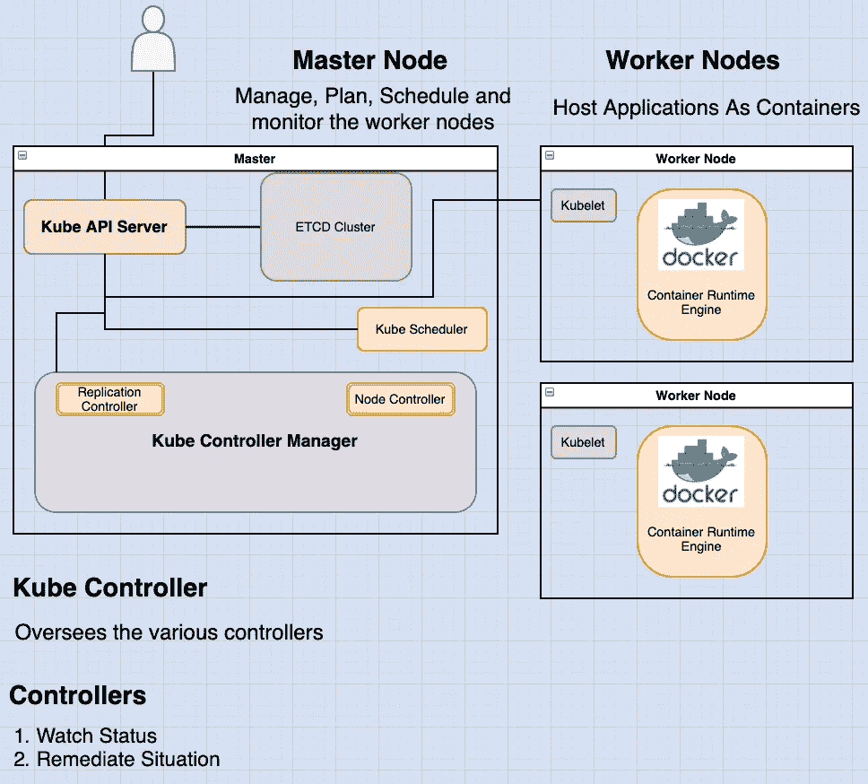
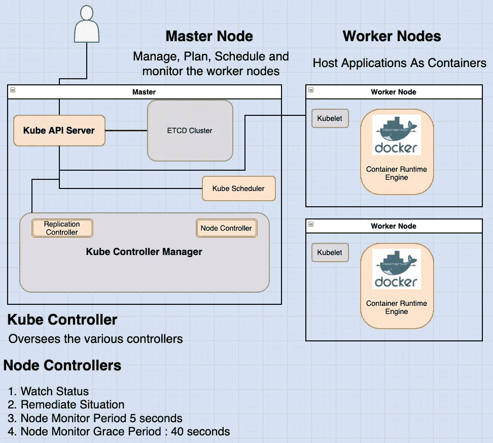
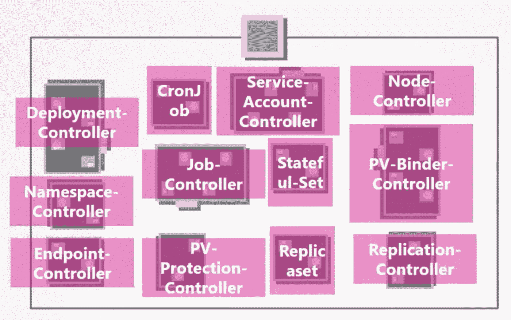

# Kubernetes 中的 Kube 控制器管理器概述

> 原文：<https://blog.devgenius.io/overview-of-the-kube-controller-manager-in-kubernetes-2628b5576540?source=collection_archive---------11----------------------->

读完这篇文章后，你会有:

*   理解 Kube 管理员的职责。

如果你想从这篇文章中得到最大的收获，我强烈推荐我的文章，这篇文章简要概述了 kubernetes 架构。[链接此处](https://medium.com/dev-genius/the-kubernetes-cluster-architecture-simplified-3c4a5fb41449)。

作为初学者，理解 kubernetes 架构可能会令人望而生畏。为了简化，我将使用船只的类比来解释 Kubernetes 的架构。


在这个例子中，我们有两种船:

1.  **货船**:从事将集装箱运送到海上的实际工作。
2.  **控制船**:负责监控和管理货船。

Kubernetes 集群由一组节点组成，这些节点可以是物理的、虚拟的、本地的或云上的，以容器的形式托管应用程序。在这个类比中，这些与**货船**相关。

另一方面，控制船拥有不同的办公室和部门、监控设备、通信设备、用于在船之间移动集装箱的起重机等。**控制船**与 kubernetes 集群中的**主节点**相关，它负责管理集群。控制船完成的任务包括:

*   **存储关于不同节点的**信息。
*   **计划**哪些集装箱去哪里。
*   **监控**节点以及其上的容器。

您可能已经猜到了，kube 控制器管理器是**控制船**中的一个“部门”，也就是说，它帮助管理整个集群。

kube 管理员管理 Kubernetes 的各种管理员。

提醒一下，管制员也是船长船上的一个办公室或部门，有它自己的一套职责。这种船舶办公室将负责:

1.  持续监视货船的状况。
2.  采取必要措施补救不利情况。



用 kubernetes 的话来说:

**控制器**是一个持续监控系统内各种组件状态的过程，致力于使整个系统达到所需的运行状态。

# 控制器的第一个例子:节点控制器

节点控制器负责监控节点的状态，并采取必要的措施来保持应用程序的运行。

它通过 **kube-api** 服务器来完成这项工作。

节点控制器每 5 秒检查一次节点的状态。通过这种方式，它可以监控节点的健康状况。

如果节点控制器停止接收来自某个节点的心跳信号，它将被标记为不可达，但它会等待 40 秒后再将其标记为不可达。

在一个节点被标记为不可达后，它会给它五分钟的时间来恢复，如果不可达，它会删除分配给该节点的 pod，并将它们配置到健康的 pod 上。



# 控制器的第二个例子:复制控制器

**复制控制器**负责监控**副本集**的状态，并确保所需数量的**容器**在副本集内始终可用。

如果一个 **POD** 死亡，则**复制控制器**会创建另一个。

这只是控制器的两个例子。

【kubernetes 中还有更多这样的控制器。

无论您在 kubernetes 中熟悉什么概念，例如:

*   部署
*   服务
*   名称空间
*   持久卷

无论在这些结构中构建什么样的智能，都是通过这些不同的控制器来实现的。



可以想象，这些控制器可以被看作是 kubernetes 中许多事物背后的“大脑”。

# **您如何看待这些控制器，它们在您的集群中位于何处？**

它们都被打包到一个称为 kubernetes 控制器管理器的单一进程中。

当您安装 kubernetes 控制器管理器时，也会安装不同的控制器。

**如何安装和查看 kubernetes 控制器管理器？**

从 kubernetes 发布页面下载 kube 控制器管理器。提取它并将其作为服务运行:

```
wget [https://storage.googleapis.com/kubernetes-release/release/v1.13.0/bin/linux/amd64/kube-controller-manager](https://storage.googleapis.com/kubernetes-release/release/v1.13.0/bin/linux/amd64/kube-controller-manager)kube-controller-manager.service
```

当您运行它时，您可以看到提供了一个选项列表。在这里您可以提供额外的选项来定制您的控制器。

请记住，我们之前讨论的节点控制器的一些默认设置，如节点监控周期、宽限期和驱逐超时。这些作为选项放在这里。

```
--node-monitor-period=5s
--node-monitor-grace-period=40s
--pod-eviction-timeout=5m0s
```

有一个称为控制器的附加选项，您可以使用它来指定要启用哪些控制器:

```
--controllers
```

默认情况下，所有这些都是启用的，但您可以选择启用少数几个。

因此，如果你的任何控制器似乎不工作或不存在，这将是一个很好的起点看看。

**如何看待 Kube-controller-manager 服务器选项？**

这取决于您如何设置集群。

如果使用 **kubeadm** 工具进行设置， **kubeadm** 将 kube-controller-manager 部署为主节点上 kube-system 名称空间中的一个 pod。

```
kubectl get pods -n kube-system
```

您可以在位于以下位置的 pod 定义文件中看到这些选项:

```
cat /etc/kubernetes/manifests/kube-controller-manager.yaml
```

在**非 kubeadm** 设置中，您可以通过查看位于服务目录的 kube-controller-manager 服务来检查选项。

```
cat /etc/kubernetes/system/kube-controller-manager.service
```

您还可以通过在主节点上列出流程并搜索 kube-controller-manager 来查看正在运行的流程和有效选项:

```
ps -aux | grep kube-controller-manager
```

感谢关注，如果你想了解更多关于 kubernetes 的信息，可以看看我的其他帖子。

*原载于* [*我的博客*](https://luispreciado.blog/posts/kubernetes/core-concepts/kube-controller-manager) 。