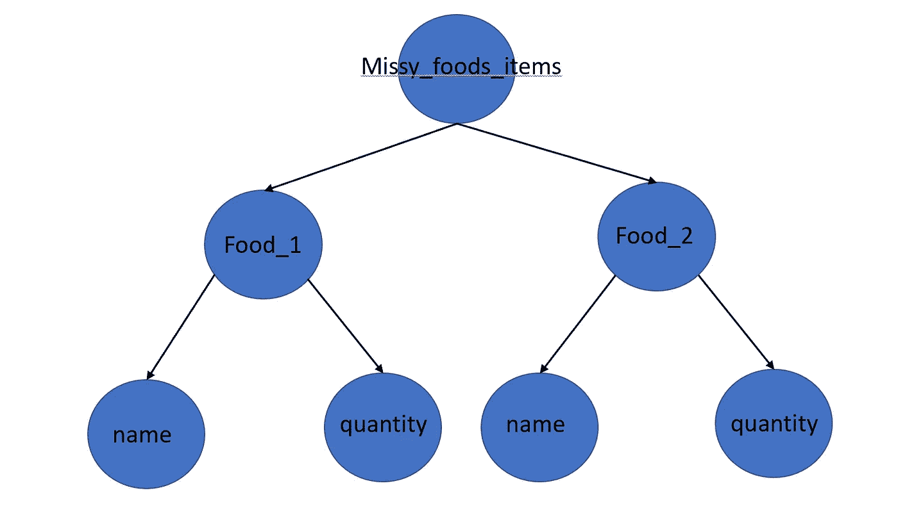
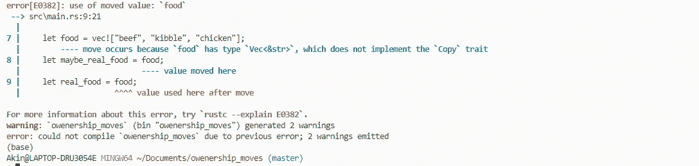

# Rust 中的内存管理—第 1 部分:所有权和移动

> 原文：<https://blog.devgenius.io/ownership-and-moves-in-rust-4a9c6f02108d?source=collection_archive---------3----------------------->

## Rust 中的内存管理介绍

不要担心；我并不是想向你推销最新的 Titok 舞或者拥有一栋房子的好处或不便之处等等。我们将回顾编程语言 Rust 中的概念**所有权**和**移动**。

在我 2022 年的第一篇文章之一， [*你为什么学锈！*](https://anismousse.medium.com/why-you-should-learn-rust-fa52d0139b85) 我提到过 Rust 最吸引人的一个特点就是它的**安全性**。我们将深入我们最喜欢的编程语言的安全方面，并试图理解内存是如何管理的。

# 内存管理

编程语言通常由它们如何处理内存管理来定义。

***在完美的世界里，一个编程语言应该能够随意分配内存，同时保证指向一个已经被释放的对象的指针(悬空指针)不能被使用。***

但是我们并不是生活在一个完美的世界中，所以一些编程语言如 Python 或 Java 选择将移除悬空指针的责任委托给一个**垃圾收集器；**还有，其他的，比如 C 或 C++，简单来说(🤣)**让你负责释放内存**。

Rust 通过**限制**如何在程序中使用指针采取了不同的方法。**所有权**和**移动**的概念定义了那些限制。

# 所有权

所有权的概念是由编译时检查(Cargo)强制实施的 Rust 的核心概念，可以用下面的内容来描述: ***每个值都有一个确定其生存期的唯一所有者*** 。 ***当拥有者被释放时，拥有的价值也被释放。***

简单来说，变量拥有它的值，变量被丢弃，值也随之被丢弃。

可变所有权示例

为了跟踪所有权关系，Rust 保留了一些 ***树*** ，其中所有者是父代，拥有的值是子代，每棵树的最终父代是一个变量。

当一个变量被删除时(例如，超出范围)，Rust 会将它从所有权树中删除，确保该变量及其所有拥有的值都被有效地删除。

下面是另一个例子，它直观地展示了相关的 Rust 树:

可变所有权的另一个例子

Rust 的树可视化表示

因此，对于这个例子，当`missy_foods_items`超出范围时，Rust 将丢弃其树中的所有元素。

这个概念相对简单，但也很有限制性。例如，当我们从现有的价值中创造新的价值时会发生什么？

下面就来拯救一下 ***招式*** 。

# 移动

Rust 中的**移动**概念为所有权角色提供了灵活性。

对于大多数类型，赋值、传递或返回值不会复制它，而是由**移动**它。

***初始源将其值所有权让给目标，从而变得未初始化。目标源现在完全拥有该价值并决定其寿命。***

是的，Rust 中的**赋值**概念可能有点混乱。

Rust 中的赋值操作是廉价的，因为我们将值移动到一个新的所有者之下，并且未初始化前一个所有者(类似于 python shallow copy，注意，由于有了 **one owner** 规则，我们不需要记录所有引用)。

Rust 中的失败赋值

上面的示例代码生成以下编译错误:

分配失败后的货物输出

让我们详细看看为什么我们会有这个错误。

首先，创建一个包含 Missy 最喜欢的食物项目的向量，并归宏`vec!`所有。然后，这个宏将放弃它对向量的所有权，转而支持变量`food`，并且不初始化它自己。

按照类似的赋值逻辑，在示例代码的第 3 行，变量`food`也将放弃其对 vector 的所有权，转而支持变量`maybe_real_food`并取消其自身的初始化。

最后，在第 4 行，当我们试图给变量`real_food`赋值`food`时，cargo 表达了它的不满，因为在这个阶段`food`是未定义的(它的值已经被移到变量`maybe_real_food`)。

在 Rust 中，我们需要明确我们的意图。如果我们的目标是在 C++中有一个类似的赋值操作(深度拷贝的执行取决于所涉及的值)，我们必须更加精确:

深层拷贝赋值

正如我们前面提到的，一个 ***move*** 保持其源未初始化，这对于一个特定类型的引用可能是有问题的，比如一个 vector。

向量元素提取失败

但是，Rust 为这个问题提供了不同的解决方案，包括方法`std::mm::replace`允许您从向量中提取一个值并用不同的值替换它。

成功提取向量元素

# 更多的灵活性:复制类型和 Rc 和 Arc 指针

如果您之前没有注意到，在我的所有例子中，在构建我的 vector 时，我们调用方法`to_string`来获得一个由`String`对象组成的 vector，这些对象是分配在内存堆部分的复杂结构。

这很重要，因为除了 ***复制类型*** 之外，大多数类型都可以移动，复制类型包括整型、浮点型、字符型和布尔型。赋值操作继续复制值，而不是移动它。

最后，Rust 还引入了 **Rc** 和 **Arc** 指针，引用计数器指针提供了支持多重所有权的灵活性(更多关于 [Arc](https://doc.rust-lang.org/std/sync/struct.Arc.html) 和 [Rc](https://doc.rust-lang.org/stable/std/rc/struct.Rc.html) )，类似于 python。

# 最后

理解所有权和移动概念是理解 Rust 本身的基础，因为它们定义了它的核心原则。

可以想象，Rust 是一种严格按值传递的编程语言。

它很容易跟踪变量和值之间的关系(**所有权**)，同时通过**移动、复制类型、Rc/Arc 指针和引用借用**(我下一篇文章的主题)的概念提供灵活性，以在保证安全的同时产生足够的解决方案。

> “安全的代码允许你冒更大的风险”(艾米丽·邓纳姆)

铁锈明显的坚硬是它如此强大的原因。

在对我表演了一个 Rust 的动作后，Missy 声称拥有我在沙发上的位置。

一如既往，欢迎一切反馈；👋,👍欢迎光临！！

另外，如果你像我一样喜欢 Rust，并且有兴趣建立一个 meetup 群组，请告诉我！！下面是我的[推特](https://twitter.com/home?lang=en):

## 其他资源:

*生锈*:https://www.rust-lang.org/learO'·雷利*还好*:[https://doc.rust-lang.org/book/](https://doc.rust-lang.org/book/)

*与奥莱利的 Rust 速成班*:[https://learning . oreilly . com/videos/ultimate-Rust-crash/9781800563902/](https://learning.oreilly.com/videos/ultimate-rust-crash/9781800563902/)

*Rust 的温柔介绍:*[https://Steve Donovan . github . io/Rust-gentle-intro/readme . html](https://stevedonovan.github.io/rust-gentle-intro/readme.html)