# P5.js 动画中 131 个字符的代码讲解

> 原文：<https://blog.devgenius.io/p5-js-animation-in-131-characters-of-code-explained-37cd8e1bb996?source=collection_archive---------0----------------------->

## 这个用不到 140 个字符的代码编写的动画实际上是如何工作的？

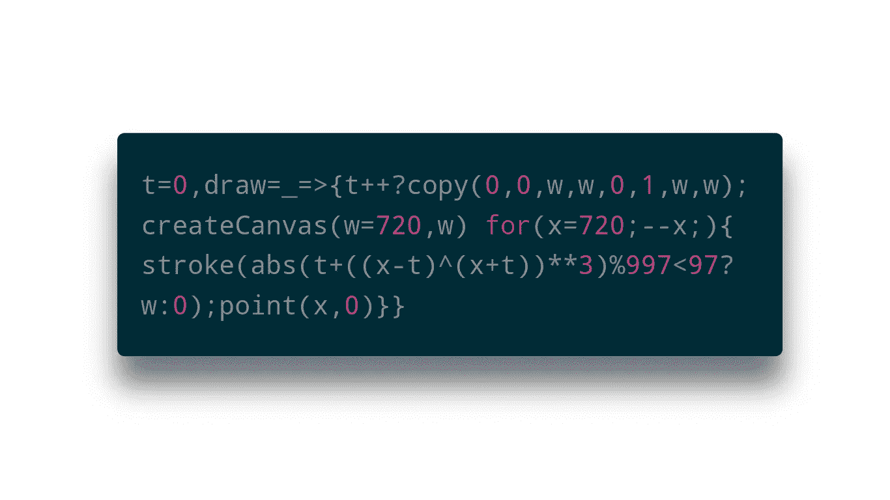

有一条来自 Naoki Tsutae 的推文，其中有一些好看的图形和一些看起来相当神秘的代码。

[https://twitter.com/ntsutae/status/1268820823952916486](https://twitter.com/ntsutae/status/1268820823952916486)

这些图像来自 Noaki 在 OpenProcessing 上创作的草图:

实现这一切的代码是这样的:

t=0，draw=_=>{t++？copy(0，0，w，w，0，1，w，w):createCanvas(w=720，w)for(x = 720；—x；){ stroke(abs(t+((x-t)^(x+t))**3)%997<97?w:0);point(x,0)}}

That's just **131 人物**。挺神奇的！

# 那么它是如何工作的呢？

正如所料(因为这是相当简洁和复杂的代码)，并不是每个人都理解这些代码是如何工作的。

作者不太倾向于解释:

由于我喜欢拼图、图形和教学，我想它可能试图解释我自己正在发生的事情。

# 解开代码

在我们了解这是如何工作的之前，我们需要使代码更具可读性。你看，代码使用了一些技巧和速记符号来去掉多余的字节。

把事情摊开让我们对正在发生的事情有更多的了解:

让这段代码如此简洁的原因也是让它更难阅读的原因。

1.  几乎不使用任何变量。其实只有**三个**。更糟糕的是，`t`、`w`和`x`并不是真正的描述性名字。
2.  使用了[三元运算符](https://developer.mozilla.org/en-US/docs/Web/JavaScript/Reference/Operators/Conditional_Operator)。它是这样工作的:`condition ? expresionIfTrue : expresionIfFalse`。这是对更冗长(通常更易读)`if`和`else`语句的一种简化替代。

如果我们进一步解包代码并重命名一些变量，它看起来像这样:

这段代码具有完全相同的功能。这本身就应该让你知道把所有这些都折叠成这么几个字符是多么的巧妙。

然而，详细版本应该更容易看到发生了什么。让我们更详细地浏览一下…

# 开始吧

首先发生的事情很容易。

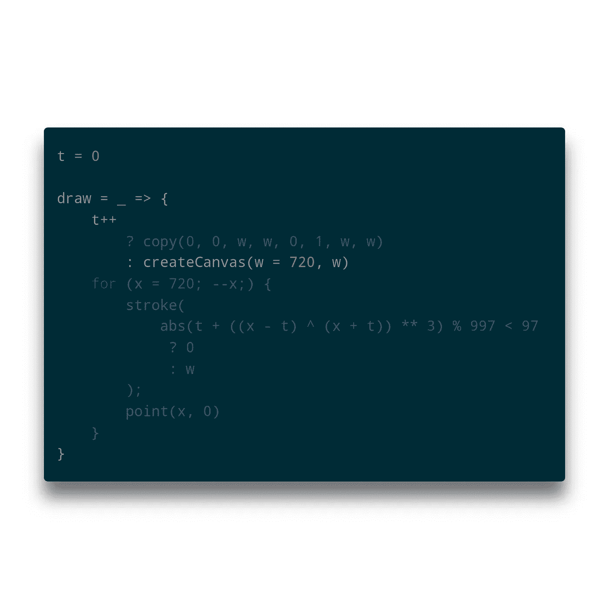

*   计数器`t`被声明。
*   创建了`[draw](https://p5js.org/reference/#/p5/draw)()`功能。这是[P5 . js](https://p5js.org/)(open processing 用来画草图的库)使用的特殊函数。它在一个连续的循环中被调用(除非`[noloop](https://p5js.org/reference/#/p5/noloop)()`被调用)。
*   计数器递增。每次在 P5.js 提供的循环中调用`draw()`时都会发生这种情况
*   定义了设置画布宽度的变量`w`。
*   画布被创建。

这里的技巧是在 `t`递增之前，`t`的值用于决定三元运算符*的结果。这确保画布只被创建一次。(因为`t`仅在第一次调用`draw()`时等于零)。*

将此代码与详细代码进行比较，结果如下所示:

这里`createCanvas()`被放在了`[setup](https://p5js.org/reference/#/p5/setup)()`中，这也是 P5.js 定义的一个特殊函数。为了设置好一切，它只被调用一次。

# 画一条线

接下来发生的事情是绘制一行(或一条线)。

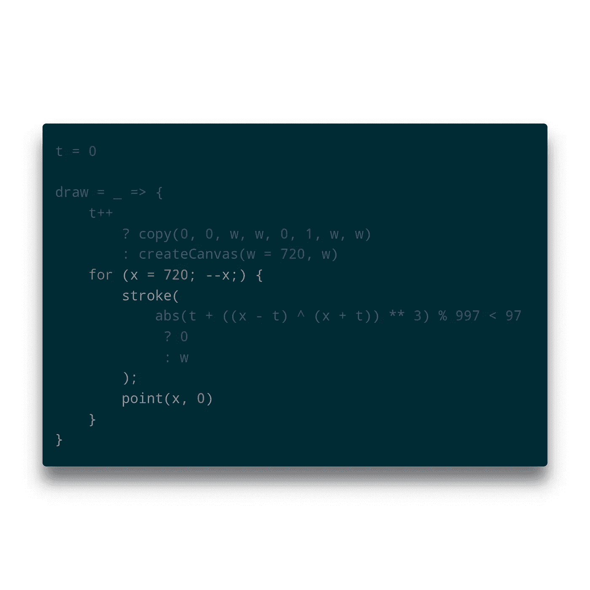

使用`[point](https://p5js.org/reference/#/p5/point)()`功能一次绘制一个像素。`[stroke](https://p5js.org/reference/#/p5/stroke)()`功能决定了圆点的颜色。

每个点都绘制在`for`循环中。`point()`功能在给定的 X 和 Y 坐标上绘制一个点。由于只画了*一条*线，所以 Y 始终为零。X 从图像的右侧开始，这里 X 等于图像宽度。然后，随着`for`循环的每一次迭代，它都向右移动(因为每次迭代 X 都减一)。

这一直持续到 X 为零。

这是这里使用的一个小技巧…省略了 `[for](https://developer.mozilla.org/en-US/docs/Web/JavaScript/Reference/Statements/for)` [循环](https://developer.mozilla.org/en-US/docs/Web/JavaScript/Reference/Statements/for)的[最终表达式。](https://developer.mozilla.org/en-US/docs/Web/JavaScript/Reference/Statements/for)

将它添加到我们更详细的代码版本中会得到:

那么笔画(颜色)是怎么计算的呢？

# 第一个魔术

首先要明白的是，颜色永远不是黑就是白。这是因为传递给`stroke()`的值总是`0`或`720`(`w`的值)。零值被解释为黑色，任何大于 255 的值被解释为白色。

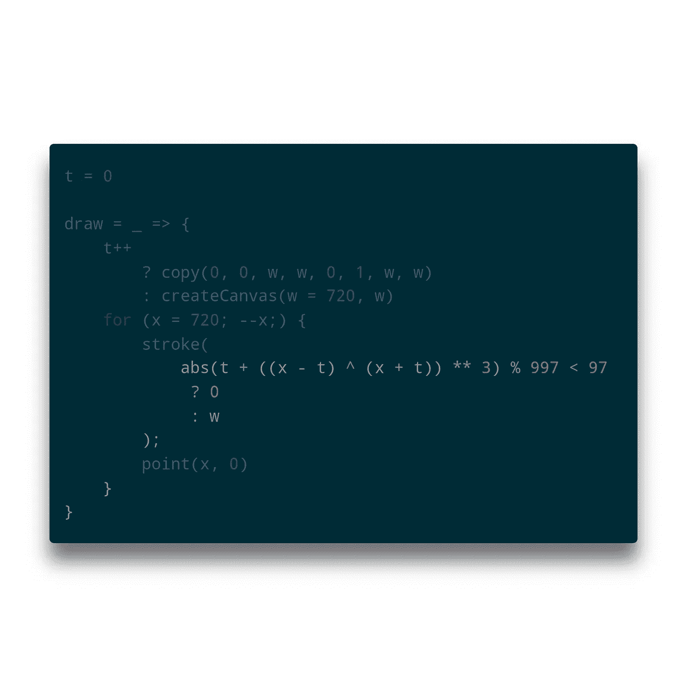

这里事情变得有点复杂。这是大多数人会觉得难以理解的部分，因为它需要牢固的数学知识，尤其是代数。

决定选择哪种颜色的逻辑使用:

*   按位[异或运算器](https://developer.mozilla.org/en-US/docs/Web/JavaScript/Reference/Operators/Bitwise_Operators#Bitwise_XOR) : `^`仅在一个输入为`true`而另一个为`false`时输出`true`(称为[异或](https://en.wikipedia.org/wiki/Exclusive_or))
*   [取幂运算符](https://developer.mozilla.org/en-US/docs/Web/JavaScript/Reference/Operators/Arithmetic_Operators#Exponentiation) `**`提供[取幂运算](https://en.wikipedia.org/wiki/Exponentiation)(重复乘法)，同`Math.pow()`
*   `[Math.abs()](https://developer.mozilla.org/en-US/docs/Web/JavaScript/Reference/Global_Objects/Math/abs)`(通过`[abs()](https://p5js.org/reference/#/p5/abs)`函数)将始终提供给定整数的[绝对值](https://en.wikipedia.org/wiki/Absolute_value)(即大于零的正数)
*   [余数运算符](https://developer.mozilla.org/en-US/docs/Web/JavaScript/Reference/Operators/Arithmetic_Operators#Remainder) `%`(也称为[模运算](https://en.wikipedia.org/wiki/Modulo_operation)
*   [小于操作员](https://developer.mozilla.org/en-US/docs/Web/JavaScript/Reference/Operators/Comparison_Operators)

为了理解“如何”，我们必须将等式分解成更小的部分。完整的等式如下所示:

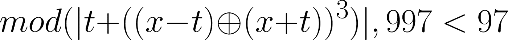

## 异或运算

让我们先取最里面的部分,“异或”。

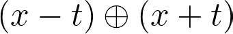

对于图像中的每一行，`x`将在 **0** 和 **720** 之间。`t`将从 **0** 处开始，并不断上升，直到每一个连续的行。因此，随着`t`上升，事情的“负”面将继续下降，而“正”面将继续上升。

那么会发生什么呢？

记住，“异或”是指只有当等式的一边是`true`(或`1`)，另一边是`false`(或`0`)时，结果才会是`true`。不过，需要知道的是，这不适用于整数(比如 720 或 97)，而是适用于它们的二进制表示(比如 1011010000 或 1100001)。例如(用 720 代表`x`，用 97 代表`t`，我们得到 **350** 。

```
(720 - 97) XOR (720 + 97) = (623) XOR (817) = 350
```

怎么会？将十进制转换成二进制，你会看到:

```
 1001101111      623
^ 1100110001    ^ 817
============    =====
  0101011110      350
```

这造成了你在图像中看到的一些随机性，但它也是图像结构的基础。

## 指数运算

接下来发生的事情非常简单。Xor 运算产生的整数的 3 次方为:

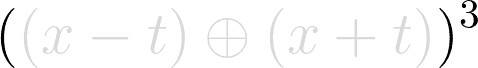

因此，使用上例中的 350，我们可以得到:

```
350 * 350 * 350 = 42875000
```

这是一个相当大的数字！别担心。这就是模的用途。但我们稍后会谈到这一点。首先，一些可能不明显的事情…

当输入是正整数时，没有什么特别的事情发生。结果总是一个正整数。然而，当输入是负数时，奇数指数的结果将是负的，偶数指数的结果将是正的。

请允许我演示:

```
-1^2 =                -1 * -1 =  1
-1^3 =           -1 * -1 * -1 = -1
-1^4 =      -1 * -1 * -1 * -1 =  1
-1^5 = -1 * -1 * -1 * -1 * -1 = -1
```

诸如此类。

因为数字被提升了奇数次(在本例中是 3 次)，所以结果也可能是负数！所以现在你可能已经猜到为什么会有一个`abs()`即将到来。

## 添加

下一部分只是将`t`添加到求幂运算的结果中:


继续我们的例子，T2 是 720，T3 是 97，我们得到:

```
97 + 42875000 = 42875097
```

## 赦免

下一部分是另一个简单的部分。记住(因为指数运算),我们在这一点上可能有一个负数？

下一位为我们解决了这个问题:

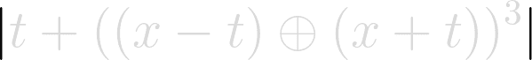

这就是我之前提到的`Math.abs()`。现在我们终于也达到了我之前提到的模。

## 以…为模

我注意到很多人*知道[模](https://en.wikipedia.org/wiki/Modulo_operation)(或“余数”)运算符*，但并不是每个人都知道*叫什么*。

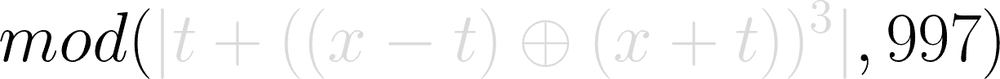

然而，它所做的很简单。它将第一个数字除以第二个数字，并返回余数。所以我们得到:`42875097 % 997 = 109`

如果你想严格要求的话，应该是:

```
42875097 % 997 = 42875097 - (997 * int(42875097 / 997)) = 109
```

只差一个数学步骤了！

## 不到

这里发生的最后一件事是比较。

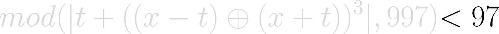

这是最终决定我们在当前行上得到黑色还是白色像素的原因。如果等式的输出小于 97，则结果为黑色(或者准确地说是`0`)，否则为白色(通过`w`的值)。

Pfew。为了得到一个像素，确实需要大量的数学计算，对吗？

如果我们把它作为一个独立的函数放在详细的代码中，它看起来会像这样:

事实上,*包含了太多的数学运算，这就是为什么图像的结构是散列的。现在你可能会想，如果这一切都是为了*仅仅一行*我们到底还要走多远？*

好了，所有的数学难题都解决了，只剩下一行代码需要解释了…

# 创建下一行

一旦画好线，P5.js 提供的循环再次调用`draw()`函数。`t++`发生了，从现在开始，`createCanvas()`将不再被称为。取而代之的是`[copy()](https://p5js.org/reference/#/p5/copy)`的称呼。

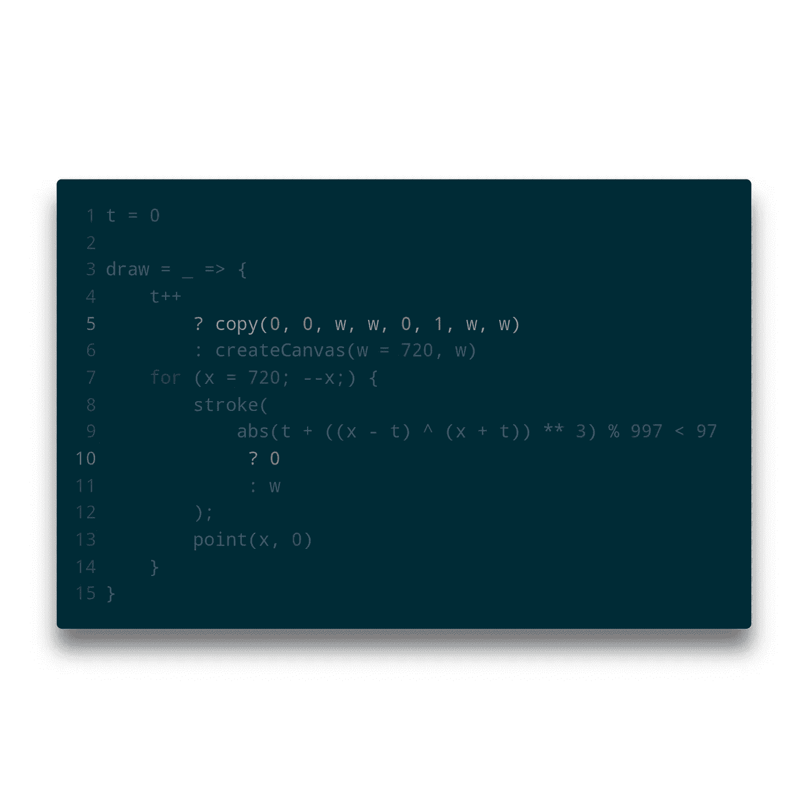

那么 copy 做什么呢？顾名思义，它复制了一些东西。它复制的内容取决于给定的参数:

```
copy(
    sourceX, sourceY, sourceWidth, sourceHeight,
    destinationX, destinationY, destinationWidth, destinationHeight
)
```

你能猜出`copy(0, 0, w, w, 0, 1, w, w)`是做什么的吗？

正如您可能已经猜到的，它从 X 和 Y `0`到 X 和 Y `w`复制整个画布，X 和 Y 等于整个高度和宽度(因为图像是 720 平方)。那么它把它复制到哪里呢？往下一行。

然后在第一行画下一行，循环重复。

这种机制也是产生“滚动”效果的一个巧妙技巧。

# 包扎

现在我们已经一行一行地看了一遍，应该*清楚每件事都做了什么。我错过什么了吗？你对这篇文章有什么问题吗？欢迎你在推特上留言或联系我。*

我很乐意解释！

最后，我想留给您这个稍微修改过的详细代码版本。它在一个`config`对象中包含了所有的变量，所以你可以更容易地使用它:

我用这段代码做了一个关于 OpenProcessing 的草图，所以你可以从中得到一些乐趣！👋

本文中的所有代码示例都是使用 [GitHub Gist](https://gist.github.com/) 或 [Carbon](https://carbon.now.sh/) 创建的。数学方程式是使用 [CodeCog 的方程式编辑器](https://www.codecogs.com/latex/eqneditor.php)创建的。我要感谢 [Naoki Tsutae](https://twitter.com/ntsutae/) 在发表前看了这篇文章，当然还有那些令人敬畏的动画！