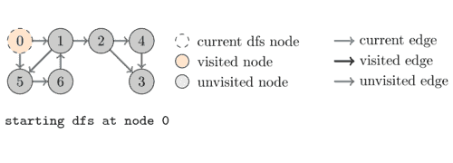

# 打包单词- Python 解决方案

> 原文：<https://blog.devgenius.io/pack-words-on-board-python-solution-8f4e956de84b?source=collection_archive---------10----------------------->

## 回溯、递归、字符串、图形

# 问题

这个问题是 Google 问的。

给你一个 N 乘 M 的随机字母矩阵和一个单词字典。从给定的词典中找出黑板上能容纳的最大单词数。

如果满足以下条件，则认为一个单词可以放在黑板上:

*   它可以在字典里找到
*   它可以由迄今为止在黑板上发现的其他单词的未标记字母构成
*   字母彼此相邻(垂直和水平，而不是对角)。

任何单词只能访问每个图块一次。

例如，给定下面的字典:

```
{ 'eat', 'rain', 'in', 'rat' }
```

和矩阵:

```
[['e', 'a', 'n'],
 ['t', 't', 'i'],
 ['a', 'r', 'a']]
```

你的函数应该返回 3，因为我们可以让单词“吃”、“在”和“老鼠”不互相接触。我们可以选择“吃”和“雨”,但那是不正确的，因为那只有两个词。

# 步骤 1:确定方法

我们遇到了一个问题，我们有多种可能的有效配置。有几个条件，我们想要一个最大化某个目标(在这个例子中是列表的长度)的配置。这应该会让你想起一些事情。当我们遇到这种情况时，我们知道回溯将导致解决方案。

# 第二步:回溯

对于那些不熟悉回溯的人来说，这是一种递归解决问题的算法技术。我们试图逐步构建一个解决方案，一次一个。我们删除在任何时候都不能满足问题约束的解决方案。如果你熟悉进化算法，这是一个相似的原理。


那么我们需要考虑什么呢？首先，我们要检查和挑选信件。解的下一个状态取决于你现在选择的字母。你的最终配置只能通过仔细检查每一个选项才能弄清楚。这意味着我们想要使用深度优先搜索(DFS)。下面是一个很好的寻找循环的 DFS 动画。



# 寻找方向

下一步要弄清楚的是我们如何遍历矩阵来找到我们的单词。记住我们只能挑选相邻的单词。对角线不被认为是相邻的。因此，如果我们的字母在(x，y)，我们可以从索引[(x-1，y)，(x+1，y)，(x，y-1)，(x，y+1)]中选择。我们在代码中使用

```
DIRECTIONS = [
    (1, 0),
    (-1, 0),
    (0, 1),
    (0, -1),
]
```

# 构建我们的 Max Words 函数

为了构建我们的递归解决方案，我们希望跟踪一些不同的事情。我们显然需要我们的董事会和它的尺寸以及允许的单词。我们还需要跟踪我们访问了哪些索引(为了不重复值)，以及我们已经形成的当前单词。一旦我们形成了一个单词，我们会把它添加到我们的单词列表中，所以我们也会跟踪它。当然，我们需要当前所在的行和列的索引。

```
def max_words(board, n, m, words, visited, r, c, curr_word):
```

我们还想尽可能地通过终止来节省时间。有两个无效条件:1)当我们超出界限/到已经访问过的单词时，我们通过这样做来检查:

```
if r < 0 or r >= n or c < 0 or c >= m or visited[r][c]:
        return []
```

以及 2)我们知道当我们的单词字典中没有单词以我们当前的单词开始时，我们命中无效的配置。我们将此编码为:

```
if not any(word.startswith(curr_word) for word in words):
        return [] #this gives our config a score of 0
```

接下来，我们有两个可能的条件:

1.  我们当前所在的单词存在于字典中。在这种情况下，我们将它添加到我们的列表中，并开始寻找新单词。既然我们只关心拥有许多单词而不是更长的单词，我们就应该这样做。
2.  我们还没有形成一个单词。这意味着我们有一个有效单词的词根。所以我们继续构建，直到找到我们要找的词(或者达到终止条件)。

这些案件表现为:

```
if curr_word in words:
        # A valid words has been found: terminate current word search and start a new one
        for r, row in enumerate(board):
            for c, val in enumerate(row):
                curr_word_set = max_words(board, n, m, words, visited, r, c, '')
                if len(curr_word_set) > len(max_word_set):
                    max_word_set = curr_word_set
        max_word_set.append(curr_word)
    else:
        for dr, dc in DIRECTIONS:
            curr_word_set = max_words(board, n, m, words, visited, r + dr, c + dc, curr_word)
            if len(curr_word_set) > len(max_word_set):
                max_word_set = curr_word_set
```

# 把所有的放在一起

现在我们必须把它们放在一起。这就是实践和编程经验有所帮助的地方。注意我们如何整合约束，以及如何初始化值。请注意我们是如何在各自开发的构建模块中工作的。所有这些都来自于练习大量的问题。

对于一个聪明的计划，你可以用它来赢得面试[看看这篇文章](https://medium.com/geekculture/your-plan-for-acing-faang-interviews-20a35fa6be1c)。这包含了学生用来在面试中胜出的经过验证的步骤。

我们最终的解决方案看起来像

```
DIRECTIONS = [
    (1, 0),
    (-1, 0),
    (0, 1),
    (0, -1),
] def max_words(board, n, m, words, visited, r, c, curr_word):
    if r < 0 or r >= n or c < 0 or c >= m or visited[r][c]:
        return [] curr_word += board[r][c]
    # if no words in |words| start with |curr_word|, then return early.
    if not any(word.startswith(curr_word) for word in words):
        return [] visited[r][c] = True max_word_set = []
    if curr_word in words:
        # A valid words has been found: terminate current word search and start a new one
        for r, row in enumerate(board):
            for c, val in enumerate(row):
                curr_word_set = max_words(board, n, m, words, visited, r, c, '')
                if len(curr_word_set) > len(max_word_set):
                    max_word_set = curr_word_set
        max_word_set.append(curr_word)
    else:
        for dr, dc in DIRECTIONS:
            curr_word_set = max_words(board, n, m, words, visited, r + dr, c + dc, curr_word)
            if len(curr_word_set) > len(max_word_set):
                max_word_set = curr_word_set visited[r][c] = False
    return max_word_set def find_max_words(board, words):
    if not board:
        return 0 n, m = len(board), len(board[0])
    visited = [[False for _ in range(m)] for _ in range(n)]
    max_words_so_far = [] for r, row in enumerate(board):
        for c, val in enumerate(row):
            word_set = max_words(board, n, m, words, visited, r, c, '')
            if len(word_set) > len(max_words_so_far):
                max_words_so_far = word_set print(max_words_so_far)
    return len(max_words_so_far)
```

因为这个解决方案沿着所有不同的路径，运行时间是指数级的。

要了解更多此类解决方案，请查看我的时事通讯[技术访谈简化版](https://codinginterviewsmadesimple.substack.com/)。Tech Made Simple 是寻求在技术领域建立惊人职业生涯的人的最佳资源。它将帮助您概念化、构建和优化您的解决方案。**它涵盖了从系统设计、计算机科学概念和 Leetcode 问题解决的技术方面到网络和职业发展的详细指南。通过在一个地方找到您所有的需求，节省您的时间、精力和金钱。 [**使用此处的链接可享受 20%的优惠，优惠期长达一整年**](https://codinginterviewsmadesimple.substack.com/subscribe?coupon=1e0532f2) **。****


我创造了[技术面试，使用通过指导多人进入顶级技术公司而发现的新技术，使面试变得简单。时事通讯旨在帮助你成功，避免你在 Leetcode 上浪费时间。**我有一个 100%满意的政策，所以你可以尝试一下，不会有任何风险。**](https://codinginterviewsmadesimple.substack.com/)**[您可以阅读常见问题解答，并在此了解更多信息](https://codinginterviewsmadesimple.substack.com/p/faqs-and-about-this-newsletter?r=4tnbw&s=w&utm_campaign=post&utm_medium=web)**


如果你也有任何有趣的工作/项目/想法给我，请随时联系我。总是很乐意听你说完。

以下是我的 Venmo 和 Paypal 对我工作的金钱支持。任何数额都值得赞赏，并有很大帮助。捐赠解锁独家内容，如论文分析、特殊代码、咨询和特定辅导:

https://account.venmo.com/u/FNU-Devansh

贝宝:【paypal.me/ISeeThings 

# 向我伸出手

使用下面的链接查看我的其他内容，了解更多关于辅导的信息，或者只是打个招呼。另外，查看免费的罗宾汉推荐链接。我们都得到一个免费的股票(你不用放任何钱)，对你没有任何风险。**所以不使用它只是失去免费的钱。**

查看我在 Medium 上的其他文章。:[https://rb.gy/zn1aiu](https://rb.gy/oaojch)

我的 YouTube:[https://rb.gy/88iwdd](https://rb.gy/88iwdd)

在 LinkedIn 上联系我。我们来连线:[https://rb.gy/m5ok2y](https://rb.gy/f7ltuj)

我的 insta gram:[https://rb.gy/gmvuy9](https://rb.gy/gmvuy9)

我的推特:[https://twitter.com/Machine01776819](https://twitter.com/Machine01776819)

如果你正在准备编码/技术面试:[https://codinginterviewsmadesimple.substack.com/](https://codinginterviewsmadesimple.substack.com/)

获得罗宾汉的免费股票:[https://join.robinhood.com/fnud75](https://join.robinhood.com/fnud75/)