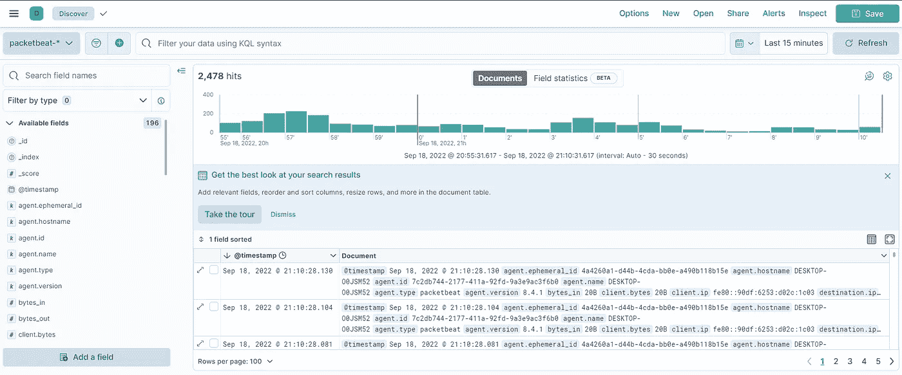
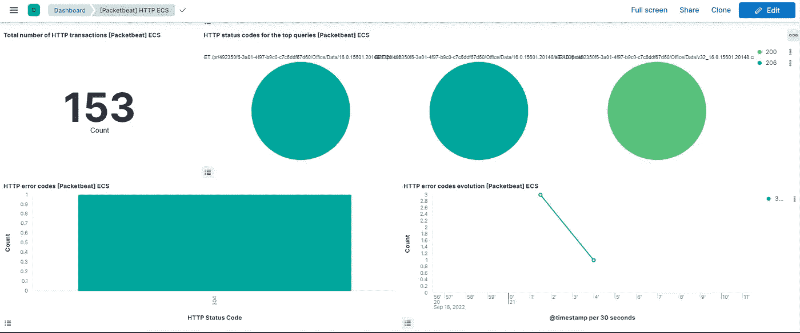

# 带有本地弹性搜索和 Kibana 的打包套餐

> 原文：<https://blog.devgenius.io/packetbeat-with-local-elasticsearch-and-kibana-a7b26448a7cf?source=collection_archive---------8----------------------->


[阿丽娜·格鲁布尼亚](https://unsplash.com/@alinnnaaaa?utm_source=unsplash&utm_medium=referral&utm_content=creditCopyText)在 [Unsplash](https://unsplash.com/s/photos/network?utm_source=unsplash&utm_medium=referral&utm_content=creditCopyText) 上的照片

什么是好人？欢迎回来😁。今天我们通过介绍弹性拍子来继续我们的发现。

**Packetbeat** 是一个轻量级的网络数据发送器，可以与 Elasticsearch 结合使用，提供一个监控和分析应用程序性能的系统。它收集应用服务器之间的网络流量，解码应用层使用的协议(如 *HTTP* 、 *MySQL* 、 *Redis* 等)，匹配请求和响应，并记录每个事务的相关信息。如文档中所述，"*它可以运行在自己的服务器上，也可以运行在应用程序所在的服务器上"*。目前，这些协议由 Packetbeat 支持:

*   域名服务器(Domain Name Server)
*   超文本传送协议
*   一种数据库系统
*   卡桑德拉
*   MongoDB
*   节俭-RPC
*   AMQP
*   坦克激光瞄准镜（Tank Laser-Sight 的缩写）
*   Memcache
*   关系型数据库
*   ICMP (v4 和 v6)
*   雷迪斯
*   DHCP (v4)
*   高级督察/社会发展计划(测试版)
*   网络文件系统

由于 Packetbeat 使您能够监视机器的网络连接，因此了解更多有关源和目标 IP 地址以及发送和接收的数据可能会很有用。

在安装 Packetbeat 之前，确保您有 Elasticsearch 和 Kibana 的本地部署。如果不是这样，我推荐阅读[这篇文章](https://medium.com/@mhdabdel151/elasticsearch-and-kibana-installation-using-docker-compose-886c4823495e)你会发现整个过程。

## 安装和配置

至于本系列中已经涉及的其他 beats，你必须首先进入[官方下载页面](https://www.elastic.co/downloads/beats/packetbeat)才能获得与你的操作系统兼容的最新版本。下载完存档文件后，提取其内容并打开生成的文件夹。您将找到`packetbeat.yml`文件，我们将在其中进行一些配置。

注意:根据你的操作系统，你可能需要安装`libpcap`数据包捕获库。更多详情请参考官方文件的[这一节](https://www.elastic.co/guide/en/beats/packetbeat/current/packetbeat-installation-configuration.html#_before_you_begin)。因为本教程是在 Windows 系统上完成的，所以这一步是不必要的。

以与之前相同的方式:在输出部分填写您的 Elasticsearch 的 URL、您的用户名和密码(*如果您的部署是安全的*)，可能是这样的:

```
output.elasticsearch:   
  hosts: ["http://localhost:9200"]   
  username: "elastic"   
  password: "*TYPE_HERE*"  
  *# If using Elasticsearch's default certificate* ssl:
      enabled: true
      ca_trusted_fingerprint:  "your_fingerprint"
```

*指纹*是第一次启动 Elasticsearch 时生成的 CA 证书的十六进制编码 SHA-256。如果您丢失了它，不要惊慌，您总是可以使用以下命令找回它:

```
openssl x509 -fingerprint -sha256 -in config/certs/http_ca.crt
```

该命令无法在 Windows 终端上运行，您需要下载并安装 [Git](https://git-scm.com/download/win) ，打开 *Git CMD* 并从 Elasticsearch 根文件夹运行该命令。

要添加或修改要监控的协议，请转到`packetbeat.protocols` 部分，输入要监控的协议类型和相关端口，或者首次使用默认配置。

Packetbeat 还附带了一组实用程序来检查配置或连接是否到位。保存配置文件，并从根文件夹中依次运行以下命令:

```
./packetbeat test config
./packetbeat test output
```

此外，要设置**资产**来解析、索引和可视化您的数据，您可以运行以下命令:

```
./packetbeat setup
```

要启动 Packetbeat，只需运行:

```
./packetbeat -e
```

在 Kibana 中，您现在可以通过过滤`packetbeat-*`来查看在 **Discover** 中上传的网络日志。



您还可以在**仪表板**部分找到仪表板。在这里，我们可以检查 http 仪表板，它给出了所有带有状态代码的事务。



今天就到这里，请随意查看关于这个主题的[官方文档](https://www.elastic.co/guide/en/beats/packetbeat/current/packetbeat-installation-configuration.html#packetbeat-installation-configuration)了解更多细节。感谢您的阅读，如果您对本文有任何问题或评论，请在下面留下您的评论。

我们下次再见，看更多的帖子🚀。

阿卜杜尔-巴吉