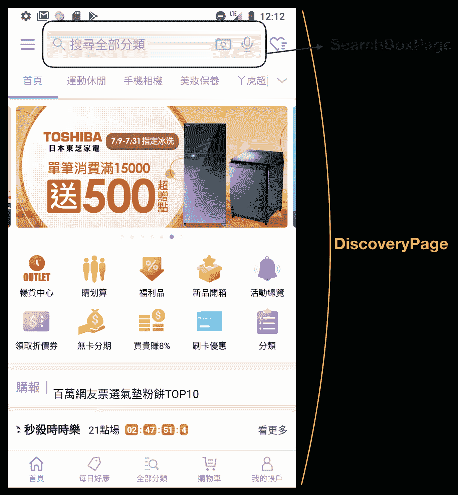
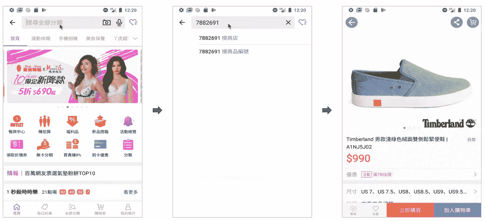
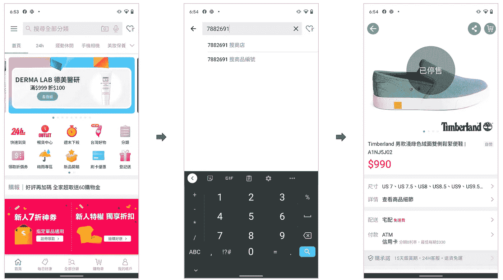
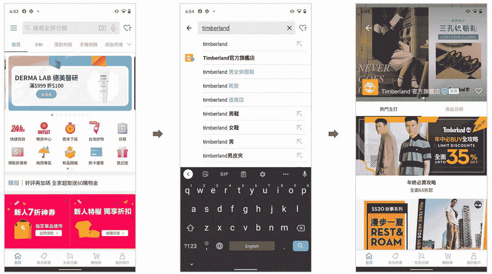

# 应用程序集成测试中的页面对象模式

> 原文：<https://blog.devgenius.io/pageobject-pattern-into-app-integration-tests-4c34eff10359?source=collection_archive---------19----------------------->

> 感谢我的同事 Kane Shih 的合作。本文和大家分享一下在 Android 应用上使用 PageObject 的经验。

PageObject 模式是 Martin Fowler 提出的 Web 应用程序 UI 自动化测试中一个著名的设计模式。它有效地将 UI 元素建模为对象，并允许开发人员操作它们，而无需深入研究实现细节。但是，这在移动应用程序开发中还不常见。

维护 Android UI 测试代码在今天是一个巨大的挑战。主要有两个原因:1。)对于不熟悉测试库的开发人员来说，编写 UI 测试需要时间。2.)由于市场的快速变化，生产代码频繁更改，这很快使 UI 测试代码过时。

在本文中，我们将介绍如何通过应用 PageObject 模式来解决这个问题，这使得我们的 UI 测试代码易于理解和修改。

# 介绍

## 应用集成测试

UI 测试用例在物理设备或模拟器上运行，以模拟用户行为并保护它所覆盖的部分用户流。当一个工程师修改生产代码，不小心改变了 UI 的动作，对应的测试用例应该会失败；这有助于开发人员在早期发现问题。UI 测试也有助于模拟边缘情况，这使得产品代码更加健壮。随着现代 Android UI 变得越来越复杂，编写和维护 UI 测试的重要性也越来越大。

## 浓咖啡

大多数 Android 开发人员使用测试库 [Espresso](https://developer.android.com/training/testing/espresso) 编写 UI 测试，该测试库已经发布并由 Google 支持。Espresso 是一个游戏改变者，它使 UI 测试比以前更容易。以下是 Espresso 的典型测试代码:

```
onView(withId(R.id.my_view))
 .perform(click())
 .check(matches(isDisplayed()))
```

尽管 Espresso 非常易于使用，但测试代码仍然深深依赖于生产 UI 实现细节。当涉及许多测试用例的视图实例发生变化时，开发人员需要同时更新它们。这可能会让维护 UI 测试变成一场噩梦。

## 页面对象模式

在 PageObject 模式中，每个页面对象可能代表一个完整的页面或者一个复杂的 UI 组件(在移动框架中，页面意味着 Android 的片段或者 iOS 的 UIViewController)。我们可以将页面上的基本元素视为一个对象，而不是整个页面。它封装了实际 UI 组件的详细机制。

*   马丁·福勒[页面对象](https://martinfowler.com/bliki/PageObject.html)
*   硒，[页面对象](https://github.com/SeleniumHQ/selenium/wiki/PageObjects)

# 体系结构

## 基本页面类

首先，我们定义了一个基本的 page 类，所有其他的 Page 对象都继承这个类。它有一个小函数`fun <reified T : Page> **on**(): T`,生成泛型类型的页面实例。这样，我们可以在任何时候连接`**Page.on**<{PageObject}>()`,并完全基于测试操作确定当前页面对象是什么。

`Page.on()`接收一个泛型类型 T，并生成 T 的一个实际实例。我们使用`T::class.constructors.*first*().call()`获取泛型构造函数，并查看第一个构造函数，通常是非参数化的构造函数，以创建 T 的一个实例

基本页面类也实现了`fun back(): Page`。通过与`**Page.on**<{PageObject}>()`链接，很容易理解 back 之后应该是哪个页面对象。

## 页面对象类

每个页面对象必须继承基本的页面类，并覆盖函数`fun verify()`来进行默认验证。例如，有一个 ItemPage 类继承了 Page 类，并验证 R.id.productitem_name 是否存在。

page 对象不一定要代表整个页面。在下面的示例中，SearchBoxPage 表示 DiscoveryPage 内部的一个子 UI 组件，该组件表示 DiscoveryFragment。

```
@Test
fun testSearchById() {
    **Page.on<DiscoveryPage>()
        .on<SearchBoxPage>()** .click()
        .on<SearchViewPage>()
        .searchKeyword(“7882691”)
        .on<ItemPage>()
        .withTitle(“A1NJ5J02”)
}
```



## 科特林具体化

Kotlin 的`reified`功能强大，可以让测试代码精炼。如果没有它，我们将需要每次实例化页面对象，并失去动作之间的连接。

*   具体化了

```
@Test
fun testSearchById() {
    Page.on<DiscoveryPage>()
        .on<SearchBoxPage>()
        .click()
        .on<SearchViewPage>()
        .searchKeyword(“7882691”)
        .back()
        .on<DiscoveryPage>()
}
```

*   没有具体化

```
@Test
fun testSearchById() {
    DiscoveryPage()
    SearchBoxPage().click()
    SearchViewPage().searchKeyword(“7882691”).back()
    DiscoveryPage()
}
```

# 优势

## 提高测试用例的可读性

当使用我们提出的实现通过 PageObject 模式编写 UI 测试用例时，它看起来像下面这样:

```
@Test
fun testSearchById() {
    Page.on<DiscoveryPage>()
        .on<SearchBoxPage>().click()
        .on<SearchViewPage>()
        .searchKeyword(“7882691”)
        .on<ItemPage>()
        .withTitle(“A1NJ5J02”)
}
```



很容易理解这个测试用例通过 DiscoveryFragment，并点击 SearchBox 视图，在 SearchView 中输入关键字，然后在 ItemPage 上显示指定的标题。


## 易于扩展

在我们的产品中，许多片段包含一个 RecyclerView，它们之间的差异很小。在这种情况下，我们实现了一个基本的 scrollabepageobject，它对 RecyclerView 进行验证，并提供一些通用方法，如“单击索引 n 的项目”。另一个具有类似行为的 PageObject 可以扩展 scrollabepageobject 并独立进行一些自定义。

```
open class ScrollablePage : Page() {
    @IdRes
    open val recyclerViewId: Int = R.id.*recycler_view* fun clickItem(index: Int): Page {
        Espresso.onView(withId(recyclerViewId))
                .perform(
                    RecyclerViewActions.*scrollToPosition*(index)
                )
        Espresso.onView(withId(recyclerViewId))
                .perform(
                    RecyclerViewActions.actionOnHolderItem(
                        ItemMatcher(),
                        click()
                    ).atPosition(index)
                )
       return this
    }
}class SearchResultPage: ScrollablePage() {
    …
}
```

## 从页面对象中分离导航

典型的实现是每个页面对象的方法决定下一个页面对象并返回它。然而，这导致了一些问题:

*   同一操作的不同目的地
*   由于不同的入口点，向后导航
*   在没有实际操作的情况下步入子组件

我们可以通过`**Page.on**<{PageObject}>()`轻松解决之前的问题，这样我们就不会定义那些操作的目的地。我们可以在操作后识别当前页面。例如，不同的搜索关键字将导航到不同的结果页面、产品项目页面或品牌页面。我们可以识别出`searchKeyword()`之后的页面。

它将如下所示:

```
@Test
fun testSearchById() {
    Page.on<DiscoveryPage>()
        .on<SearchBoxPage>()
        .click()
        **.on<SearchViewPage>()
        .searchKeyword(“7882691”)
        .on<ItemPage>()** .withTitle(“A1NJ5J02”)
}
```



```
@Test
fun testSearchByBrand() {
    Page.on<DiscoveryPage>()
        .on<SearchBoxPage>()
        .click()
        **.on<SearchViewPage>()
        .searchKeyword(“timberland”)
        .on<BrandPage>()** .withTitle(“Timberland”)
}
```



同时，一些片段有多个不同的入口点。例如，在我们的例子中，ItemPage 可以通过搜索或单击 BrandPage 的产品列表上的一个项目来打开；由于每个场景的不同 backstacks，这也会影响 back key 的行为。这里是用`**Page.on**<{PageObject}>()`来解决问题。

```
@Test
fun testItemDetail() {
    Page.on<ItemPage>()
        .clickDetail()
        .on<WebPage>()
        .withTitle(“The Product Details”)
        **.back()
        .on<ItemPage>()** }@Test
fun testBrandDetail() {
    Page.on<BrandPage>()
        .clickDetail()
        .on<WebPage>()
        .withTitle(“The Brand Details”)
        **.back()
        .on<BrandPage>()** }
```

# 结论

通过使用页面对象模式，我们可以将所有与 Espresso 相关的 UI 操作代码隐藏到每个页面对象中，以使我们的测试代码易于阅读和理解。帮助您更快地开发和扩展 UI 测试覆盖率。

## 提取那些通用的浓缩咖啡代码

这可以帮助我们更快地创建页面对象，因为我们不必重复重写那些 Espresso 函数。第二，虽然 Espresso 现在是一个成熟的库，但它在未来可能仍然会有一些突破性的变化，以及作为一个外部库。最糟糕的情况是，一些新奇的下一代图书馆可能会凭空出现，并获得谷歌的支持，以取代 Espresso。

## 考虑如何分离对应于产品 UI 的页面对象

页面对象可以代表整个页面，但通常不是。根据我们的经验，它可以是一个搜索框，测试代码可以与之交互。这增加了可重用性，并帮助我们更快地开发。但是不要做的太复杂，设计过度。

理想情况下，当工程师完成一个特性实现时，UI 测试和页面对象也应该准备好了。然后，测试人员或项目经理可以使用这些方便的页面对象高效地编写更多的 UI 测试。