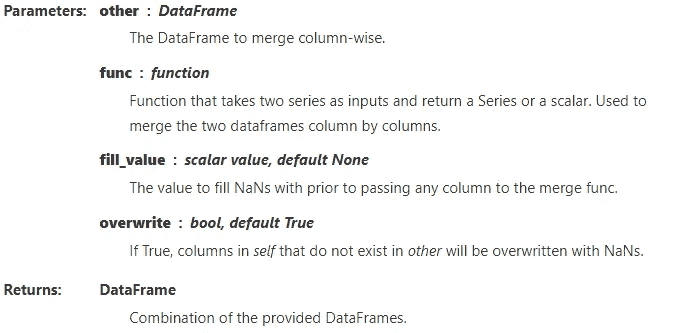
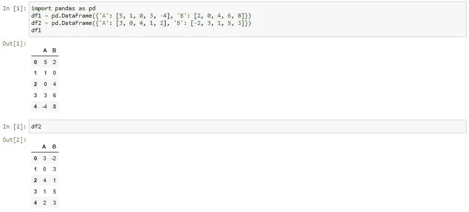
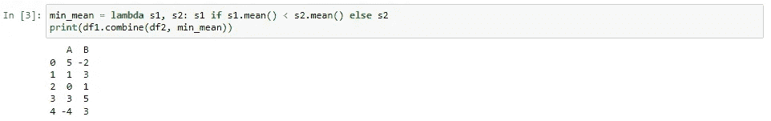
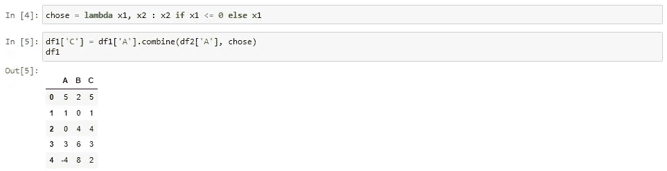
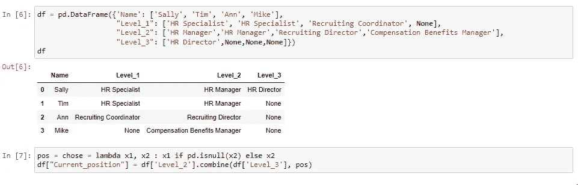
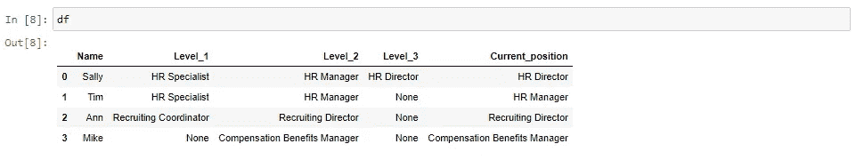

# Pandas DataFrame: Combine()函数

> 原文：<https://blog.devgenius.io/pandas-dataframe-combine-function-b0278f8f9d7?source=collection_archive---------7----------------------->

[https://pix abay . com/插图/背景-蓝-黄-art-3616101/](https://pixabay.com/illustrations/background-blue-yellow-art-3616101/)

有几种组合数据帧的方法。最流行的数据帧函数是:

*   合并
*   加入
*   附加
*   串联
*   结合

然而，对于本教程，我们将关注后一个函数`DataFrame.combine()`。`combine`函数不同于其他函数，因为它使用一个函数参数与另一个数据帧进行列组合。下面的例子将更清楚地说明`combine`函数的作用。

> 句法
> 
> DataFrame.combine(other，func，fill_value =无，overwrite =真)

## 示例 1:组合两个数据帧

第一个例子显示了两个数据帧，`df1`和`df2`。我们通过定义函数`min_mean`来组合这两个数据帧。该函数选择最小的平均列。

其他参数的用法在 [***pandas 中有详细介绍。data frame . combine*T22**](https://pandas.pydata.org/docs/reference/api/pandas.DataFrame.combine.html)

## 示例 2:创建新列(int dtype)

`combine`功能的另一个用途是在同一数据帧或不同数据帧内创建一列。我们从定义一个函数`chose`开始。

这将创建一个新列`df[C]`，它的值是基于函数`chose`选择的。该函数从`df1[A]`中选择大于 0 的值。任何不符合标准的`df1[A]`中的值都被替换为`df2[A]`中的值。

## 示例 3:创建新列(对象数据类型)

在前面的例子中，数据类型是一个`int`数据类型。在本例中，带有`Object` dtype 的 DataFrames 将被组合成一个新列。

数据集是一家公司的人力资源组织图。有三个级别，但是，我们希望创建一个新列来显示员工的当前职位。一种方法是使用如下的`combine`功能。

结果列显示在下面的输出中。

## 结论

在本教程中，我们学习了 Python 熊猫`DataFrame.combine()`函数。我们还学习了如何使用该函数创建一个数据类型为`int`和`object`的新列。