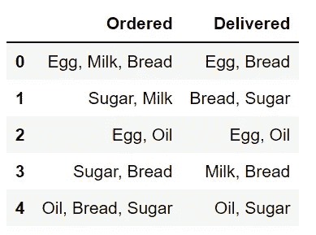
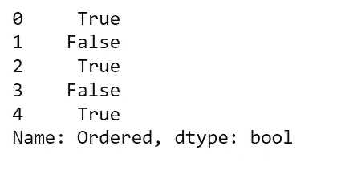
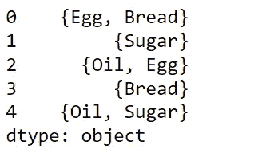
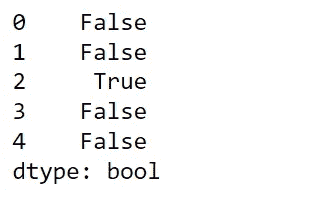
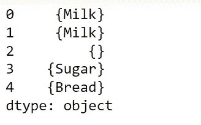
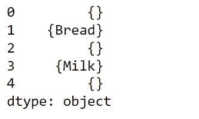

# 熊猫:处理数据帧中的字符串列表

> 原文：<https://blog.devgenius.io/pandas-dealing-with-string-list-within-a-dataframe-31b949cd92a?source=collection_archive---------5----------------------->


帕斯卡尔·迈耶在 [Unsplash](https://unsplash.com/) 上拍摄的照片

对于数据帧中的正则表达式，大多数 Pandas 用户都熟悉`.extract()`、`.replace()`和`.findall()`。这些函数主要帮助数据提取和清理，尤其是字符串数据类型。然而，其他熊猫方法也有助于正则表达式。本教程的目的是在处理 DataFrame 单元格中的字符串值列表时，更好地了解这些函数的用法。重点将放在以下职能上:

*   包含( )
*   设置。交集( )
*   设置。差异( )

# 包含( )

我们从熊猫开始。Series.str.contains 函数测试模式或正则表达式(regex)是否包含在序列或索引的字符串中。它根据给定的模式或正则表达式是否包含在一个系列或索引的字符串中，输出一个布尔系列或索引。此链接提供了语法中参数的更多详细信息。

## *语法*

*Series.str.contains(pat，case=True，flags=0，na=None，regex=True)*

该链接给出了语法中参数的更多细节。

## 示例 1:在表达式或字符串列表中查找字符串。

熊猫的文献参考。Series.str.contains 给出了如何使用 Series 和 Index 函数以及如何处理`NaN`的示例。在本教程中，我们想看看这个函数是如何处理数据帧中的列表的。

我们首先创建一个数据集`df`，这是 5 个人的购物清单。数据集有两列`Ordered`和`Delivered`。每一行代表这个人点了什么和送了什么。

```
import pandas as pd
df = pd.DataFrame({'Ordered': ['Egg, Milk, Bread', 'Sugar, Milk', 'Egg, Oil', 'Sugar, Bread', 'Oil, Bread, Sugar'], 
                    'Delivered': ['Egg, Bread', 'Bread, Sugar', 'Egg, Oil', 'Milk, Bread', 'Oil, Sugar']})
df
```



对于`Example 1`，我们希望找到哪个订单有`Eggs`或`Oil`。

```
 df['Ordered'].str.contains('Egg|Oil')
```



当字符串中出现`Egg`或`Oil`时，函数返回 **True** 。

# 设置。交集( )方法

`Set()`和`Intersection()`是返回包含两个或更多集合之间相似性的集合的方法。返回的集合只包含同时存在于两个集合中的项目。

## 句法

> 设置(x)。交集(集合(y))

在我们的下一个例子中，我们将比较这两列的字符串值，并找到相似的值。

## 示例 2:比较两列

要找出哪些订购的商品已经交付，为此，我们必须将单元格拆分成一个列表，并使用`set( )`和`intersection`方法进行检查。我们通过创建另一个专栏`check`来做到这一点

```
check = df.apply(lambda x: (set(x['Ordered'].split(', '))
          .intersection(set(x['Delivered'].split(', ')))), 
           axis = 1)
check
```



## 示例 3:比较两个具有精确值的列

要找出交付的项目，请与订单完全匹配。`Set( )`方法可以帮助做到这一点，如下所示。

```
check2 = df.apply(lambda x: (set(x['Ordered'].split(', ')) == 
                 (set(x['Delivered'].split(', ')))), axis = 1)
check2
```



# 设置。差分( )方法

`Difference()`返回一个集合，其中包含只存在于集合 x 中而不存在于集合 y 中的项目:

## 句法

> 设置(x)。差异(集合(y))

在我们的下一个例子中，我们将比较这两列的字符串值，并找到相似的值。

## 示例 4:比较具有不同值的两列

以找出哪些订购的项目没有交付，以及没有订购的已交付项目。如下所示。

```
check3 = df.apply(lambda x: (set(x['Ordered'].split(', '))
           .difference(set(x['Delivered'].split(', ')))), axis = 1)
check3
```



要检查哪些已交付的项目没有订购，我们只需交换代码中`Ordered`和`Delivered`的位置。

```
check4 = df.apply(lambda x: (set(x['Delivered'].split(', '))
           .difference(set(x['Ordered'].split(', ')))), axis = 1)
check4
```



# 结论

在本教程中，我们学习了 Python pandas `contains()`、`Set.Intersection()`和`difference()`访问 DataFrame 单元格中的字符串列表的方法。