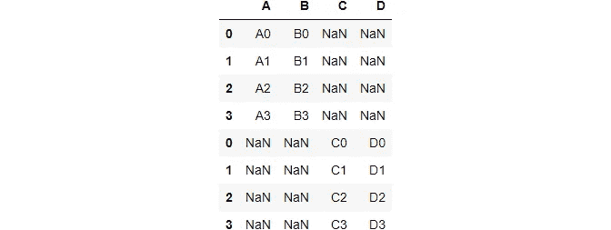
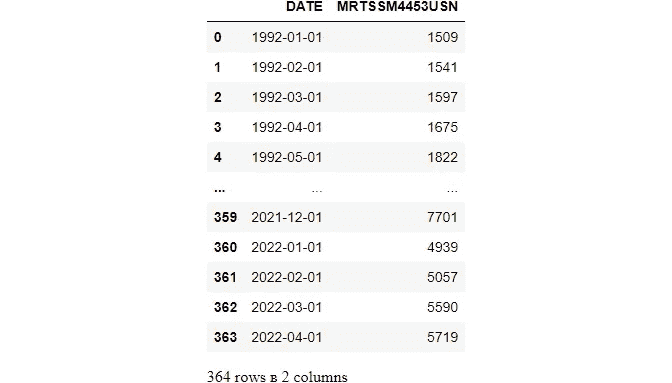
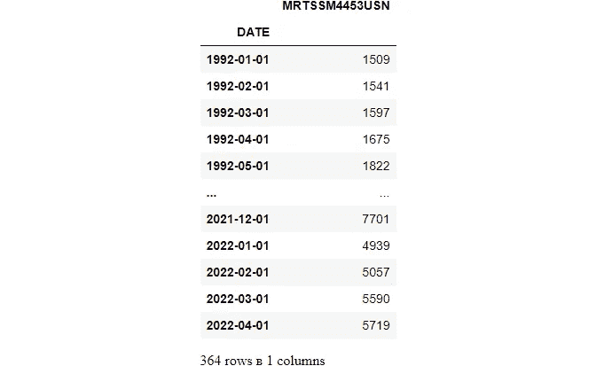
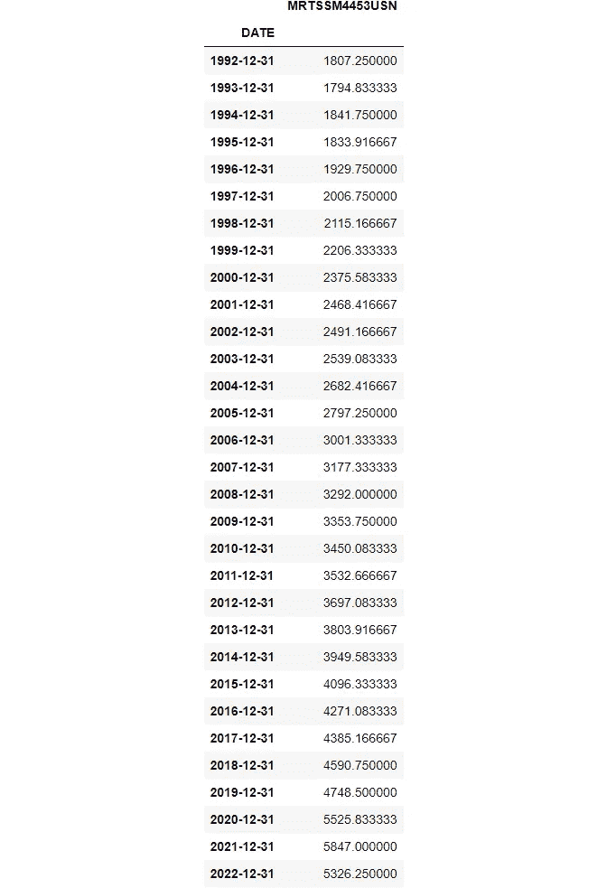
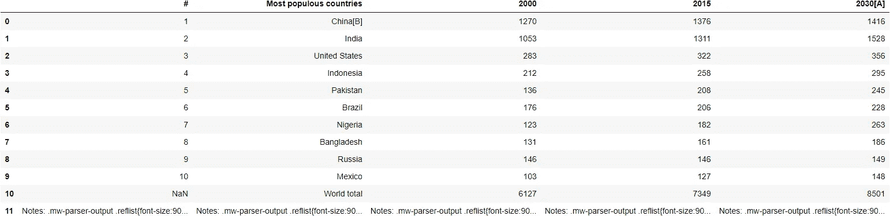
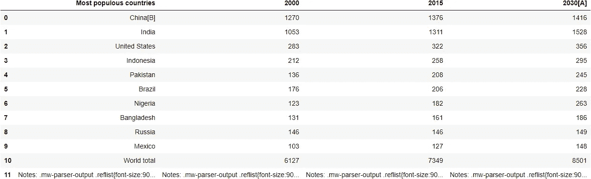
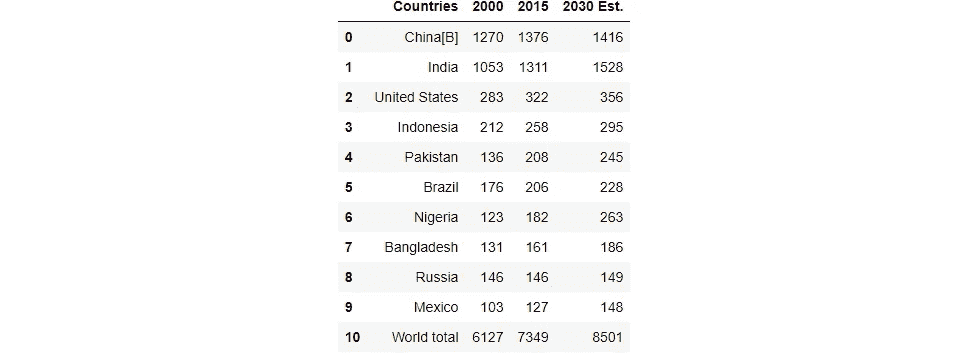
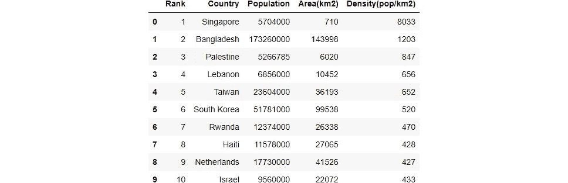
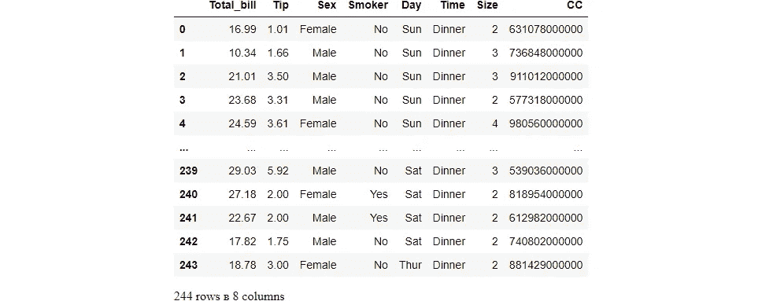

# 蟒蛇熊猫第四集

> 原文：<https://blog.devgenius.io/pandas-part-4-5a465f3a218f?source=collection_archive---------20----------------------->


熊猫

欢迎回到 Pandas 的最后一章，其中我介绍了数据分析和数据科学中使用的基本命令和函数。作为我最喜欢的 Python 包之一，很遗憾看到熊猫系列要结束了。没有熊猫，这将是一个多么大的挑战，我甚至无法想象。

无论如何，如果你碰巧看到这个页面，我强烈建议你阅读我已经发表的关于熊猫系列的前三篇文章。

[第一部分](https://medium.com/@gokulguugu/python-packages-pandas-part-1-42ceb5e3f081)、[第二部分](https://medium.com/@gokulguugu/python-pandas-part-2-9676f36be053)、[第三部分](https://medium.com/@gokulguugu/pandas-part-3-39ebf39222f4)

在本系列中，您会发现一些重要的主题，如:

1.组合数据帧
2。合并数据帧
3。加入熊猫
4。熊猫
5 中的文本方法。清洗和编辑字符串
6。Python 中的时间方法
7。导入和写入(导出)数据
8。输入和输出方法

```
**--> import numpy as np
--> import pandas as pd**
```

## 组合数据帧

## 如何在 Python 中组合两个数据帧—熊猫？

在许多现实生活中，我们想要使用的数据来自多个文件。我们经常需要将这些文件组合成一个数据帧来分析数据。Pandas 提供了这样的工具，在连接/合并类型的操作中，可以很容易地将序列或数据帧与各种索引和关系代数功能的集合逻辑结合起来。此外，pandas 还提供了比较两个系列或数据框架并总结其差异的实用程序。

## 串联

pandas 中的`concat()`函数用于将列或行从一个数据帧追加到另一个数据帧。`concat()`函数完成了沿一个轴执行连接操作的所有繁重工作，同时对其他轴上的索引(如果有)执行可选的集合逻辑(union 或 intersection)。

```
*#Directly "glue" together dataframes.
#basically it will be helpful for joining two columns*

**--> data1 = {'A':['A0','A1','A2','A3'],'B':['B0','B1','B2','B3']}
--> data2 = {'C':['C0','C1','C2','C3'],'D':['D0','D1','D2','D3']}
--> one = pd.DataFrame(data1)
--> two = pd.DataFrame(data2)****--> one**
```


```
**--> two**
```


## 轴= 0

## 沿行串联

```
*#Joining two tables based on columns
#axis 0 represents rows and axis 1 represents coulmns*

**--> axis0 = pd.concat([one,two],axis=0)
--> axis0**
```



```
*#joining based on rows*
**--> axis1 = pd.concat([one,two],axis=1)
--> axis1**
```


## 轴 0，但列匹配

```
*#first are saying that column on df two = to column on df one
#second we are joining two df
#****note****: we can not do like this on rows*

**--> two.columns = one.columns
--> pd.concat([one,two])**
```


## 合并

`merge()`方法使用指定的方法通过合并两个数据帧来更新它们的内容。

## 数据表

```
**--> registrations = pd.DataFrame({'reg_id':[1,2,3,4],'name':  ['Andrew','Bobo','Claire','David']})
--> logins = pd.DataFrame({'log_id':[1,2,3,4],'name':['Xavier','Andrew','Yolanda','Bobo']})****--> registrations**
```


```
**--> logins**
```


# 连接

该方法获取 iterable 中的所有项，并将它们连接成一个字符串。必须指定一个字符串作为分隔符。

## pd.merge()

基于键列合并 pandas 数据帧，类似于 SQL 连接。结果基于 how 参数。

## 内部连接

```
*#Match up where the key is present in BOTH tables.
#There should be no NaNs due to the join, since by definition to be part of the Inner Join they need info in both tables.
# how and on are imp keys, how means type of join on means on what key or index*

**--> pd.merge(registrations,logins,how='inner',on='name')**
```


```
*# Pandas are smart enough to figure out key column (on parameter) if only one column name matches up*
**--> pd.merge(registrations,logins,how='inner')**
```


***1。如果“开”键列不在两个数据帧中，Pandas 会报告错误***

***2。pd.merge(registrations，logins，how='inner '，on='reg_id')***

## 左连接

```
*#Match up AND include all rows from Left Table.
#Show everyone who registered on Left Table, if they don't have login info, then fill with NaN.*

**--> pd.merge(registrations,logins,how='left')**
```


## 右连接

```
*#Match up AND include all rows from Right Table.
# Show everyone who logged in on the Right Table, if they don't have registration info, then fill with NaN.*

**--> pd.merge(registrations,logins,how='right')**
```


## 外部连接

```
*#Match up on all info found in either Left or Right Table. 
#Show everyone that's in the Log in table and the registrations table. Fill any missing info with NaN*

**--> pd.merge(registrations,logins,how='outer')**
```


## 在索引或列上联接

**使用** `**left_on**` **，** `**right_on**` **，** `**left_index**` **，** `**right_index**` **的组合来相互合并列或索引**

```
*#setting an index*

**--> registrations = registrations.set_index('name')
--> registrations**
```


```
*#right_on indicates on which parameter the merge needs to be maid*
**--> pd.merge(registrations,logins,left_index=True,right_on='name',how='inner')**
```


```
*#same as the above left_on is a parameter*
**--> pd.merge(logins,registrations,right_index=True,left_on='name',how='inner')**
```


## 处理连接表中不同的键列名

在这里，如果列上的数据彼此相似，我们将能够根据 column_name 连接列。

```
*#resetting the index column*
**--> registrations = registrations.reset_index()
--> registrations**
```


```
*#renaming the column name*
**--> registrations.columns = ['reg_name','reg_id']****--> registrations**
```


```
**--> pd.merge(registrations,logins,how='inner',left_on='reg_name',right_on='name')**
```


```
**--> results = pd.merge(registrations,logins,how='inner',left_on='reg_name',right_on='name')
--> results**
```


```
**--> results.drop('name',axis=1)**
```


## 熊猫会自动标记重复的列

```
*#This is basically renaming the columns*
**--> registrations.columns = ['name','id']
--> logins.columns = ['id','name']

--> registrations**
```


```
**--> logins**
```


```
*# _x is for left
# _y is for right
#this is to see how pandas automatically tags column name with the sufix*

**--> pd.merge(registrations,logins,on='name')**
```


```
*#we can change the default suffix _x and _y to whatever we can*

**--> pd.merge(registrations,logins,on='name',suffixes=('_r','_l'))**
```


## 文本方法

1.  `lower()` - **将序列/索引中的字符串转换成小写。**
2.  `upper()` - **将序列/索引中的字符串转换为大写。**
3.  `len()` - **计算字符串长度()。**
4.  `strip()` - **帮助从序列/索引的两边去除每个字符串中的空白(包括换行符)。**
5.  `split(' ')` - **按照给定的模式分割每个字符串。**
6.  `cat(sep=' ')` - **用给定的分隔符连接系列/索引元素。**
7.  `islower()` - **检查序列/索引中每个字符串的所有字符是否都是小写。返回布尔值**
8.  `isupper()` - **检查序列/索引中每个字符串的所有字符是否都是大写。返回布尔值。**
9.  `isnumeric()` - **检查序列/索引中每个字符串的所有字符是否都是数字。返回布尔值。**
10.  `swapcase` - **交换箱子下部/上部。**

```
*#A normal Python string has a variety of method calls available:*

**--> mystr = "hello"****--> mystr.capitalize()**'Hello'**--> mystr.isdigit()**False
```

## 熊猫和文字

```
**--> names = pd.Series(['max','lewis','leclare','carlos','4'])
--> names**0        max
1      lewis
2    leclare
3     carlos
4          4
dtype: object**--> names.str.capitalize()**0        Max
1      Lewis
2    Leclare
3     Carlos
4          4
dtype: object**--> names.str.isdigit()**0    False
1    False
2    False
3    False
4     True
dtype: bool
```

## 分割、抓取和扩展

```
**--> stocks = ['GOOG,APPL,AMZN','JPM,BAC,GS']
--> stocks**['GOOG,APPL,AMZN', 'JPM,BAC,GS']**--> len(stocks)**2**--> sym = pd.Series(stocks)
--> sym**0    GOOG,APPL,AMZN
1        JPM,BAC,GS
dtype: object**--> sym.str.split(',')**0    [GOOG, APPL, AMZN]
1        [JPM, BAC, GS]
dtype: object**--> sym.str.split(',').str[0]**0    GOOG
1     JPM
dtype: object**--> sym.str.split(',',expand=True)**
```


## 清理或编辑字符串

```
**--> mess = pd.Series(['max','lew;is','alonso'])
--> mess**0       max
1    lew;is
2    alonso
dtype: object**--> mess = mess.str.replace(';','')
--> mess**0       max
1     lewis
2    alonso
dtype: object*#used to remove any whitespaces*
**--> mess.str.strip()**0       max
1     lewis
2    alonso
dtype: object**--> mess.str.capitalize()**0       Max
1     Lewis
2    Alonso
dtype: object
```

## 自定义 apply()调用的替代方法

```
**--> mess = pd.Series(['  max','lew;is ','  alonso   '])
--> mess**0            max
1        lew;is 
2      alonso   
dtype: object*#defining a function and cleaning the data*
**--> def clean(name):
      name = name.replace(';','')
      name = name.strip()
      name = name.capitalize()
      return name****--> mess.apply(clean)**0       Max
1     Lewis
2    Alonso
dtype: object*#we can also use vectorize for more fast performece*
**--> mess = pd.Series(np.vectorize(clean)(mess))
--> mess**0       Max
1     Lewis
2    Alonso
dtype: object
```

## 时间方法

Python 中的日期本身不是一种数据类型，但是我们可以导入一个名为`datetime`的模块，将日期作为日期对象来处理。

## Python 日期时间评论

```
*#Basic Python outside of Pandas contains a datetime library:*

**--> from datetime import datetime***# To illustrate the order of arguments*
**--> my_year = 2017
--> my_month = 1
--> my_day = 2
--> my_hour = 13
--> my_minute = 30
--> my_second = 15***# January 2nd, 2017
# Defaults to 0:00*

**--> my_date = datetime(my_year,my_month,my_day)
--> my_date**datetime.datetime(2017, 1, 2, 0, 0)*# January 2nd, 2017 at 13:30:*
**--> my_date_time = datetime(my_year,my_month,my_day,my_hour,my_minute,my_second)**
**--> my_date_time**datetime.datetime(2017, 1, 2, 13, 30, 15)*#You can grab any part of the datetime object you want*
**--> my_date.day**2**--> my_date_time.hour**13
```

## 转换为日期时间

通常，当存储数据集时，时间部分可能是一个字符串。熊猫很容易将字符串转换成日期时间对象。

```
**--> myser = pd.Series(['Nov 3, 2000', '2000-01-01', None])
--> myser**0    Nov 3, 2000
1     2000-01-01
2           None
dtype: object**--> myser[0]**'Nov 3, 2000'
```

## pd.to_datetime()

```
#*converting any type of datetime data to standard format*
**--> pd.to_datetime(myser)**0   2000-11-03
1   2000-01-01
2          NaT
dtype: datetime64[ns]**--> pd.to_datetime(myser)[0]**Timestamp('2000-11-03 00:00:00')*# 10th of Dec OR 12th of October?
# We may need to tell pandas*

**--> euro_date = '10-12-2000'
-->euro_date**'10-12-2000'**--> pd.to_datetime(euro_date)**Timestamp('2000-10-12 00:00:00')**--> pd.to_datetime(euro_date,dayfirst=True)**Timestamp('2000-12-10 00:00:00')
```

## 自定义时间字符串格式

有时日期可能有一个不标准的格式，幸运的是你总是可以指定熊猫的格式。你还应该注意到这可以加速转换，所以即使熊猫可以自己解析，这也是值得的。

```
**--> style_date = '12--Dec--2022'
--> style_date**'12--Dec--2022'**--> pd.to_datetime(style_date, format='%d--%b--%Y')**Timestamp('2022-12-12 00:00:00')**--> strange_date = '12th of Dec 2000'
--> strange_date**'12th of Dec 2000'**--> pd.to_datetime(strange_date)**Timestamp('2000-12-12 00:00:00')
```

# 数据

```
**--> sales = pd.read_csv('retail.csv')****--> sales**
```



```
**--> sales.iloc[0]['DATE']**'1992-01-01'**--> type(sales.iloc[0]['DATE'])**str**--> sales.head()**
```


```
#*converting str date type into datetime type* 
**--> sales['DATE'] = pd.to_datetime(sales['DATE'])
--> sales**
```


```
**--> sales.iloc[0]['DATE']**Timestamp('1992-01-01 00:00:00')**--> type(sales.iloc[0]['DATE'])**pandas._libs.tslibs.timestamps.Timestamp
```

# 尝试自动解析日期

```
#*parse_date genreally converts the data column into a Timestamp object when you are importing*
#*keep in mind that we need to pass in the index of the column*

**--> sales = pd.read_csv('retail.csv',parse_dates=[0])****--> sales.head()**
```


```
**--> sales.iloc[0]['DATE']**Timestamp('1992-01-01 00:00:00')**--> type(sales.iloc[0]['DATE'])**pandas._libs.tslibs.timestamps.Timestamp
```

## 重新取样或分组依据

时序数据的常见操作是基于时序索引进行重采样。让我们看看如何使用 resample()方法。

```
#*our index*
**--> sales.index**RangeIndex(start=0, stop=364, step=1)#*Reset DATE to index*
**--> sales = sales.set_index('DATE')
--> sales**
```



当调用`.resample()`时，首先需要传入一个规则参数，然后需要调用某种聚合函数。

```
#*what we are trying to do here is grouping by the year and calculating the mean of MRTSSM4453USN*
#*there are a diffrent rules to group by a year,month and date*

**--> sales.resample(rule='A').mean()**
```



# 。dt 方法调用

一旦列或索引采用 DateTime 格式，就可以调用。熊猫里面的 dt 图书馆

```
**--> sales = sales.reset_index()
--> sales**
```


```
#*we can take the month, year, day from the .dt methord* 
**--> sales['DATE'].dt.month**0       1
1       2
2       3
3       4
4       5
       ..
359    12
360     1
361     2
362     3
363     4
Name: DATE, Length: 364, dtype: int64#*returns boolean output is this is a leap year or not*
**--> sales['DATE'].dt.is_leap_year**0       True
1       True
2       True
3       True
4       True
       ...  
359    False
360    False
361    False
362    False
363    False
Name: DATE, Length: 364, dtype: bool
```

## 输入和输出

## 有 4 种广泛使用的数据格式

1.  `.csv`哪个是逗号分隔文件
2.  `.xlsx`哪个是 Excel 文件
3.  `.html`哪一个是网页文件
4.  `.sql`这是一个数据库文件

但是最常用的文件是`.csv`文件和`.excel`文件。

```
# *creating a data frame*

**--> df = pd.DataFrame({'a':[0,4,8,12],
                  'b':[1,5,9,13],
                  'c':[2,6,10,14],
                  'd':[3,7,11,15]})
--> df**
```


```
**--> df**
```


# CSV 输出

如果不想保存索引，请设置 index=False，否则，它会向。包含您的索引的 csv 文件，如果您的索引没有名称，则将其命名为“Unnamed: 0”。如果您想保存您的索引，只需将其设置为 True(默认值)。

```
**--> df.to_csv('new_file.csv',index=False)****--> df**
```


# 超文本标记语言

这个函数将从网页中读取表格，并返回一个 DataFrame 对象列表。这个函数对于快速合并来自不同网站的表格很有用，而不需要弄清楚如何抓取网站的 HTML。

**注意:这只适用于定义明确的**

对象，这不能神奇地从页面上的图像表格中读取。

```
#*Here we have used world population wiki website to grab the tables*
**--> table = pd.read_html('https://en.wikipedia.org/wiki/World_population')****--> len(table)**25**--> table**[                                                    #  \
 0                                                   1   
 1                                                   2   
 2                                                   3   
 3                                                   4   
 4                                                   5   
 5                                                   6   
 6                                                   7   
 7                                                   8   
 8                                                   9   
 9                                                  10   
 10                                                NaN   
 11  Notes: .mw-parser-output .reflist{font-size:90...   

                               Most populous countries  \
 0                                            China[B]   
 1                                               India   
 2                                       United States   
 3                                           Indonesia   
 4                                            Pakistan   
 5                                              Brazil   
 6                                             Nigeria   
 7                                          Bangladesh   
 8                                              Russia   
 9                                              Mexico   
 10                                        World total   
 11  Notes: .mw-parser-output .reflist{font-size:90...   

                                                  2000  \
 0                                                1270   
 1                                                1053   
 2                                                 283   
 3                                                 212   
 4                                                 136   
 5                                                 176   
 6                                                 123   
 7                                                 131   
 8                                                 146   
 9                                                 103   
 10                                               6127   
 11  Notes: .mw-parser-output .reflist{font-size:90...   

                                                  2015  \
 0                                                1376   
 1                                                1311   
 2                                                 322   
 3                                                 258   
 4                                                 208   
 5                                                 206   
 6                                                 182   
 7                                                 161   
 8                                                 146   
 9                                                 127   
 10                                               7349   
 11  Notes: .mw-parser-output .reflist{font-size:90...   

                                               2030[A]  
 0                                                1416  
 1                                                1528  
 2                                                 356  
 3                                                 295  
 4                                                 245  
 5                                                 228  
 6                                                 263  
 7                                                 186  
 8                                                 149  
 9                                                 148  
 10                                               8501  
 11  Notes: .mw-parser-output .reflist{font-size:90...  ,
                      Region Density(inhabitants/km2) Population(millions)  \
 0                      Asia                    104.1                 4641   
 1                    Africa                     44.4                 1340   
 2                    Europe                     73.4                  747   
 3             Latin America                     24.1                  653   
 4  Northern America[note 2]                     14.9                  368   
 5                   Oceania                        5                   42   
 6                Antarctica                       ~0            0.004[16]   

                                Most populous country  \
 0                      1,411,778,000 – China[note 1]   
 1                            0,211,401,000 – Nigeria   
 2  0,146,171,000 – Russia, approx. 110 million in...   
 3                             0,214,103,000 – Brazil   
 4                      0,332,909,000 – United States   
 5                          0,025,917,000 – Australia   
 6                                        N/A[note 3]   

               Most populous city (metropolitan area)  
 0  13,515,000 – Tokyo Metropolis(37,400,000 – Gre...  
 1     09,500,000 – Cairo(20,076,000 – Greater Cairo)  
 2  13,200,000 – Moscow(20,004,000 – Moscow metrop...  
 3  12,252,000 – São Paulo City(21,650,000 – São P...  
 4  08,804,000 – New York City(23,582,649 – New Yo...  
 5                                05,367,000 – Sydney  
 6                       00,001,258 – McMurdo Station  ,
   World population milestones in billions [3](Worldometers estimates)        \
                                                            Population     1   
 0                                               Year                   1804   
 1                                      Years elapsed                      —   

       2     3     4     5     6     7     8     9    10  
 0  1927  1960  1974  1987  1999  2011  2023  2037  2057  
 1   123    33    14    13    12    12    12    14    20  ,
                                                    0  \
 0  .mw-parser-output .legend{page-break-inside:av...   

                                    1  
 0  67.5–70 65–67.5 60–65 55–60 50–55  ,
    Rank Country / Dependency  Population  Percentage of the world  \
 0     1                China  1412600000                      NaN   
 1     2                India  1373761000                      NaN   
 2     3        United States   333001029                      NaN   
 3     4            Indonesia   272248500                      NaN   
 4     5             Pakistan   229488994                      NaN   
 5     6              Nigeria   216746934                      NaN   
 6     7               Brazil   215027046                      NaN   
 7     8           Bangladesh   168220000                      NaN   
 8     9               Russia   147190000                      NaN   
 9    10               Mexico   128271248                      NaN   

           Date Source (official or from the United Nations)  
 0  31 Dec 2021                 National annual estimate[93]  
 1   1 Mar 2022                 Annual national estimate[94]  
 2  18 Aug 2022                National population clock[95]  
 3   1 Jul 2021                 National annual estimate[96]  
 4   1 Jul 2022                            UN projection[97]  
 5   1 Jul 2022                            UN projection[97]  
 6  18 Aug 2022                National population clock[98]  
 7   1 Jul 2020               Annual Population Estimate[99]  
 8   1 Oct 2021         2021 preliminary census results[100]  
 9  31 Mar 2022             National quarterly estimate[101]  ,
    Rank      Country  Population  Area(km2)  Density(pop/km2)
 0     1    Singapore     5704000        710              8033
 1     2   Bangladesh   173260000     143998              1203
 2     3    Palestine     5266785       6020               847
 3     4      Lebanon     6856000      10452               656
 4     5       Taiwan    23604000      36193               652
 5     6  South Korea    51781000      99538               520
 6     7       Rwanda    12374000      26338               470
 7     8        Haiti    11578000      27065               428
 8     9  Netherlands    17730000      41526               427
 9    10       Israel     9560000      22072               433,
    Rank         Country  Population  Area(km2)  Density(pop/km2)  \
 0     1           India  1381370000    3287240               420   
 1     2        Pakistan   229650000     803940               286   
 2     3      Bangladesh   173260000     143998              1203   
 3     4           Japan   126010000     377873               333   
 4     5     Philippines   112300000     300000               374   
 5     6         Vietnam    96209000     331689               290   
 6     7  United Kingdom    66436000     243610               273   
 7     8     South Korea    51781000      99538               520   
 8     9          Taiwan    23604000      36193               652   
 9    10       Sri Lanka    21803000      65610               332   

   Population trend  
 0          Growing  
 1  Rapidly growing  
 2  Rapidly growing  
 3   Declining[102]  
 4          Growing  
 5          Growing  
 6          Growing  
 7           Steady  
 8           Steady  
 9          Growing  ,
     Year  Population Yearly growth           Density(pop/km2)  \
     Year  Population             %    Number Density(pop/km2)   
 0   1951  2584034261         1.88%  47603112               17   
 1   1952  2630861562         1.81%  46827301               18   
 2   1953  2677608960         1.78%  46747398               18   
 3   1954  2724846741         1.76%  47237781               18   
 4   1955  2773019936         1.77%  48173195               19   
 ..   ...         ...           ...       ...              ...   
 65  2016  7464022000         1.14%  84225000               50   
 66  2017  7547859000         1.12%  83837000               51   
 67  2018  7631091000         1.10%  83232000               51   
 68  2019  7713468000         1.08%  82377000               52   
 69  2020  7795000000         1.05%  81331000               52   

    Urban population       
              Number    %  
 0         775067697  30%  
 1         799282533  30%  
 2         824289989  31%  
 3         850179106  31%  
 4         877008842  32%  
 ..              ...  ...  
 65       4060653000  54%  
 66       4140189000  55%  
 67       4219817000  55%  
 68       4299439000  56%  
 69       4378900000  56%  

 [70 rows x 7 columns],
                      Region  1500  1600  1700  1750  1800  1850  1900  1950  \
 0                     World   585   660   710   791   978  1262  1650  2521   
 1                    Africa    86   114   106   106   107   111   133   221   
 2                      Asia   282   350   411   502   635   809   947  1402   
 3                    Europe   168   170   178   190   203   276   408   547   
 4     Latin America[Note 1]    40    20    10    16    24    38    74   167   
 5  Northern America[Note 1]     6     3     2     2     7    26    82   172   
 6                   Oceania     3     3     3     2     2     2     6    13   

    1999  2008  2010  2012  2050  2150  
 0  6008  6707  6896  7052  9725  9746  
 1   783   973  1022  1052  2478  2308  
 2  3700  4054  4164  4250  5267  5561  
 3   675   732   738   740   734   517  
 4   508   577   590   603   784   912  
 5   312   337   345   351   433   398  
 6    30    34    37    38    57    51  ,
                      Region  1500  1600  1700  1750  1800  1850  1900  1950  \
 0                    Africa  14.7  17.3  14.9  13.4  10.9   8.8   8.1   8.8   
 1                      Asia  48.2  53.0  57.9  63.5  64.9  64.1  57.4  55.6   
 2                    Europe  28.7  25.8  25.1  20.6  20.8  21.9  24.7  21.7   
 3     Latin America[Note 1]   6.8   3.0   1.4   2.0   2.5   3.0   4.5   6.6   
 4  Northern America[Note 1]   1.0   0.5   0.3   0.3   0.7   2.1   5.0   6.8   
 5                   Oceania   0.5   0.5   0.4   0.3   0.2   0.2   0.4   0.5   

    1999  2008  2010  2012  2050  2150  
 0  13.0  14.5  14.8  15.2  25.5  23.7  
 1  61.6  60.4  60.4  60.3  54.2  57.1  
 2  11.2  10.9  10.7  10.5   7.6   5.3  
 3   8.5   8.6   8.6   8.6   8.1   9.4  
 4   5.2   5.0   5.0   5.0   4.5   4.1  
 5   0.5   0.5   0.5   0.5   0.6   0.5  ,
          Year    World  Africa    Asia  Europe  Latin America& Carib.[Note 1]  \
 0   70,000 BC  < 0.015     NaN     NaN     NaN                            0.0   
 1   10,000 BC        4     NaN     NaN     NaN                            NaN   
 2     8000 BC        5     NaN     NaN     NaN                            NaN   
 3     6500 BC        5     NaN     NaN     NaN                            NaN   
 4     5000 BC        5     NaN     NaN     NaN                            NaN   
 5     4000 BC        7     NaN     NaN     NaN                            NaN   
 6     3000 BC       14     NaN     NaN     NaN                            NaN   
 7     2000 BC       27     NaN     NaN     NaN                            NaN   
 8     1000 BC       50     7.0    33.0     9.0                            NaN   
 9      500 BC      100    14.0    66.0    16.0                            NaN   
 10       AD 1      200    23.0   141.0    28.0                            NaN   
 11       1000      400    70.0   269.0    50.0                            8.0   
 12       1500      458    86.0   243.0    84.0                           39.0   
 13       1600      580   114.0   339.0   111.0                           10.0   
 14       1700      682   106.0   436.0   125.0                           10.0   
 15       1750      791   106.0   502.0   163.0                           16.0   
 16       1800     1000   107.0   656.0   203.0                           24.0   
 17       1850     1262   111.0   809.0   276.0                           38.0   
 18       1900     1650   133.0   947.0   408.0                           74.0   
 19       1950     2525   229.0  1394.0   549.0                          169.0   
 20       1955     2758   254.0  1534.0   577.0                          193.0   
 21       1960     3018   285.0  1687.0   606.0                          221.0   
 22       1965     3322   322.0  1875.0   635.0                          254.0   
 23       1970     3682   366.0  2120.0   657.0                          288.0   
 24       1975     4061   416.0  2378.0   677.0                          326.0   
 25       1980     4440   478.0  2626.0   694.0                          365.0   
 26       1985     4853   550.0  2897.0   708.0                          406.0   
 27       1990     5310   632.0  3202.0   721.0                          447.0   
 28       1995     5735   720.0  3475.0   728.0                          487.0   
 29       2000     6127   814.0  3714.0   726.0                          527.0   
 30       2005     6520   920.0  3945.0   729.0                          564.0   
 31       2010     6930  1044.0  4170.0   735.0                          600.0   
 32       2015     7349  1186.0  4393.0   738.0                          634.0   

     North America[Note 1]  Oceania              Notes  
 0                     0.0      NaN              [119]  
 1                     NaN      NaN              [120]  
 2                     NaN      NaN                NaN  
 3                     NaN      NaN                NaN  
 4                     NaN      NaN                NaN  
 5                     NaN      NaN                NaN  
 6                     NaN      NaN                NaN  
 7                     NaN      NaN                NaN  
 8                     NaN      NaN  [citation needed]  
 9                     NaN      NaN                NaN  
 10                    NaN      NaN                NaN  
 11                    1.0      2.0                NaN  
 12                    3.0      3.0                NaN  
 13                    3.0      3.0                NaN  
 14                    2.0      3.0                NaN  
 15                    2.0      2.0                NaN  
 16                    7.0      3.0                NaN  
 17                   26.0      2.0                NaN  
 18                   82.0      6.0                NaN  
 19                  172.0     12.7              [121]  
 20                  187.0     14.2                NaN  
 21                  204.0     15.8                NaN  
 22                  219.0     17.5                NaN  
 23                  231.0     19.7                NaN  
 24                  242.0     21.5                NaN  
 25                  254.0     23.0                NaN  
 26                  267.0     24.9                NaN  
 27                  281.0     27.0                NaN  
 28                  296.0     29.1                NaN  
 29                  314.0     31.1                NaN  
 30                  329.0     33.4                NaN  
 31                  344.0     36.4                NaN  
 32                  358.0     39.3                NaN  ,
     0                                                  1
 0 NaN  This section needs additional citations for ve...,
    Year  UN est.(millions) Difference  USCB est.(millions) Difference.1
 0  2005               6542          –                 6473            –
 1  2010               6957        415                 6866          393
 2  2015               7380        423                 7256          390
 3  2020               7795        415                 7643          380
 4  2025               8184        390                 8007          363
 5  2030               8549        364                 8341          334
 6  2035               8888        339                 8646          306
 7  2040               9199        311                 8926          280
 8  2045               9482        283                 9180          254
 9  2050               9735        253                 9408          228,
     Year  World           Asia         Africa       Europe  \
 0   2000   6144  3,741 (60.9%)    811 (13.2%)  726 (11.8%)   
 1   2005   6542  3,978 (60.8%)    916 (14.0%)  729 (11.2%)   
 2   2010   6957  4,210 (60.5%)  1,039 (14.9%)  736 (10.6%)   
 3   2015   7380  4,434 (60.1%)  1,182 (16.0%)  743 (10.1%)   
 4   2020   7795  4,641 (59.5%)  1,341 (17.2%)   748 (9.6%)   
 5   2025   8184  4,823 (58.9%)  1,509 (18.4%)   746 (9.1%)   
 6   2030   8549  4,974 (58.2%)  1,688 (19.8%)   741 (8.7%)   
 7   2035   8888  5,096 (57.3%)  1,878 (21.1%)   735 (8.3%)   
 8   2040   9199  5,189 (56.4%)  2,077 (22.6%)   728 (7.9%)   
 9   2045   9482  5,253 (55.4%)  2,282 (24.1%)   720 (7.6%)   
 10  2050   9735  5,290 (54.3%)  2,489 (25.6%)   711 (7.3%)   
 11  2055   9958  5,302 (53.2%)  2,698 (27.1%)   700 (7.0%)   
 12  2060  10152  5,289 (52.1%)  2,905 (28.6%)   689 (6.8%)   
 13  2065  10318  5,256 (51.0%)  3,109 (30.1%)   677 (6.6%)   
 14  2070  10459  5,207 (49.8%)  3,308 (31.6%)   667 (6.4%)   
 15  2075  10577  5,143 (48.6%)  3,499 (33.1%)   657 (6.2%)   
 16  2080  10674  5,068 (47.5%)  3,681 (34.5%)   650 (6.1%)   
 17  2085  10750  4,987 (46.4%)  3,851 (35.8%)   643 (6.0%)   
 18  2090  10810  4,901 (45.3%)  4,008 (37.1%)   638 (5.9%)   
 19  2095  10852  4,812 (44.3%)  4,152 (38.3%)   634 (5.8%)   
 20  2100  10875  4,719 (43.4%)  4,280 (39.4%)   630 (5.8%)   

    Latin America/Caribbean Northern America    Oceania  
 0               522 (8.5%)       312 (5.1%)  31 (0.5%)  
 1               558 (8.5%)       327 (5.0%)  34 (0.5%)  
 2               591 (8.5%)       343 (4.9%)  37 (0.5%)  
 3               624 (8.5%)       357 (4.8%)  40 (0.5%)  
 4               654 (8.4%)       369 (4.7%)  43 (0.6%)  
 5               682 (8.3%)       380 (4.6%)  45 (0.6%)  
 6               706 (8.3%)       391 (4.6%)  48 (0.6%)  
 7               726 (8.2%)       401 (4.5%)  50 (0.6%)  
 8               742 (8.1%)       410 (4.5%)  53 (0.6%)  
 9               754 (8.0%)       418 (4.4%)  55 (0.6%)  
 10              762 (7.8%)       425 (4.4%)  57 (0.6%)  
 11              767 (7.7%)       432 (4.3%)  60 (0.6%)  
 12              768 (7.6%)       439 (4.3%)  62 (0.6%)  
 13              765 (7.4%)       447 (4.3%)  64 (0.6%)  
 14              759 (7.3%)       454 (4.3%)  66 (0.6%)  
 15              750 (7.1%)       461 (4.4%)  67 (0.6%)  
 16              739 (6.9%)       468 (4.4%)  69 (0.7%)  
 17              726 (6.8%)       474 (4.4%)  71 (0.7%)  
 18              711 (6.6%)       479 (4.4%)  72 (0.7%)  
 19              696 (6.4%)       485 (4.5%)  74 (0.7%)  
 20              680 (6.3%)       491 (4.5%)  75 (0.7%)  ,
   Population(in billions)     0.5  0.5.1     1   1.1     2   2.1     4   4.1  \
 0                    Year  1500.0   1500  1804  1804  1927  1927  1974  1974   
 1           Years elapsed     NaN    304   304   123   123    47    47    50   

       8     8.1  
 0  2024  2024.0  
 1    50     NaN  ,
   Population(in billions)   0.375  0.375.1  0.75  0.75.1   1.5  1.5.1     3  \
 0                    Year  1171.0     1171  1715    1715  1881   1881  1960   
 1           Years elapsed     NaN      544   544     166   166     79    79   

     3.1     6     6.1  
 0  1960  1999  1999.0  
 1    39    39     NaN  ,
   .mw-parser-output .navbar{display:inline;font-size:88%;font-weight:normal}.mw-parser-output .navbar-collapse{float:left;text-align:left}.mw-parser-output .navbar-boxtext{word-spacing:0}.mw-parser-output .navbar ul{display:inline-block;white-space:nowrap;line-height:inherit}.mw-parser-output .navbar-brackets::before{margin-right:-0.125em;content:"[ "}.mw-parser-output .navbar-brackets::after{margin-left:-0.125em;content:" ]"}.mw-parser-output .navbar li{word-spacing:-0.125em}.mw-parser-output .navbar a>span,.mw-parser-output .navbar a>abbr{text-decoration:inherit}.mw-parser-output .navbar-mini abbr{font-variant:small-caps;border-bottom:none;text-decoration:none;cursor:inherit}.mw-parser-output .navbar-ct-full{font-size:114%;margin:0 7em}.mw-parser-output .navbar-ct-mini{font-size:114%;margin:0 4em}vteGlobal human population  \
 0                                       Major topics                                                                                                                                                                                                                                                                                                                                                                                                                                                                                                                                                                                                                                                                                                                                                                                                                   
 1                       Biological andrelated topics                                                                                                                                                                                                                                                                                                                                                                                                                                                                                                                                                                                                                                                                                                                                                                                                                   
 2                                  Populationecology                                                                                                                                                                                                                                                                                                                                                                                                                                                                                                                                                                                                                                                                                                                                                                                                                   
 3                             Society and population                                                                                                                                                                                                                                                                                                                                                                                                                                                                                                                                                                                                                                                                                                                                                                                                                   
 4                                         Literature                                                                                                                                                                                                                                                                                                                                                                                                                                                                                                                                                                                                                                                                                                                                                                                                                   
 5                                       Publications                                                                                                                                                                                                                                                                                                                                                                                                                                                                                                                                                                                                                                                                                                                                                                                                                   
 6                                              Lists                                                                                                                                                                                                                                                                                                                                                                                                                                                                                                                                                                                                                                                                                                                                                                                                                   
 7                            Events andorganizations                                                                                                                                                                                                                                                                                                                                                                                                                                                                                                                                                                                                                                                                                                                                                                                                                   
 8                                     Related topics                                                                                                                                                                                                                                                                                                                                                                                                                                                                                                                                                                                                                                                                                                                                                                                                                   
 9                      Commons  Human overpopulation                                                                                                                                                                                                                                                                                                                                                                                                                                                                                                                                                                                                                                                                                                                                                                                                                   

   .mw-parser-output .navbar{display:inline;font-size:88%;font-weight:normal}.mw-parser-output .navbar-collapse{float:left;text-align:left}.mw-parser-output .navbar-boxtext{word-spacing:0}.mw-parser-output .navbar ul{display:inline-block;white-space:nowrap;line-height:inherit}.mw-parser-output .navbar-brackets::before{margin-right:-0.125em;content:"[ "}.mw-parser-output .navbar-brackets::after{margin-left:-0.125em;content:" ]"}.mw-parser-output .navbar li{word-spacing:-0.125em}.mw-parser-output .navbar a>span,.mw-parser-output .navbar a>abbr{text-decoration:inherit}.mw-parser-output .navbar-mini abbr{font-variant:small-caps;border-bottom:none;text-decoration:none;cursor:inherit}.mw-parser-output .navbar-ct-full{font-size:114%;margin:0 7em}.mw-parser-output .navbar-ct-mini{font-size:114%;margin:0 4em}vteGlobal human population.1  
 0  Demographics of the world Demographic transiti...                                                                                                                                                                                                                                                                                                                                                                                                                                                                                                                                                                                                                                                                                                                                                                                                                    
 1  Population biology Population decline Populati...                                                                                                                                                                                                                                                                                                                                                                                                                                                                                                                                                                                                                                                                                                                                                                                                                    
 2  Earth's energy budget I = P × A × T Kaya ident...                                                                                                                                                                                                                                                                                                                                                                                                                                                                                                                                                                                                                                                                                                                                                                                                                    
 3  Biocapacity Human overpopulation Malthusian ca...                                                                                                                                                                                                                                                                                                                                                                                                                                                                                                                                                                                                                                                                                                                                                                                                                    
 4  A Modest Proposal Observations Concerning the ...                                                                                                                                                                                                                                                                                                                                                                                                                                                                                                                                                                                                                                                                                                                                                                                                                    
 5  Population and Environment Population and Deve...                                                                                                                                                                                                                                                                                                                                                                                                                                                                                                                                                                                                                                                                                                                                                                                                                    
 6  Population and housing censuses by country Lar...                                                                                                                                                                                                                                                                                                                                                                                                                                                                                                                                                                                                                                                                                                                                                                                                                    
 7  7 Billion Actions International Conference on ...                                                                                                                                                                                                                                                                                                                                                                                                                                                                                                                                                                                                                                                                                                                                                                                                                    
 8  Deep ecology Fertility and intelligence Green ...                                                                                                                                                                                                                                                                                                                                                                                                                                                                                                                                                                                                                                                                                                                                                                                                                    
 9                      Commons  Human overpopulation                                                                                                                                                                                                                                                                                                                                                                                                                                                                                                                                                                                                                                                                                                                                                                                                                    ,
            Articles related to the world's population  \
 0   vteHuman impact on the environmentGeneral Anth...   
 1                  vteHuman impact on the environment   
 2                                             General   
 3                                              Causes   
 4                                             Effects   
 5                                          Mitigation   
 6   Commons  Category by country assessment mitiga...   
 7      vteLists of countries by population statistics   
 8                                              Global   
 9                               Continents/subregions   
 10                                   Intercontinental   
 11                                 Cities/urban areas   
 12                                    Past and future   
 13                                 Population density   
 14                                  Growth indicators   
 15                                 Other demographics   
 16                                             Health   
 17                           Education and innovation   
 18                                           Economic   
 19    List of international rankings Lists by country   
 20                               vteHierarchy of life   
 21  Biosphere > Biome > Ecosystem > Biocenosis > P...   
 22                                   vteGlobalization   
 23                          Journals  Outline Studies   
 24                                            Aspects   
 25                                             Issues   
 26                                             Global   
 27                                              Other   
 28                                           Theories   
 29                                    Notablescholars   
 30                                          Economics   
 31                                  Political economy   
 32                               Politics / sociology   
 33                                       Non–academic   
 34                          Category  Business portal   

          Articles related to the world's population.1  
 0   vteHuman impact on the environmentGeneral Anth...  
 1                  vteHuman impact on the environment  
 2   Anthropocene Environmental issues list of issu...  
 3   Agriculture cannabis cultivation irrigation me...  
 4   Biodiversity threats biodiversity loss decline...  
 5   Alternative fuel vehicle propulsion Birth cont...  
 6   Commons  Category by country assessment mitiga...  
 7      vteLists of countries by population statistics  
 8        Current population Demographics of the world  
 9   Africa Antarctica Asia Europe North America Ca...  
 10  Americas Arab world Commonwealth of Nations Eu...  
 11  World cities National capitals Megacities Mega...  
 12  Past and future population World population es...  
 13  Current density Past and future population den...  
 14  Population growth rate Natural increase Net re...  
 15  Age at childbearing Age at first marriage Age ...  
 16  Antidepressant consumption Antiviral medicatio...  
 17  Bloomberg Innovation Index Education Index Int...  
 18  Access to financial services Development aid g...  
 19    List of international rankings Lists by country  
 20                               vteHierarchy of life  
 21  Biosphere > Biome > Ecosystem > Biocenosis > P...  
 22                                   vteGlobalization  
 23                          Journals  Outline Studies  
 24  Alter-globalization Anti-globalization Cultura...  
 25  Global Climate change Climate justice Disease ...  
 26  Climate change Climate justice Disease COVID-1...  
 27  Brain drain reverse Care drain Development aid...  
 28  Capital accumulation Dependency Development Ea...  
 29  Economics David Autor Richard Baldwin Ravi Bat...  
 30  David Autor Richard Baldwin Ravi Batra Jagdish...  
 31  Samir Amin Giovanni Arrighi Robert W. Cox Andr...  
 32  Arjun Appadurai Daniele Archibugi K. Anthony A...  
 33  Noam Chomsky Thomas Friedman Naomi Klein John ...  
 34                          Category  Business portal  ,
                   vteHuman impact on the environment  \
 0                                            General   
 1                                             Causes   
 2                                            Effects   
 3                                         Mitigation   
 4  Commons  Category by country assessment mitiga...   

                 vteHuman impact on the environment.1  
 0  Anthropocene Environmental issues list of issu...  
 1  Agriculture cannabis cultivation irrigation me...  
 2  Biodiversity threats biodiversity loss decline...  
 3  Alternative fuel vehicle propulsion Birth cont...  
 4  Commons  Category by country assessment mitiga...  ,
      vteLists of countries by population statistics  \
 0                                            Global   
 1                             Continents/subregions   
 2                                  Intercontinental   
 3                                Cities/urban areas   
 4                                   Past and future   
 5                                Population density   
 6                                 Growth indicators   
 7                                Other demographics   
 8                                            Health   
 9                          Education and innovation   
 10                                         Economic   
 11  List of international rankings Lists by country   

      vteLists of countries by population statistics.1  
 0        Current population Demographics of the world  
 1   Africa Antarctica Asia Europe North America Ca...  
 2   Americas Arab world Commonwealth of Nations Eu...  
 3   World cities National capitals Megacities Mega...  
 4   Past and future population World population es...  
 5   Current density Past and future population den...  
 6   Population growth rate Natural increase Net re...  
 7   Age at childbearing Age at first marriage Age ...  
 8   Antidepressant consumption Antiviral medicatio...  
 9   Bloomberg Innovation Index Education Index Int...  
 10  Access to financial services Development aid g...  
 11    List of international rankings Lists by country  ,
                                 vteHierarchy of life  \
 0  Biosphere > Biome > Ecosystem > Biocenosis > P...   

                               vteHierarchy of life.1  
 0  Biosphere > Biome > Ecosystem > Biocenosis > P...  ,
              vteGlobalization  \
 0   Journals  Outline Studies   
 1                     Aspects   
 2                      Issues   
 3                      Global   
 4                       Other   
 5                    Theories   
 6             Notablescholars   
 7                   Economics   
 8           Political economy   
 9        Politics / sociology   
 10               Non–academic   
 11  Category  Business portal   

                                    vteGlobalization.1  
 0                           Journals  Outline Studies  
 1   Alter-globalization Anti-globalization Cultura...  
 2   Global Climate change Climate justice Disease ...  
 3   Climate change Climate justice Disease COVID-1...  
 4   Brain drain reverse Care drain Development aid...  
 5   Capital accumulation Dependency Development Ea...  
 6   Economics David Autor Richard Baldwin Ravi Bat...  
 7   David Autor Richard Baldwin Ravi Batra Jagdish...  
 8   Samir Amin Giovanni Arrighi Robert W. Cox Andr...  
 9   Arjun Appadurai Daniele Archibugi K. Anthony A...  
 10  Noam Chomsky Thomas Friedman Naomi Klein John ...  
 11                          Category  Business portal  ,
         0                                                  1
 0  Global  Climate change Climate justice Disease COVID-1...
 1   Other  Brain drain reverse Care drain Development aid...,
                       0                                                  1
 0             Economics  David Autor Richard Baldwin Ravi Batra Jagdish...
 1     Political economy  Samir Amin Giovanni Arrighi Robert W. Cox Andr...
 2  Politics / sociology  Arjun Appadurai Daniele Archibugi K. Anthony A...
 3          Non–academic  Noam Chomsky Thomas Friedman Naomi Klein John ...,
                                        0        1
 0  Authority control: National libraries  Germany]
```

## 无用的表格

熊猫在那一页上找到了 26 张桌子。有些没有用:

```
#*grabbing the first table through indexing*
**--> table[0]**
```



## 需要格式化的表格

有些会错位，这意味着您需要做额外的工作来修复列和行:

```
**--> world_population = table[0]****--> world_population.columns**Index(['#', 'Most populous countries', '2000', '2015', '2030[A]'], dtype='object')#*droping the '#' column from the table*
**--> world_population = world_population.drop('#',axis=1)
--> world_population**
```



```
**--> world_population.columns**Index(['Most populous countries', '2000', '2015', '2030[A]'], dtype='object')#*Renaming the column name and dropping the last row of the table*

**--> world_population.columns = ['Countries','2000','2015','2030 Est.']
--> world_population = world_population.drop(11,axis=0)
--> world_population**
```



## 完好无损的桌子

```
#*tables that are already exists*

**--> table[5]**
```



## 写入 HTML 输出

如果您正在一个网站上工作，并希望快速输出。html 文件，可以用 to_html

```
#*to_html is used to save the data frame in a html file*
**--> df.to_html('World_pop.html',index=False)**
```

## 用 read_Excel()输入 excel 文件

`read_excel()`该命令用于从 excel 文件中读取数据。

```
**--> df = pd.read_excel('tips1.xlsx')
--> df.head()**
```


## 如果不知道工作表名称怎么办？

## 或者想对某些工作表名称运行 for 循环？

## 还是想要每一张？

```
# *Returns a list of sheet_names*

**--> pd.ExcelFile('tips1.xlsx').sheet_names**['First_Sheet']
```

## 抓住所有的床单

```
**--> excel_sheets = pd.read_excel('tips1.xlsx',sheet_name=None)****--> type(excel_sheets)**dict**--> excel_sheets.keys()**dict_keys(['First_Sheet'])**--> excel_sheets['First_Sheet']**
```



## 写入 Excel 文件

```
**--> df.to_excel('tips1.xlsx',sheet_name='First_Sheet',index=False)**
```

这是这篇文章，我希望它能帮助到一些人。如果你觉得有什么需要修改的，请随时联系我的 LinkedIn

如果你在阅读和理解我的帖子时发现任何困难，我已经附上了几个帖子来更好地理解主题。

1.  [GeeksForGeeks](https://www.geeksforgeeks.org/pandas-tutorial/)
2.  [熊猫文档。](https://pandas.pydata.org/docs/)

谢谢！！！快乐学习！！！