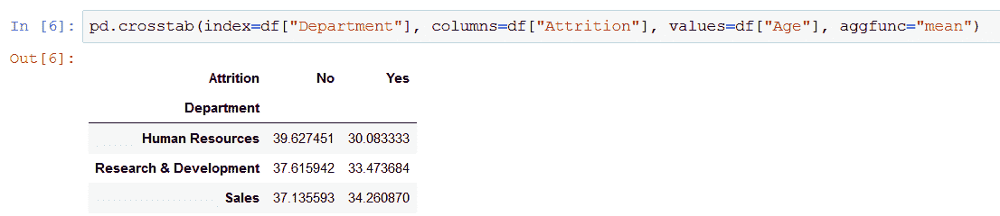

# 熊猫快速报告:快速探索，交叉表

> 原文：<https://blog.devgenius.io/pandas-rapid-reporting-quick-exploration-crosstab-b6511400c48e?source=collection_archive---------4----------------------->

## 使用熊猫进行快速探索、低调报道和分析的指南。

照片由来自 [pixabay](https://pixabay.com/) 的 [Pexels](https://pixabay.com/users/pexels-2286921/) 拍摄

当您获得一组新数据，并被要求进行一些快速(不，不是肮脏)的探索，甚至一些低调的报告和分析时，会发生什么？

嗯，你总是可以要求更多的时间，或者使用阿加莫托的*之眼，*但是你通常不能真正要求更多的时间，而且你很可能不是最高魔法师。

幸运的是，熊猫有一些巧妙的方法供你使用，让你非常容易获得令人印象深刻的洞察力，而无需花费数小时去挖掘、寻找、计算/求和。

对于本文，我将使用 Kaggle 的 [IBM HR Analytics 员工流失&性能数据集。](https://www.kaggle.com/pavansubhasht/ibm-hr-analytics-attrition-dataset?select=WA_Fn-UseC_-HR-Employee-Attrition.csv)

# **偷看数据**

假设我们不必担心数据清理(这是我们接触科幻小说的最后一点，我保证)。我们只需要随便加载我们的 CSV 文件，调用 **head** 方法，看看到底是什么。

作者截图

嗯，看起来不错，但是，如果不滚动，我们甚至无法看到一个堆栈中的所有列。幸运的是，Pandas 为我们提供了 **DataFrame.columns()** 方法。

作者截图

这不仅仅是你用来追踪租金的栏目。有多少行和多少列？简单:看看 **DataFrame.shape** 属性:

作者截图

现在，我们已经绕着数据框架转了几圈，是时候看看内部了。这些数据是关于员工流失的，如你所见，我们列出了每个员工所在的部门。数据中的员工来自哪些部门？Series.unique()方法有答案:

作者截图

下一个合乎逻辑的问题可能是:那么，这些部门的雇员分布情况如何。在 Excel 中，这将是 countif 函数。在熊猫中，我们有 Series.value_counts()

作者截图

如果你想让结果更漂亮一点，就把它包在熊猫里。数据帧()

作者截图

因为我们正在处理流失数据，所以在数据收集期间看看流失情况会很好，对吗？类似 pd.crosstab()这样的文件可以完成这个任务:

作者截图

您想包含更多维度吗？没问题。只需使用一个列表作为*索引* / *列*参数，并提供您希望看到的系列。

作者截图

相当令人印象深刻吧，用一行甚至不长的代码？现在，crosstab 有几个值得研究的参数。

> 如果你想让我保持咖啡因创造更多这样的内容，请考虑支持我，只要一杯咖啡。

## **正常化**

为了得到小计的比率，*规格化*参数开始起作用。您可以跨索引、列或整个表计算比率。看看各部门的人员流失率:

作者截图

## **保证金**

您可以一次获得小计、行和列总计以及雇员总数。

作者截图

## **值**和 **aggfunc**

使用 *values* 参数，您可以指定想要用于创建新数据帧值的列。例如，我选择了“年龄”列。重要的是要注意，如果你指定了这些值，你必须通过 *aggfunc* 参数提供 Pandas 应该对这些值做什么:

作者截图

目前这并不太令人兴奋，我们已经看到了这张图片，但是现在想象一下，您想知道每个部门/自然减员的平均年龄。你所要做的就是将 *aggfunc* 改为“mean”:

作者截图

让我们看看如何将上述内容结合起来:我们想了解离家的距离是否会影响减员:

作者截图

当然，这不是任何合适的数据科学家都会毫不犹豫地接受的分析，但是，这可能会给你一个线索，说明员工留在公司的意愿与他们到公司的距离之间的关系。

我写这篇文章的目的是为了说明，如果您想用一个看似难以理解的数据集展示有趣的东西，没有必要进行大量的数据争论。如果您经常遇到不熟悉的数据需要快速输出的情况，您甚至可以考虑为数据探索的基础编写一个通用的第一响应脚本，然后在此基础上，您可以使用一些交叉表魔术。

*更多内容看* [*说白了. io*](http://plainenglish.io/) *。报名参加我们的* [*免费周报在这里*](http://newsletter.plainenglish.io/) *。*