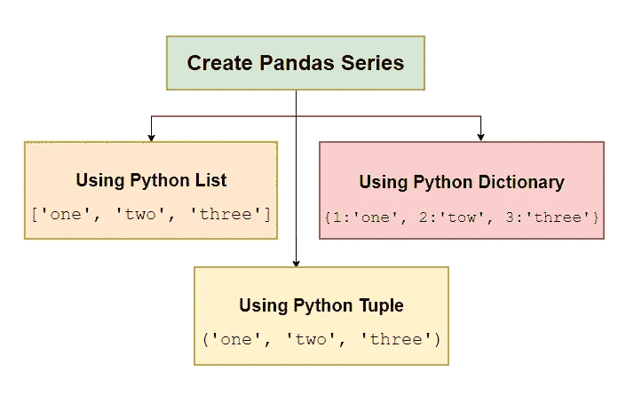

# 熊猫系列:从新手到专家——第一集

> 原文：<https://blog.devgenius.io/pandas-series-from-novice-to-professional-part-01-94537eb7c409?source=collection_archive---------9----------------------->

## 创建和转换熊猫系列的数据类型

系列是一维的索引数据结构，用于保存任何类型的数据(整数、浮点、字符串、对象、布尔等)。它就像 excel 数据表中的一列。系列是熊猫数据框的基础，熊猫数据框是一个二维数据结构，用于存储像 excel 表一样的平面文件。在本文中，我们将讨论以下主题。

*   从 python 列表、元组和字典创建熊猫系列
*   创建带有自定义索引的序列
*   使用深层复制和浅层复制从 Numpy 数组创建序列
*   创建分类系列
*   熊猫系列的属性
*   熊猫系列的内存使用
*   检查序列是否有缺失值
*   推断序列的数据类型
*   推断并将序列转换为正确的数据类型
*   将序列转换为数字数组

# 创建熊猫系列的模板

# 创作熊猫系列

Pandas 系列可以使用 python list、tuple 或 dictionary 数据结构创建，遵循代码片段显示三种方法。

## 使用列表

*   python 中的列表可以使用括号`[]`作为`[‘USA’, ‘UK’, ‘China’]`来创建。
*   列表是一种可变的数据结构，可以保存任何类型的数据，如文本、数字、布尔值等。
*   数字数据元素应该用逗号分隔，不带单引号或双引号，而文本数据应该用逗号分隔，带单引号或双引号。

## 使用元组

*   python 中的元组可以使用`()`括号作为`(2, 5, 8)`来创建。
*   元组是不可变的数据结构，这意味着我们不能在创建元组之后改变它的元素。
*   元组可以保存任何类型的数据，如文本、数字、布尔值等。
*   数字数据元素应该用逗号分隔，不带单引号或双引号，而文本数据元素应该用逗号分隔，带单引号或双引号。

## 使用字典

*   键值对类型的数据可以存储在 python 字典中。
*   键是索引，值是序列的数据元素。

# 创建带有自定义索引的序列

*   默认情况下，序列索引以`0.`开头
*   我们可以通过给出索引列表来屏蔽序列的默认行为。
*   索引可以是数字，也可以是文本类型。

*   在字典数据结构的情况下，`index`参数列表与字典的`keys`匹配，如果匹配，则值将是结果序列的一部分，否则`NULL`将是结果序列的一部分。

# 使用深层复制和浅层复制从 Numpy 数组创建序列

*   创建一个名为`array_data`的 NumPy 数组
*   用`copy = True`从`array_data`创建系列`ser`
*   `copy = True`表示`array_data`到`ser`对象的深层复制
*   深度复制意味着`array_data`不会因改变系列(`ser`)数据而改变。
*   `copy = False`表示`array_data`到`ser`对象的浅层拷贝
*   浅拷贝意味着`array_data`将通过改变系列(`ser`)数据而改变。

# 创建分类系列

Pandas 继承了 R 编程语言的大部分功能。r 编程有一个 factor 数据结构，用于存储有限数值集中的分类数据。例如，`gender`列值应该是`male`或`female`。`marital status`列值来自集合`married`或`divorced`。熊猫也有同样的数据结构`pd.Categorical(list_data).`

*   `pd.Series(pd.Categorical(list_data))`显示关于该系列的大量信息，使其具有`3`对象，并且该系列的所有值都来自`{C++, Python, R}`

# 熊猫系列的属性

*   `name_series.index`收益指数系列
*   `name_series.values`返回序列的值
*   `name_series.dtype or name_series.dtypes`返回系列的数据类型
*   `dtype(‘O’)`是对象数据类型
*   `name_series.shape`返回数列的形状
*   `(4, )`表示数列中有四个元素。

# 熊猫系列的内存使用

*   `range(1, 1000)`创建一个列表的第一个`999`自然数
*   从第一个`999`自然数创建一个序列`ser`
*   `ser.nbytes`用于返回`bytes`的编号，用于存储`int64`类型的底层数据。
*   `ser.memory_usage()`用于返回存储序列的内存使用情况。
*   `ser.astype(‘int32’)`用于改变系列的数据类型。
*   现在只需要`3996`个字节来存储底层数据，大约是`int64` 数据类型的一半。
*   通过将系列的数据类型从`int64`更改为`int32`，内存使用量也从`8120`减少到了`4124`字节

# 检查序列是否有缺失值

*   创建一个空系列`ser`
*   `ser.empty`如果系列中没有元素，则返回 true
*   `ser.hasnans`如果序列中缺少值元素，则返回 true

# 推断序列的数据类型

*   我们创建了一个序列，前 4 个元素是文本数据类型
*   从第 5 个数据成员到第 8 个数据成员的元素是整数。
*   从第 9 个数据成员到第 12 个数据成员的元素是布尔值。
*   `ser.iloc[:4].infer_objects().dtypes`推断并返回`ser`系列前四个元素的数据类型。
*   `ser.iloc[4:8].infer_objects().dtypes`推断并返回`ser`系列接下来四个元素的数据类型。
*   `ser.iloc[8:12].infer_objects().dtypes`推断并返回`ser`系列的下四个元素的数据类型。

# 推断并将序列转换为正确的数据类型

*   创建一系列`object`数据类型的`ser1`
*   `ser1.dtype`返回`ser1`系列的数据类型
*   `ser1 = ser1.convert_dtype()`推断并为序列分配正确的数据类型，并分配给`ser1`。
*   `ser2`和`ser3`的程序相同

# 将序列转换为数字数组

*   创建一个系列`ser.`
*   `ser.to_numpy()`返回 NumPy 数组中系列的值。
*   `ser.values`返回 NumPy 数组中系列的值。

# 结论

在本文中，我们学习了如何使用不同的 python 和 NumPy 数据结构创建一个系列。我们学习了将序列从一种数据类型转换为另一种数据类型，序列和类型推断的内存使用，以及转换为适当的数据类型。