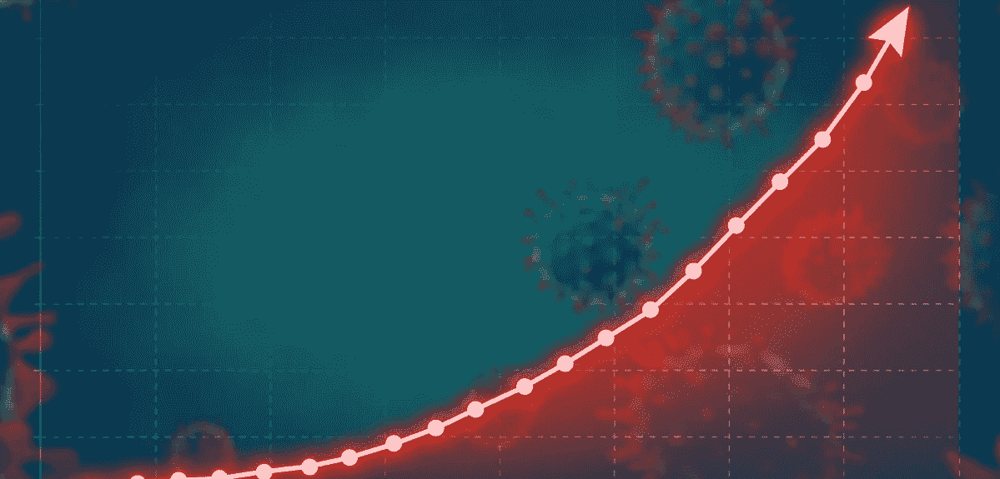
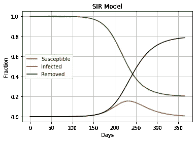
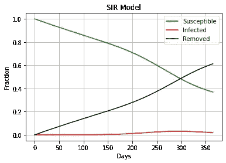
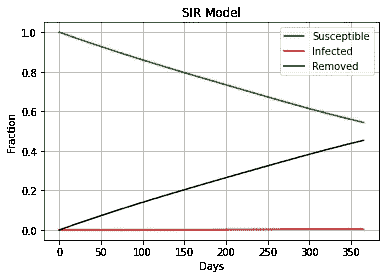

# 用 Python 进行疫情建模:SIR 模型

> 原文：<https://blog.devgenius.io/pandemic-modeling-with-python-the-sir-model-16b5f8348e85?source=collection_archive---------3----------------------->



[(图片来源)](https://news.cnrs.fr/articles/covid-19-how-are-epidemic-models-designed)

数据科学家，特别是医疗保健领域的数据科学家，可能要做的事情之一是模拟我们目前正在经历的传染病、流行病或疫情的传播。模拟实际上并没有看起来那么复杂。SIR 模型是一种相当简单但有效的模型。

**爵士模型**

SIR 在一个缩写中表示易感、感染和清除(认为痊愈)。该模型假设人口保持不变，在传播过程中的任何时间点，都有易受感染但尚未感染的人、已感染的人和已经感染的人。你还假设人群从易受感染到被感染再到被清除(康复或死亡)。

**SIR 方程式:**

在任何时候，易感人群都是尚未被感染或移除的群体。假设我们从第 1 天开始，n，我们可以代表 S 人口如下:

S=S-I-R

现在向前看，在每一步中，我们必须从易感人群中剔除被感染的人数。现在每个被感染者可以感染 S 的一部分，这个部分用 b 来表示，这样被感染者感染的人数就是 BXS。下一步受感染的总人数将是 I x β x S(n)。因此，如果起点在 n，则在下一步 S 人口中，n+1 将表示为:

S(n+1) = S(n) - I(n) x β x S(n)

S(n+1) = S(n) - I(n) x β x S(n)

保持同样的逻辑，我们可以计算下一步的恢复人数。考虑感染人群的γ分数每天恢复。所以第二天，恢复的人数会增加γ x I(n)，所以我们可以计算 R 为:

R(n+1) = R(n) + γ x I(n)

下一个部分是计算感染人数。这有点复杂，因为新感染的要加上，恢复的要减去。每天，I 的每个成员感染 S 的β部分，因此 I 增加 I x β x S，而 I 的γ部分恢复。

I(n+1) = I(n) + I x β x S(n) - γ x I(n)

现在我们知道了人群是如何从 S 发展到 I 再到 R 的，我们可以绘制出一段时间内这种变化的人群类型，并预测疾病在人群中传播的过程。

**接种疫苗**

接种疫苗将保护一部分 S 人群，因此我们将他们从 S 人群中移除并添加到 R 人群中。接种疫苗的这部分人由 kvacc 代表。因此，我们可以将等式改为:

S(n+1)= S(n)-I(n)xβx S(n)-kv ACC x S(n)x I(n+1)

= I(n)+I xβx S(n)-γx I(n)+kv ACC x S(n)

用 python 编写 SIR 模型的代码 SIR 模型的目的是绘制疾病在人群中传播的过程。我们可以编写一个函数，取β、γ和人口中的人数，并绘制出在参数 days 指定的一段时间内 S、I 和 R 的每日数量。

```
from matplotlib import pyplot as plt
def sir(beta, gamma, population, days, kvacc=0):
    plt.clf 
    N=population
    I=[1/N]
    S=[1.0-I[0]]
    R=[0]
    T=[0]

    for t in range(days):
        s=S[t]-I[t]*beta*S[t]-kvacc*S[t]
        i=I[t]+I[t]*beta*S[t]-I[t]*gamma
        r=R[t]+I[t]*gamma+kvacc*S[t]

        S.append(s)
        I.append(i)
        R.append(r)
        T.append(t+1)

    _ = plt.figure(figsize=(6,4))
    plt.plot(T,S, 'green', label='Susceptible')
    plt.plot(T,I, 'red', label='Infected')
    plt.plot(T,R, 'black', label='Recovered')
    plt.xlabel('Days')
    plt.ylabel('Fraction')
    plt.title('SIR Model')
    plt.grid(True)
```

标绘的数据 1/β代表一个感染者会继续传染他人的天数，所以如果我们说，一个感染者在传染期为 10 天，β=1/10 或 0.1。同样，如果我们说恢复需要 20 天，那么 1/γ就是 20，γ=1/20 或者γ= 0.05。我们可以绘制这个模型，想象我们有 10 万人口。我们希望显示一年或 365 天的数据。

```
sir(0.1, 0.05, 100000, 365)
```



因此，疾病过程的进展受到β和γ的影响。任何加速恢复的东西都会增加γ，任何降低传染性或提供感染保护的东西都会降低β。

**疫苗接种:**假设我们有一个疫苗，我们每天为 0.15%的人口接种疫苗。所以我们可以画出图表，看看是否有所不同。我们的 kvacc 是 0.0015%。

```
sir(0.1, 0.05, 100000, 365, 0.0015)
```



你可以看到这是如何“拉平”曲线并阻止峰值的。

**药物/治疗:**假设我们想出了一种可以将恢复时间缩短一半的治疗方法。所以现在我们的γ是 1/10 或者 0.1。让我们绘制数据。

```
sir(0.1, 0.06, 100000, 365, 0.0015)
```



这是一个非常基本的 SIR 模型。显然，它不能 100%适用于任何人群。该模型假设人口是静态的，但实际上，没有人口是静态的，而是动态的，人们进出人口。在 SIR 模型中可以考虑许多其他参数，如最初感染的数量、潜伏期等。但是一个基本的 SIR 模型是一个好的开始。