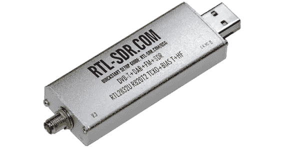

# 全景调频，或如何使用 SDR 查看所有调频电台

> 原文：<https://blog.devgenius.io/panorama-fm-or-how-to-see-all-fm-stations-using-sdr-b18b88210a09?source=collection_archive---------3----------------------->

可能每个对无线电和通信有点兴趣的人都知道，使用 SDR 接收机可以同时接收和处理宽带无线电频谱。在 HDSDR 或 SDR#这样的程序中显示瀑布并不奇怪。我将展示如何使用 RTL-SDR、GNU Radio 和大约 100 行 Python 代码构建 FM 频段的伪 3D 频谱。


我们还将采用一个功率更大的接收机，研究整个 FM 波段 88–108 MHz。

从技术上讲，这项任务相当简单。SDR 接收器使用速度相当快的 ADC 对输入的无线电信号进行数字化处理。在输出端，我们得到一个宽带 IQ 信号，它是来自 ADC 的一组数字，带宽对应于 ADC 的采样速率。ADC 频率决定可以使用的最大带宽。这与 PC 声卡中的过程相同，只是我们每秒不是 22.050，而是 2.000.000，甚至 10.000.000 个样本。为了在屏幕上显示无线电频谱，我们必须对数据阵列执行快速傅立叶变换，它将数据从所谓的时域转换到频域。然后我们把数据显示在屏幕上，问题就解决了。我也会尽量使用最少的代码，这样 GNU Radio 就可以帮助我们进行数据处理。

为了测试，我们首先需要一个 RTL-SDR 接收机，价格大约是 35 美元。它允许我们在 70 年代接收无线电信号..使用高达 2 MHz 带宽的 1700 MHz 频率范围:



如果有人想使用 RTL-SDR 进行测试，建议使用照片上的接收器。有更便宜的仿制品，但质量较差。

好吧，我们开始吧。

# GNU 无线电处理

首先，我们需要从接收器获取并处理数据。GNU 无线电连接图如图所示:


正如我们所看到的，我们从接收器获取数据，将连续的数据流转换为一组 1024 个值大小的“向量”，对这些向量执行 FFT，将值从复数转换为实数，最后通过 UDP 发送数据。当然，所有这些都可以使用 *SoapySDR* 和 *numpy* 库在纯 Python 中完成，但是代码量会更大一些。

**QT GUI 频率接收器**模块仅在调试时需要，使用该模块，我们可以确保无线电台可见，并在必要时调整接收器增益。当应用程序运行时，图片应该如下所示:


如果一切正常，可以禁用频率接收块，同样在 GNU Radio 项目设置中，我们可以选择不指定 GUI 模式，这样就不会浪费 UI 资源。原则上，这个程序可以在没有任何 UI 的情况下作为服务运行。

# 翻译

因为我们通过 UDP 传输数据，所以我们可以用任何客户端接收它，甚至在另一台 PC 上。我会用 Python，对于原型来说已经相当够用了。

首先，让我们获取 UDP 数据:

```
fft_size = 1024
udp_data = None
UDP_IP = "127.0.0.1"
UDP_PORT = 40868sock = socket.socket(socket.AF_INET, socket.SOCK_DGRAM)  *# UDP*
sock.setsockopt(socket.SOL_SOCKET, socket.SO_REUSEADDR, 1)
sock.bind((UDP_IP, UDP_PORT))
sock.settimeout(0.5)try:
    data, addr = sock.recvfrom(fft_size * 4)
    if len(data) == 4096:
        udp_data = np.frombuffer(data, dtype=np.float32)
        return True
except socket.timeout:
    pass
```

因为我们处理图形，所以使用 **pygame** 库很方便。绘制 3D 光谱很简单，我们将数据存储在一个数组中，从上到下，从旧到新绘制线条。

```
fft_size = 1024
depth = 255
fft_data = np.zeros([depth, fft_size])def draw_image(screen, font):
    x_left, x_right, y_bottom = 0, img_size[0],  img_size[1] - 5
    *# Draw spectrum in pseudo-3d*
    for d in reversed(range(depth)):
        for x in range(fft_size - 1):
            d_x1, d_x2, d_y1, d_y2 = x + d, x + d + 1, y_bottom - int(y_ampl*fft_data[d][x]) - y_shift - d, y_bottom - int(y_ampl*fft_data[d][x+1]) - y_shift - d
            if d_y1 > y_bottom - 34: d_y1 = y_bottom - 34
            if d_y2 > y_bottom - 34: d_y2 = y_bottom - 34
            dim = 1 - 0.8*(d/depth)
            color = int(dim*data_2_color(fft_data[d][x]))
            pygame.draw.line(screen, (color//2,color,0) if d > 0 else (0, 250, 0), (d_x1, d_y1), (d_x2, d_y2), (2 if d == 0 else 1))
```

我们还可以在屏幕上显示频率和电台名称。傅立叶变换算法给出对应于接收器带宽的 1024 点的输出。我们知道中心频率，所以计算像素位置可以使用小学公式。

```
stations = [("101.8 FM", 101.8), ("Rock FM", 102.4), ...]
for st_name, freq in stations:
    x_pos = fft_size*(freq - center_freq)*1000000//sample_rate
    textsurface = font.render(st_name, False, (255, 255, 0))
    screen.blit(textsurface, (img_size[0]//2 + x_pos - textsurface.get_width()//2, y_bottom - 22))
```

实际上就是这样，我们可以同时运行两个程序，在屏幕上，我们会看到一个全景，实时显示当前工作的调频电台:


很容易看出，不同的电台有不同的信号水平，我们甚至可以区分单声道和立体声广播。

好了，现在我将展示整个调频波段的全景。为此，我们必须将 RTL-SDR 放在一边，使用更好的无线电。例如，像这样:


我用的是专业级的 Ettus Research SDR，但是从代码角度来看，一切都是一样的，只是需要在 GNU Radio 中把一个块换成另一个块。因此，它在接收带宽为 24 MHz 的频谱上寻找:


有趣的是，不同调频电台的信号强度各不相同。

当然，不仅可以接收 FM 电台，还可以接收 SDR 工作频率范围内的任何其他电台。例如，这是[气垫](https://en.wikipedia.org/wiki/Airband)的样子:


我们可以看到一些永久运行的频率(可能是 ATIS 气象局)和地面与飞行员之间断断续续的无线电通信。这是 GSM 频段频谱的样子(GSM 信号比 24 MHz 更宽，不完全符合):


# 结论

正如我们所见，无线电频谱的研究相当令人兴奋，尤其是在 3D 方面。当然，这里没有制造另一个频谱分析仪的目的，这只是一个好玩的原型。唉，渲染很慢，Python 不是在屏幕上显示几千个图元的最佳选择。线条着色算法也可以改进。

像往常一样，祝所有读者实验成功。

完整的渲染源代码附后。

```
import numpy as np 
from matplotlib import pyplot as plt 
from PIL import Image, ImageDraw 
import sys 
import pygame 
from pygame.locals import * 
from threading import Thread 
import io 
import cv2 
import time 
import socket# FFT
receiver_name = "RTL-SDR"
center_freq = 102.5
sample_rate = 1800000stations = [("101.8", 101.8), ("102.1", 102.1), ("102.4", 102.4), ("102.7", 102.7), ("103.0", 103.0), ("103.2", 103.2)]# Load data from UDP
UDP_IP = "127.0.0.1"
UDP_PORT = 40868
udp_data = None
sock = None# Panorama history
fft_size = 1024
depth = 255
fft_data = np.zeros([depth, fft_size])# Canvas and draw
img_size = (fft_size, fft_size*9//16)
y_ampl = 90
color_ampl = 70
y_shift = 250 def udp_prepare():
    global sock
    sock = socket.socket(socket.AF_INET, socket.SOCK_DGRAM)  # UDP
    sock.setsockopt(socket.SOL_SOCKET, socket.SO_REUSEADDR, 1)
    sock.bind((UDP_IP, UDP_PORT))
    sock.settimeout(0.5)def udp_getdata():
    global sock, udp_data
    try:
        data, addr = sock.recvfrom(fft_size * 4)
        if len(data) == 4096:
           udp_data = np.frombuffer(data, dtype=np.float32)
           return True
    except socket.timeout:
        pass
    return Falsedef clear_data():
    for y in range(depth):
        fft_data[y, :] = np.full((fft_size,), -1024)def add_new_line():
    global udp_data, fft_data
    # Shift old data up
    for y in reversed(range(depth - 1)):
        fft_data[y + 1, :] = fft_data[y, :]
    # Put new data at the bottom line
    if udp_data is not None:
        fft_data[0, :] = udp_datadef data_2_color(data):
    c = -data + 2  # TODO: detect noise floor of the spectrum
    color = 150 - int(color_ampl * c)
    if color < 20:
        color = 20
    if color > 150:
       color = 150
    return colordef draw_image(screen, font):
    x_left, x_right, y_bottom = 0, img_size[0], img_size[1] - 5
    # Draw spectrum in pseudo-3d
    for d in reversed(range(depth)):
      for x in range(fft_size - 1):
         d_x1, d_x2, d_y1, d_y2 = x + d, x + d + 1, y_bottom - int(y_ampl*fft_data[d][x]) - y_shift - d, y_bottom - int(y_ampl*fft_data[d][x+1]) - y_shift - d
         if d_y1 > y_bottom - 34: d_y1 = y_bottom - 34
         if d_y2 > y_bottom - 34: d_y2 = y_bottom - 34
         dim = 1 - 0.8*(d/depth)
         color = int(dim*data_2_color(fft_data[d][x]))
         pygame.draw.line(screen, (color//2,color,0) if d > 0 else (0, 250, 0), (d_x1, d_y1), (d_x2, d_y2), (2 if d == 0 else 1)) # Bottom line
    pygame.draw.line(screen, (0,100,0), (x_left, y_bottom - 30), (x_right, y_bottom - 30), 2) # Station names
    for st_name, freq in stations:
        x_pos = fft_size*(freq - center_freq)*1000000//sample_rate
        textsurface = font.render(st_name, False, (255, 255, 0))
        screen.blit(textsurface, (img_size[0]//2 + x_pos - textsurface.get_width()//2, y_bottom - 22)) text_mhz = font.render("MHz", False, (255, 255, 0))
    screen.blit(text_mhz, (img_size[0] - 5 - text_mhz.get_width(), y_bottom - 22)) if __name__ == "__main__":
    # UI init
    screen = pygame.display.set_mode(img_size)
    pygame.display.set_caption(receiver_name)
    pygame.font.init()
    font = pygame.font.SysFont('Arial Bold', 30) # Subscribe to UDP
    clear_data()
    udp_prepare() # Main loop
    is_active = True
    while is_active:
        # Get new data
        if udp_getdata():
            add_new_line() # Update screen
            screen.fill((0, 0, 0))
            draw_image(screen, font)
            pygame.display.flip() # Check sys events
        for events in pygame.event.get():
            if events.type == QUIT:
                is_active = False
```