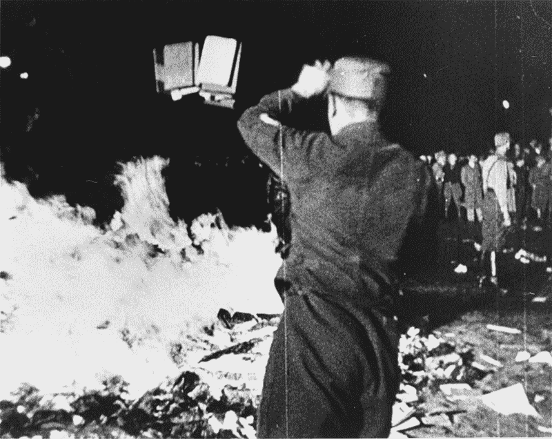
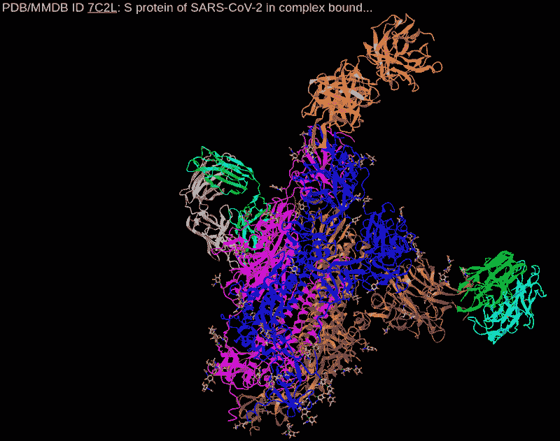
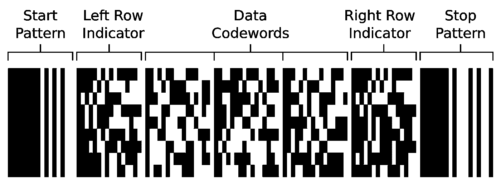
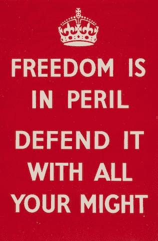
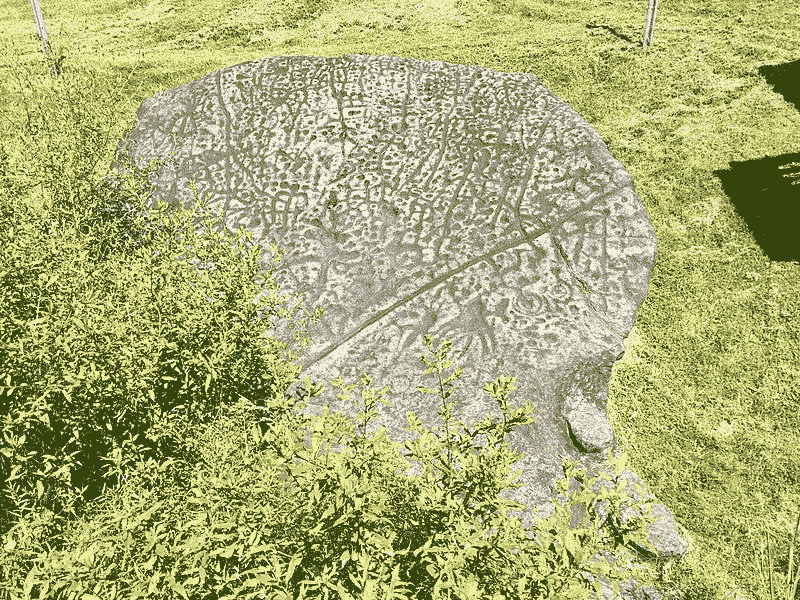
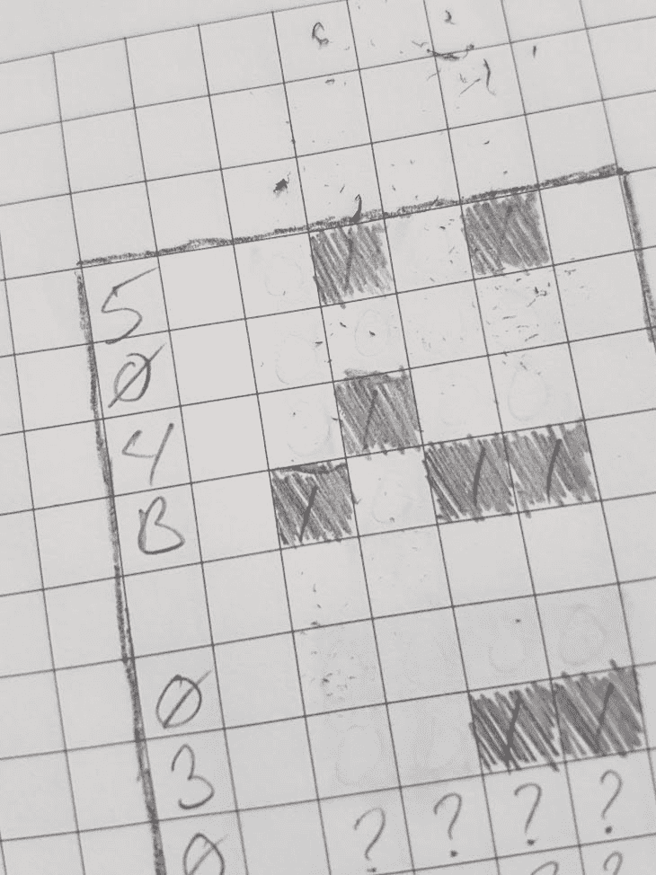

# 作为数字存储介质的纸张

> 原文：<https://blog.devgenius.io/paper-as-a-digital-storage-medium-4096c5062da?source=collection_archive---------12----------------------->

## 分发当前的数据并为未来保存数据

一种读写数据的描述，具有数字数据的再现性和纸张的长期存储能力。

 [## 阻止 Wiki dpub /条形码 EPub GitLab

### 使用条形码作为存储介质的实验。目的是创建一个 EPUB 阅读器，将它的数据存储在…

gitlab.com](https://gitlab.com/dpub/barcode-epub/-/wikis/Specs/Blocks) 

# 两个故事

## 一个关于匿名的故事

最近，我们看到了一场信息战。在俄罗斯，新闻来源因批评他们入侵乌克兰而被封杀。在中国，网络言论受到监控，可能导致个人遭受[惩罚性](https://www.wsj.com/articles/hong-kongs-crackdown-on-dissent-hits-facebook-pages-11660645491) [损害赔偿](https://en.wikipedia.org/wiki/Social_Credit_System#Examples_of_policies)。沙特阿拉伯要求邻国谴责对方。

二战后，我的祖父母从欧洲移居到了北美。欧洲在战后遇到了麻烦，就像许多其他难民一样，我祖父母拥有的一切都失去了，所以移居到一个充满机会的新大陆激发了他们的想象力。我是在祖母和各种各样的阿姨们传给我的故事中长大的，这些故事激励我去读更多的书。

一个一直让我印象深刻的故事是焚烧禁书。很自然，我们在几个世纪以来的几个国家看到了这种情况，因为某些信仰体系被压制，但最著名的是 1933 年对德国柏林性学研究所的突袭。

1933 年焚烧“非德国”作品[ [维基百科，公共领域](https://commons.wikimedia.org/wiki/File:1933-may-10-berlin-book-burning.JPG) ]

T2 性科学研究所(Institut für Sexualwissenschaft)是欧洲致力于研究和倡导替代性行为的领先组织，5 月 6 日，政府官员突袭了该机构。性别研究的许多早期研究(和宣传)被拖到街上，因为“非德国”而被戏剧性地摧毁。

当人们第一次听说这个故事时，他们理所当然地为那些永远丢失的知识感到悲伤，但也有一个教训是从后来的故事中学到的，即战后从某人的地下室中找到了丢失的宝藏。我脑海中的故事是这样的。

> 马格努斯·希施菲尔德出版了一本巨著，并给了他所有的学生。教授和他的学生被逮捕、处决，他们的私人图书馆被洗劫一空。幸运的是，他的一个学生李少彤把这本书借给了一个熟人。这位熟人同情国家民主行动党当局，但也不想给他的朋友带来麻烦，已经把它放在他的书架上，忘了这件事。几年后，当他去世时，他的妻子把所有的书放进盒子里，存放在阁楼上，在接下来的 30 年里，它们一直呆在那里，因为没有人在一个被遗忘的收藏中寻找一本被遗忘的书。

在我的内部叙述中，这发生在东德，斯大林继续压迫同性恋。这本书完全丢失了，除了一次意外，它被放在一个盒子里被遗忘了。当社会为变革做好准备时，它就有了新生的机会。

被遗忘和匿名的能力在传播不同意见方面具有重要的力量。

在现代，随着信息传递系统变得更加强大，我们看到同样的知识毁灭正在发生，尽管是以一种更加微妙的方式。随着分发成本的降低，我们已经看到数据变得集中化:用手机访问维基百科比下载页面并随身携带要容易得多。此外，维基百科有一个与文档相关的开放的编辑历史，不是所有的网站都这么开放。

这导致了两种风险:

1.  在单个组织的归档中，存在内容从库(web 服务器)中被删除的风险。在上面的例子中，赫希菲尔德已经表示，如果研究所关闭，他的图书馆应该捐赠给大学。这种情况从未发生过，强制关闭被认为是合法的，确保了所有副本都被销毁。
2.  这种集中化意味着对内容的编辑可以在没有维护历史副本的情况下进行。编辑历史记录丢失了，永远无法追踪观点的重大转变。历史是可以改变的。

[互联网档案馆](https://blog.archive.org/2022/09/06/building-democracys-library-celebrate-with-the-internet-archive-on-october-19/) [展示了](https://blog.archive.org/2022/03/10/guest-blog-an-egyptian-perspective-on-american-book-banning/)这样做的必要性:网站和内容被定期从互联网上移除，原因无伤大雅，如成本(开发 Git 的部分原因是为了保护 OSS 不被关闭的公共服务器丢失)，以及邪恶的如[政府关闭新闻站](https://www.cnn.com/2022/03/04/media/russia-media-crack-down/index.html)以压制异议。像互联网档案馆这样的中央存储库通过允许我们观察变化来帮助保护知识，但也因为是历史的唯一保管者而将知识置于危险之中。

通过将数据分布在多个书架上，可以防止数据完全丢失。

## 关于储物的故事

很多年前，我听过一个故事。我不知道这是不是真的，但它带来了宝贵的教训。

在 90 年代早期，一个令人惊奇的产品出现了，它允许人们生成比以前更多的数据，而且质量比以前更高:微软 Word。以前储存在纸上的东西现在可以数字化编码并储存在磁盘上。档案管理员喜欢它，他们把数据填充到磁盘的左、右、中间。

90 年代末，微软升级了 Word。

转换成不兼容的格式。

没有办法返回并恢复所有长期存储的数据。从法律上来说，他们是不允许这样做的，因为它必须完全按照入库时的样子储存(并签字)。

另一方面，磁存储会随着时间的推移而退化，并且受到非常有限的环境条件的影响。很容易损坏存储介质。

在我被告知的故事中，美国国会图书馆的档案员说“你知道什么不会降级吗？纸。”开始把所有东西打印到纸上，把纸捆起来，存放在现有的保险库里。

如果有一种方法可以两全其美呢？如果数字存储的保真度和纸张的寿命一样，那将会怎样？智能设备中可用的传输量，以及面对面交谈的匿名性？

不幸的是，现在产生的很多数据都是动态的。所谓“动态”，我的意思是你可以与观想本身互动(滚动地图；旋转三维模型；过滤、搜索、聚合海量数据集)；一旦它被打印到纸上，那就不再可能了。

新型冠状病毒蛋白质互动可视化的静态图像([美国国家医学研究所](https://structure.ncbi.nlm.nih.gov/icn3d/share.html?s8hdP5Ji5CSvgs4V9))

此外，很难将大型数据表从纸质媒体转移到数字媒体。将文档作为图像扫描并使用 OCR 收集信息表会丢失大量元数据:

*   数据类型必须从内容中猜测
*   对齐问题导致数据被视为脱离上下文
*   字符保真度会导致解释不正确的值

虽然高分辨率摄影和人工智能确实提高了扫描内容的质量，但数据传输仍然是模拟的，这将导致一些错误。

# 定义问题

如果有一种方法可以在两个世界之间达成妥协，那会怎么样呢:纸张的长期存储，数字的高保真；私人谈话的匿名性，与计算机网络的分布能力？

我们正在寻找一种将数字信息存储在物理介质上的方法，如纸张或蚀刻在石头上的方法。我们可以称之为“可见”媒体。

## 数字的属性

公司、政府和个人都希望长期存储数据以用于法律存档。这很难做到。在过去的 20 到 30 年里，随着我们从纸质存储转向磁性存储，数字存储的成本已经降低。这给必须存储由此产生的大量数据的档案工作者提出了一个问题:随着我们制作数据变得越来越便宜，档案工作者存储这些数据就变得更具挑战性。

数据必须有一种简单的解释方式:它必须以一种易于转换成人类可读的格式存储。开源标准是有优势的，因为它们不受知识产权的限制，并且容易被更多的专家理解。

复制数字数据是我们理所当然的事情。当我们复制数字数据时，它是一个精确的副本。例如，当录制成高分辨率格式时，音乐会失去一些保真度，但是，从该点开始的歌曲复制会保留一个精确的副本(以位的分辨率)。

## 存储介质的属性

虽然在石头上蚀刻或在木头上雕刻是可行的选择，但是这些介质的重量和体积对存储空间和重量造成了障碍。亚麻布和棉布床单是较轻的选择，但生产成本较高。聚酯薄膜和投影胶片减小了尺寸，这提供了很好的潜力。

现代档案纸代表了持久性、重量和体积的平衡。这些中的每一个都可以(并且应该)被考虑用于不同的目的，事实上，该解决方案应该适用于所有这些解决方案。我们讨论纸作为主要媒体，是因为纸作为存储媒体有如此丰富的进化史。

为了实现数字存储机制，它必须提供合理的压缩级别。所谓压缩，我们指的是每平方英寸或每磅所储存的信息量。这意味着它应该能够被记录在一个小的物理空间中，尽管这必须与容易读回它的能力相平衡。

# 解决办法

通过结合这两种媒体的需求，我们可以将现有的技术组合在一起，创建一个独特的解决方案。 [ePUB](https://en.wikipedia.org/wiki/EPUB#Version_3.2) 是一种用于电子书的[开源容器格式](https://www.w3.org/TR/epub-33/)，它为大量数据提供了一种标准化([ISO/IEC TS 30135–1:2014](https://www.iso.org/standard/53255.html))和无障碍的格式。此外，使用 2D 条形码(以 QR 码的形式)作为传输 URL 的手段已经变得无处不在，然而，从根本上说，它们只是二进制缓冲器，能够存储任何编码的数字序列。

## ePUB

*   多样化的数据存储
*   压缩
*   可访问性一致性
*   广泛消费

从纸质出版到屏幕媒体的转变带来了一些过渡性的挑战。PDF 作为一种将纸张数字化的手段以及作为纸张和数字格式之间的媒介而得到普及。在与纸张截然相反的另一端，数字化标准(如由 [W3C](https://www.w3.org/) 开发的标准)已经被优化，以交付给未知的显示器。

HTML 引入了重新格式化内容的概念，以适应消费者的需求。这意味着文本可以被屏幕阅读器阅读，可以为在小屏幕上阅读的人重排，或者为视力不好的人放大文本。这种格式的可访问性催生了现在由 W3C 管理的大量其他标准。这些标准确保了最大数量的消费者的最大可用性。

ePUB 利用这些标准将网站封装到单个文档中。他们将网页嵌入 ZIP 文件格式，以允许包含整个网站的查看。通常，文档被组织成章节。

通过使用通用的 ePUB 格式，任何人都可以阅读数字文档并对其进行解码。ePUBv3 允许嵌入 [JavaScript](https://en.wikipedia.org/wiki/EPUB#Version_3.2) ，这意味着你可以嵌入地图、交互式图表等。(像 [R-shiny](https://jefferey-cave.medium.com/turn-a-shiny-dashboard-into-a-desktop-app-6f51287b7d6f) ，但自成一体)。作为一个通用的 W3C 容器，还可以嵌入其他文件格式以供使用和保存:CSV 形式的数据集，或者视频形式的证据。

## 条形码

您可以将数字信息编码成条形码，然后打印到纸上进行长期存档，并且可以将条形码读回到数字设备上进行读取。

二维条形码作为一种对特定信息进行编码的手段已经使用了几十年。 [BRML](http://xml.coverpages.org/brml.html) ，文本，或其他数据格式，已经被附加到印刷文件中，如[驾照](https://en.wikipedia.org/wiki/Enhanced_driver%27s_license)和发票，以用数字信息补充文本。这通常相当于唯一的文档标识符或数字记录。

北美许多地方的驾照使用 PDF417 条形码[ [Wikimedia，CC-0](https://commons.wikimedia.org/wiki/File:PDF417_Example.svg) ]

对 ePUB 进行编码应该很简单，因为有几个问题:

1.  编码方案必须可被读者识别(数据中必须嵌入足够的信息，以允许读者重构正确的形式)
2.  单本书的大小可能会超过给定的 2D 条形码的存储容量。编码机制必须能够跨越多个图像块。
3.  有一个必须解决的社会问题，那就是人类不能直接阅读代码。出于法律、宗教或道德原因，他们可能不希望查看该材料。必须有足够的元数据允许查看者决定不接受该消息。

一旦发现问题，就很容易解决；以应用程序标识符、分页、标题、作者和主题的形式将元数据添加到单独的图块应该提供足够的信息，以允许用户与单独的图块交互并重构数据。

已经创建了一个概念原型来展示这种能力。原型的协议包括

1.  **一个 URL** :它指向阅读器，用于在线使用(仅浏览器)或作为 PWA 安装，或仅作为一个唯一标识符，表明这是一种兼容的格式
2.  **协议版本**:当发生变化时，使用正确的解码器很重要
3.  **分页**:当前图块编号和要转换的图块总数。这允许正确的排序以及进度的测量
4.  **书目**:标题、作者和主题允许读者决定这是否是他们感兴趣的内容，或者他们互动是否合法。可以添加过滤器来防止意外下载占用空间
5.  **家长分级**:对家长来说不算多，但通常是对某些类型的内容不感兴趣的人(例如过滤来自工作设备的`xxx`内容)
6.  **关联日期**:有些内容只到某一点有效，过了那个时间就应该忽略(演唱会海报)。给读者一个提示，也许这可以

有了每个区块中的这一信息，读取第一个图像可以导致向用户提供一些信息，允许他们决定是继续还是阻止。如果他们确定他们希望继续，则可以使用分页来确定缓冲区应该以什么顺序进行重建。

原型规范[提供了更多细节](https://gitlab.com/dpub/barcode-epub/-/wikis/Specs/Blocks)。

# 各种用途

## 安全档案

对档案的访问伴随着权限问题。控制对存储敏感数据的归档中的信息的访问可能很困难。使用这种编码机制相当于内容的一个信封。

在元数据的描述中，提出了内容分级。重用协议的这一部分来使用分类评级是非常容易的。被允许访问安全文档的用户可以让他们的专业阅读器在解码之前先检查内容的分类等级。如果个人只有[足够的权限](https://en.wikipedia.org/wiki/Classified_information#NATO_classifications)来查看一些相关的文档，但是该区域中的一些文档包含的信息超过了个人的当前权限，那么它可以作为查看它的二级过滤器。

显然，这将是帮助环境中诚实行为者的工具，而不是干扰恶意行为者的方法，但这是帮助行为者管理他们所拥有的信息的另一层保护。

## 情报传播

假设你在一个信息受到控制的地方，你可以把文章和时事通讯打印到纸上，然后扫描阅读。例如，它可以被印在小册子上或张贴在公告栏上，没有人会知道是谁出版了它([小心隐藏在打印输出上的条形码](https://en.wikipedia.org/wiki/Machine_Identification_Code#Protection_of_privacy_and_circumvention))。

在这种情况下，优势之一是高压缩比。在早期的一次测试中，一百页的小说被压缩成了 9 页的条形码。虽然仍然需要一些努力来分发，整部小说可以钉在一个软木板上。

这些内容会转化成你手机上可读的东西，比如一张鼓舞人心的海报。

【维基媒体，[公共领域](https://commons.wikimedia.org/wiki/File:Freedomisinperilposter.jpg)

## 远程互动媒体

教科书、海报和广告都有一个共同的元素，那就是必须在物理上有关联的位置展示内容:博物馆的标志、钉在灯柱上的海报。网络通信的访问没有保证，观众错过了一个机会。

举个例子，在山顶上有一个标志，祝贺一个登山者旅途成功。数字体验消息可以留在顶部，但需要配置和启动基于 WiFi 的网站。

或者，在海报本身上存储沉浸式体验将允许数字内容可用，但不需要任何电力来维护。

在这种情况下，将信息刻在更永久的东西上，如木头或石头，可能是合适的

朱达库拉岩石展示了公元前 2000 年的雕刻，展示了蚀刻石头的持久能力和低维护能力

# 结论

数据和信息的匿名和长期存储是必要的。思想的自由传播和储存以备将来参考，是社会进步的基本需要。虽然数字时代使信息获取比以往任何时候都更容易，但它也随之带来了许多新问题。

 [## 觉得这个免费内容有意思？考虑留下小费

### 我写一些关于软件和开发的东西，重点是讲述故事。故事帮助我们…

www.buymeacoffee.com](https://www.buymeacoffee.com/jeffereycave) 

使用纸张作为数字存储介质是解决一些新的问题环境的一种新颖且有用的方法。

如果你对这个概念感兴趣，我邀请你在 GitLab 上查看这个概念的原型[。有一个移动应用程序可以将 ePUB 转换为图像和纸张，然后再转换回来；就在你的智能手机上。](https://gitlab.com/dpub/barcode-epub)

你可以通过几种方式做出贡献:

1.  设计一个 UI:我只是从另一个项目中抓取了一个旧的来运行
2.  编写一个阅读器:目前，该应用程序充当书架。有些功能非常适合定制阅读器
3.  自定义过滤器:如果用户遇到他们不感兴趣的内容，他们应该能够根据作者和标题过滤内容。
4.  在你的学校里传一些纸条:使用一个系统突出了它的问题。使用这种编码机制将俱乐部列表张贴到学校的公告板上。

提交问题、发布合并请求或在下面留下评论。如果您发现此内容有价值，请记得[点击跟随按钮](https://jefferey-cave.medium.com/)。

 [## dpub /条形码 EPub GitLab

### 使用条形码作为存储介质的实验。目的是创建一个 EPUB 阅读器，将它的数据存储在…

gitlab.com](https://gitlab.com/dpub/barcode-epub) 

## 更新— 2022 年 11 月 15 日

从互联网档案中

[电子书比实体书磨损得更快(2022 年 11 月 15 日)](https://blog.archive.org/2022/11/15/digital-books-wear-out-faster-than-physical-books/)