# 论文解释——NeRF:将场景表示为用于视图合成的神经辐射场

> 原文：<https://blog.devgenius.io/paper-explained-nerf-representing-scenes-as-neural-radiance-fields-for-view-synthesis-e16567180531?source=collection_archive---------0----------------------->

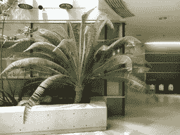

GIF 图片来自官方 GitHub repo

# 介绍

当它问世时， [NeRF:将场景表示为用于视图合成的神经辐射场](https://arxiv.org/abs/2003.08934)论文彻底改变了它的领域，产生了大量受其启发的后续作品。尽管如此，我还没能在网上找到一个对这个领域的新手来说容易理解的解释，并且解释得足够详细以至于能真正理解它到底是怎么回事。有了这篇文章，希望能填补这个空白。

在接下来的内容中，我将引导你阅读这篇文章，澄清第一次阅读时可能会模糊的部分。对于那些想进一步探索这些主题的人，他们可以在本文末尾找到更多的资料。

# 新视图合成

**神经辐射场** ( **NeRF** )试图解决的问题被称为**新颖视图合成**，如[论文中所描述的代码](https://paperswithcode.com/task/novel-view-synthesis)其在于:

> 从给定的源图像和它们的相机姿态合成具有任意目标相机姿态的目标图像。

这项技术很重要，因为它可以实现从**电影摄影**到**虚拟现实**等广泛的应用。

# 为什么这篇论文是相关的

尤其是在计算机视觉领域，一张图片(或者更好的是一段视频)胜过千言万语:

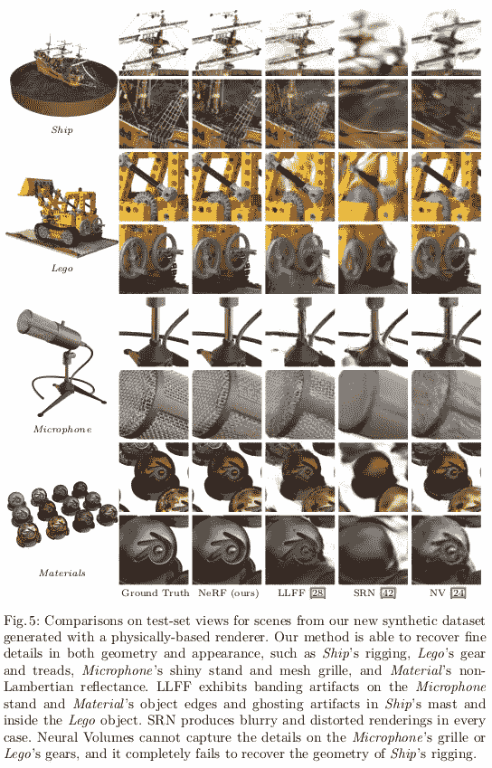

经[原稿](https://arxiv.org/abs/2003.08934)许可拍摄的图像

从上面可以清楚地看到，NeRF 通过启动一个可与 GANs 相媲美的新研究系列，极大地提高了技术水平，例如参见 Hassan Abu Alhaija 的推文:

# 神经辐射场场景表示

## 输入和输出

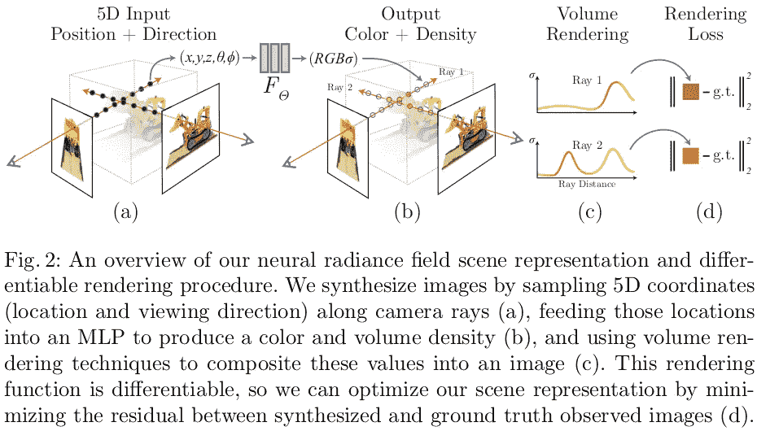

图片经[原文](https://arxiv.org/abs/2003.08934)许可拍摄

让我们先来理解一个场景是如何被 NeRF 表示的:

> 我们将连续场景表示为 5D 向量值函数，其输入是 3D 位置 x = (x，y，z)和 2D 观察方向(θ，φ)的
> ，其输出是发射的颜色 c = (r，g，b)和体积密度σ。

在实践中，**观察方向**被表示为 3D 笛卡尔单位向量 **d** ，所以让我们想象一个单位长度的向量，它从我们相机的光学中心开始，指向我们正在取景的方向。

*光学中心对你来说是一个晦涩难懂的词吗？没听说过针孔摄像头模型？看看我的另一篇文章:*

 [## 使用 NumPy 和 Matplotlib 的简单相机模型

### 几何学乍一看很难理解。为了更好地吸收这些概念，最好的方法是在…

medium.com](https://medium.com/analytics-vidhya/simple-camera-models-with-numpy-and-matplotlib-92281f15f9b2) 

但不管这些，为什么知道方向对预测特定点发出的颜色很重要呢？事实上，这并不总是必要的。在完全**朗伯**表面的情况下(想象一个像陶土花瓶一样的理想“无光泽”表面)，当光线击中一个点时，光线稍微进入物体的表面，并向各个方向散射。在这种情况下，我可以从任何方向看这个点，它的颜色都是一样的。在另一个极端，我们有一面**完美的镜子**:在这种情况下，每条光线只向一个方向反射，这使得，例如，当我们看着一面镜子时，我们看到的东西会根据我们的观察位置而变化。该论文的图 3 显示了观察方向的影响:

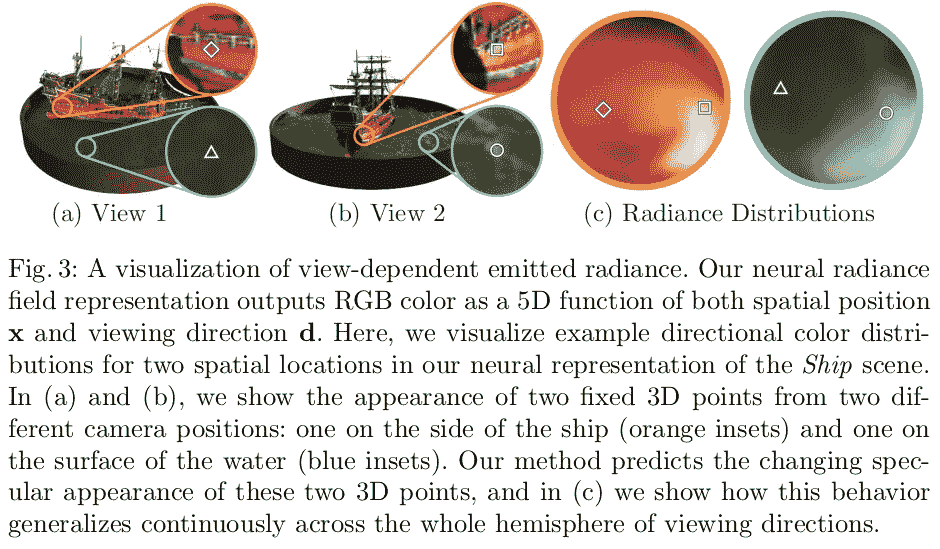

经[原稿](https://arxiv.org/abs/2003.08934)许可拍摄的图像

最后，**体积密度**模拟物体的不透明程度。让我们想象一下，我们戴上太阳镜。因为它们不是完全不透明的，我们可以透过它们看东西，我们看到的颜色受我们使用的镜头的颜色影响。因此，从理论上讲，要确定在给定像素中观察到的颜色，我们必须分析一条线或“**相机** **光线**”中所有点的特征，这条线或光线从我们相机的光学中心发出，并沿着我们的观察方向无限延伸。

## 模型架构

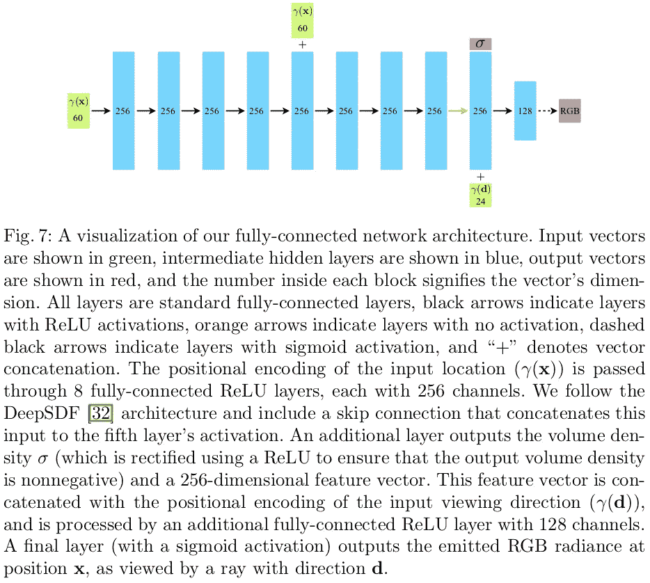

经[原稿](https://arxiv.org/abs/2003.08934)许可拍摄的图像

为了将输入映射到期望的输出，NeRF 使用一个简单的**多层感知器**(**MLP**)fθ:(**x**， **d** ) → ( **c** ，σ)，其中θ是其要优化的权重。

暂时忽略位置编码γ( **x** )，我们将在后面讨论它，并且假设它仅仅是输入坐标 **x** ，从图 7 中我们可以看到，仅从这些坐标预测体积密度σ，同时预测颜色也考虑输入观察方向γ( **d** )的(位置编码)。由于点的密度不依赖于观察点的位置，因此使用观察方向来预测它会使多视图表示不一致。

# 辐射场体绘制

假设我们有一个系统，它为沿着**相机光线****r**(*t*)=**o**+*t***d**的每个 3D 点提供密度和颜色，我们如何计算给定像素的**预期颜色**？为此，作者使用了[经典的体绘制原理](https://dl.acm.org/doi/10.1145/964965.808594):

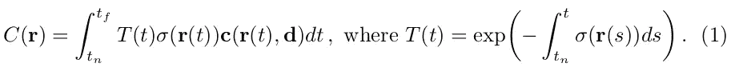

经[原稿](https://arxiv.org/abs/2003.08934)许可拍摄的图像

在上面的公式中， *tn* 和 *tf* 是相机光线的近的**和远**的**和**边界**，也就是我们忽略这个范围之外的一切， *T(t)* 表示光线从 *tn* 行进到 *t* 而没有碰到任何其他粒子的概率。注意，由于σ总是非负的， *T(t)* 只能随着 *t* 的增加而减少或保持不变；如果我们想象几个部分透明的物体在彼此前面，这在直觉上是有意义的，在某个点上，最远的物体的影响将几乎为零。为了进一步帮助直观，我们注意到沿着光线 **r** ( *t* )的一个点如何基于其发出的颜色**C**(**r**(*T*)、 **d** )对最终颜色 *C* ( **r** )做出贡献，这也取决于观察方向 **d** ，并且**

上面的公式是连续的，为了估计 *C* ( **r** )我们需要**将其离散化**，使用[求积](https://en.wikipedia.org/wiki/Quadrature_(mathematics))。作者更喜欢使用**分层抽样方法**，而不是使用确定性正交，限制 MLP 的空间分辨率，然后只在固定的离散位置集进行查询。在实践中，他们将[ *tn* ， *t* f]分成 *N* 个均匀间隔的箱，然后从每个箱内随机抽取一个样本，这导致在优化过程中在连续位置评估 MLP:

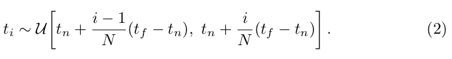

经[原稿](https://arxiv.org/abs/2003.08934)许可拍摄的图像

然后，使用 Max 在[体积渲染审查中讨论的**求积规则**，将得到的样本用于估计 *C* ( **r** ):](https://ieeexplore.ieee.org/document/468400)

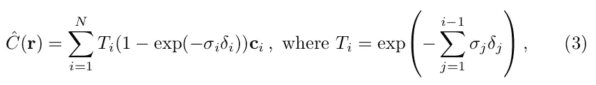

经[原稿](https://arxiv.org/abs/2003.08934)许可拍摄的图像

其中*δI*=*ti*+1*ti*为相邻样本之间的距离。

这样定义的函数是**可微的**，这是一个关键属性，因为我们想使用**梯度下降**来优化我们的参数！

# **优化神经辐射场**

到目前为止，提出的核心组件不足以实现最先进的结果。这里我们引入另外两个组件:**位置编码、**以更好地模拟高频函数，以及**分层采样**过程，以有效地对这种高频表示进行采样。

## 位置编码

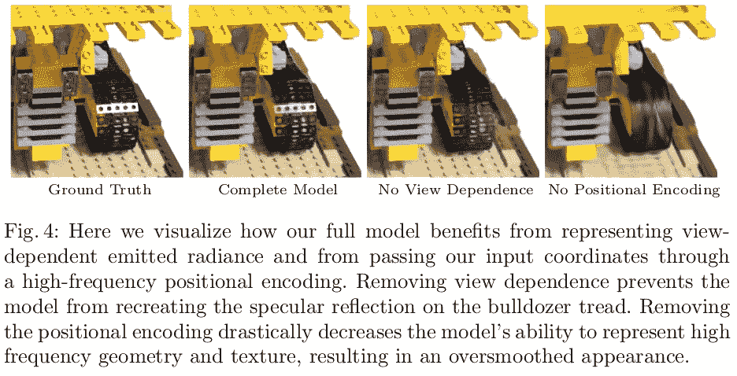

经[原稿](https://arxiv.org/abs/2003.08934)许可拍摄的图像

上面你可以看到使用位置编码的好处。没有这些，高频率的几何图形和纹理实际上是模糊的。但是什么是位置编码呢？在论文中，他们使用了以下**编码函数**:

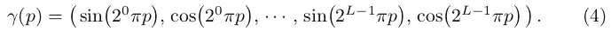

经[原稿](https://arxiv.org/abs/2003.08934)许可拍摄的图像

其中 *p* 是一个标量。该函数γ()分别应用于 **x** 中的三个坐标值以及观察方向 **d** 的坐标值。

位置编码并不是一个新概念，这种映射的一个非常相似的版本被用在流行的 [Transformer 架构](https://arxiv.org/abs/1706.03762)中。然而，目的是不同的:如果对于**变压器**来说，这是一种提供序列中记号的离散位置的方式，在这种情况下，目的是将输入映射到更高维度的空间中，在该空间中，MLP 可以更容易地逼近更高频率的函数。

## 分层体积取样

想想看，沿相机光线均匀采样点不是很有效，许多点会落入自由空间或遮挡区域，对渲染图像没有贡献。

为了解决这个问题，NeRF 使用了**两个网络**:一个**粗**和一个**细**。该策略可分为**两步**:

1.  使用分层抽样对一组 *Nc* 位置进行抽样，并评估这些位置的“粗略”网络
2.  给定第一步的输出，产生一个更加明智的采样，它倾向于对最终图像做出真正贡献的点

重写等式(3)我们有:

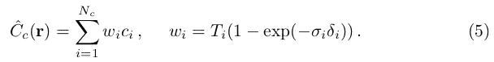

经[原稿](https://arxiv.org/abs/2003.08934)许可拍摄的图像

如果我们用归一化权重*，这将产生一个沿射线的概率密度函数(PDF)。然后，我们可以使用[逆变换采样](https://en.wikipedia.org/wiki/Inverse_transform_sampling)从该分布中采样第二组 *Nf* 位置，在第一组和第二组样本的联合处评估我们的“精细”网络，并使用(3)但使用所有 *Nc* + *Nf* 样本计算光线*ĉf*(**r**)的最终渲染颜色。*

如前所述，该过程将更多的样本分配给我们期望包含可视内容的区域。

**实施细节**

对于机器学习专家来说，可能导致违反直觉的结果是，迄今为止描述的程序**为每个场景优化了单独的神经连续体表示网络**。换句话说，网络不是为了预测其他场景而在场景数据集上训练的，而是在我们想要合成新视图的单个场景上训练的。

训练 NeRF 只需要一组捕获的场景的 RGB 图像、相应的相机姿态和内在参数以及场景边界(还记得等式(1)中的 *tn* 、 *t* f 吗？).对于**合成数据**，作者使用地面真实值，而对于**真实数据**，他们使用 [COLMAP](https://colmap.github.io/) **运动结构**软件包来估计这些参数。

然后，在每个**优化迭代**中，训练网络的过程是:

1.  从数据集中所有像素的集合中采样一批相机光线
2.  按照分层抽样程序从粗网络中查询 *Nc* 样本，从细网络中查询 *Nc* + *Nf* 样本
3.  使用前面描述的渲染过程来渲染两组样本的每条光线的颜色
4.  计算损失
5.  使用优化器更新参数

在论文中,**损失函数**简单地是粗略渲染和精细渲染的
渲染和真实像素颜色之间的**总平方误差**:

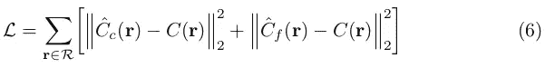

经[原稿](https://arxiv.org/abs/2003.08934)许可拍摄的图像

作为一个**优化器**，作者使用 [Adam](https://arxiv.org/abs/1412.6980) ，其**学习率**从 5×104 开始，**以指数方式从**衰减到 5×105。

# 局限性和后续步骤

好了，我们已经走了很长一段路，那么可以说小说视图合成任务完全由 NeRF 解决了吗？不完全是。这里列出了一些最重要的**限制**:

*   最初的 NeRF 旨在表现一个**静态场景**；这一限制随后被未来的作品解决，如 [D-NeRF:动态场景的神经辐射场](https://arxiv.org/abs/2011.13961)
*   为了对单个场景进行**优化，作者报告了大约 100-300k 的多次迭代以达到收敛，这类似于在单个 NVIDIA V100 GPU 上**1-2 天**的时间，而不是实时的。已经提出了许多改进来加速训练和推理(参见“附加材料”)**
*   如前所述，一个训练好的 NeRF 不能推广到其他场景/物体
*   最初的 NeRF 无法渲染**大规模环境**，这个问题由 [Block-NeRF 解决:可扩展的大场景神经视图合成](https://waymo.com/research/block-nerf/)

虽然这个列表可能继续与其他点，这项开创性工作的重要性不能低估。NeRF 的论文革新了它的领域，在过去的两年里，研究继续沿着它的方向进行。

# 附加材料

鉴于 NeRF 的流行，网上有很多关于这个主题的资料，下面是其中的一小部分:

*   马修·坦西克的 NeRF 网站
*   官方 [GitHub 页面](https://github.com/bmild/nerf)
*   [令人敬畏的神经辐射场](https://github.com/yenchenlin/awesome-NeRF)
*   弗兰克·德拉雷特的《2020 年的 NeRF 爆炸》
*   [ML 研究论文由 Yannic Kilcher 解释](https://www.youtube.com/watch?v=CRlN-cYFxTk)(YouTube 视频)

显然，你可以在搜索栏中键入“神经辐射场**”**找到其他关于这个主题的文章。

# 结论

我希望这个 NeRF 演示能够击中目标:对于新手来说，比原始论文更容易理解，但又不会丢失重要的细节。

如果你喜欢这篇文章，并希望我写更多类似的文章，你可以做几件事来支持我:开始在 Medium 上关注我，在社交媒体上分享这篇文章，并使用下面的鼓掌按钮，这样我就知道你对这种类型的内容感兴趣。

最后，如果您还不是中等会员，您可以使用我的推荐链接成为中等会员:

 [## 通过我的推荐链接加入 Medium-Mario Nam Tao shian ti Larcher

### 作为一个媒体会员，你的会员费的一部分会给你阅读的作家，你可以完全接触到每一个故事…

mnslarcher.medium.com](https://mnslarcher.medium.com/membership) 

想保持联系吗？在 [LinkedIn](https://www.linkedin.com/in/mnslarcher/) 或 [Twitter](https://twitter.com/mnslarcher) 上关注我！