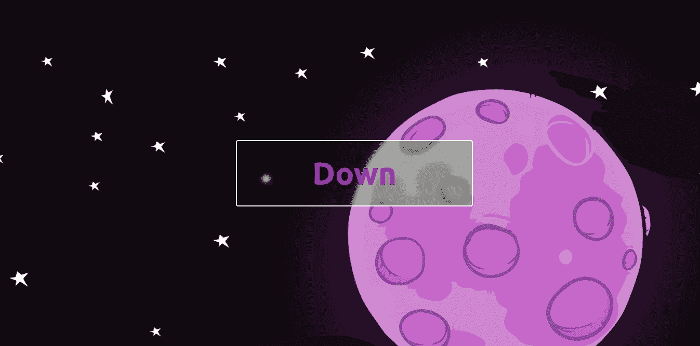
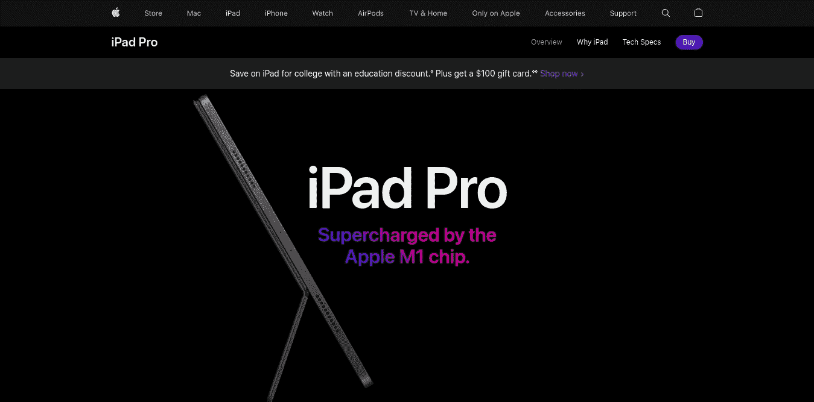
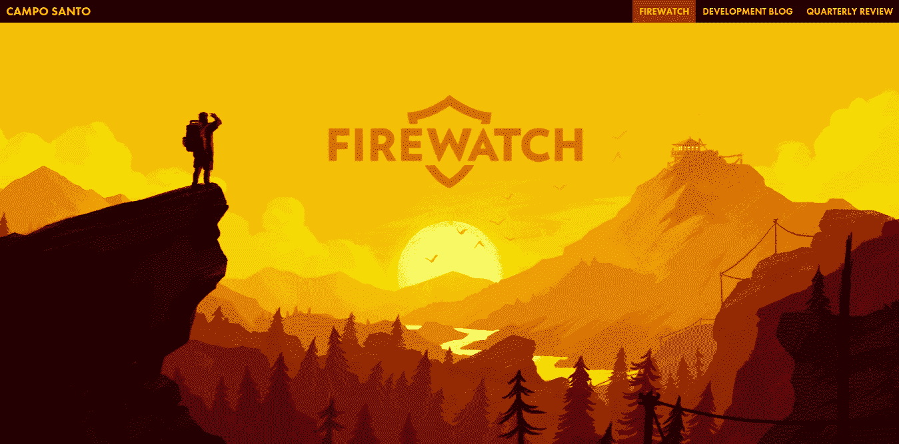
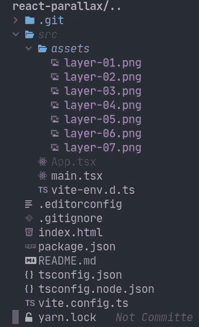
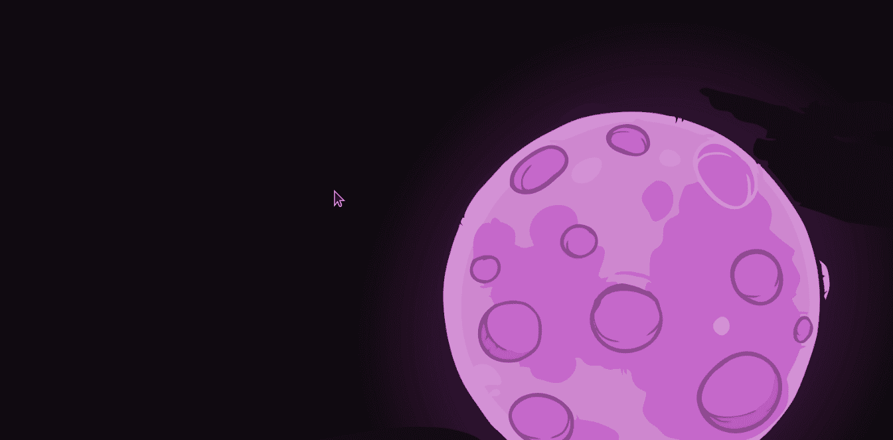
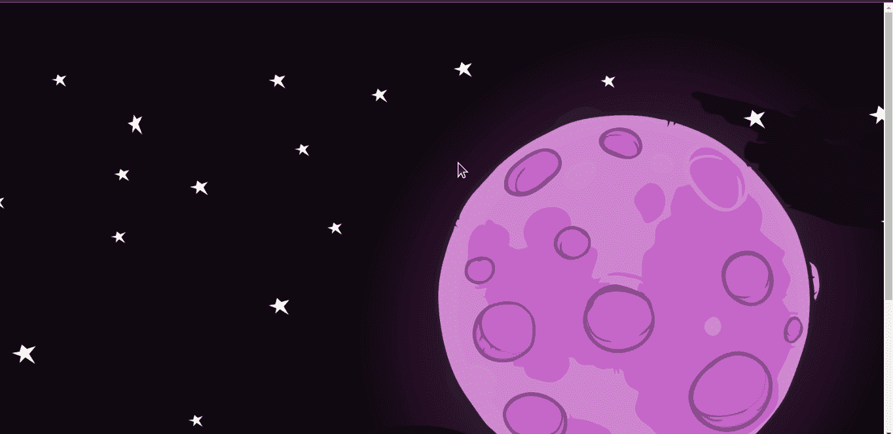
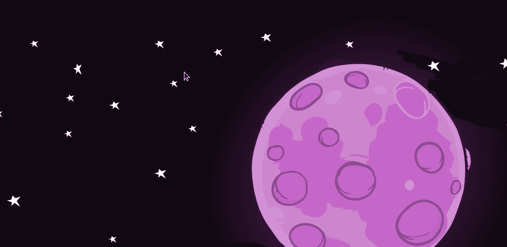
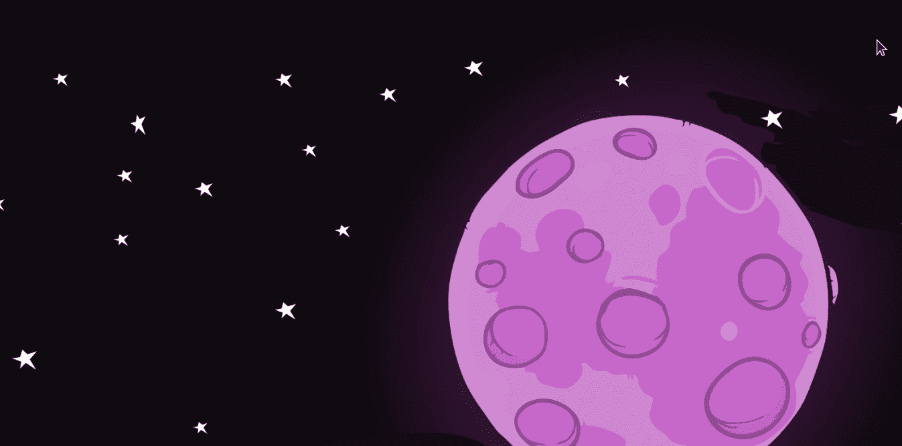

# 反应中的视差效应

> 原文：<https://blog.devgenius.io/parallax-effect-in-reactjs-b304fd5f9a67?source=collection_archive---------0----------------------->



你可能打开了 Firewatch 游戏网站或苹果网站，想知道这些网站的滚动效果是如何制作的。你今天很幸运，因为我将向你展示如何创造这些效果，叫做视差效果。

## **项目**

是一个简单的网页，在页面中间有一个按钮，如果你点击按钮，你会回到底部，如果你再次点击，你会回到顶部。当背景移动时，视差效果开始发挥作用，所以你可以看到效果，用鼠标滚动或点击按钮。

这个简单的技术很有趣，因为你可以在常规网站的几乎任何类型的交互中应用它。

## **什么是视差效应？**

基本上是一个有一个或多个物体或背景的效果，每个物体或背景有不同的运动速度。

视差效果的一些例子…



显然，苹果不只是在物体中使用不同的速度运动，而是超越了这一点。

但是 Firewatch 是一个简单视差效果的完美例子。你有多个图像作为背景，每个背景以多种速度移动。



为了创建这个项目，我将使用 React、Typescript、react-spring 和 tailwind。React-spring 包支持视差，它将为我们做艰苦的工作，tailwind 是一个 CSS 库，它使用实用优先的基本原则，我们可以用它来快速设计我们的项目。

在我们开始之前，让我们看看最终的项目。


期末项目。

## 项目

首先，我们需要创建一个 React 项目:

```
➜ yarn create vite react-parallax
```

选择 React 作为框架，然后选择 react-ts 作为变体:

```
✔ Select a framework: › react
✔ Select a variant: › react-ts
```

我们需要的唯一套件是反作用弹簧/视差:

```
➜ yarn add [@react](http://twitter.com/react)-spring/parallax
```

我们还需要顺风，但我们可以只使用 CDN 链接，而不是安装 throw yarn，因为这个项目不需要顺风的全部潜力。

要使用 CDN 添加 tailwind，您必须打开文件`index.html`，并在`<header>`中添加以下标签:

```
<script src="[https://cdn.tailwindcss.com](https://cdn.tailwindcss.com)"></script>
```

整个文件看起来应该完全像这样:

```
<!DOCTYPE html>
<html lang="en">
  <head>
    <meta charset="UTF-8" />
    <link rel="icon" type="image/svg+xml" href="/src/favicon.svg" />
    <meta name="viewport" content="width=device-width, initial-scale=1.0" />
    <script src="[https://cdn.tailwindcss.com](https://cdn.tailwindcss.com)"></script>
    <title>Vite App</title>
  </head>
  <body>
    <div id="root"></div>
    <script type="module" src="/src/main.tsx"></script>
  </body>
</html>
```

还有一件事，在项目的根目录下创建一个`.editorconfig`文件:

```
➜ touch .editorconfig # To create the file
```

将以下内容添加到文件`.editorconfig`:

```
root = true[*]
charset = utf-8
end_of_line = lf
indent_size = 2
indent_style = space
insert_final_newline = false
max_line_length = 120
tab_width = 2
```

Editorconfig 用一个简单的文件帮助我们定义项目的格式样式。如果你想了解更多关于 **Editorconfig** 的信息，请访问[https://editorconfig.org/](https://editorconfig.org/)网站。

要完成项目设置:

*   删除`**index.css**`和`**App.css**`文件，因为我们将在 HTML 中使用 Tailwind direct。

安装完**反作用弹簧**和**尾翼**后，您需要的最后一样东西就是我们将要使用的资产。有 7 个图像被分层。

它们被分成几层，所以我们可以用不同的值来制作每层的速度动画。

要下载资产，您只需从 [**github**](https://github.com/itsbetma/react-tree-parallax/tree/main) 下载资产，或者克隆完整的 [**github**](https://github.com/itsbetma/react-tree-parallax/tree/main) 存储库并签出到分支`start-here`以跟随教程。

**仅资产:**

[](https://github.com/itsbetma/react-tree-parallax/tree/main/src/assets) [## react-tree-parallax/src/assets at main its betema/react-tree-parallax

### 使用 react-spring/parallax 的 ReactJS 项目。通过创建一个……

github.com](https://github.com/itsbetma/react-tree-parallax/tree/main/src/assets) 

**完整知识库:**

[](https://github.com/itsbetma/react-tree-parallax) [## GitHub-its betma/react-tree-parallax:使用 react-spring/parallax 的 ReactJS 项目。

### 此时您不能执行该操作。您已使用另一个标签页或窗口登录。您已在另一个选项卡中注销，或者…

github.com](https://github.com/itsbetma/react-tree-parallax) 

克隆存储库后，您的项目应该如下所示:



文件

首先，让我们导入依赖项:

```
import layer1 from './assets/layer-01.png';
import layer2 from './assets/layer-02.png';
import layer3 from './assets/layer-03.png';
import layer4 from './assets/layer-04.png';
import layer5 from './assets/layer-05.png';
import layer6 from './assets/layer-06.png';
import layer7 from './assets/layer-07.png';
import { IParallax, Parallax, ParallaxLayer } from "[@react](http://twitter.com/react)-spring/parallax";
import { useState } from 'react';function App() {return (
    <div className={'w-full h-full'}>
      App
    </div>
  )
}export default App
```

`className={'w-full h-full'}`用于定义两个 T **ailwindcss** 类。

*   **w-full** :同`width:100%`；
*   **h 满**:同`height:100%`；

现在我们需要添加我们的第一层。第一层是**层 7** 因为动画中的顺序颠倒了，第一层显示在背景中，最后一层显示在前面。

添加以下代码:

```
function App() {return (
    <div>
      <Parallax pages={1.45}>
        <ParallaxLayer
          offset={0}
          speed={0.5}
          factor={2}
          style={{
            backgroundImage: `url(${layer7})`,
            backgroundSize: 'cover',
            backgroundPosition: 'center'
          }}
        ></ParallaxLayer> </Parallax>
    </div>
  )
}
```

**代码解释:**

*   `<Parallax pages={1.45}>` —定义页数，本例中为 **1.45 页**；
*   `<ParallaxLayer` —定义图层属性；

**图层属性:**

*   `offset` —当层的相应页面完全可见时层的偏移(例如:0 = >第一页的顶部，1 = >第二页的顶部，等等)。默认值为 0。
*   `speed` —层相对于滚动移动的速率。可以是正的，也可以是负的。默认值为 0。
*   `factor` —相对于页面大小的图层大小(例如:1 = > 100%，1.5 = > 150%，等等)。默认为 1。
*   `style` —层 css 属性。

现在运行:

```
yarn dev
```

并查看它是否显示月亮图像。`localhost:3000`



只有月亮。

现在让我们添加**星星**层。在文件`App.tsx`中，在**层 7** 下添加以下代码:

```
<ParallaxLayer
          offset={0}
          speed={0.8}
          factor={2}
          style={{
            backgroundImage: `url(${layer6})`,
            backgroundSize: 'cover',
            backgroundPosition: 'center'
          }}
></ParallaxLayer>
```

添加**星星**的结果。



明星

已经可以看到视差效应在起作用。为了继续和不浪费时间，让我们添加更多的动画层。

下面的代码添加了更多的三层图像:

```
<ParallaxLayer
          offset={0.9999}
          speed={1.5}
          factor={1.1}
          style={{
            backgroundImage: `url(${layer5})`,
            backgroundSize: 'cover',
            backgroundPosition: 'center'
          }}
></ParallaxLayer>
<ParallaxLayer
          offset={0.9999}
          speed={3}
          factor={2.1}
          style={{
            backgroundImage: `url(${layer4})`,
            backgroundSize: 'cover',
            backgroundPosition: 'center'
          }}
></ParallaxLayer>
<ParallaxLayer
          offset={0}
          speed={2}
          factor={4}
          style={{
            backgroundImage: `url(${layer3})`,
            backgroundSize: 'contain',
            backgroundPosition: 'center'
          }}
></ParallaxLayer>
```

添加这三个层后，您可以在动画中看到显示的树:


树

最终的动画正在成形，你可以看到每个图像有不同的延伸和速度。比如月亮，从开始一直延伸到结束，树只在最后阶段出现。

只剩下两张图像，您可以添加倒数第二张**图像:**

```
<ParallaxLayer
          offset={0.87}
          speed={1}
          factor={1}
          style={{
            backgroundImage: `url(${layer2})`,
            backgroundSize: 'cover',
            backgroundPosition: 'center'
          }}
></ParallaxLayer>
```

检查`localhost:3000`可以看到动画中的**干灌木**。



干燥的灌木。

最后，我们可以添加**地**:

```
<ParallaxLayer
          offset={0.9}
          speed={1}
          factor={1}
          style={{
            backgroundImage: `url(${layer1})`,
            backgroundSize: 'cover',
            backgroundPosition: 'center'
          }}
></ParallaxLayer>
```



地面。

滚动动画已经准备好了，但是我们需要添加最后的润色。对于最后的触摸，我们可以创建一个按钮，从动画的开始到结束，反之亦然。

对于这个特性，我们可以使用 React **useState** 和 React-spring/parallax**ref**来控制页面索引。

添加一个变量来存储反作用弹簧/视差参考:

```
...function App() {
  let element: IParallax | null...
```

为了存储按钮的值，添加下面的**使用状态**:

```
...function App() {
  let element: IParallax | null const [buttonMessage, setButtonMessage] = useState('Down')...
```

要处理该按钮，请单击下面的添加功能:

```
...const handleClick = () => {
    if (buttonMessage === 'Down') {
      setButtonMessage('Up')
      element?.scrollTo(2)
    }
    if (buttonMessage === 'Up') {
      setButtonMessage('Down')
      element?.scrollTo(0)
    }
  }...
```

最后，创建以下 JSX 代码:

```
.
.
.
.
// Layer 2
// Layer 1<ParallaxLayer
          sticky={{ start: 0, end: 1 }}
          speed={10}
          factor={1}
          onClick={() => handleClick()}
        >
          <div className='w-screen h-screen   flex font-bold items-center justify-center'>
            <div className='w-2/6 py-8 text-center rounded backdrop-blur-sm backdrop-grayscale bg-violet/30 border-2 border-white cursor-pointer'>
              <h1 className='text-6xl text-violet-600'>
                 {buttonMessage}
              </h1>
            </div>
          </div>
</ParallaxLayer>
```

这里我们为这个层使用了一个不同的属性，`sticky`属性。`sticky`用于定义一个层的开始和结束位置，这对于向下/向上按钮很有用，因为我希望它在相同的位置。

将`<Parallax>`组件更新为:

```
<Parallax pages={1.45} ref={ref => element = ref}>
```

最终结果:


期末项目。

至此，您已经构建了一个具有视差效果的全功能网页。

你想要一篇关于别的东西的文章吗？别等了，在下面留下评论，我会努力的。

**如果你喜欢关于 Git、Linux、生产力技巧、Typescript 和 Python 的内容，请在 Medium 上关注我**[**Marco Antonio Bet**](https://medium.com/u/d708e403f9f9?source=post_page-----4829a118eb2-----------------------------------)**。**

如果你觉得这篇文章有用，请与你的朋友分享，留着以后用，并给👏。

回头见。

# 开源代码库

[](https://github.com/itsbetma/react-tree-parallax/tree/main) [## GitHub-itsbetma/react-tree-parallax:React-spring/parallax 教程的 React 项目。

### 此时您不能执行该操作。您已使用另一个标签页或窗口登录。您已在另一个选项卡中注销，或者…

github.com](https://github.com/itsbetma/react-tree-parallax/tree/main) 

在软件工程师的生活中，Git 非常重要，考虑到这一点，我写了一些关于它的文章:

[](/productivity-with-git-aliases-4829a118eb2) [## 使用 Git 别名提高工作效率

### 从我开始实际工作到现在已经一年了，这是我第一次需要使用 git…

blog.devgenius.io](/productivity-with-git-aliases-4829a118eb2) [](/git-advanced-topics-part-one-5443ff7c9f1b) [## Git 高级主题第一部分

### 我开始使用 git 已经一年了，在这篇文章中，我想教一些我的高级 git 技术。

blog.devgenius.io](/git-advanced-topics-part-one-5443ff7c9f1b) [](/git-advanced-topics-part-two-1833a5f690bf) [## Git 高级主题第二部分

### 继续高级主题，我们将讨论 reflog、二分法、search、find，最后是 git 子模块。

blog.devgenius.io](/git-advanced-topics-part-two-1833a5f690bf) 

## 别忘了查看我的媒体页面:

[](https://medium.com/@itsbetma) [## 马可·安东尼奥赌注-中等

### 阅读马可·安东尼奥写的赌中等。Web 开发人员。每天，马可·安东尼奥和成千上万的其他人打赌…

medium.com](https://medium.com/@itsbetma) 

要了解更多信息:

*   【https://react-spring.dev/components/parallax 号
*   【https://reactjs.org/docs/hooks-state.html 
*   [https://yarnpkg.com/getting-started/usage](https://yarnpkg.com/getting-started/usage)