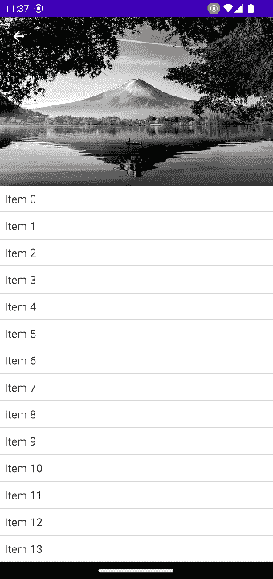
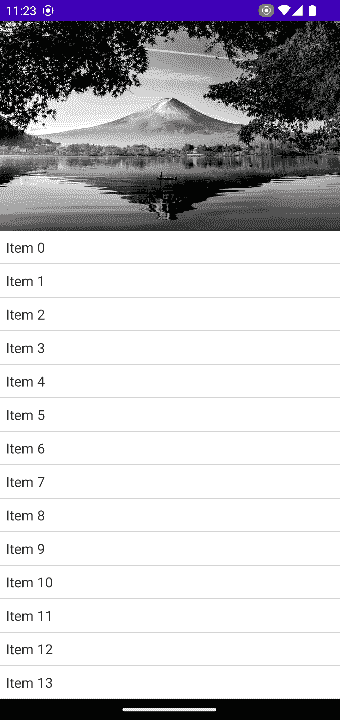
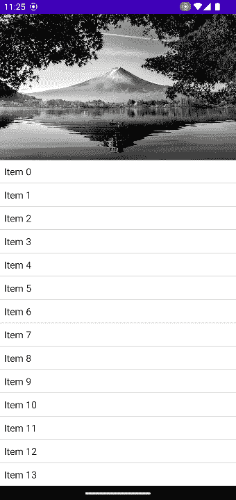
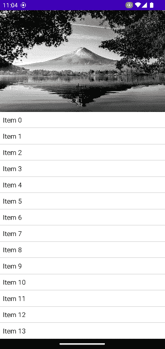

# 使用 LazyColumn 的视差滚动

> 原文：<https://blog.devgenius.io/parallax-scrolling-using-lazycolumn-8df1d416888d?source=collection_archive---------10----------------------->


[杰瑞米·托马斯](https://unsplash.com/es/@jeremythomasphoto?utm_source=medium&utm_medium=referral)在 [Unsplash](https://unsplash.com?utm_source=medium&utm_medium=referral) 上拍照

视差滚动效果看起来总是很好，并且能吸引用户的注意力。使用 Jetpack Compose 可以相当容易地实现这个效果。



# 只是另一个项目

在这个例子中，我们在带有文本项的列表顶部有一个图像。这可能意味着我们有一个图像，后面跟着一个 **LazyColumn** ，但是在查看 API **LazyColumn** 时，我们不仅可以调用 **items** 方法，并给它一个列表，其中包含创建项目所需的数据。

```
val list = (0..1_000).map{ "Item $it" }.toList()LazyColumn {
    items(list) { item ->
        Text(text = item)
    }
}
```

我们还可以在一个 **LazyColumn** 的范围内调用多个 **item** 和**item**方法。不仅限于让它调用**项**函数。
对于这种方式，我们可以用**项**显示图像，然后用**项**创建列表。

```
val list = (0..1_000).map{ "Item $it" }.toList()LazyColumn { item {
        Image(
            painter = resourcePainter(id = R.drawable.image),
            contentDescription = "Top image"),
            contentScale = ContentScale.Crop,
            modifier = Modifier.fillParentMaxWidth()
    } items(list) { item ->
        Text(text = item)
    }
}
```

我们已经有了一个包含两种类型条目的列表，当然现在它们以同样的速度滚动。



# 没那么快

为了实现视差效果，我们需要降低图像的滚动速度，同时保持其他项目的滚动速度不变。

来影响我们需要的滚动

1.  一种滚动信息的方法
2.  一种操纵图像滚动行为的方法。

对于滚动信息，我们可以利用 **LazyColumns** 参数 **LazyListState** ，它包含了我们需要的信息。为了得到它，我们创建自己的并传入它，而不是保留默认值。

```
val lazyListState = rememberLazyListState()LazyColumn(state = lazyListState){
    ...
}
```

从 **LazyListState** 中我们可以计算出，与其他项目相比，我们的图像沿 y 轴的平移速度较慢。

```
val firstItemTranslationY by remember {
        derivedStateOf {
            when {
                lazyListState.layoutInfo.visibleItemsInfo.isNotEmpty() && lazyListState.firstVisibleItemIndex == 0 -> lazyListState.firstVisibleItemScrollOffset * .6f
                else                                                                                               -> 0f
            }
        }
    }
```

我们检查图像在屏幕上是否可见，如果不可见，我们什么都不想做，只说行为正常，通过返回 0 的翻译。只要图像是可见的，我们就用当前的滚动偏移量乘以 1 到 0 之间的一个数。数字越接近 1，图像滚动的速度越慢。对于视差滚动效果，我们希望图像在屏幕上保持更长的时间，就像它正常情况下一样。

您可以随意调整该值来调整速度。对于这个例子，让我们把它保持在 0.6 的中间。

现在我们有了调整图像滚动的值。但是应该在哪里应用它呢？因为 Compose 提供了一个非常方便的修饰符供我们使用。**修改器. graphicsLayer** 为我们提供了操作缩放、旋转、阿尔法、平移和更多应用它的可组合元素的可能性。

翻译听起来是个不错的选择。让我们将**修改器. graphicsLayer** 应用于我们的图像，并将垂直平移设置为我们刚刚计算的值。

```
...
item {
    Image(
        painter = painterResource(id = R.drawable.image),
        contentDescription = "Top image",
        contentScale = ContentScale.Crop,
        modifier = Modifier
            .fillParentMaxWidth()
            .graphicsLayer {
                translationY = firstItemTranslationY
            }
    )
}
...
```



只是为了玩多一点，让我们也慢慢淡出图像，而它是滚动的。

```
val visibility by remember {
        derivedStateOf {
            when {
                lazyListState.layoutInfo.visibleItemsInfo.isNotEmpty() && lazyListState.firstVisibleItemIndex == 0 -> {
                    val imageSize = lazyListState.layoutInfo.visibleItemsInfo[0].size
                    val scrollOffset = lazyListState.firstVisibleItemScrollOffset scrollOffset / imageSize.toFloat()
                }
                else                                                                                               -> 1f
            }
        }
    }
```

这个过程基本上和以前一样，不同的是我们不是获取第一个项目的偏移量，而是获取它的大小和滚动偏移量，并计算 alpha 值。

当我们应用它时，我们从 1 中减去我们计算的可见度，当它离开屏幕时，图像将是完全透明的。

```
.graphicsLayer {
    alpha = 1f - visibility
    translationY = firstItemTranslationY
}
```



# 结论

使用 Jetpack Composes LazyColumn 和 **Modifier.graphicsLayer** 创建视差滚动效果非常简单。计算从 **LazyListState** 导出的平移，并将其应用于**修改器**。

这方面的完整代码可以在 [GitHub](https://github.com/a-frank/parallax-scrolling-compose) 上找到。

我还在这个例子中添加了一个淡入淡出的 TopBar。我想让返回箭头总是可见，因此最终创建了我自己的顶栏。如果你有任何关于如何让它与标准的撰写顶部栏一起工作的想法，请留下评论或直接给我写信。我想听听这件事:-)。

希望你喜欢这个视差滚动的小例子。
下一集见👋。