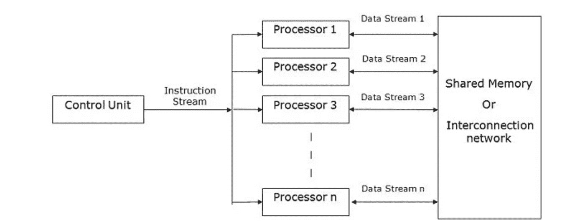
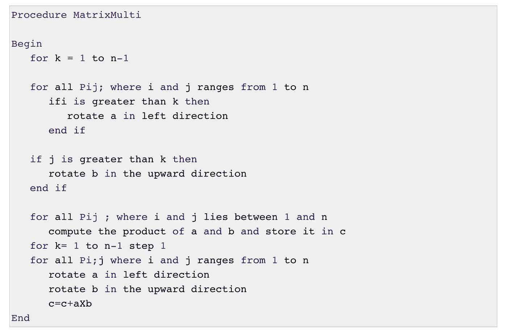

# 并行计算和 Web 开发的未来

> 原文：<https://blog.devgenius.io/parallel-computing-and-the-future-of-web-development-4af659cac155?source=collection_archive---------8----------------------->

## Web 开发、工人和展望未来

奥利维尔·科莱在 [Unsplash](https://unsplash.com?utm_source=medium&utm_medium=referral) 上拍摄的照片

在开始的时候，每个程序只存在于一个线程中，一次只能执行一条指令。大多数处理器制造商通过提高时钟速度和增加更多晶体管来提高处理能力。但有一个致命的缺陷:时钟速度越快，保持处理器冷却就越难，这是由于 2000 年代中期 Dennard Scaling 的死亡(更多关于那个[这里](https://en.wikipedia.org/wiki/Dennard_scaling)，但这或多或少是一种理论，表明你的晶体管占用的空间越少，它们消耗的功率就越少)。因此，为什么到了 2020 年，顶级处理器的时钟速度仍然在 3.0-3.5 GHz 左右。进入多核处理器和并行计算领域

自从 2001 年 IBM 推出 POWER 4 处理器以来，并行计算在编程世界中就已经存在了(尽管是理论上的)。AMD 于 2005 年发布了首款商用双核处理器，英特尔随后于 2006 年初发布了酷睿 2 双核处理器。我要带着这个去哪里？并行计算是未来的发展方向，我在此帮助您参与其中。

但是等等，我听到你说，你只不过是一个 web 开发人员，javascript 只不过是一种低级的单线程编程语言！我承认，作为一个目前从事大量 web 开发的人，javascript 并不是测试和学习并行算法的最佳场所。然而，情况可能并不总是如此。

很少有东西能让 web 开发变得更加并行。我首先要提到的是工人。在 javascript 中，可以使用 worker 在独立于主线程的进程中实现一段代码。这样，那些你不需要马上得到答案的东西，那些通常会冻结你的 DOM 的东西，可以进入一个 worker。像将一个对象转换成 JSON 这样的事情通常会冻结 DOM，如果您的应用程序有很多类似的请求，这种情况就会增加。这是那种你可以推卸给工人的事情。另一件事是，如果您正在进行需要您对响应数据进行大量计算的提取，这种事情最好从您的主线程中去掉。

你可以在这里阅读更多关于 worker[的内容，但是基本思想是创建一个 worker 对象，向 worker 发送消息，worker 接收消息并处理它，而主线程仍然处理 DOM 操作的各种元素，等等。当 worker 完成其任务时，它将响应发送给主线程，主线程现在获取该信息并在该点进行处理。然而，这仅仅触及了并行计算的皮毛。](https://developer.mozilla.org/en-US/docs/Web/API/Web_Workers_API/Using_web_workers)

T 他这里我要看的主要并行方法是 SIMD 或者单指令，多数据。这需要计算机的多个处理器或线程同时对不同的数据集计算相同的指令，然后在最后将它们组合起来。这就是在[这篇论文](https://www.usenix.org/legacy/event/hotpar09/tech/full_papers/jones/jones.pdf)中所写的实验性并行浏览器所采用的方法，作为一种优化移动设备上浏览器性能的解决方案。

SIMD 处理图

现在，没有时间对每个并行算法进行深入的算法分析，但是 SIMD 算法的一个很好的例子是网状网络矩阵乘法。网状拓扑本质上是一个矩阵，因为它由排列在网格中的几个节点定义，没有间隙或空白空间。您可以基于两个因素来评估网状网络；直径-两个节点之间的最大距离，二等分宽度-将矩阵一分为二所需移除的最小边数。

这些矩阵是交错排列的，因此每个进程总是得到要相乘的元素，将所有这些元素相乘，然后将结果相加。这会产生类似以下的伪代码:

现在，我不会假装我自己完全理解这一点，但是如果你好奇，我建议[看看这个指南](https://www.tutorialspoint.com/parallel_algorithm/parallel_algorithm_quick_guide.htm)。起初看起来令人生畏，但实际上，这是在一个网页中多次阅读单词 hypercube 的好机会。

如果我们允许的话，并行性可以有实际和理论上的应用，可以对我们所有的技术职业产生影响。或许即使我们没有。