# 在 Azure Logic 应用程序和 Power Automate 中将 CSV 文件解析为 JSON 对象

> 原文：<https://blog.devgenius.io/parse-csv-files-as-json-objects-in-azure-logic-apps-and-power-automate-4d99d23306f7?source=collection_archive---------1----------------------->

根据最近的调查，Azure 是世界上第二受欢迎的云计算服务和环境。微软 Azure 提供的可用资源之一是逻辑应用。Azure Logic Apps 是一个基于云的平台，用于创建和管理自动化工作流，这是一系列定义在触发后执行的流程或任务的步骤。

当您使用 Azure Logic 应用程序构建工作流时，您可以使用连接器来快速访问和转换数据。逻辑应用连接器基本上是一个 API 的包装器，底层服务使用它与 Azure 逻辑应用进行通信。在消费逻辑应用中，连接器根据定价级别分为标准连接器和企业连接器。

存储数据或配置表的一种流行方式是 CSV 文件。在 Azure Logic 应用中，虽然您可以获取/导入 CSV 文件，但没有本机内置连接器来解析/读取 CSV 文件。唯一可用的连接器需要进一步订阅，如 Encodian 和 Plumsail 文档。在本文中，我介绍了一种在 Azure Logic Apps 中解析任何 CSV 文件的本机方法，并将 Power Automate 作为 JSON 对象。对于本例，我将使用“使用路径获取文件内容”连接器从 SharePoint 读取一个 CSV 文件。

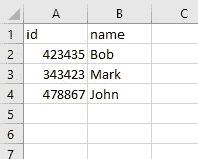

用于演示的 CSV 文件

# 第一步

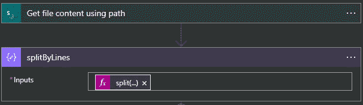

SharePoint 连接器并为每一行拆分 CSV

```
split(base64ToString(outputs('Get_file_content_using_path')?['body']?['$content']), decodeUriComponent('%0D%0A'))
```

在这一步中，我们将 CSV 文件中每一新行的内容拆分成一个数组。

**合成动作:**使用这个动作设计一个云流。

**使用的功能:**

**split** :根据原始字符串中指定的分隔符，返回包含子字符串的数组，子字符串之间用逗号分隔。

```
split('<text>', '<delimiter>')
```

**base64 字符串**:返回 base64 编码字符串的字符串版本，有效地解码 base64 字符串。请使用此函数，而不要使用不推荐使用的 [decodeBase64()](https://docs.microsoft.com/en-us/azure/logic-apps/workflow-definition-language-functions-reference#decodeBase64) 。

```
base64ToString('<value>')
```

**['体']？['$content']** :通过 SharePoint 连接器返回文件主体的所有内容。

**decodeUriComponent** :返回一个字符串，用解码后的版本替换转义字符。%0D%0A 是 ANSI 编码文件用于其线闸的内容。

```
decodeUriComponent('<value>')
```

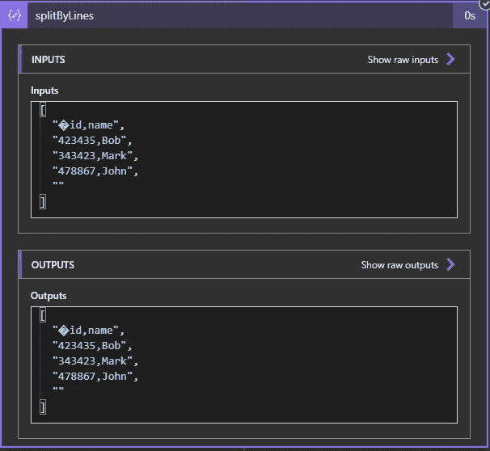

第一步输出

# 第二步

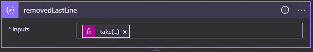

为步骤 2 撰写操作

```
take(outputs('splitByLines'),add(length(outputs('splitByLines')),
-1))
```

在这一步中，我们将删除上一步生成的数组的最后一行。

**编写动作**:使用这个动作设计一个云流。

**使用的功能**:

**拿走**:从收藏的最前面退回物品。

```
take('<collection>', <count>)
```

**相加**:返回两个数相加的结果。

```
add(<summand_1>, <summand_2>)
```

**length** :返回集合中的项目数。

```
length('<collection>')
```

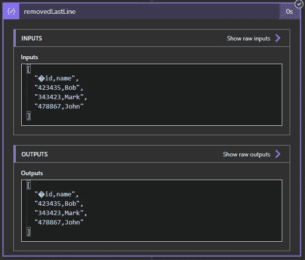

第二步输出

# 第三步

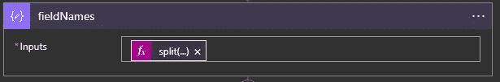

为步骤 3 撰写操作

```
split(first(outputs('splitByLines')), ',')
```

在这一步中，我们在分隔符上拆分每一行，在这种情况下是逗号，然后获取数组的元素来检索 CSV 文件的标题或字段。

**合成动作**:使用这个动作设计一个云流。

**使用的功能**:

**first** :返回字符串或数组的第一项。

```
first('<collection>')
```

**split** :根据原始字符串中指定的分隔符，返回包含子字符串的数组，子字符串之间用逗号分隔。

```
split('<text>', '<delimiter>')
```

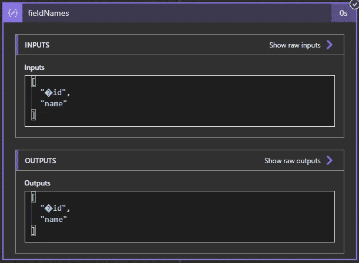

第三步输出

# 第四步

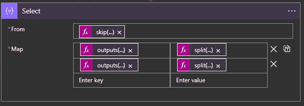

为步骤 4 选择操作

```
From:skip(outputs('removedLastLine'), 1)Map:outputs('fieldNames')[0]   ||||||||||||   split(item(), ',')?[0]outputs('fieldNames')[1]   ||||||||||||   split(item(), ',')?[1]
```

在这一步中，我们正在转换前面数组的形状，因此我们用相应的值(key-value)映射每个头。

**选择动作**:使用该动作变换数组中对象的形状。例如，您可以添加、移除或重命名数组中每个对象的元素。

**使用的功能**:

**split** :根据原始字符串中指定的分隔符，返回包含子字符串的数组，子字符串之间用逗号分隔。

```
split('<text>', '<delimiter>')
```

**跳过**:移除收藏前面的物品，返回*所有其他*物品。

```
skip([<collection>], <count>)
```

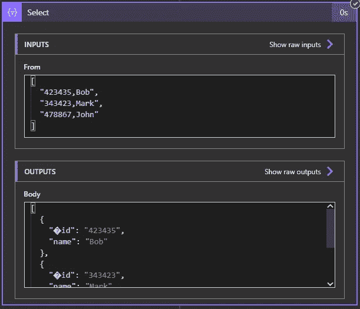

第四步输出

# 第五步

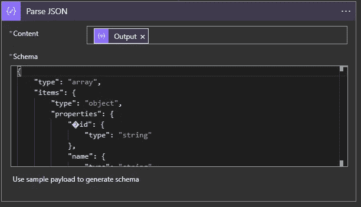

解析步骤 5 的 JSON 操作

在这一步中，我们解析步骤 4 中的数组，并将其转换成 JSON。为了获得 JSON 的模式，执行从步骤 1 到步骤 4 的工作流，并使用示例 JSON 输出来生成该步骤的模式。

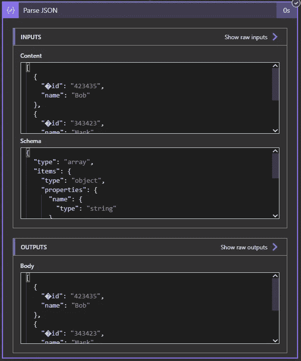

第五步输出

参考资料:

Microsoft Logic Apps 函数文档:[表达式函数参考指南—Azure Logic Apps | Microsoft Docs](https://docs.microsoft.com/en-us/azure/logic-apps/workflow-definition-language-functions-reference)

Power Automate 的数据操作:[使用 Power Automate(包含视频)中的数据操作—Power Automate | Microsoft Docs](https://docs.microsoft.com/en-us/power-automate/data-operations)

CSV 文件解析的类似教程:[如何在 Microsoft Power Automate Flow for Azure Logic Apps 中解析/读取 CSV 文件— YouTube](https://www.youtube.com/watch?v=rNTEOk0cq4k)