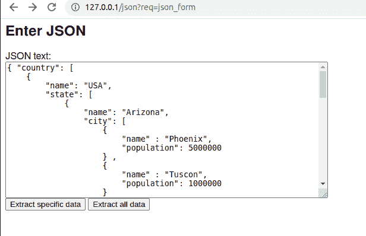
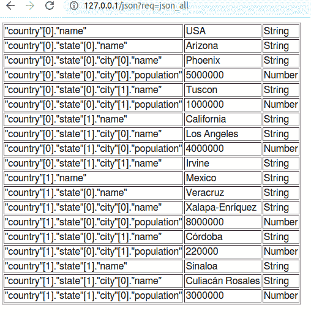
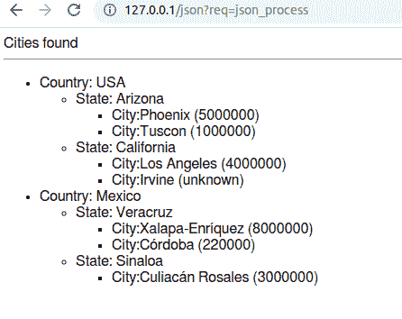
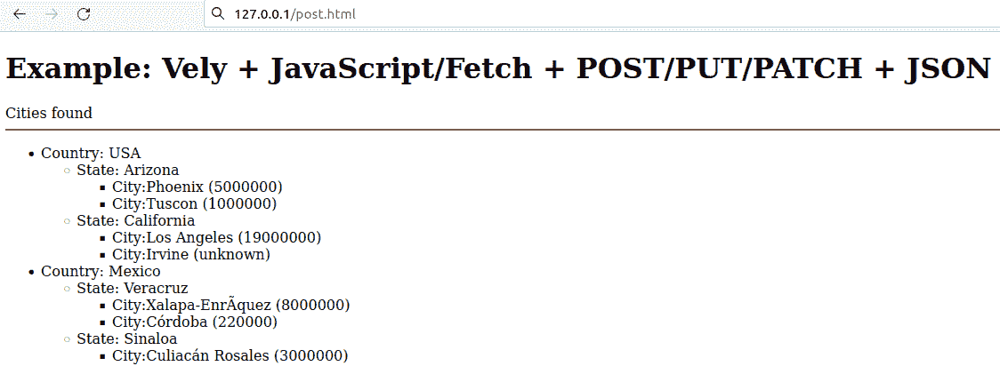

# 用 vly 框架解析 C 语言中的 JSON

> 原文：<https://blog.devgenius.io/parsing-json-in-c-with-vely-framework-e6cf5537392?source=collection_archive---------9----------------------->


封面图片版权 Sergio Mijatovic 2022

# 以不同的方式解析 JSON

这个例子演示了在 c 语言中用[vs](https://vely.dev/?ref=hackernoon.com)解析 JSON 文本。JSON 文档包含一组国家，其中包含一组州，每个州包含一组城市。JSON 数据也不是固定的——一些数组成员包含其他成员不包含的数据。所以这个例子相当复杂。

还显示了 UTF8 Unicode 数据的使用—一些城市的名称中有这样的字符。

JSON 文本来自两种不同的客户端请求:来自 HTML 表单，也来自 Javascript/fetch()。第一个使用来自表单的 URL 查询 POST。第二个示例演示了一个内容类型为“application/json”的请求，并使用[请求体](https://vely.dev/request-body.html?ref=hackernoon.com)来获取 HTTP 请求体。

每个 JSON 数据节点都使用内置的散列语句来检索(参见 [new-json](https://vely.dev/new-json.html?ref=hackernoon.com) )。

JSON 解析演示了两种方法:

*   首先，通过搜索特定元素，在本例中是所有国家，然后是一个国家下的所有州，最后是一个州下的所有城市。这展示了如何处理一个结构已知但可以改变的通用 JSON 文档。
*   第二，遍历所有的数据节点，并让每个节点进入一个循环。这对于获取所有数据非常有用，即使你不知道数据的结构，也可以一路搜索你感兴趣的内容。

# 应用程序截图

您可以在该表单中输入要解析的 JSON 文本:



这是使用“提取所有数据”按钮提交的结果，其中显示了所有数据节点及其规范化名称(包括层次结构和数组)、值和类型:



以下是按下“提取特定数据”按钮的输出。考虑到数据的层次结构，找到特定的数据节点，并显示它们的名称和值:



您可以从 Javascript fetch()调用 Vely 代码—这是 post.html 的输出(参见 Access application…关于如何运行它):



# 设置先决条件

[安装 Vely](https://vely.dev/pkg/?ref=hackernoon.com)——可以使用标准的打包工具，如 [apt](https://www.debian.org/doc/manuals/debian-handbook/sect.apt-get.en.html?ref=hackernoon.com) 、 [dnf](https://dnf.readthedocs.io/en/latest/command_ref.html?ref=hackernoon.com) 、 [pacman](https://archlinux.org/pacman/?ref=hackernoon.com) 或 [zypper](https://opensuse.github.io/openSUSE-docs-revamped-temp/zypper/?ref=hackernoon.com) 。

因为在这个例子中使用了它，所以您需要安装 [Nginx](https://www.nginx.com/resources/wiki/start/topics/tutorials/install/?ref=hackernoon.com) 作为 web 服务器。

安装完 vly 后，如果您正在使用 vim，请打开它的语法高亮显示功能:

```
vv -m
```

# 获取源代码

源代码是虚拟安装的一部分。为每个应用程序创建一个单独的源代码目录是一个好主意(您可以随意命名)。在这种情况下，解包源代码将为您做到这一点:

```
tar xvf $(vv -o)/examples/json.tar.gz
cd json
```

# 设置应用程序

第一步是创建应用程序。该应用程序将被命名为“json”，但您可以将其命名为任何名称(如果您这样做，请在任何地方更改它)。用 [vf](https://vely.dev/vf.html?ref=hackernoon.com) 做起来很简单:

```
sudo vf -i -u $(whoami) json
```

这将创建一个新的应用程序主页(即`/var/lib/vv/json`)并为您设置应用程序。这通常意味着在主文件夹中创建各种子目录，并为它们分配权限。在这种情况下，只有当前用户(或`whoami` Linux 命令的结果)将拥有那些具有 0700 特权的目录；这意味着一个安全的设置。

# 构建应用程序

使用 [vv](https://vely.dev/vf.html?ref=hackernoon.com) 实用程序进行应用:

```
vv -q
```

# 启动您的应用服务器

要为您的 web 应用程序启动应用服务器，请使用 [vf](https://vely.dev/vf.html?ref=hackernoon.com) FastCGI 进程管理器。应用服务器将使用 Unix 套接字与 web 服务器通信(即反向代理):

```
vf -w 3 json
```

这将启动 3 个守护进程来处理传入的请求。您还可以启动一个 adaptive server，它将增加进程的数量以服务更多的请求，并在不需要进程时逐渐减少进程的数量:

```
vf json
```

参见 [vf](https://vely.dev/vf.html?ref=hackernoon.com) 了解更多选项，帮助您实现最佳性能。

要停止应用程序服务器，请执行以下操作:

```
vf -m quit json
```

# 安装 web 服务器

这展示了如何将您的应用程序连接到 Nginx web 服务器，该应用程序监听 Unix 套接字(从 [vf](https://vely.dev/vf.html?ref=hackernoon.com) 开始)。

**第一步**:

您需要编辑 Nginx 配置文件。对于 Ubuntu 和类似的:

```
sudo vi /etc/nginx/sites-enabled/default
```

而在 Fedora 和其他系统上，它可能位于:

```
sudo vi /etc/nginx/nginx.conf
```

在“服务器{}”部分添加以下内容(“json”是您的应用程序名称，但一般可以是任何 URL 应用程序路径，参见 [request_URL](https://vely.dev/request_URL.html?ref=hackernoon.com) ):

```
location /json { include /etc/nginx/fastcgi_params; fastcgi_pass  unix:///var/lib/vv/json/sock/sock; }
```

**第二步**:

最后，重启 Nginx:

```
sudo systemctl restart nginx
```

# 从浏览器访问应用服务器

使用以下 URL 从 web 客户端(如浏览器)访问您的应用服务器(如果不同，请使用实际 IP 地址，而不是 127.0.0.1):

```
#Enter JSON and send for parsing :
http://127.0.0.1/json?req=json_form
```

将 cities.json 文件的内容复制到表单中的文本区域。

**通过 fetch 方法从 Javascript 运行**

还可以通过 Javascript/fetch 机制测试 JSON 解析。首先，将文件复制到 web 服务器的单独目录中:

```
sudo mkdir /var/www/html/velytest
sudo cp post.html /var/www/html/velytest
```

测试它(如果不在本地测试，请使用您的网址，而不是 127.0.0.1):

```
http://127.0.0.1/velytest/post.html
```

注意:如果您的服务器在互联网上，并且有防火墙，您可能需要允许 HTTP 流量—参见 [ufw](https://www.linux.com/training-tutorials/introduction-uncomplicated-firewall-ufw/?ref=hackernoon.com) 、 [firewall-cmd](https://www.thegeekdiary.com/5-useful-examples-of-firewall-cmd-command/?ref=hackernoon.com) 等。

# 文件

您现在已经完成了示例！以下是这个项目中的源文件，因此您可以检查它是如何工作的:

# JSON 文档(cities.json)

这是您在表单中输入的用于解析的 JSON 文档。它包含国家、州和城市及其人口。

```
{ "country": [
    {
        "name": "USA",
        "state": [
            {
                "name": "Arizona",
                "city": [
                    {
                        "name" : "Phoenix",
                        "population": 5000000
                    } ,
                    {
                        "name" : "Tuscon",
                        "population": 1000000
                    }
                ]
            } ,
            {
                "name": "California",
                "city": [
                    {
                        "name" : "Los Angeles",
                        "population": 19000000
                    },
                    {
                        "name" : "Irvine"
                    }
                ]
            }
        ]
    } ,
    {
        "name": "Mexico",
        "state": [
            {
                "name": "Veracruz",
                "city": [
                    {
                        "name" : "Xalapa-Enríquez",
                        "population": 8000000
                    },
                    {
                        "name" : "C\u00F3rdoba",
                        "population": 220000
                    }
                ]
            } ,
            {
                "name": "Sinaloa",
                "city": [
                    {
                        "name" : "Culiac\u00E1n Rosales",
                        "population": 3000000
                    }
                ]
            }
        ]
    }
    ]
}
```

# 从 Javascript 调用(post.html)

您可以通过 fetch()从 Javascript 调用您的 Vely 代码。这个 HTML 文件会在加载后立即执行(无需按键)，当然，您可以根据自己的需要进行修改。这也演示了使用 POST 方法和“application/json”的内容类型与您的服务器端 vly 代码进行对话。

```
<!DOCTYPE html>
<html lang="en">
<head>
    <title>Vely + JavaScript/Fetch + POST/PUT/PATCH + JSON</title>
</head>
<body>
    <h1 class="align">Example: Vely + JavaScript/Fetch + POST/PUT/PATCH + JSON</h1>
    <script>
        fetch('/json?req=json_process',{
            method: 'POST',
            headers: {'content-type': 'application/json'},
            body:  '{ "country": [ \
    {  \
        "name": "USA", \
        "state": [ \
            {  \
                "name": "Arizona", \
                "city": [ \
                    { \
                        "name" : "Phoenix", \
                        "population": "5000000" \
                    } , \
                    { \
                        "name" : "Tuscon", \
                        "population": "1000000" \
                    }  \
 \
                ] \
            } , \
            {  \
                "name": "California", \
                "city": [ \
                    { \
                        "name" : "Los Angeles", \
                        "population": "4000000" \
                    }, \
                    { \
                        "name" : "Irvine" \
                    } \
                ] \
            }  \
        ]  \
    } , \
    {  \
        "name": "Mexico", \
        "state": [ \
            {  \
                "name": "Veracruz", \
                "city": [ \
                    { \
                        "name" : "Xalapa-Enríquez", \
                        "population": "8000000" \
                    }, \
                    { \
                        "name" : "C\u00F3rdoba", \
                        "population": "220000" \
                    } \
                ] \
            } , \
            {  \
                "name": "Sinaloa", \
                "city": [ \
                    { \
                        "name" : "Culiac\u00E1n Rosales", \
                        "population": "3000000" \
                    } \
                ] \
            }  \
        ]  \
    } \
    ] \
}'
        })
        .then((result) => { return result.text(); })
        .then((content) => { document.getElementById("json_output").innerHTML = content; });
    </script>
    <div id='json_output'></div>
</body>
</html>
```

# 输入 JSON (json_form.vely)

这是一个简单的 HTML 表单，您可以在其中输入 JSON 文档。由于 json_process.vely 和 json_all.vely 中的代码解析了城市列表，所以要输入的文本在 cities.json 文件中给出。

```
#include "vely.h"

void json_form () {
    out-header default
    @<h2>Enter JSON</h2>
    @<form action="?req=json_process" method="POST">
    @    <label for="json_text">JSON text:</label><br>
    @    <textarea name="json_text" rows="8" columns="70">\
           </textarea><br/>
    @    <button type="submit">Extract specific data</button>
    @    <button type="submit" formaction="?req=json_all">\
           Extract all data</button>
    @ </form>
}
```

# 在一个循环中解析所有 JSON 数据(json_all.vely)

这将解析您可能不知道其结构的文档。获得每个数据节点后，您可以在代码中检查它。

```
#include "vely.h"

void json_all() {
    out-header default
    input-param json_text
    // Parse json text and display any error and the position of it
    new-json define json from json_text status define st \
      error-text define etext error-position define epos
    if (st != VV_OKAY) {
        @Could not parse JSON! Error [<<p-out etext>>] at \
          position <<p-num epos>>.
        exit-request
    }
    // Traverse JSON document, node by node, display as a table of 
    // all data nodes
    read-json json traverse begin
    @<table border='1'>
    while (1)
    {
        read-json json traverse key define k value define v \
          type define t status define s
        if (s != VV_OKAY) break;
        // Display name, value and type (ignore boolean and type since
        // we don't have them)
        @<tr>
            @<td><<p-out k>></td> <td><<p-out v>></td>
            @<td><<p-out t==VV_JSON_TYPE_NUMBER?"Number": \
              (t==VV_JSON_TYPE_STRING?"String":"Other")>></td>
        @</tr>
    }
    @</table>
}
```

# 通过查找特定元素解析 JSON(JSON _ process . vely)

解析 JSON 文档。这显示了对文档的解析，您知道该文档的结构，但是没有固定的结构，因此每个元素都是基于其规范化名称进行检索的(参见 [read-json](https://vely.dev/read-json.html?ref=hackernoon.com) )。

```
#include "vely.h"

void json_process() {
    out-header default
    // If JSON data sent via URL-encoded GET or POST
    input-param json_text
    // If JSON data sent in the request body (application/json), 
    // use that JSON data 
    request-body json_body
    get-req content-type to define ctype
    if (!strcmp(ctype, "application/json")) json_text=json_body;
    // Parse json text and display any error and the position of it
    new-json define json from json_text status define st \
      error-text define etext error-position define epos
    if (st != VV_OKAY) {
        @Could not parse JSON! Error [<<p-out etext>>] at \
          position <<p-num epos>>.
        exit-request
    }
    @Cities found<hr/>
    num country_count;
    num state_count;
    num city_count;
    // Start displaying a list
    @<ul>
    // Look for countries, states and then cities
    // Data is organized in hashed arrays, for example
    // country[0].state[1].city[0]
    // and each can have sub-nodes, such as
    // country[0].name
    // etc.
    for (country_count = 0; ; country_count++) {
        // First, build key prefix for a country
        (( define json_key_country
        @"country"[<<p-num country_count>>]
        ))
        // Search for a country name
        (( define json_key_country_name
        @<<p-out json_key_country>>."name"
        ))
        // Search for a country name under index [country_count]
        read-json json key json_key_country_name \
          value define country_name  status st
        if (st != VV_OKAY) break;
        // Country found
        @<li>Country: <<p-out country_name>><br/>
        @<ul>
        // Look for states under this country
        for (state_count = 0; ; state_count++) {
            // Build key prefix for a state
            (( define json_key_state
            @<<p-out json_key_country>>."state"[<<p-num state_count>>]
            ))
            // Search for state name
            (( define json_key_state_name
            @<<p-out json_key_state>>."name"
            ))
            // Search for a state name as: 
            // country[countr_count].state[state_count]
            read-json json key json_key_state_name \
              value define state_name  status st
            if (st != VV_OKAY) break;
            // State found
            @<li>State: <<p-out state_name>><br/>
            @<ul>
            // Look for cities under state
            for (city_count = 0; ; city_count++) {
                // Build key prefix for city
                (( define json_key_city
                @<<p-out json_key_state>>."city"[<<p-num city_count>>]
                ))
                // Search for city name
                (( define json_key_city_name
                @<<p-out json_key_city>>."name"
                ))
                // Search for a city name as: 
                // country[countr_count].state[state_count].
                // city[city_count]
                read-json json key json_key_city_name \
                  value define city_name  status st
                if (st != VV_OKAY) break;
                // Found city, get its population 
                // by building a key for it
                (( define json_key_city_population
                @<<p-out json_key_city>>."population"
                ))
                // Get city population
                read-json json key json_key_city_population \
                  value define city_population  status st
                if (st != VV_OKAY) city_population="unknown";
                // Display city name and its population
                @<li>City:<<p-out city_name>> \
                  (<<p-out city_population>>)</li>
            }
            @</ul>
            @</li>
        }
        @</ul>
        @</li>
    }
    @</ul>
}
```