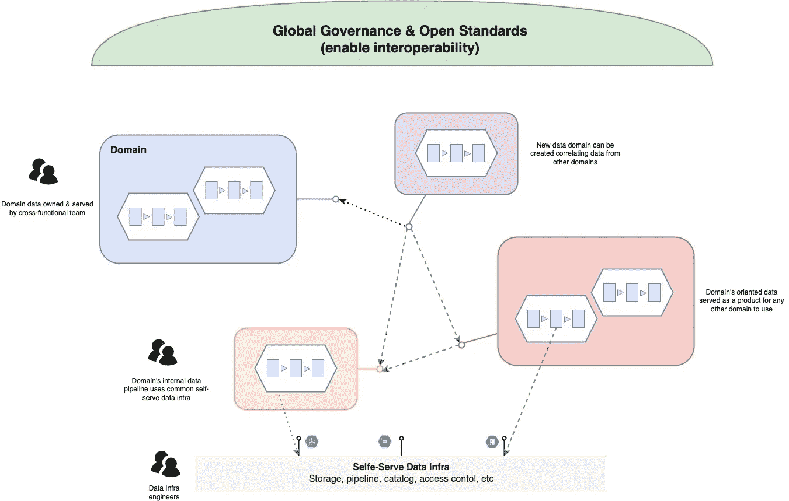
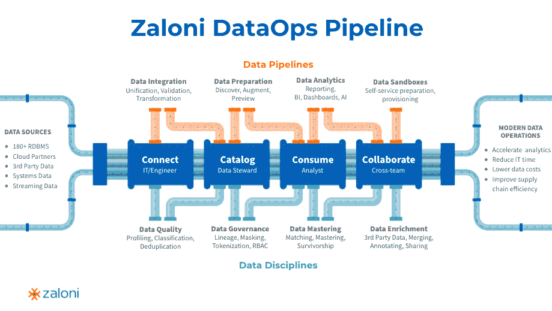
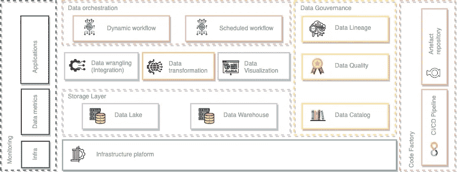
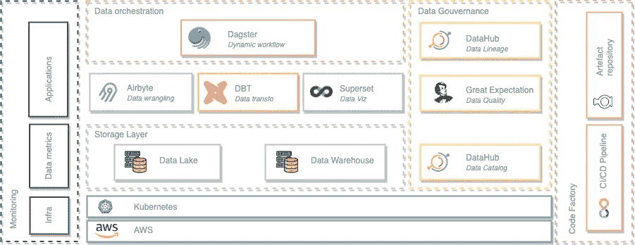

# [第 0 部分] -现代数据架构之旅(2022 年)

> 原文：<https://blog.devgenius.io/part-0-journey-to-a-modern-data-architecture-in-2022-4deb72a4fe7?source=collection_archive---------3----------------------->

# 动机

通过这一系列文章，我想尝试形式化和结构化我的想法，以及什么是数据的当前方向，这对数据架构意味着什么。这显然是一个分享经验的好机会。😊

# 数据网状组织

旅程从一个时髦的概念开始:“数据网格”。

核心原则如下:

*   **领域驱动分布式架构:**旨在将单一的、集中式的大数据平台打破为面向领域的组织，
*   **产品思维:**把数据当成产品
*   **多技能团队:**每个领域汇集了从应用到数据分析的数据工程师、运营、数据分析师、数据科学家、BI 工程师和软件工程师。
*   **生态系统治理:**每个领域数据管道都有自己的生命周期，但领域边界由全球治理和标准定义和控制，
*   **自助式基础架构平台:**整个组织由自助式数据基础架构支持。

数据网状组织

如果您想要扩展数据实践，您需要转向这种组织来支持数据需求的增长。否则，你会越来越:

*   您的数据分析师的需求没有考虑数据基础架构需求。
*   不能长期保持数据集市整洁的 BI 工程师。
*   数据工程师总是被视为数据问题的源头，并试图接收和公开世界上的所有数据
*   平台工程师不愿意或无法实现某些东西，因为“升级到一个集中、单一的气流实例可能会破坏所有的数据工作流”(与现有情况的任何相似之处纯属巧合)。

# 数据运营:帮助数据平台

在这次旅程中，让我感兴趣的部分是这个平台的位置和作用，以支持这种类型的组织。

对于数据网状组织，我们必须经历许多障碍/风险才能实现它。您需要工具和实践来:

*   **支持基础设施即服务:**避免所有域共享一切的集中式整体大数据平台。
*   **支持跨域的数据发现和管理数据沿袭(数据目录):**支持跨域互操作性并激活数据产品范式。
*   **确保数据质量及其监控:**主动检测数据漂移，确保数据产品质量。
*   **支持公开数据的标准方式(数据可视化、语义层等)。):**标准化 data domain 接口，支持数据使用。
*   **提供自助式沙盒环境玩转数据:**为数据分析师和数据科学家提供安全的环境，探索和分析生产数据，加速生产用例的激活。

扎洛尼的数据运营渠道

这是数据操作发生的地方，这些原则将给予团队:

*   **一种方法论**，提供了大规模管理数据管道的指导方针(例如，当我集成数据时，我必须系统地确保模式验证和重复数据删除)
*   **遵循这些原则的一套工具**以一种更加集成的方式实现我的数据管道。
*   **在实施过程中使用的一套流程**和最佳实践，例如自助服务方法

# Kubernetes:基础设施基金会

如果我们沿着我试图建立的道路走下去，我们就有了一个组织模型，我们希望通过数据网格达到这个模型。

实现这一目标的关键要素之一是平台团队能够提供能够满足数据运营目标的自助服务基础架构。

问题是我们把它们放在哪里？第一自然反应似乎是接近“云端”。支持许多核心功能，因为我们需要在不同的提供商(AWS、GCP、Azure 等)上启用数据平台。)

但是因为目标是支持大规模的数据组织，所以一些基础需要更具体和更少管理的解决方案。所以你需要在你的基础上再加一部分。我个人认为，数据基础设施的下一步是站在与云提供商的能力相结合的 Kubernetes 一边。

这两者的结合为您提供了我们需要的核心功能:**基础设施即服务。**

借助 Kubernetes，您将能够**通过简单地更改一些配置来轻松地跨域复制您的基础架构**，并自动化大多数操作流程:从集成到使用 CI/CD 的生产，以及使用 [Kubernetes 操作人员的堆栈生命周期](https://kubernetes.io/docs/concepts/extend-kubernetes/operator/)。另一个重要的部分是，在一个领域内，每个人都在一起工作:数据工程师、Ops、BI 工程师、数据分析师、数据科学家以及软件工程师。这意味着，对于数据平台和应用程序，您可以与 Kubernetes 在**相同的基础架构上，并在相同的基础架构流程下。**

# 现代数据架构:设计

好了，现在我们知道我们需要在哪里运行我们的数据架构，所以让我们定义我们想要构建的最小现代架构，以更接近我们的目标！

功能简约的现代建筑

## 存储层

*那个地方:*

*   **数据湖:**我们将原始格式的数据作为对象存储的地方。
*   **数据仓库:**我们将拥有数据集市的地方，从数据的沿袭转换中构建。

## 数据管理

*如何:*

*   **数据争论:**促进将数据导入我们的 ELT 管道，并支持将数据导出到其他领域和外部。
*   **数据转换:**为了构建我们的数据集市，我们需要实现许多转换，这些转换将消费其他数据集市，这涉及到管理转换、源和目的地之间的依赖关系。
*   **数据可视化:**在仪表板中展示我们的数据的好方法，以实现这个有趣而复杂的架构的目标之一:帮助推动业务！

## 数据编排

*何时:*

*   **事件触发:**我们需要一个工具，允许我们根据事件条件编排任务图。这可以是调度、内部依赖条件或外部触发事件。
*   **动态定义:**图形必须根据执行上下文进行调整，而不需要重新实现新的图形，因为即使在批处理上下文中，数据管道也不总是以相同的方式工作(例如，部分重试、条件数据状态等)。)

## 数据治理

*控制:*

数据网格涉及数据治理，以保持跨域的互操作性并避免上下文孤岛。

*   **数据目录:**一个发现域所拥有和公开的数据的中心位置，它描述了数据以及数据是如何被消费的。
*   **数据谱系:**了解数据的整个谱系，了解它是如何构建的以及它的意义。
*   **数据质量:**主动监控和检测数据中的偏差和错误，以适应和纠正所有受影响的流程。

# 现代数据架构:实现

我们现在知道了我们需要在数据平台中涵盖的功能！因此，让我们来定义我们将用来涵盖所有这些问题的工具😊。

技术简约的现代建筑

## 达格斯特

Dagster 是一个 **orchestrator** ，它是为开发和维护数据资产而设计的，比如表格、数据集、机器学习模型和报告。

您声明想要运行的函数以及这些函数产生或更新的数据资产。Dagster 然后帮助您在正确的时间运行您的功能，并保持您的资产最新。

Dagster 被构建用于数据开发生命周期的每个阶段——本地开发、单元测试、集成测试、试运行环境，一直到生产。

**备选方案:** [提督](https://www.prefect.io/)，[蓉城工作流程](https://argoproj.github.io/argo-workflows/)

## DBT

[dbt](https://www.getdbt.com/) 是一个**转换**工作流程，帮助您完成更多工作，同时产生更高质量的结果。您可以使用 dbt 来模块化和集中化您的分析代码，同时还可以为您的数据团队提供软件工程工作流中常见的防护。在将数据模型安全地部署到生产环境之前，利用监控和可见性，在数据模型上进行协作，对其进行版本化，并测试和记录您的查询。

**替代品:** [数据表单](https://dataform.co/)

## 空气字节

[Airbyte](https://airbyte.io/) 是一个开源的**数据管道平台**。尽管现有的数据管道平台提供了与 Stripe 和 Salesforce 等广受好评的资源的大量集成，但当前模型中存在一个缺口，即忽略了小型服务集成。

Airbyte 通过构建和维护连接器解决了这个问题，同时培养了一个用户社区，他们从彼此的定制连接器中受益。公司通常会构建自定义连接器来支持他们的应用程序。Airbyte 的开源模式创建了一个社区，公司可以通过建立和维护他们独特的连接器来相互支持。

## 热切的期望

[远大前程](https://greatexpectations.io/)是[验证](https://docs.greatexpectations.io/docs/terms/validation)、[记录](https://docs.greatexpectations.io/docs/terms/data_docs)、[剖析](https://docs.greatexpectations.io/docs/terms/profiler)您的数据的主要工具，以保持质量并改善团队之间的沟通。

软件开发人员很早就知道自动化测试对于管理复杂的代码库是必不可少的。巨大的期望给数据科学和数据工程团队带来了同样的纪律、信心和加速。

## 超集

Apache Superset 是一个现代的、企业级的**商业智能网络应用**。它快速、轻量、直观，并加载了各种选项，使所有技能的用户都可以轻松浏览和可视化他们的数据，从简单的饼图到非常详细的 deck.gl 地理空间图表。

## 数据中心

[DataHub](https://datahubproject.io/) 是一个现代化的**数据目录，旨在实现端到端的数据发现、数据可观察性和数据治理**。这个可扩展的元数据平台是为开发人员构建的，以驯服其快速发展的数据生态系统的复杂性，并为数据从业人员利用其组织内数据的总价值。

**替代品:** [阿蒙森](https://www.amundsen.io/amundsen/)

# 结论

这篇文章就像一个指南针，指引我们发现和测试现代建筑。

在下一部分中，我们将通过一个接一个地添加砖块来试验所有技术，试图了解它们能够提供与当前数据架构相关的什么，以及它们如何能够帮助我们应对现代挑战。

一旦我们完成了 PoC 数据平台的构建，我们将进入生产实施阶段，对架构和解决方案进行大规模测试！

这将是一次漫长而激动人心的旅程！

下一篇文章:kubernetes 上的 Dagster