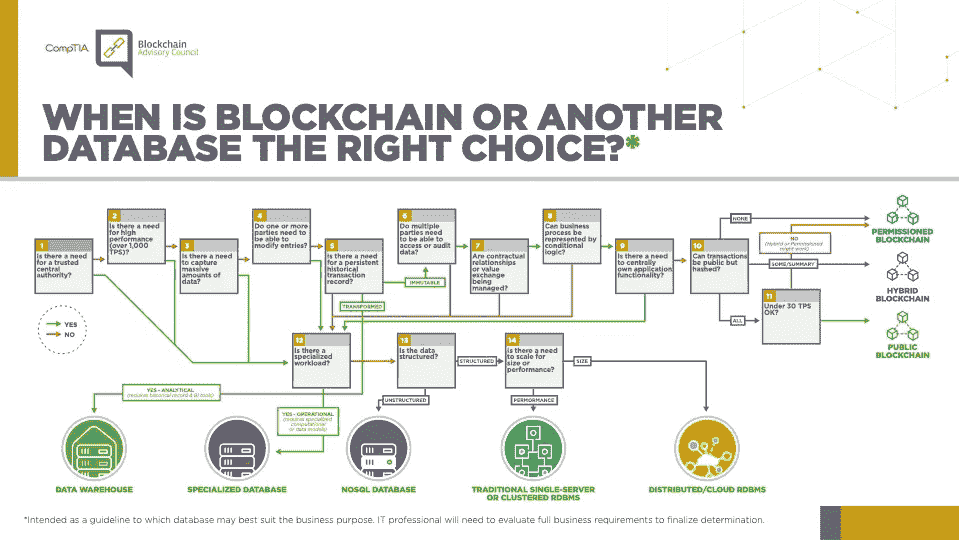

# 第 1 部分:用棱角和安全帽构建 DApps

> 原文：<https://blog.devgenius.io/part-1-building-dapps-with-angular-and-hardhat-ace1c60b2523?source=collection_archive---------3----------------------->


## 构建可靠的智能合约，并通过以太网将它们连接到您的角度应用。

首先，你会找到关于 DApps 和智能合约的简短解释。之后，我们将模板安装并运行，这样您就可以开始构建自己的 DApps 了。你可以在这里找到相关的库。

## 什么是 DApps？

分散式应用程序将 Angular 这样的前端与一个由独立节点组成的分散式网络连接起来，这些节点保存着您部署的智能契约的副本。每一个改变你的合同状态的行为都会被记录在区块链上，并且需要付费。您的 DApp 可以在智能合同的帮助下读写区块链。你可以在这里找到更多信息[。](https://ethereum.org/en/developers/docs/dapps/)

## 什么是智能合约？

使用智能合约，您可以将一组预定义的规则放在一起。这是一个自动执行的合同，每一个动作都被写入一个不可变的公开可见的数据库(区块链)。

> 智能合同是存储在区块链上的数字合同，在满足预定的条款和条件时自动执行

智能合同可以取代银行、公证人、律师或其他中间人。

智能合同也可以建立信任。例如，一家在线商店可以使用智能合同来为客户保持安全支付，直到货物成功交付。只有在货物交付后，卖方才能拿到钱。如果卖方未能在预定的时间内交付货物，这笔钱将退还给买方。

关于如何使用智能合约，有无数种可能性。你可以在这里阅读更多关于智能合约的想法[。](https://www.ibm.com/topics/smart-contracts)

如果您不确定区块链是否是您项目的正确选择，这个决策树可能会有所帮助:



来源:[https://connect . comptia . org/content/infograph/区块链决策树](https://connect.comptia.org/content/infographic/blockchain-decision-tree)

## 先决条件

1.  [NodeJS](http://nodejs.org/)
2.  NPM(节点包经理)
3.  角度坐标(`npm install -g @angular/cli`)

## 使用的版本

*   角度 13
*   角形材料 13
*   安全帽 2.8
*   醚类 5.5
*   坚实度 0.8.4

我们使用 **Angular** 作为带有 Angular 材质的前端框架，因此我们有一些 UI 组件来轻松地将我们的前端放在一起。

[**Hardhat**](https://github.com/nomiclabs/hardhat) 是一个 npm 模块，我们可以使用 CLI 来编译、部署和测试用 Solidity 编写的 EVM 兼容智能合同。你可以在这里找到 EVM 兼容区块链[的列表。](https://coinguides.org/evm-blockchains-add-evm-network/)

以下是 EVM 兼容区块链的简化列表:

*   以太坊
*   多边形
*   币安智能连锁

我们使用 **Ethers** 这是一个完整的以太坊钱包实现和 JavaScript(和 TypeScript)实用程序，它是轻量级的，经过良好测试。如果您已经听说过 Web3 库，Ethers 是一个替代库。

对于智能契约开发，我们使用 **Solidity** ，作为一名 Javascript/Typescript 开发人员，使用 Solidity 很容易上手。有几个概念对你来说是新的，比如映射、结构、严格类型等等。但是有很好的资源可以满足你的 DApp 需要的每一个细节。

我们使用 **IPFS** (星际文件系统)来存储和读取图像和元数据。如果你保存更多关于区块链的数据，汽油费会很快变得昂贵。避免这种情况的一个简单方法是使用 IPFS 以分散的方式存储和读取我们的数据。

## 入门指南

要启动并运行此 DApp，请按照以下步骤操作。

1.  克隆存储库

```
git clone git@github.com:pguso/angular-hardhat-starter-dapp.git
```

2.切换到克隆的文件夹 angular-hardhat-starter-dapp

3.安装依赖项

```
npm install
```

4.安装元掩模[https://metamask.io/download/](https://metamask.io/download/)

5.使用本[教程](https://docs.matic.today/docs/develop/metamask/config-polygon-on-metamask/)在 Metamask 中配置多边形(切换到 Mumbai-Testnet 选项卡)

6.将. env.dist 重命名为。env 并将元掩码私钥粘贴到 PRIVATE_KEY 字段中

7.将合同上传到 Polygon Mumbai Testnet

确保你在 Metamask 中有足够的 MATIC，你可以从这里得到测试 MATIC[https://faucet.polygon.technology/](https://faucet.polygon.technology/))

```
npm run deploy:testnet
```

8.将您在命令行上获得的合同地址粘贴到 src/environments/environment . ts 中

```
export const environment = {
  // ...
  contractAddress: '0x04215C89a6af0f7ed9103c48BaF6A8e19f119470',
  // ...
};
```

9.运行 angular 应用程序，并在 [http://localhost:4200](http://localhost:4200) 下测试应用程序

```
ng serve
```


已上传图片的主页

你可以玩这个 DApp，在下一篇文章[第二部分](https://pguso.medium.com/part-2-smart-contract-and-angular-service-interaction-5862f6ec3f48)中，我们将研究智能合同(图库)如何通过服务与我们的前端连接。