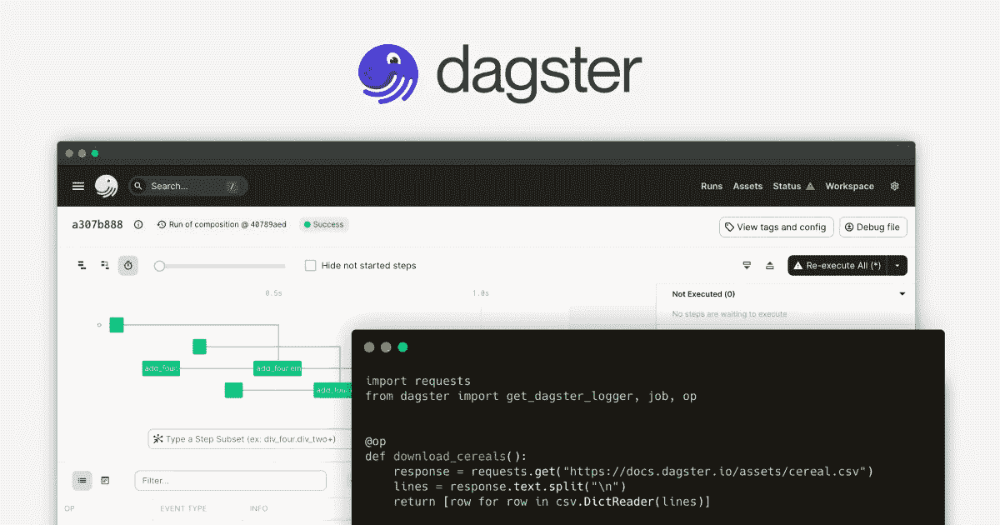
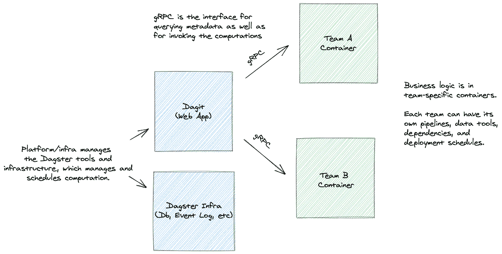
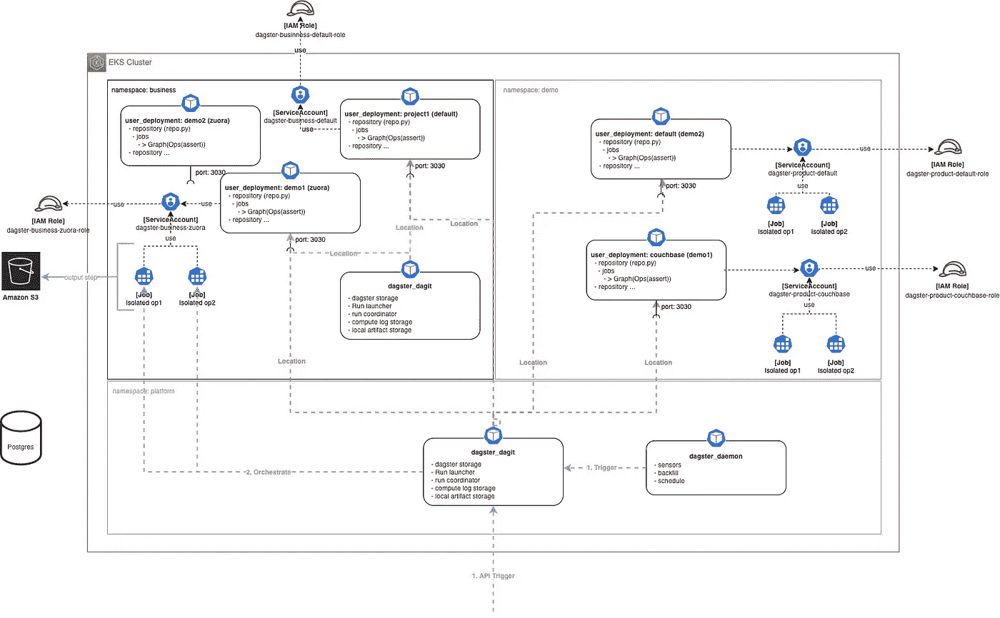
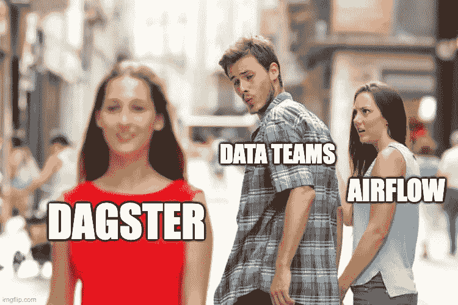

# [第 1 部分] - Dagster:数据编排器

> 原文：<https://blog.devgenius.io/part-1-dagster-a-data-orchestrator-30f482d425bf?source=collection_archive---------0----------------------->

本文是旨在 2022 年构建现代数据平台的系列文章的第二部分。请随意阅读[第一个故事](https://medium.com/@alexandreguitton_12701/part-0-journey-to-a-modern-data-architecture-in-2022-4deb72a4fe7)来了解我们的旅行计划！

这是我们旅程的第一步:数据编制器！在传统的数据平台中，对我来说，orchestrator 和您的数据湖是一个核心部分。它定义了数据工作流运行时的行为方式。

有两种类型的编排器，第一种是那些定义工作流并通过简单的配置进行调度的编排器: [Oozie](https://oozie.apache.org/) (xml)、[云工作流](https://cloud.google.com/workflows?hl=fr) (yaml)、[步骤函数](https://aws.amazon.com/fr/step-functions/) (json)。当管理越来越多的工作流时，这些工具很快就会受到限制。

这就引出了第二种类型的编排器，除了调度和定义工作流之外，它还增加了:

*   错误处理
*   使用代码的高级配置
*   任务监控
*   广泛的工具集成，激活您的 ELT/ETL

我们将把重点放在第二种工具上，因为我们的目标是规模化，并轻松地将我们的英语教学与外部世界相结合！

# 简而言之，达格斯特

Dagster 是一个开源的数据编排器，旨在开发和维护**数据资产，**支持一个更结构化的编程模型，该模型展示了一个更丰富的、语义感知的图。Dagster 试图解决数据团队如今面临的挑战:

*   **本地开发**具有快速反馈周期
*   **部署前的有效测试**
*   **与数据从业者使用的各种工具**集成
*   构建它们的不同角色之间的合作
*   **调试**出错时
*   将数据资产链接到产生它们的代码
*   **管理应用复杂性**与不断变化和日益苛刻的需求保持一致

# 再见气流？

在这篇文章中，我们将主要比较 Dagster 和 Airflow，因为它是用于编排数据的主要编排工具！我们将试图找到一些关键点来理解“传统”工具和 Dagster 之间的区别，以及一个工具是否应该/能够/将会取代另一个工具。

Airflow 使用纯粹的操作依赖图:确保正确的执行顺序、管理重试、整合日志记录等等。与松散耦合的 cron 作业和其他没有正式定义依赖关系的解决方案相比，这些系统向前迈进了一大步。

Dagster 进行了不同的权衡，启用了一个更结构化的编程模型，该模型公开了一个更丰富的、语义感知的图。

# Dagster:开发者端

在 Dagster discovery 的第一步中，我没有将编码体验推得太远，因为我对该工具的期望是不要将其用作我的核心代码用例！

对我来说，Dagster 将被用作管弦乐队，而不是 ETL。这意味着有趣的实现体验应该是将它与 dbt 和 Airbyte 一起使用。但是我开始寻找基本概念，为下一步做准备💪。

## 核心概念

当你要发展你的工作时，要理解的基本概念(是的，这不是一个 DAG，而是一个工作，而工作是一个带有配置的图表…一点大脑练习！):

*   **软件设计的资产:**持久存储中的对象，例如表格、文件或持久机器学习模型
*   **Ops:** 核心计算单元(例如:从其他人那里获得数据集、执行数据库查询、启动 Spark 作业、发送电子邮件或 Slack 消息)
*   **图:**一组互连的 op 或子图。虽然单个 op 通常执行简单的任务，但是 op 可以组合成一个图形来完成复杂的任务
*   **工作:**主要执行和监控单元。作业的核心是通过数据依赖关系连接的运营图。Ops 通过定义输入和输出之间的依赖关系而联系在一起。
*   **Op:** 依赖关系表现为数据依赖，而不仅仅是执行 dep。
*   **储存库:**资产、作业、时间表和传感器的集合。由 Dagit 和 Dagster 守护程序作为一个单元加载。
*   **工作区:**用户定义的存储库和关于在哪里可以找到它们的信息的集合
*   **物化:**Op 创建的资产的物化

再看我们的老朋友气流，有一个重大的本质区别:资产**的概念**。这是基本的，并且证明了谈论 Dagster 的数据编制器而不是气流编制器是正确的。

当你开始在 Dagster 中工作时，你从你的数据(S3 对象，大查询/红移表等)开始。)并设置操作来执行它。然后，您使用 Ops 构建您的“工作流”(图表)。

## 扳机

与气流的另一个主要区别是工作定义。当你定义你的工作时，你说哪个图形(啊…是的，图形定义可以是动态的…当你来自气流时，这是一件令人惊奇的事情🤓)用哪个配置。

你拿到了吗？是的，我没有说什么时候运行它…在 Airflow 中，我必须定义时间表，它需要知道时间，当您不知道数据将在什么时候出现，以及它是否已被重试时，这对于数据来说是一个真正的硬约束。

Dagster 编排是基于事件的，这意味着默认行为是被触发的！它可以是一个内部触发器:

*   **调度:**提交 Dagster 作业的固定时间的定义
*   **传感器:**根据外部状态的变化提交给 Dagster 作业的定义。例如，当数据发生变化时，意味着资产发生了变化，因此您可以更新依赖于它的其他资产，而不必手动重新启动不再计划的依赖 Dag！
*   **回填:**数据回填每个分区或分区子集。

它们也可以是外部传感器(我的 S3 对象刚刚被创建，它触发了一个 lambda，该 lambda 将触发我的作业)。所有这些元素都可以同时用于触发作业。

## 数据应用是一种软件应用

对于 Dagster 团队来说，许多软件工程原则在数据领域都有其必然结果。但是，试图盲目地将传统的软件工程技术应用于数据往往达不到他们的承诺。

他们认为今天的数据工程与十年前的 web 前端工程处于相似的位置:与一个新奇而复杂的领域搏斗，工具严重不足，并且经常被拥有更成熟工具(如系统编程)的更好理解的领域中的从业者不合理地鄙视。

今天，即使是初级前端开发人员也在复杂的框架中工作——建立在被认为是晦涩难懂的函数式编程原则之上——使用由健康的生态系统支持的高质量工具。

就像十年前的 web frontend 一样，他们认为数据应用工程需要新的方法。Dagster 提供了一组新颖的抽象，可以产生更具弹性、可测试、可重用的代码。

这种思维方式意味深长，对我很有吸引力，因为我也有同样的分析，对此我也有同感！

## 气流，你还在吗？

如果我们试着比较气流和 Dagster。Dagster 解决了当前许多气流限制:

*   构建可测试和可维护的数据应用(单元测试，对输出的期望等)。)
*   容易改变环境
*   人类工程学代码
*   动态图表
*   事件驱动触发器

但它也带来了深刻的变化，如果你已经在气流上:

*   **基于资产的方法与命令式方法:**数据团队需要改变他们的心态，这可能很困难(当您的气流已经调整为您的 ETL 时，这可能会更加困难)
*   **解决方案成熟度:** Airflow 有一个令人难以置信的社区，有大量运营商来简化和加速其采用，我们现在有几年的使用知识。达格斯特年轻…

在我们接下来的旅程中，仍有几个问题需要解决:

*   开源项目比托管解决方案更有优势，我可以**查看代码进行调试，并了解它是如何工作的**。但是当涉及到气流的代码… …这真的真的很难(痛苦经历的反馈！)，所以我们要小心 Dagster 是可访问的！
*   最重要的事情，也许……**在高使用率的生产中，它起作用吗？**

好了，现在就这样，在开发人员方面，这里的目标不是深入研究代码，但是我们现在有了 Dagster 在使用方面将带给我们什么的概述，以及如果资产可以从 dbt 和 Airbyte 自动加载而无需编码的想法…对于[示例](https://dagster.io/blog/dagster-0-15-0-dbt-python) …

# 达格斯特:基础设施方面

你想自己测试一下配置？以下是与本次探索相关的地形配置:[**eks-with-dagster**](https://github.com/konpyutaika/data-platform/releases/tag/0.0.1-eks-with-dagster)

## 异质团队

回顾我们在这个旅程中的一个目标，有一个问题:这些现代数据工具如何帮助数据平台团队实现数据网格？

在这种情况下，数据平台不可避免地服务于许多想要某种程度的操作隔离和独立性的团队。在一个领域中，团队希望使用他们自己的工具，使用他们自己的具体依赖项，按照他们自己的时间表部署，同时仍然利用共享的基础设施。

Python 依赖冲突的实际问题通常是这种不想要的相互依赖的第一个表现。错误的用户代码也可能使我们的服务崩溃或不稳定。

Dagster 在工具和用户定义的管道之间实施严格的进程隔离，通过 gRPC 接口与这些进程进行通信:

## Kubernetes 上的设置

这种方法是编排工具向前迈出的真正一步，为处理现代数据组织中出现的组织约束提供了具体的解决方案！

为了在某种程度上证实我们的假设，即数据的下一个登陆平台是 Kubernetes，Dagster 使用 Docker 和 Kubernetes 来实现数据域的隔离。

让我们来看一个具体的实现:

*   我有两个数据领域需要服务:业务和产品。
*   我有一个数据平台团队，负责提供基础架构

以下是在 AWS 上实现 EKS 的架构:

为了实现这个架构，我使用了 [EKS 蓝图地形模块](https://aws-ia.github.io/terraform-aws-eks-blueprints/main/)作为基础。

## 安全隔离

在 Kubernetes 上部署 Dagster 时，第一个重要的概念是**用户部署**。它允许我们在 pod 中部署一个存储库(包含我们的管道/作业)。您可以将一个 Kubernetes 服务帐户与这个用户部署相关联，并且在 AWS 中，您可以将其与一个 IAM 角色相关联…

你开始明白我们要去哪里了吗？

*   现在假设每个团队在 Kubernetes 中都有自己的名称空间。
*   我们将每个团队的存储库部署到它们的名称空间，
*   根据作业所需的访问权限将服务帐户与每个作业相关联，
*   在这里，我们对数据访问和提供商服务进行了安全隔离！

**注意:**在这种情况下，我们在名称空间级别工作，但是也可以在 Kubernetes 级别工作(每个团队一个 k8s 集群)。

## Dagit:联合和每个团队

好的，我们可以隔离团队，在库的代码层，在 Kubernetes 的用户部署的访问层。但是，我如何隔离团队来查看彼此的执行，同时数据平台来查看跨域的一切呢？

同样，Dagster 通过提供定义可以在 Dagit(用户界面)中管理的存储库服务器列表的能力来实现这一点。如架构图所示，我们可以让一个 Dagit 实例为数据平台团队管理一切，每个团队一个 DagIt，只访问他们的存储库。

## 任务执行:step_isolated_job 和 single_pod_job

最后，当我们在 Kubernetes 上时，我们可以使用 k8s_executor，它将在 Kubernetes job 中运行任务(这是我们希望更多的本地 Kubernetes 集成和使用的)。

有两种模式:

*   **single_pod_job:** 一个作业的所有任务将在同一个 pod 中执行(如果您想减少延迟，这很有用，因为您只希望一个 pod 运行)。
*   **step_isolated_job:** 作业的每个任务都将在一个专用的 pod 中执行(如果您想要优化资源使用，这很有用)。

## 气流，再见还是不再见，这就是问题？

根据我们在这里学到的知识，我们现在可以说 Dagster 通过设计解决了我们今天面临的许多气流问题:

*   **代码依赖隔离:**可以通过存储库执行
*   **安全隔离:**使用名称空间和服务帐户，如果不部署多个气流实例，这对于气流是不可能的。
*   **滚动部署管理:**我们可以很容易地想象为 Dagster 升级一步一步地部署作业的子集。
*   **守护程序，与气流调度程序相比的小 SPOF:**正如我们在开发人员部分看到的，您的调度只负责触发作业，仅此而已，基础架构的其余部分是可扩展的。与气流调度器相比是个大人物！
*   **联邦和隔离支持(Dagit):** 我们可以使用 Dagit 为每个团队提供不同的视图，这在使用 Airflow 时是不容易做到的…

# 气流 vs Dagster，技术 K.O？

## 达格斯特开始行动了

如果我必须用一句话来总结我与 Dagster 的第一次约会，我会说:“Dagster 是一个数据编排者，为数据的下一级发展奠定了基础”

*   **数据作为解决方案设计的基础。**
*   **数据应用是一种软件应用。**
*   **管理异构团队，**实现依赖、安全和域隔离。
*   **基于事件的编排。**

对我来说，这些是与经典 orchestrator(如 Airflow)真正不同的关键概念，它过去和现在都不是为应对当今的主要数据挑战而设计的技术解决方案。

**从气流到 Dagster？**

尽管如此，由于许多公司已经开始围绕气流建立一个完整的生态系统，一些合理的问题仍然存在:

*   达格斯特的成熟度是多少？它准备好迎接生产的挑战了吗？
*   在一些组织中，Airflow 已经成为一个 ETL，而不仅仅是一个 orchestrator(再次声明，与现有情况的任何相似之处纯属巧合)，对于 Airflow 来说，这已经是一个坏主意，我认为 Dagster 的情况会更糟！
*   开源部分缺少一些特性，比如认证和授权(但是因为我们在 Kubernetes 上，我们可以很容易地想象出像 Istio 这样的解决方案来解决这个问题😉)
*   迁移的代价是什么，要从气流中迁移到 Dagster(好像有什么神奇的东西可以帮到我们:[从气流中摄取 Dagster】，但是它是神奇的，所以我们要小心谨慎的测试它！)](https://docs.dagster.io/integrations/airflow#ingesting-dags-from-airflow)

这是我们与 Dagster 的第一次约会的结束，在下一篇文章中，我们将通过添加 Airbyte(可能还有 dbt)来构建我们的第一个管道，并看看它是如何一起工作的！